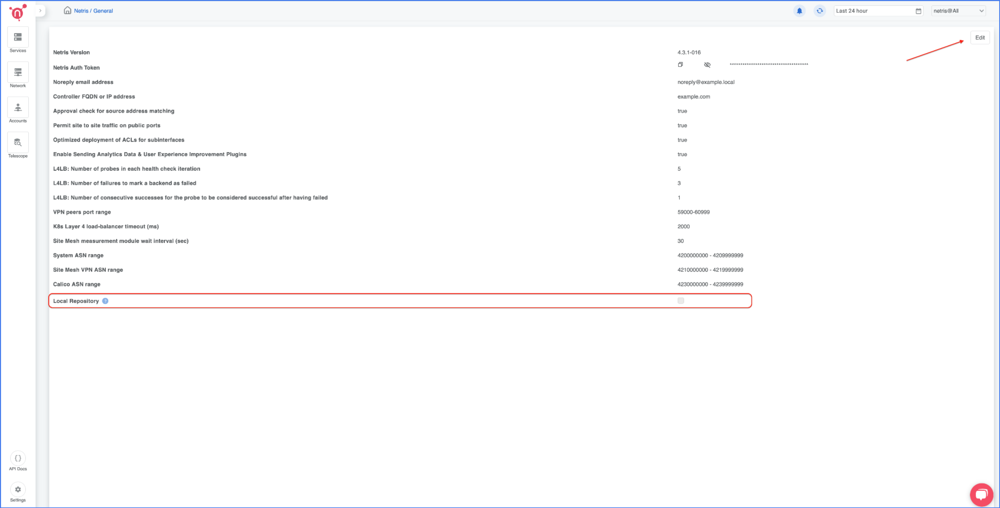
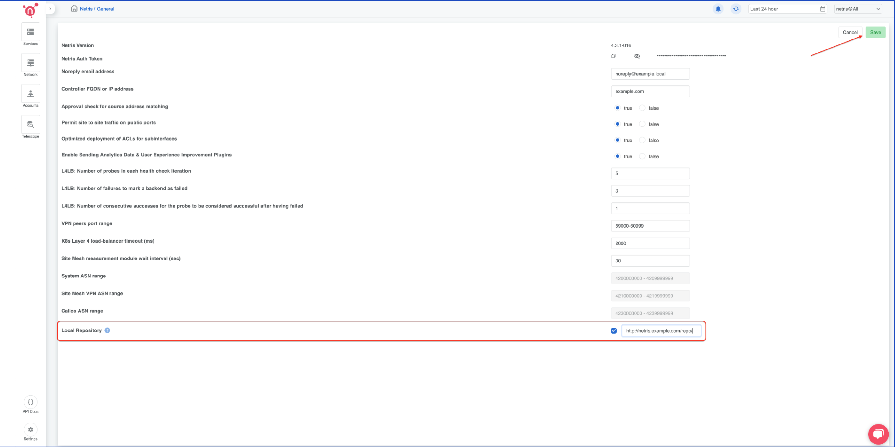

How to Enable the Local Repository on the Netris Controller?
------------------------------------------------------------

To install the Netris Local Repository on the controller host, run the following command:  
*Note: The controller must be set up using the `--ctl-hostname` argument; otherwise, the Netris Local Repository setup script will exit with an error.*

.. code-block:: shell-session

  curl -sS https://get.netris.io/local-repo.sh | sh -

The script may take a while, depending on the controller's connectivity and available resources.

The output of the script will look similar to this:

.. code-block:: shell-session

  ubuntu@netris:~$ curl -sS https://get.netris.io/local-repo.sh | sh -
  Checking if the controller is installed
  Checking controller's FQDN
  Creating local repo service under URL: http://netris.example.com/repo/
  Waiting for netris-local-repo pod to be ready...
  No pods found. Waiting for pod creation...
  Current pod status: Pending. Waiting...
  Current pod status: Pending. Waiting...
  Current pod status: Pending. Waiting...
  Current pod status: Pending. Waiting...
  Current pod status: Pending. Waiting...
  Pod is running.

  Netris local repository pod is now running.

  Path to upload custom ISOs: /var/lib/rancher/k3s/storage/pvc-ea0dd3ef-ded1-49d3-bbd8-b797c91d76b5_netris-controller_netris-local-repo-pvc/repo/isos

The script will output the local repository URL. Copy and paste this URL into the Netris Controller Web UI under **Settings** section (as shown in the screenshots below).

Additionally, it provides the host system path, which you may want to use to host your custom ISOs for your servers, softgates, or switches.

How to consume local repository
-------------------------------
