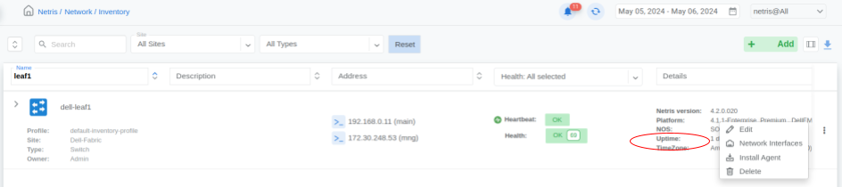
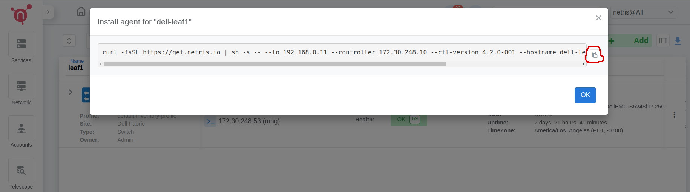
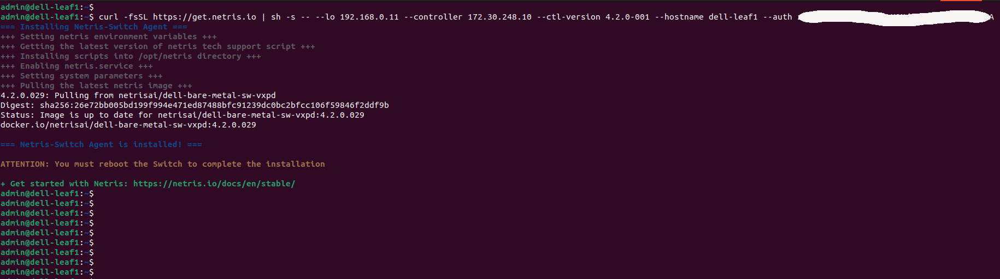

===================================
Dell SONiC Switch Initial Setup
===================================
.. note::

  Further installation requires a Console and Internet connectivity via the management port!

If the switch has pre-installed network operating system (NOS), it needs to be uninstalled first.

1. NOS Uninstall (if pre-installed)

To uninstall the current NOS, access **ONIE** from the GRUB menu and select the  **Uninstall OS** option.
   
.. image:: images/uninstallOS.png
   :align: center
    
Once it's done, the switch will automatically reboot and get ready for the installation of Dell SONiC.

2. NOS Install

If there is no DHCP in the management network, stop the onie-discovery service and configure an IP address and default gateway manually. 

.. code-block:: shell-session

  onie-discovery-stop
  
.. code-block:: shell-session

  ip addr add <management IP address/prefix> dev eth0
  
.. code-block:: shell-session

  ip route add default via <gateway of the management network>
  
.. code-block:: shell-session

  echo "nameserver <DNS server address>" > /etc/resolv.conf

The Dell SONiC image should be available on a web server to which the switch has access through the local network or the Internet.

Example:

.. code-block:: shell-session

  onie-nos-install http://192.168.100.10/Enterprise_SONiC_OS_4.1.1_Enterprise_Premium.bin

After completion of the installation, the switch will automatically reboot.

To login use the default username and password:
 
``admin/YourPaSsWoRd``

3. Set up the Out-of-Band (OOB) Management.

Upon the initial boot of the newly installed NOS, please wait until the message "System is ready" appears, typically resembling the following:

.. code-block:: shell-session
  
  May 03 15:02:35.430469 System is ready
  
Once this message is displayed, proceed to disable ZTP using the following commands:

.. code-block:: shell-session
  
  admin@sonic:~$ sonic-cli
  sonic# configure
  sonic(config)# no ztp enable

Wait once more until the "System is ready" message reappears. This may take approximately 1-2 minutes.
If there isn't a DHCP server available in the Out-of-Band (OOB) management network to ensure the switch's connection to the internet, you'll need to configure the Management IP address, gateway, and nameservers using the following commands:

.. code-block:: shell-session

  admin@sonic:~$ sonic-cli
  sonic# configure
  sonic(config-if-Management0)# interface Management 0
  sonic(config-if-Management0)# ip address <MGMT-IPv4>/<MGMT-SUBNET-MASK> gwaddr <MGMT-SUBNET-GATEWAY>
  sonic(config)# exit
  sonic(config)# ip name-server <DNS-SERVER1>
  sonic(config)# ip name-server <DNS-SERVER2>
  sonic(config)# end
  sonic# write memory
  sonic# exit

.. _sonic-switch-agent-installation:

4. Netris agent installation.

Navigate to the Net–>Inventory section and click the three vertical dots (⋮) on the right side of the switch you are provisioning. Then click Install Agent, copy the one-line installer command to your clipboard and paste in the switch.

5. Reboot the switch

.. code-block:: shell-session

 sudo reboot
