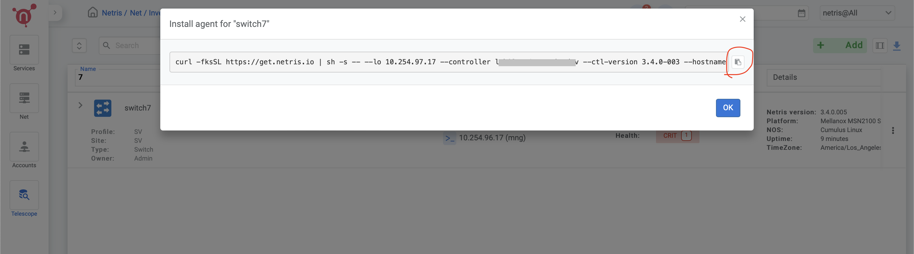
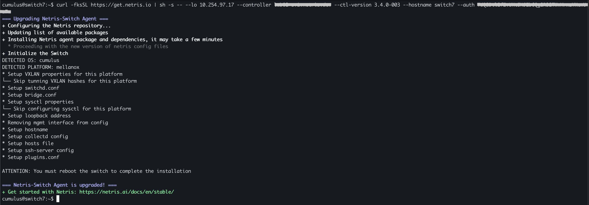

============================
EdgeCore SONiC Switch Initial Setup
============================
.. note::

  Further installation requires a Console and Internet connectivity via the management port!

If the switch has pre-installed network operating system (NOS), it needs to be uninstalled first.

1. NOS Uninstall (if pre-installed)

To uninstall the current NOS, access **ONIE** from the GRUB menu and select the  **Uninstall OS** option.
   
.. image:: images/uninstallOS.png
   :align: center
    
Once it's done, the switch will automatically reboot and get ready for the installation of EC SONiC.

2. NOS Install

If there is no DHCP in the management network, stop the onie-discovery service and configure an IP address and default gateway manually. 

.. code-block:: shell-session

  onie-discovery-stop
  
.. code-block:: shell-session

  ip addr add <management IP address/prefix> dev eth0
  
.. code-block:: shell-session

  ip route add default via <gateway of the management network>
  
.. code-block:: shell-session

  echo "nameserver <DNS server address>" > /etc/resolv.conf

The Cumulus image should be available on a web server to which the switch has access through the local network or the Internet.

Example:

.. code-block:: shell-session

  onie-nos-install http://192.168.100.10/Edgecore-SONiC_20211125_074752_ec202012_227.bin

After completion of the installation, the switch will automatically reboot.

To login use the default username and password:
 
``admin/YourPaSsWoRd``

3. Set up the Out-of-Band (OOB) Management.

Disable ztp:

.. code-block:: shell-session
  
  ztp disable -y
  
Configure the IP address, default gateway, and DNS to establish Internet connectivity via the management port.

.. code-block:: shell-session
  
  ip addr add <management IP address/prefix> dev eth0

.. code-block:: shell-session

  ip route add default via <gateway of management network>

.. code-block:: shell-session

  echo "nameserver <dns server>" > /etc/resolv.conf

4. Netris agent installation.

Navigate to the Net–>Inventory section and click the three vertical dots (⋮) on the right side of the switch you are provisioning. Then click Install Agent and copy the one-line installer command to your clipboard.

.. image:: images/Switch-agent-installation-Inventory.png
   :align: center

6. Reboot the switch

.. code-block:: shell-session

 sudo reboot
