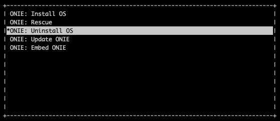

============================
Nvidia Cumulus v3.7 Switch Initial Setup
============================
.. note::

  Further installation requires a Console and Internet connectivity via the management port!

First, uninstall the current operating system.
1. NOS Uninstall

To uninstall the current NOS, enter into **ONIE** from the grub menu, then **Uninstall OS**:
   

    
Once it's done, the switch will reboot automatically and ready to install Cumulus Linux.

2. NOS Install

To install the Cumulus, enter into **ONIE** from the grub menu, then **Install OS**:

.. image:: images/installOS.png
   :align: center

If there is no DHCP in the management network, stop the onie-discovery service and configure an IP address and default gateway manually:

.. code-block:: shell-session

  onie-discovery-stop
  ip addr add <management IP address/prefix> dev eth0
  ip route add default via <gateway of management network>
  echo "nameserver <dns server>" > /etc/resolv.conf

The Cumulus image should be available on a web server to which switch(es) have access through the local network or the Internet.

Example:
.. code-block:: shell-session

  onie-nos-install http://192.168.100.10/cumulus-linux-3.7.15-mlx-amd64.bin

Once installation is completed, the switch will reboot automatically.

To login use the default username and password for Cumulus v3.7:
 
``cumulus/CumulusLinux!``

3. Setup OOB Management.

.. code-block:: shell-session

    sudo vim /etc/network/interfaces

.. code-block:: shell-session

 # The loopback network interface
 auto lo
 iface lo inet loopback
 
 # The primary network interface
 auto eth0
 iface eth0 inet static
         address <management IP address/prefix length>
         gateway <gateway of management network>
         dns-nameserver <dns server>
 
 source /etc/network/interfaces.d/*

.. code-block:: shell-session

 sudo ifreload -a

4. Cumulus Linux license installation.

.. code-block:: shell-session

 sudo cl-license -i

Copy/paste the Cumulus Linux license string then press ctrl-d.

5. Netris agent installation.

Navigate to the Net–>Inventory section and click the three vertical dots (⋮) on the right side of the SoftGate node you are provisioning. Then click Install Agent and copy the one-line installer command to your clipboard.

.. image:: images/Switch-agent-installation-Inventory.png
   :align: center

.. image:: images/Switch-agent-installation-oneliner.png
   :align: center

.. image:: images/Switch-agent-installation-cli.png
   :align: center

6. Reboot the switch

.. code-block:: shell-session

 sudo reboot
