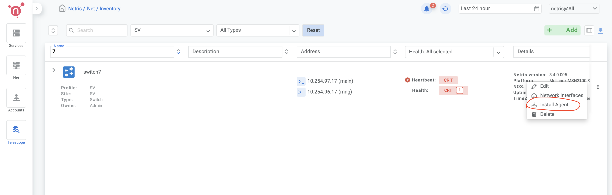
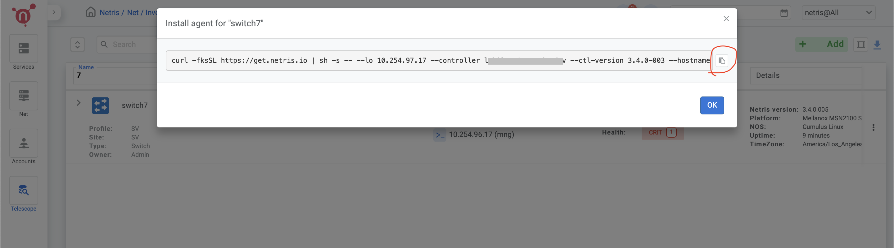
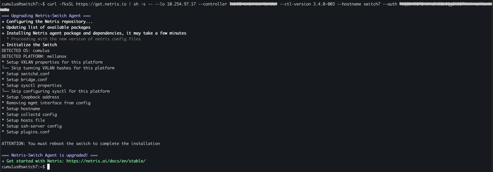

.. _switch-agent-installation:
.. meta::
  :description: Network Switch Initial Setup

============================
Nvidia Cumulus v5 Switch Initial Setup
============================

.. note::

  Further installation requires a Console and Internet connectivity via the management port!

If the switch has pre-installed network operating system (NOS), it needs to be uninstalled first

1. NOS Uninstall (if pre-installed)

To uninstall the current NOS, access **ONIE** from the GRUB menu and select the  **Uninstall OS** option.
   
.. image:: images/uninstallOS.png
   :align: center
    
Once it's done, the switch will automatically reboot and get ready for the installation of the Cumulus Linux.

2. NOS Install

If there is no DHCP in the management network, stop the onie-discovery service and configure an IP address and default gateway manually. 

.. code-block:: shell-session

  onie-discovery-stop
  
.. code-block:: shell-session

  ip addr add <management IP address/prefix> dev eth0
  
.. code-block:: shell-session

  ip route add default via <gateway of the management network>
  
.. code-block:: shell-session

  echo "nameserver <DNS server address>" > /etc/resolv.conf

The Cumulus image should be available on a web server to which the switch has access through the local network or the Internet.

Example:

.. code-block:: shell-session

  onie-nos-install http://192.168.100.10/cumulus-linux-5.4.0-mlx-amd64.bin

After completion of the installation, the switch will automatically reboot.

To login use the default username and password for Cumulus v5:
 
``cumulus/cumulus``

3. Set up the Out-of-Band (OOB) Management.

Upon installation of Cumulus Linux v5, the default Virtual Routing and Forwarding (VRF) is set to 'mgmt.' To switch to the default VRF, please refer to the following instructions:

Disable ztp:

.. code-block:: shell-session

    sudo ztp -d

.. code-block:: shell-session

    sudo ip vrf exec default bash

Open the network interfaces file, add the IP address and other required details, and ensure that you remove the 'mgmt' VRF configuration:

.. code-block:: shell-session

    sudo vim /etc/network/interfaces

.. code-block:: shell-session

 # The loopback network interface
 auto lo
 iface lo inet loopback
 
 # The primary network interface
 auto eth0
 iface eth0 inet static
         address <management IP address/prefix length>
         gateway <gateway of management network>
 
 source /etc/network/interfaces.d/*

.. code-block:: shell-session
 
 echo "nameserver <dns server>" | sudo tee /etc/resolv.conf
 
.. code-block:: shell-session

 sudo ifreload -a
 
.. note::

  You might see a one-time warning in the output of ifreload, which you can ignore:
  
.. code-block:: shell-session
  
  warning: mgmt: cmd '/usr/lib/vrf/vrf-helper delete mgmt 1001' failed: returned 1 (Failed to delete cgroup for vrf mgmt)

4. Netris agent installation.

Navigate to the Net–>Inventory section and click the three vertical dots (⋮) on the right side of the switch you are provisioning. Then click Install Agent and copy the one-line installer command to your clipboard.

6. Reboot the switch

.. code-block:: shell-session

 sudo reboot
