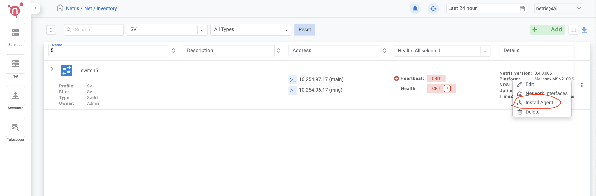
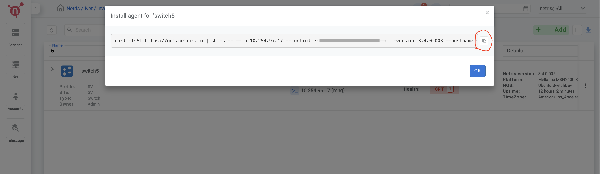
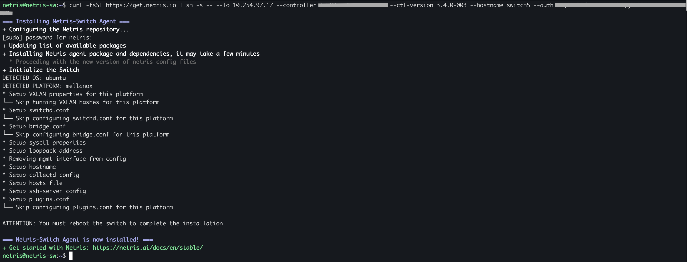

============================
Ubuntu SwitchDev Switch Initial Setup
============================
.. note::

  Further installation requires a Console and Internet connectivity via management port!
 

If the switch has pre-installed network operating system (NOS), it needs to be uninstalled first.

1. NOS Uninstall (if pre-installed)

To uninstall the current NOS, access **ONIE** from the GRUB menu and select the  **Uninstall OS** option.
   
.. image:: images/uninstallOS.png
   :align: center
   
Once it's done, the switch will automatically reboot and get ready for the installation of the Ubuntu SwitchDev.

2. NOS Install

If there is no DHCP in the management network, stop the onie-discovery service and configure an IP address and default gateway manually. 

.. code-block:: shell-session

  onie-discovery-stop
  
.. code-block:: shell-session

  ip addr add <management IP address/prefix> dev eth0
  
.. code-block:: shell-session

  ip route add default via <gateway of the management network>
  
.. code-block:: shell-session

  echo "nameserver <DNS server address>" > /etc/resolv.conf
  
Install Ubuntu SwitchDev using the Netris customized image:

.. code-block:: shell-session

  onie-nos-install http://downloads.netris.ai/netris-ubuntu-18.04.1.bin

Default username/password
 
``netris/newNet0ps``

3. Set up the Out-of-Band (OOB) Management.

Open the network interfaces file and add the IP address and other required details.

.. code-block:: shell-session

    sudo vim /etc/network/interfaces

.. code-block:: shell-session

 # The loopback network interface
 auto lo
 iface lo inet loopback
 
 # The primary network interface
 auto eth0
 iface eth0 inet static
         address <management IP address/prefix length>
         gateway <gateway of management network>
         dns-nameserver <dns server>
 
 source /etc/network/interfaces.d/*

.. code-block:: shell-session

 sudo ifreload -a

5. Netris agent installation.

Navigate to the Net–>Inventory section and click the three vertical dots (⋮) on the right side of the switch you are provisioning. Then click Install Agent and copy the one-line installer command to your clipboard.

6. Reboot the switch

.. code-block:: shell-session

 sudo reboot
