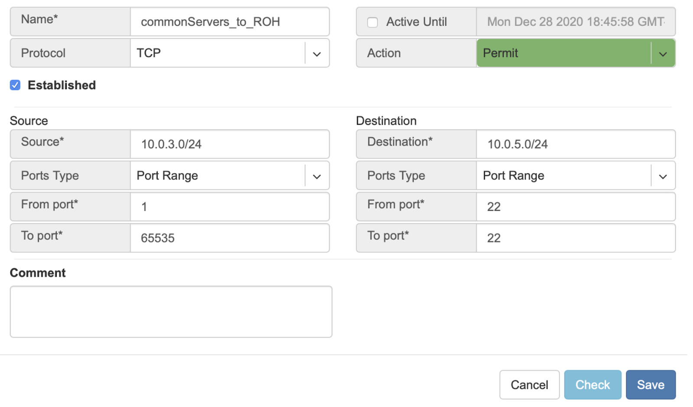
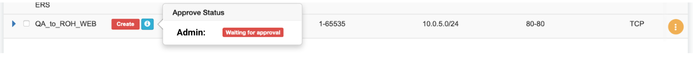

.. meta::
    :description: Access Control Lists (ACLs)
    
##########################
Access Control Lists (ACL)
##########################
Netris supports ACLs for switch network access control. (ACL and ACL2.0) ACL is for defining network access lists in a source IP: Port, destination IP: Port format. ACL2.0 is an object-oriented service way of describing network access.

Both ACL and ACL2.0 services support tenant/RBAC based approval workflows. Access control lists execute in switch hardware providing line-rate performance for security enforcement. It’s important to keep in mind that the number of ACLs is limited to the limited size of TCAM of network switches. 

Screenshot: TCAM utilization can be seen under Net→Inventory

.. image:: images/TCAM.png
    :align: center
    :class: with-shadow
    
Netris is applying several optimization algorithms to minimize the usage of TCAM while achieving the user-defined requirements.  

ACL Default Policy
------------------
The ACL default policy is to permit all hosts to communicate with each other.  You can change the default policy on a per Site basis by editing the Site features under Net→Sites. Once the “ACL Default Policy” is changed to “Deny,” the given site will start dropping any traffic unless specific communication is permitted through ACL or ACL2.0 rules.

Example: Changing “ACL Default Policy” for the site “siteDefault”.

.. image:: images/siteDefault.png
    :align: center
    :class: with-shadow
    

ACL Rules
---------
ACL rules can be created, listed, edited, approved under Services→ACL.

Description of ACL fields.
General

* **Name** - Unique name for the ACL entry.
* **Protocol** - IP protocol to match.

  * All - Any IP protocols.
  * IP - Specific IP protocol number.
  * TCP - TCP.
  * UDP - UDP.
  * ICMP ALL - Any IPv4 ICMP protocol.
  * ICMP Custom - Custom IPv4 ICMP code.
  * ICMPv6 ALL - Any IPv6 ICMP protocol. 
  * ICMPv6 Custom - Custom IPv6 ICMP code.
  
* **Active Until** - Disable this rule at the defined date/time. 
* **Action** - Permit or Deny forwarding of matched packets.
* **Established/Reverse** - For TCP, also match reverse packets except with TCP SYN flag. For non-TCP, also generate a reverse rule with swapped source/destination.  

Source/Destination - Source and destination addresses and ports to match.

* **Source** IPv4/IPv6 - IPv4/IPv6 address.
* **Ports Type**

  * Port Range - Match on the port or a port range defined in this window.
  * Port Group - Match on a group of ports defined under Services→ ACL Port Group.
  
* **From Port** - Port range starting from.
* **To Port** - Port range ending with.

* **Comment** - Descriptive comment, commonly used for approval workflows.

* **Check button** - Check if Another ACL on the system already permits the described network access.

Example: Permit hosts in 10.0.3.0/24 to access hosts in 10.0.5.0/24 by SSH, also permit the return traffic (Established).

      
Example: “Check” shows that requested access is already provided by a broader ACL rule.

.. image:: images/ACL_rule.png
    :align: center
    :class: with-shadow
        
ACL Approval Workflow
---------------------
When one tenant (one team) needs to get network access to resources under the responsibility of another tenant (another team), an ACL can be created but will activate only after approval of the tenant responsible for the destination address resources. See the below example.

Example: User representing QA_tenant is creating an ACL where source belongs to QA_tenant, but destination belongs to the Admin tenant.

.. image:: images/ACL_approval.png
    :align: center
    :class: with-shadow
    
Screenshot: ACL stays in “waiting for approval” state until approved.
    

    
Screenshot: Users of tenant Admin, receive a notification in the GUI, and optionally by email. Then one can review the access request and either approve or reject it.

.. image:: images/approve_reject.png
    :align: center
    :class: with-shadow
    
Screenshot: Once approved, users of both tenants will see the ACL in the “Active” state, and soon Netris Agents will push the appropriate config throughout the switch fabric.

.. image:: images/ACL_active.png
    :align: center
    :class: with-shadow
    
ACL Processing Order
--------------------
#. User-defined Deny Rules
#. User-defined Permit Rules
#. Deny the rest

