.. meta::
    :description: Netris Controller Initial Configuration

********************************
Controller initial configuration
********************************

Definitions
===========

* **User** - A user account for accessing Netris Controller through GUI, RestAPI, and Kubernetes. The default username is ``netris``, with password ``newNet0ps``. 
* **Tenant** - IP addresses and Switch Ports are network resources assigned to different Tenants to have under their management. Admin is the default tenant, and by default, it owns all the resources. You can use different Tenants for sharing and delegation of control over the network resources. Network teams typically use Tenants to grant access to other groups to request & manage network services using the Netris Controller as a self-service portal or programmatically (with Kubernetes CRDs) DevOps/NetOps pipeline.  
* **Permission Group** - List of permissions on a per section basis can be attached individually to a User or a User Role.  
* **User Role** - Group of user permissions and tenants for role-based access control. 
* **Site** - Each separate deployment (each data center) should be defined as a Site. All network units and resources are attached to a site. Netris Controller comes with a "default" site preconfigured. Site entry defines global attributes such as; AS numbers, default ACL policy, Site Mesh (site to site VPN) type.
* **Subnet** - IPv4/IPv6 address resources linked to Sites and Tenants. 
* **Switch Port** - Physical ports of all switches attached to the system. Switch port objects represent statuses, take basic parameters, and are assigned to Tenants.
* **Inventory** - This is an inventory of all network units that are operated using Netris Agent.
* **E-BGP** - Is for defining all External BGP peers (iBGP and eBGP). 

Subnets
=======
It is required to define at least two subnets to get started. One subnet is for the management interfaces, another for the loopback addresses. Every network unit managed with Netris should have at least one management IP and at least one loopback IP. Loopback IP addresses are used for network unit identification by network protocols and by Netris Agent/Controller. There’s no need for defining any IP addresses for the switch-to-switch links. Netris is using IPv6 link-local addresses for all switch-to-switch communication. 

Example:  (IP addresses used are just examples, please replace them following your IP planning.)
------------------------------------------------------------------------------------------------
In NET->Subnets section of the Netris Controller GUI, you can add new subnet entries. Subnets are of 2 types of allocation and assignment. Allocations are the large blocks of IP resources assigned to the organization. Assignments are IP blocks that are smaller blocks inside the allocation and can be used by services or policies that yet to be defined.   

1. Adding a new allocation. In this example, 10.0.0.0/8 is used as a large block of allocation. You can add as many allocations as required.

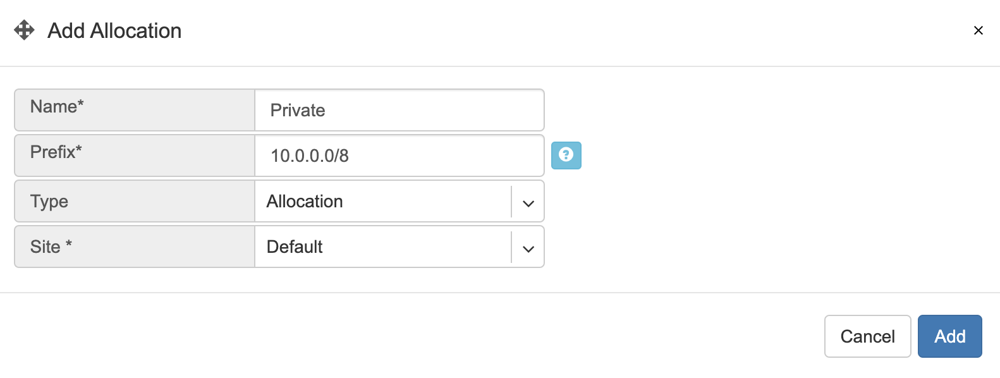
    
2. Adding two new assignments. 

* 10.254.96.0/24 (netManagement) assigned to the tenant “Admin” and available for the site “Default”.
* 10.254.97.0/24 (netLoopbacks) assigned to the tenant “Admin” and available for the site “Default”.

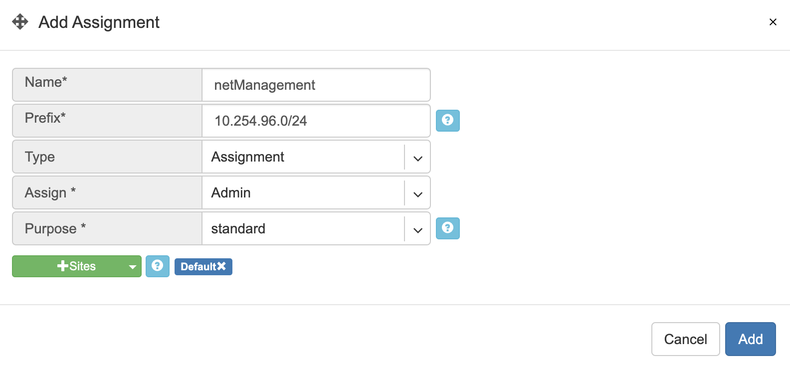
    

    
Screenshot: Listing of the Subnets section after adding the new objects.

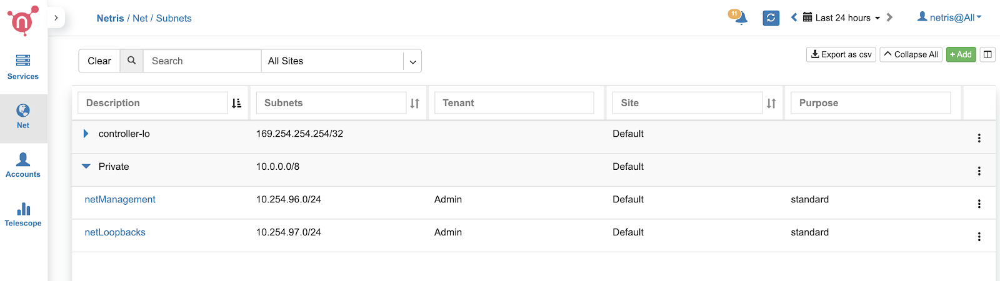
|
|
Inventory Profiles 
==================
Inventory profiles define access security, timezone, DNS, NTP settings profiles for network switches and SoftGate nodes.
To create a new Inventory profile, click +Add under the Net→Inventory Profiles section.

Fields descriptions:
--------------------
* **Name** - Profile name.
* **Description** - Free text description.
* **Allow SSH from IPv4** - List of IPv4 subnets allowed to ssh (one address per line)
* **Allow SSH from IPv6** - List of IPv6 subnets allowed to ssh (one address per line)
* **Timezone** - Devices using this inventory profile will adjust their system time to the selected timezone.
* **NTP servers** - List of domain names or IP addresses of NTP servers (one address per line). You can use your Netris Controller address as an NTP server for your switches and SoftGate.
* **DNS servers** - List of IP addresses of DNS servers (one address per line). You can use your Netris Controller address as a DNS server for your switches and SoftGate.

**Example:** In this example Netris Controller is used to provide NTP and DNS services to the switches (common setup).

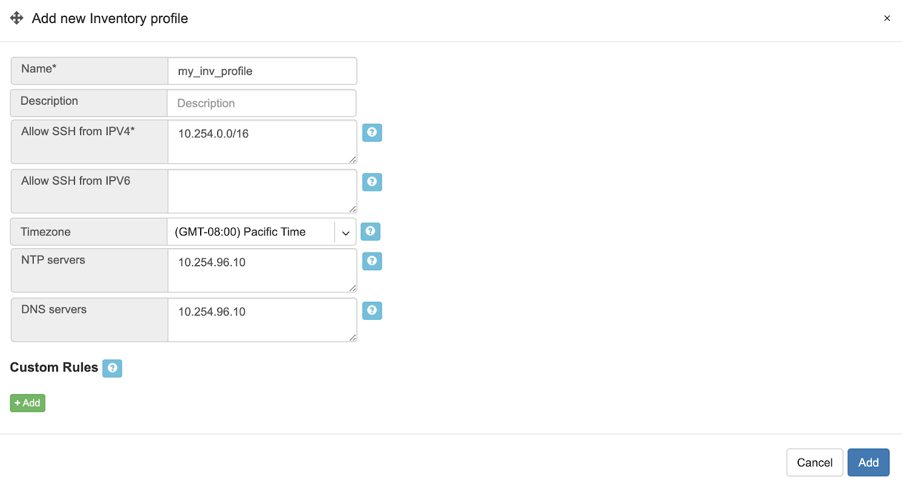
    
Adding Switches to Topology
===========================
You need to define every switch in the Net→Topology section. To add a switch, please go to Net→Topology and click +Add.

* **Name** - Descriptive name.
* **Owner Tenant**  - Tenant(typically Admin) who administers this node.
* **Description** - Free text description.
* **Hardware Type** - For switches: Spine Switch or Leaf Switch.
* **NOS*** - Network operating system. Cumulus Linux, Ubuntu SwitchDev (Nvidia Mellanox only), SONiC (not for production use yet)  
* **Site*** - The site where the switch belongs. 
* **Inventory Profile** - Reference to Timezone, DNS, NTP, and Security features profile.
* **IP Address*** - IPv4 address for the loopback interface.
* **Management IP address** - IPv4 address for the out of band management interface. 
* **Zero-touch provisioning** - Automatically install the NOS. (Experimental in this version) 
* **MAC address** - Out of band management interface MAC address used for zero-touch provisioning. (Experimental in this version)
* **The number of ports** - It is required for the topology manager. WIll be synced to the real number of Switch Ports when Netris Switch Agent establishes the very first connection with the Netris Controller.

**Example:**  Adding a spine switch w/ Cumulus Linux.

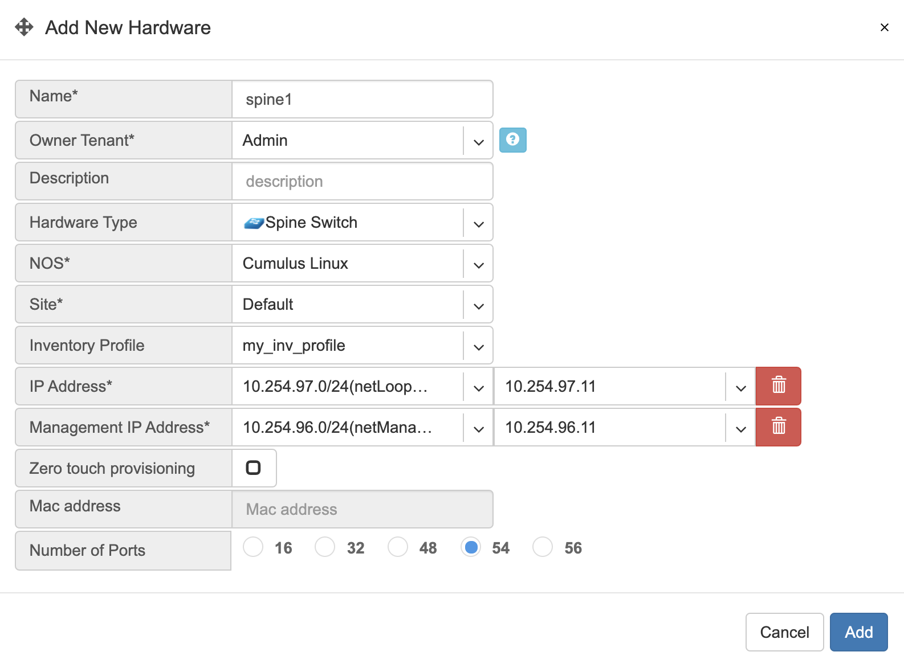
    
Tip: You can drag/move the units to your desired positions and click “Save positions”.

Note: Repeat this process to define all your switches.

Topology Manager
================
The topology manager is for describing and monitoring the desired network topology. Netris Switch Agents will configure the underlying network devices according to this topology dynamically and start watching against potential failures.

To define the links, right-click on the spine switch, then click create a link. Select the “from port,” then “to device” and “port.” See the example below.  

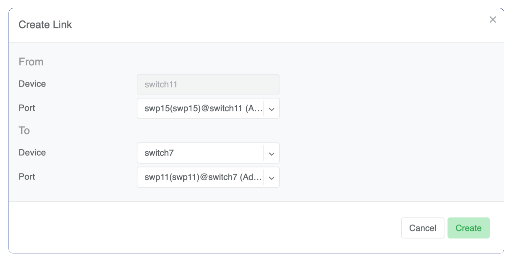
    
All links require definition in the topology manager. Topology links can also be described through a .yaml file when using Kubernetes CRD. (a GUI wizard is planned to be available in v2.10).

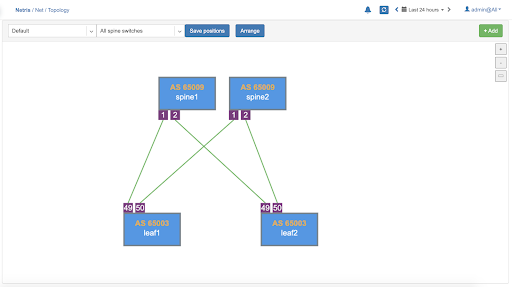
    
Now when network units and links are defined, your network is automatically configured as long as physical connectivity is in place and Netris Agents can communicate with Netris Controller.

Hairpin (Cumulus only) 
======================
With Cumulus Linux only, we need to loop two ports on spine switches (hairpin cable) in the current release, usually two upstream (higher capacity) ports. We are planning to lift this requirement in the next Netris release (v2.10).

To define what ports will be used as a hairpin, navigate to Net→Switch Ports, or right-click on the spine switch, click Ports in Net-->Topology.

Example: Accessing Switch Ports from Net→Topology

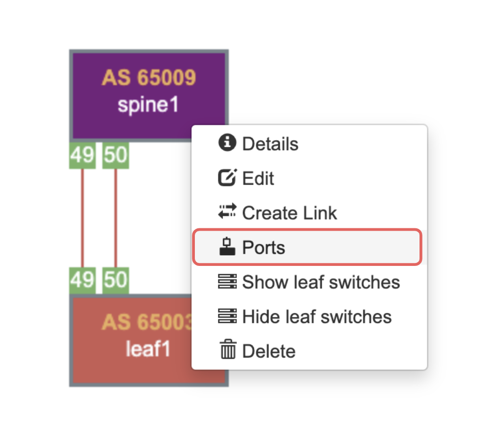
    
For each spine switch, find the two ports that you are going to connect (loop/hairpin) and configure one port as a “hairpin **l2**” and another port as “hairpin **l3**”. The order doesn’t matter. The system needs to know which ports you have dedicated for the hairpin/loop on each spine switch. (do not do this for non-Cumulus switches)  
|
|
Example: Editing Switch Port from Net→Switch Ports.

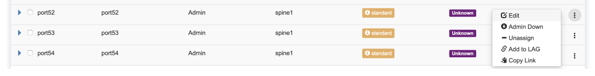
    
Example: Setting port types to “hairpin l2” and “hairpin l3”.

.. image:: images/hairpin.png
    :align: center
    
Screenshot: Hairpin visualized in Net→Topology

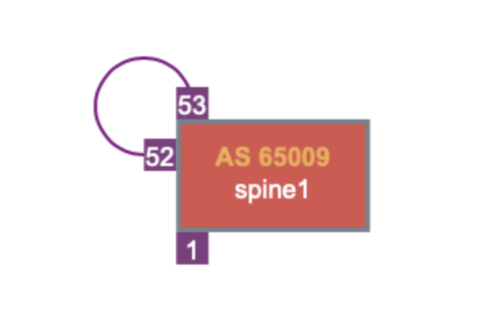
    
Adding SoftGate nodes to Topology
=================================
Every SoftGate node first needs to be defined in Netris Controller.
To add a SoftGate node, please go to Net→Topology and click +Add.

* **Name** - Descriptive name.
* **Owner Tenant** - Tenant(typically Admin), who administers this node.
* **Description** - Free text description.
* **Hardware Type** - NFV node.
* **Site** - The data center where the current SoftGate node belongs. 
* **Inventory Profile** - Profile describing the timezone, DNS, NTP, and Security features.
* **IP Address** - IPv4 address for the loopback interface.
* **Management IP address** - IPv4 address for the out of band management interface. 
* **NFV Node Port** - A physical port on a spine switch where the SoftGate node's first SmartNIC port is connected. Typically each spine switch has one SoftGate node connected to it. 
* **+NAT address** - Public IP addresses to be used as global IP for SNAT/DNAT. (check Enabling NAT section of Network Policies chapter)
* **+NAT address pool** - Public IP address subnets to be used as rolling global IP addresses for SNAT. (check Enabling NAT section of Network Policies chapter)

Example: Adding a SoftGate Node to Topology.

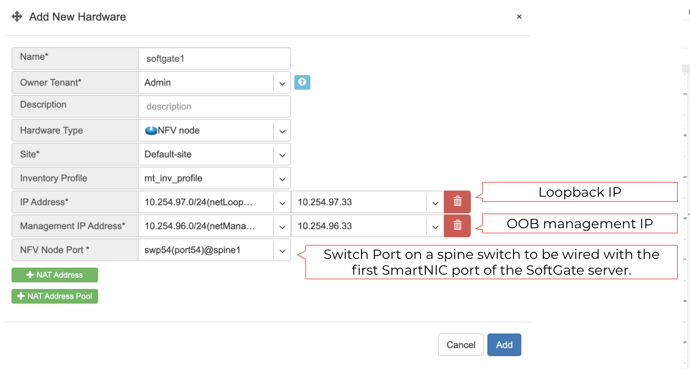
