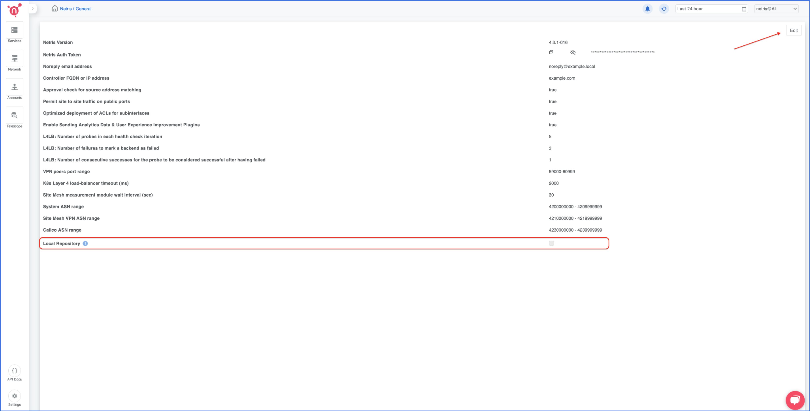
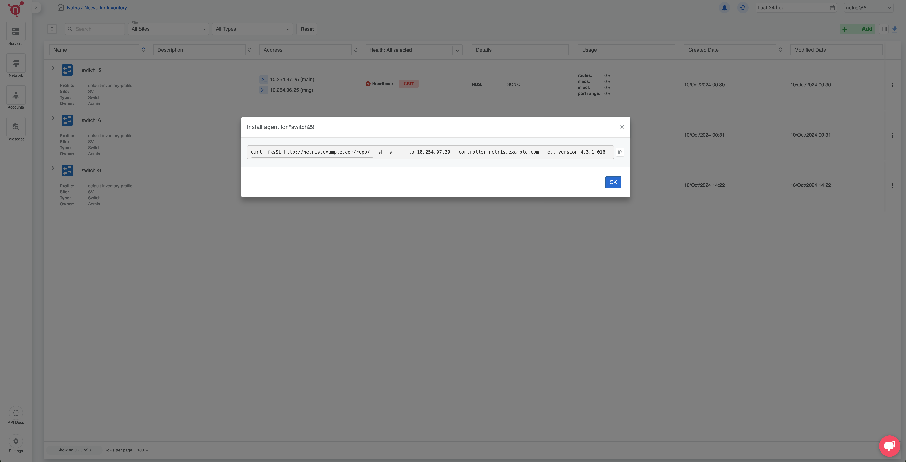

.. meta::
  :description: Installing Netris Controller in Air-Gapped Environments

Installing Netris Controller in Air-Gapped Environments
=======================================================

Why Air-Gapped Installation?
----------------------------
Air-gapped environments are isolated from the public internet to ensure heightened security, compliance, or operational reliability. Many organizations operate in such environments to safeguard their infrastructure from external threats and maintain strict control over their data.

Netris provides a way to install the Netris Controller in air-gapped environments to cater to these requirements, ensuring seamless deployment without relying on internet access.

How to Install the Netris Controller
-------------------------------------

Prerequisites
^^^^^^^^^^^^^
- A **tar.gz** installation file provided by Netris.
- An Ubuntu 24.04 server designated as the Netris Controller.
- Sufficient permissions to execute installation scripts and perform necessary configurations.

Steps to Install
^^^^^^^^^^^^^^^^

1. **Obtain the Installation File**

  Contact Netris to obtain the required installation file (``netris-controller-v4.x.x.tar.gz``).

2. **Transfer the File to the Server**

  Use a secure file transfer method (e.g., SCP or USB) to copy the tar.gz file to the target Ubuntu 24.04 server.

3. **Extract the Tarball**

  Run the following command to extract the contents of the tarball:  

  .. code-block:: shell-session

    tar -xzvf netris-controller-v4.x.x.tar.gz

4. **Navigate to the Installation Directory**

   Move into the extracted directory:  
   
  .. code-block:: shell-session

    cd netris-controller-v4.x.x

5. **Run the Installation Script**

   Execute the installation script with the ``ctl-hostname`` argument, specifying the desired hostname for your controller. For example:  

  .. code-block:: shell-session

    ./install.sh --ctl-hostname netris.example.com

6. **Verify Installation**

   Once the script is complete, follow any on-screen instructions to verify the installation. The Netris Controller should now be operational in your air-gapped environment.

After Installation
------------------

The air-gapped Netris Controller will also include a local repository/registry. This repository provides all the necessary packages and images for installing various types of Netris agents.

The script will output the local repository URL. Copy and paste this URL of the Local repository into the Netris Controller Web UI under **Settings** section (as shown in the screenshots below).

.. image:: images/Global-settings-save.png
    :align: center

How to consume local repository
-------------------------------

Once the local repository function is enabled in the Netris Controller Settings, the Netris agent installation oneliner will automatically point to the local repository (as shown in the screenshots below).

---

For any issues or additional assistance, please contact Netris Support.
