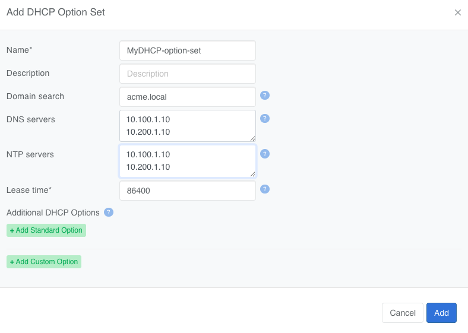
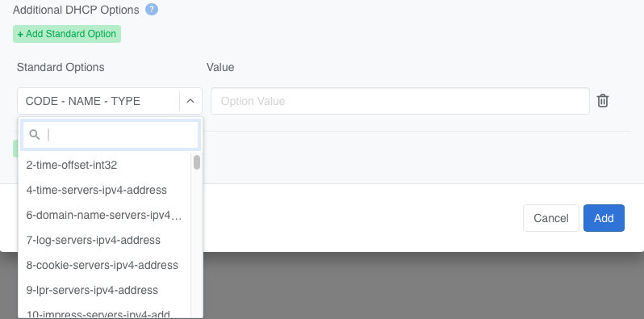
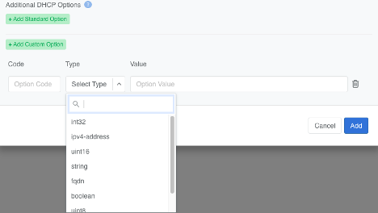
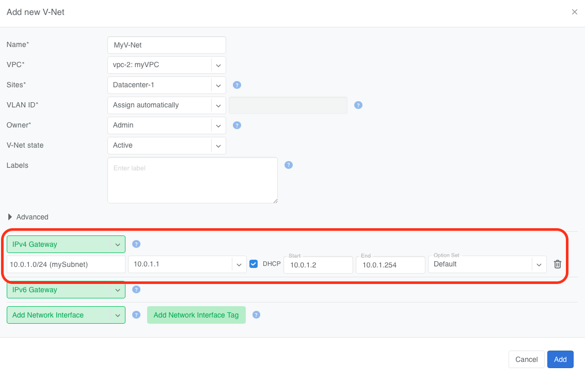
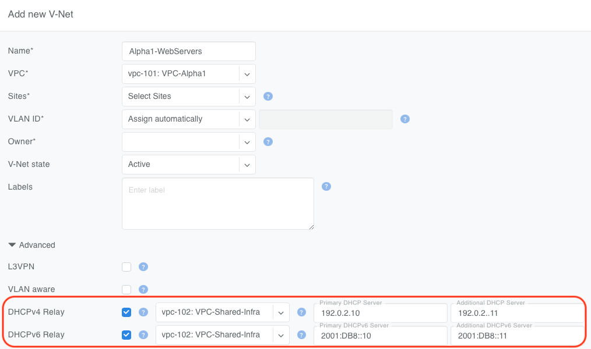
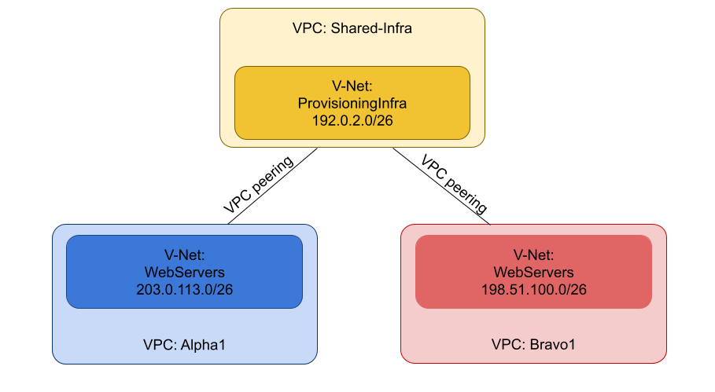

.. meta::
    :description: DHCP and DHCP Relay for V-Nets

.. _vnet_dhcp:

====================
DHCP and DHCP Relay
====================

L2VPN routed V-Nets (where an IP gateway is added) may also be configured with a DHCP service fully managed by Netris and hosted on SoftGate.

DHCP Option Sets
=================

The Controller ships with a default DHCP Options Set. The default set cannot be deleted, but it can be modified. You can also configure additional DHCP Option Sets before enabling a DHCP server for any V-Net.

Add a DHCP Options Set by navigating to ``Services -> DHCP Options Sets`` and clicking ``+Add`` in the top right.

.. raw:: html

   

Netris supports a wide range of Standard DHCP Options.

.. raw:: html

   

Netris also enables you to define Custom DHCP Options.

.. raw:: html

   

Netris DHCP
===========

To enable Netris' built-in DHCP service on an L2VPN V-Net:

 - Add a gateway to the V-Net — native DHCP requires a gateway.
 - Check the DHCP checkbox next to the gateway IP address.
 - Provide a starting and ending IP address for the DHCP scope.
 - Select a DHCP Options Set.

.. warning::
  A DHCP Options Set is required to enable Netris DHCP. You can use the default DHCP Options Set the Controller ships with, or create your own (see DHCP Option Sets above), before DHCP can be enabled on a V-Net.

.. raw:: html

   
<em>Figure: Netris DHCP configuration in V-Net settings</em>

SoftGate–Controller dependency for Netris DHCP
-----------------------------------------------

Netris DHCP has no hard dependency on the Controller for day-to-day service. The active SoftGate's local DHCP server hands out leases from its own local leases file, independent of Controller reachability — if the Controller is unreachable, the SoftGate keeps issuing dynamic leases on its own, from its last Controller-synced configuration, which the Netris SoftGate agent caches locally.

The Controller's role is keeping IP assignments stable across a SoftGate failover: the Netris agent on the active SoftGate pushes each new lease up to the Controller, which converts it into a static IP–MAC reservation and syncs it back down to every SoftGate as a static binding. That round trip isn't instantaneous — if the SoftGate serving DHCP for a V-Net fails over before a given client's lease has completed the round trip and been written into every SoftGate's static bindings, the newly active SoftGate has no record of that client yet and may hand it a different dynamic IP.

The Controller's reservation set persists independently of most V-Net edits:

 - Setting a V-Net to inactive preserves it, so DHCP can't hand a previously leased IP to a different endpoint and create a conflict once the V-Net is reactivated, and changing the lease range doesn't clear it either.
 - Unchecking DHCP, or removing the V-Net's IP subnet and saving, resets it; deleting the V-Net cleans it up entirely.

DHCP Relay
==========
Netris supports using an external DHCP server by enabling the DHCP Relay function. This allows DHCP clients inside a V-Net to obtain addresses from a non-Netris-managed DHCP server running in the same or another VPC. Both DHCPv4 and DHCPv6 are supported.

.. note::
  DHCPv6 Relay is currently supported on Cumulus and Arista platforms.

.. tip::
  In a V-Net, a DHCP Relay service and a DHCP service cannot be enabled simultaneously.

To configure DHCP Relay in a V-Net:
 - Specify the VPC where the DHCP server is located.
 - Enter the IP addresses of the primary and (optionally) backup DHCP servers.

.. raw:: html

     

.. note::
  When a V-Net and the DHCP server specified in the DHCP Relay configuration are homed in different VPCs, VPC peering is mandatory. Without it, the relay traffic cannot reach the DHCP server. Configure peering under Network → VPC Peering in the Controller.

  Non-overlapping IP ranges are required between the client VPCs (e.g., VPC-Alpha1) and the DHCP server's VPC (VPC-Shared-Infra). The DHCP server must be able to route back to the client's V-Net.

  The switch loopback IP is the source IP of relayed packets.

.. raw:: html

   

DHCPv6 Relay: Switch Loopback IPv6 Address
-------------------------------------------

When DHCPv6 Relay to a third-party server is configured (Address Family set to IPv4/IPv6 Dual-Stack or IPv6-Only), Netris derives an IPv6 loopback address for the switch and assigns it, as a /128, to the loopback interface in the relevant VRF(s). This address is used as the source address of relayed DHCPv6 traffic, the same role the switch's existing IPv4 loopback plays for DHCPv4 relay.

The loopback is configured when DHCPv6 Relay is enabled on the V-Net (with Address Family covering IPv6), and removed when DHCPv6 Relay is turned off. Switches cannot have a pre-existing IPv6 loopback address configured through any other means, so this derived address is always the switch's only IPv6 loopback.

The address is deterministically derived from the switch's existing main IPv4 loopback address: Netris takes the IPv4 loopback address, converts it to hex, and uses that as the lower 32 bits of an address in the ``fd00::/8`` unique local address range. For example, an IPv4 loopback of ``10.2.3.4`` produces the IPv6 loopback ``fd00::0a02:0304/128``.

DHCPv4 Relay Example:
----------------------

Suppose you have tenant workloads in VPC-Bravo1 and VPC-Alpha1. Both need DHCP, but you want to run a single DHCP service in VPC-Shared-Infra.

.. raw:: html

   

1. In each tenant's V-Net (VPC-Bravo1 and VPC-Alpha1), enable DHCP Relay and set the DHCP server address to the IPs of the DHCP servers in VPC-Shared-Infra.

  .. image:: images/dhcp-relay-coke.png
      :alt: DHCP Relay
      :align: center
      :class: with-shadow

  .. raw:: html

     

  .. image:: images/dhcp-relay-pepsi.png
      :alt: DHCP Relay
      :align: center
      :class: with-shadow

  .. raw:: html

     

  .. image:: images/dhcp-relay-shared.png
      :alt: DHCP Relay
      :align: center
      :class: with-shadow

  .. raw:: html

     

2. Establish VPC peering between VPC-Bravo1 ↔ VPC-Shared-Infra and VPC-Alpha1 ↔ VPC-Shared-Infra.

  .. image:: images/dhcp-relay-vpc-peer-coke.png
      :alt: DHCP Relay
      :align: center
      :class: with-shadow

  .. raw:: html

     

  .. image:: images/dhcp-relay-vpc-peer-pepsi.png
      :alt: DHCP Relay
      :align: center
      :class: with-shadow

  .. raw:: html

     

Now:
 - DHCP clients in the tenant VPCs (VPC-Bravo1 and VPC-Alpha1) broadcast their DHCP requests normally in their respective V-Nets
 - Netris configures the fabric to forward these requests across the peering link to the DHCP server in the VPC-Shared-Infra VPC.
