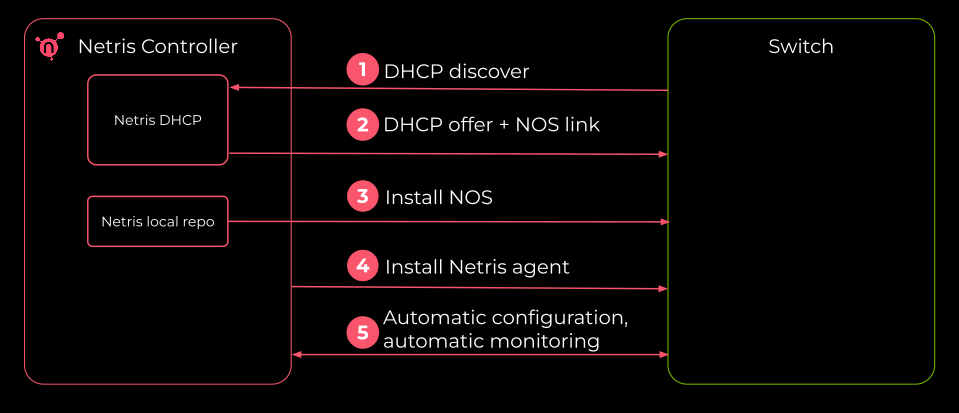
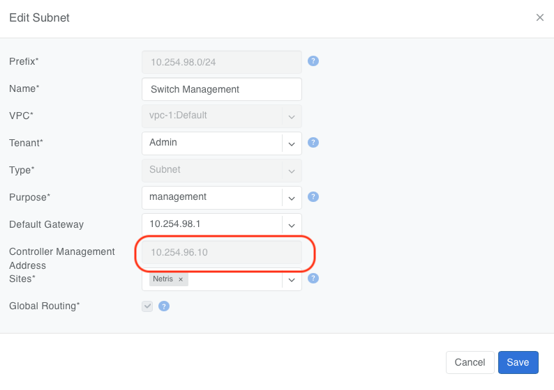
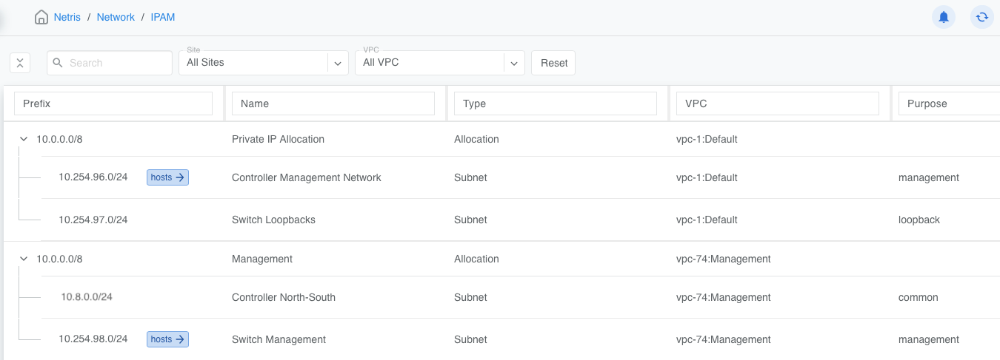
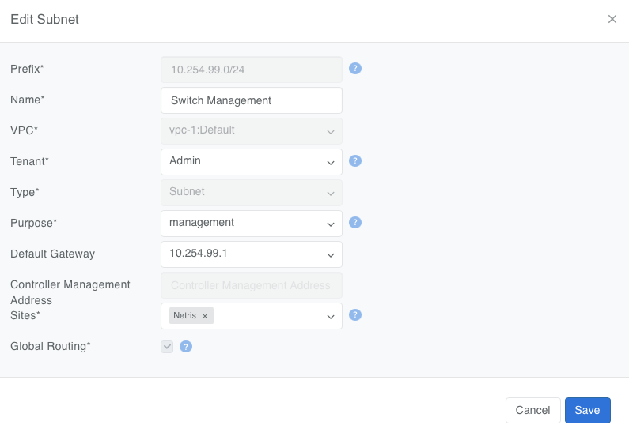
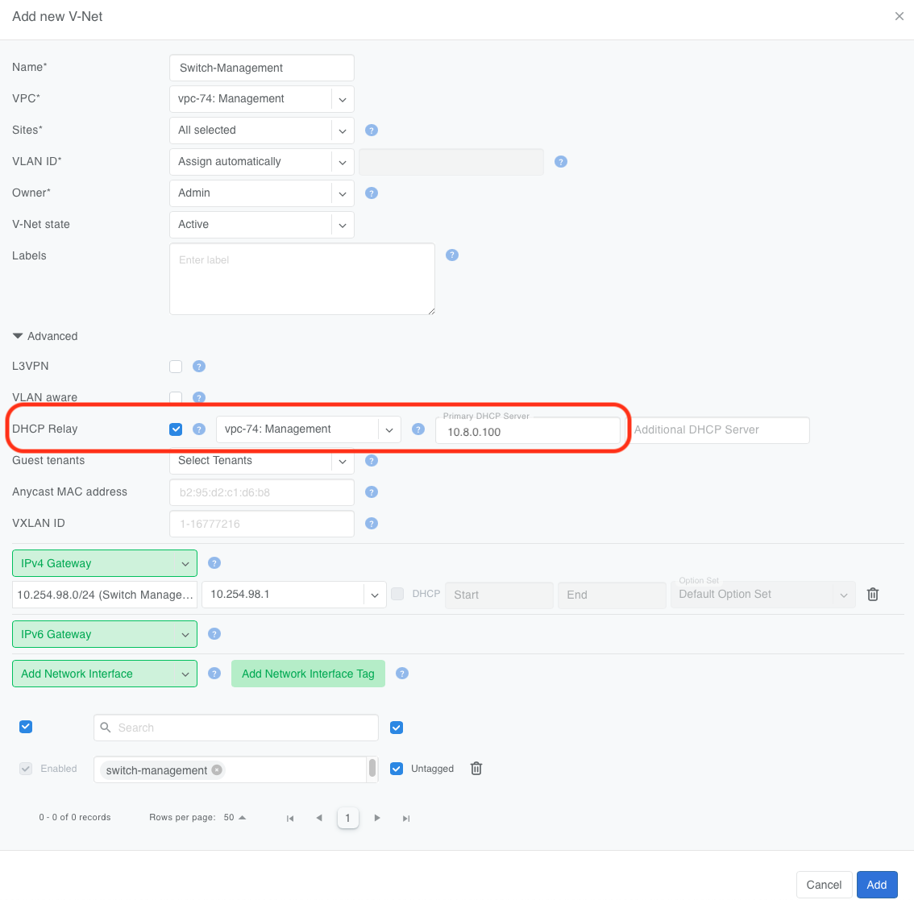
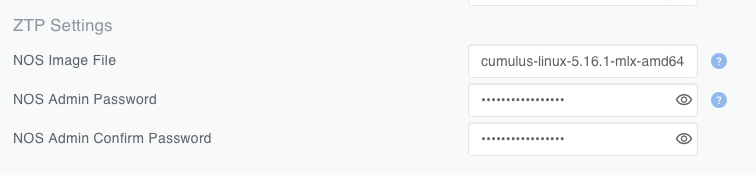
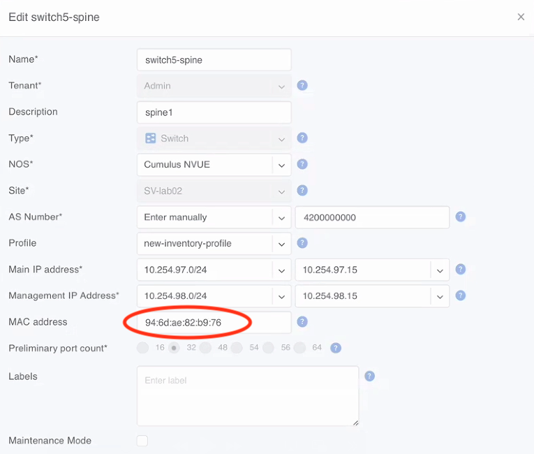
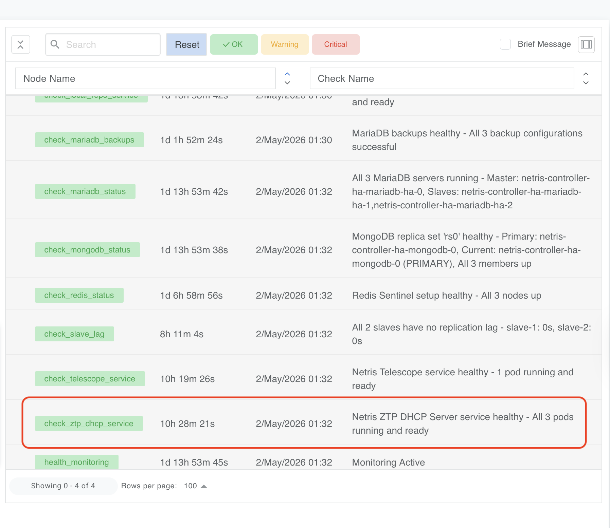

.. meta::
   :description: Netris Zero Touch Provisioning (ZTP)

##############################
Zero Touch Provisioning (ZTP)
##############################

.. contents:: Table of Contents
   :local:
   :depth: 3

Overview
========

Netris Zero Touch Provisioning (ZTP) automates the initial configuration and onboarding of Netris-managed switches. Netris ZTP automatically installs the appropriate Network Operating System (NOS) based on the switch make and model, configures management networking, and registers the device with the Netris Controller.

The following diagram demonstrates the ZTP process.

.. raw:: html

   

When a new switch is powered on and connected to the management network, it sends a DHCP discover request on its eth0 (management) interface. The Netris ZTP DHCP server responds with the correct IP address and a link to download the appropriate NOS based on the switch's MAC address found in the discover request. The switch then downloads its NOS image from the Netris Controller local repository, installs it, and registers with the controller — all without operator intervention.

Netris ZTP significantly reduces deployment time and eliminates manual configuration errors, especially in environments with many switches to provision.

Prerequisites
=============

To enable ZTP, the following requirements must be satisfied. Complete each item in the order listed.

1. HA Controller with North-South VIP
--------------------------------------

Deploy the Netris Controller with a North-South Virtual IP (N/S VIP) configured. The N/S VIP is the address switches and other infrastructure devices use to reach the controller services.

See: :ref:`Deploy North-South controller VIP <North-South-vip>`

.. tip::

   The N/S VIP is required only when deploying a hierarchical (a.k.a. hybrid) Out-of-Band Management network topology. In direct-to-CMN deployments, you can use the controller's CMN VIP instead, and the N/S VIP is not required. Contact Netris Support to learn more about Hybrid and Direct-to-CMN deployments.

2. Configure Netris Local Repository
-------------------------------------

See: :ref:`Installing the Local Repository <install-local-repo>`

3. Upload NOS images to the local repo
---------------------------------------

Identify the path to the local directory where the local repo is located on each of the controller nodes (``$PVC_PATH``), as described in the :ref:`Local Repo installation instructions <install-local-repo>`.

Below is the command to identify the directory name on a controller node (must be run on each controller node separately):

.. code-block:: shell

   export PVC_PATH=$(kubectl get pv $(kubectl get pvc staticsite-$(kubectl -nnetris-controller get pod -l app.kubernetes.io/instance=netris-local-repo --field-selector spec.nodeName=$(hostname | tr '[:upper:]' '[:lower:]') --no-headers -o custom-columns=":metadata.name") -n netris-controller -o jsonpath="{.spec.volumeName}") -o jsonpath="{.spec.local.path}")

   echo $PVC_PATH

Upload required NOS images to this subdirectory on each controller node in the HA cluster (substitute ``<controller_IP>`` and ``$PVC_PATH`` with the appropriate values):

.. code-block:: shell

   scp cumulus-linux-5.16.1-mlx-amd64.bin <username>@<controller_IP>:/$PVC_PATH/repo/ztp_images/

.. tip::

   The above example command may need to be modified to include the appropriate username and/or port number for your environment.

   This method will be improved in future releases to allow uploading through the Netris Controller UI or API, eliminating the need for manual file transfer to each controller node.

.. _ztp-controller-address-resolution:

4. Controller Management Address Resolution
-------------------------------------------

Netris automatically resolves the Controller Management Address for each management subnet. The Controller IP Discovery service determines which controller address reaches each management subnet and writes that address to the subnet object in IPAM.

.. raw:: html

   
<em>Figure: A management subnet after discovery, showing the resolved Controller Management Address on the subnet edit form</em>

The ZTP DHCP server and the Netris agent installer both read it from there, so every switch receives a provisioning URL pointing to the controller address reachable from its own management segment.

Netris serves every management segment at once. Seed switches on the CMN and switches on the management V-Net can be provisioned, rebuilt, and upgraded in parallel, with no operator action between phases.

The global Controller Management Address under **Settings > General** remains as a fallback. Netris uses it only when no management subnet attached to a device has a resolved address. You do not need to set it.

.. note::

   Netris will remove the global Controller Management Address setting in a future release. Per-subnet resolution is the supported mechanism from 4.18 onward.

By default, the Netris agent installer is downloaded from the Netris public repository. You can optionally enable the :ref:`Local Repository feature <install-local-repo>` to source the Netris agent installer directly from the Netris controller.

.. tip::

   If you use an FQDN instead of the IP address in the Local Repository URL, ensure the DNS servers configured in the application inventory profiles can resolve the controller's FQDN to the controller's N/S VIP.

.. note::

   Controller IP Discovery resolves addresses from the controller's own Kubernetes environment: kube-vip VIPs on HA controllers, or the controller's LoadBalancer service on single-node and cloud deployments. External load balancers that are not represented as a Kubernetes LoadBalancer service are not supported.

5. IPAM Subnets in the Management VPC
--------------------------------------

.. tip::

   Netris automatically configures ZTP for any subnet in IPAM with Purpose set to "management".

.. raw:: html

   

A typical Netris deployment includes at least two "management" subnets: one for all Netris-managed switches and one for the initial set of "seed" switches.

The above screenshot demonstrates this configuration.

* ``10.254.96.0/24`` is the subnet for the "seed" switches (attached to the System VPC)
* ``10.254.98.0/24`` is the subnet for all other Netris-managed switches (attached to the Management VPC)

.. tip::

   You must set the default gateway value on the subnet. This option is visible only when the subnet purpose is set to management.

   .. image:: ../images/ztp-ipam-management-default-gateway.png
      :align: center
      :class: with-shadow

   .. raw:: html

      
<em>Figure: Adding a management subnet.</em>

Each management subnet also carries a read-only **Controller Management Address** attribute showing the address Netris resolved for that subnet. The Add Subnet form does not show the Controller Management Address. It appears on the subnet edit form. Until discovery completes, the value reads ``Not yet resolved``. Netris does not provision switches on a subnet whose Controller Management Address has not resolved.

.. raw:: html

   
<em>Figure: A management subnet whose Controller Management Address has not yet resolved</em>

If your Netris deployment includes a dedicated subnet for the controller's North-South VIP, create this subnet in IPAM as well.

.. tip::

   The Controller Management Network is a physically separate, statically configured, non-Netris-managed management network. It connects Netris Controller nodes (for HA communication) and seed switches (in hierarchical deployments) or OOB switches (in direct-to-CMN deployments).

.. tip::

   Seed switches — the initial set of 2 to 6 Netris-managed switches provisioned before any other switches in hierarchical deployments — have their management ports connected directly to CMN.

6. V-Net with DHCP Relay
-------------------------

If the Netris-managed switches are in a different VNet from the controller's North-South VIP, then configure a DHCP relay in the switch management VNet, pointing to the Netris controller's North-South VIP address. This ensures that DHCP requests from switches on the management V-Net are forwarded to the ZTP DHCP server running on the Netris controller.

.. raw:: html

   

.. tip::

   Depending on your routing domain configuration, you may need to provision a local static route to the switches' loopbacks on each Netris Controller so the DHCP server (running on the Netris Controller node) can properly forward DHCP reply traffic. See the example in :ref:`ztp-static-routes` below.

7. Inventory Profile Configuration
-----------------------------------

Each inventory profile used for ZTP must specify the following:

* **NOS Image** — the network operating system image file that ZTP will install on the switch.
* **NOS Admin Password** — the administrative password Netris will configure on the switch after provisioning is complete.

.. raw:: html

   

8. Switch MAC Address in Inventory
-----------------------------------

Populate the MAC address of each switch in the corresponding switch object within the Netris inventory. The MAC address must be that of the switch's **eth0** interface. This is the address the switch uses during its initial DHCP discovery, and it is how the ZTP server identifies which NOS to assign.

.. raw:: html

   

**Where to Find the MAC Address:**

1. **Switch chassis label** — a sticker on the front or rear of the switch, typically near the serial number.
2. **Original packaging** — the shipping box label includes the MAC address, part number, and serial number.

.. _ztp-static-routes:

9. Configure Static Routes on the Controller Nodes
---------------------------------------------------

The controller nodes need static routes to communicate with the management V-Net subnet through the N/S interface. Without these routes, the controller cannot reach the switches on the management network.

On each controller node, edit the Netplan configuration file at ``/etc/netplan/50-cloud-init.yaml`` to add the required routes.

**Example Netplan Configuration**

In this example, the controller has two interfaces:

* ``ens3`` — the primary interface with the default gateway.
* ``ens8`` — the N/S VIP interface, used to reach the management networks.

.. code-block:: yaml

   network:
     version: 2
     ethernets:
       ens3:
         addresses:
           - "10.254.96.130/24"
         nameservers:
           addresses:
             - 8.8.8.8
           search:
             - netris.local
         routes:
           - to: "default"
             via: "10.254.96.1"
       ens8:
         addresses:
           - 10.8.0.100/24
         routes:
           - to: 10.254.97.0/24
             via: 10.8.0.1
           - to: 10.254.98.0/24
             via: 10.8.0.1

In this example, ``10.254.98.0/24`` is the management subnet where the switches' management ports reside. ``10.254.97.0/24`` is a prefix from which the switches' loopback IPs are allocated. The routes point to the appropriate next-hop gateways reachable through the ``ens8`` interface.

After editing, apply the configuration:

.. code-block:: shell

   sudo netplan apply

.. note::

   Repeat this step on all controller nodes in the HA cluster. Each node must have the same routes so that whichever node is active can reach the management networks.

10. Deploy the Netris ZTP DHCP Server
-------------------------------------

Deploy the Netris ZTP DHCP server as a Kubernetes workload on the controller cluster, following the same pattern used for other controller services (e.g., the local repository). The manifest is located at:

.. code-block:: shell

   manifests/netris-controller/ztp-dhcp-server.yaml

Deploy the ZTP DHCP server by applying the manifest from the first controller node without modifying it:

.. code-block:: shell

   kubectl apply -f manifests/netris-controller/ztp-dhcp-server.yaml

Expected output:

.. code-block:: shell

   deployment.apps/netris-ztp-dhcp-server created

Verify the DHCP server pod is running:

.. code-block:: shell

   kubectl -n netris-controller get pods -l app.kubernetes.io/instance=netris-ztp-dhcp-server

11. Verify ZTP Readiness
-------------------------

After deploying the DHCP server, confirm the following:

1. The ZTP DHCP server pod is in a Running state, as shown in the Dashboard.

.. raw:: html

   

2. The controller nodes can reach the management subnets (verify with ping from a controller node).
3. Switch MAC addresses are populated in the Netris inventory.
4. The inventory profile has the NOS image and the admin password configured.

Once everything is confirmed, power on the switches. They will automatically perform a DHCP request, receive their configuration from the ZTP server, download and install the NOS image, and register with the Netris Controller.

How ZTP works (Process Summary)
===============================

For reference, here is the sequence of events that occurs when a switch is provisioned via ZTP:

1. The switch powers on with no configuration and sends a DHCP discover on its eth0 (management) interface.
2. The ZTP DHCP server matches the DHCP request to a switch object in Netris using the source MAC address.
3. The server assigns the correct management IP address and provides boot parameters, including the URL of the NOS image on the local repository.
4. The switch downloads and installs the NOS image.
5. After installation, the switch reboots into the new NOS, initiates the ZTP process, which configures the admin credentials from the inventory profile, downloads the Netris switch agent, and establishes a connection to the Netris Controller. A switch may take 10-15 minutes to provision, depending on the switch's hardware and other factors.
6. The switch appears as provisioned in the Netris inventory and begins receiving its intended network configuration.

Troubleshooting
===============

If a switch does not provision as expected, check the following:

**DHCP server logs:** Check the ZTP DHCP server pod logs for DHCP discover/offer/request/ack messages.

.. code-block:: shell

   kubectl -n netris-controller logs -l app.kubernetes.io/instance=netris-ztp-dhcp-server

**MAC address mismatch:** Verify that the MAC address in the Netris inventory matches the eth0 MAC address printed on the switch.

**Network reachability:** From a controller node, ping the management subnet gateway to confirm the static routes are in place.

**DHCP relay:** Confirm the V-Net DHCP relay is pointing to the correct N/S VIP address.

**Controller Management Address not resolved:** In IPAM, check the **Controller Management Address** attribute on the switch's management subnet. If it reads ``Not yet resolved``, Netris could not determine which controller address reaches that subnet. Confirm the controller has a route to the subnet and that a controller VIP exists in the subnet the controller uses to reach it.

**NOS image and admin password:** Verify the NOS image name in the Inventory Profile matches the NOS images uploaded to the local repo, and that the profile has a NOS admin password set.

For additional assistance, contact Netris Support.
