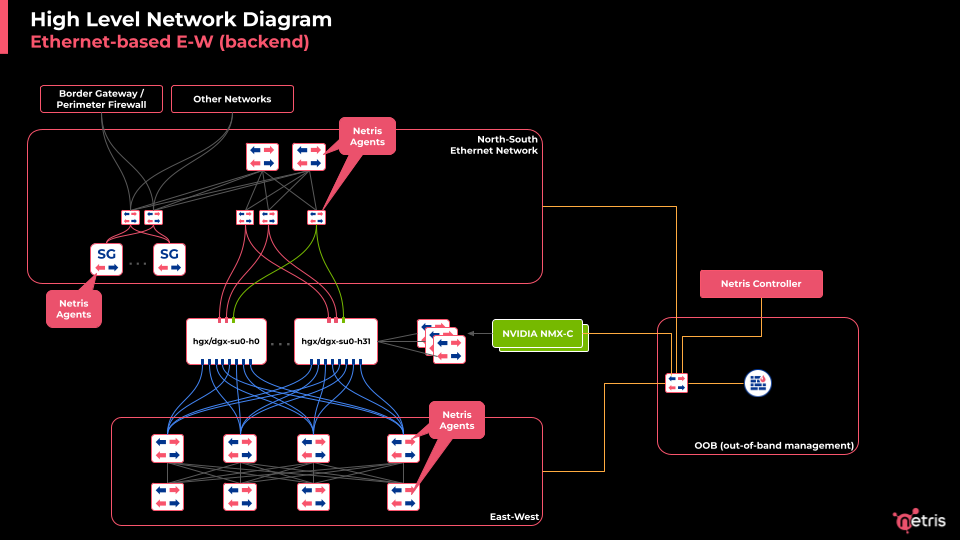
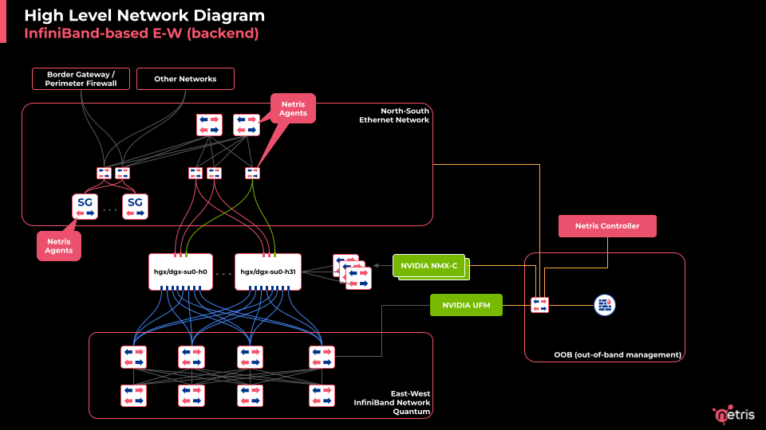

.. meta::
    :description: Introduction to Netris

======================
Introduction to Netris
======================

What is Netris
--------------

Netris is the leading provider of network automation and multi-tenancy for AI infrastructure. The Netris NAAM (Network Automation, Abstraction, and Multi-Tenancy) platform is purpose-built for GPU clouds and AI factories and is the most widely deployed network automation and multi-tenancy platform for AI infrastructure on the market.

What Netris does
----------------

Netris delivers three capabilities together as a single platform:

* **Automation.** Netris configures the network from user-defined intent — switching, routing, load-balancing, ACLs, VRFs, VXLANs, BGP, InfiniBand partition keys (PKeys), and NVLink partitions. Operators describe the end state; Netris translates intent into device configuration in minutes with closed-loop assurance, and continuously reconciles.

* **Abstraction.** Netris provides cloud-provider-grade constructs over the physical network — VPCs, V-Nets, elastic IPs, NAT, L4 load balancers, ACLs, and VPC peering — through a single web console, REST API, Kubernetes CRDs, and Terraform provider. Operators consume the network like a cloud; Netris algorithms translate those constructs into precise configurations across every fabric.

* **Multi-tenancy.** Netris enables true multi-tenancy through hard isolation (enforced on networking hardware) across bare metal, VM, and container workloads, on every fabric Netris manages. Operators define endpoints; Netris enforces isolation automatically and dynamically without downtime.

Who Netris is for
-----------------

Netris is used by GPU cloud providers (also known as neoclouds or AI cloud providers), enterprise AI factories, sovereign AI cloud providers, NVIDIA Cloud Partners (NCPs), and traditional data center operators who want to run their physical network like a cloud. If you are building a GPU cloud, operating a multi-tenant AI factory, or running an enterprise data center, and you want the network to behave like a cloud-provider service instead of a per-box configuration project, Netris is built for you.

How an AI network differs from a traditional network
----------------------------------------------------

A traditional enterprise or cloud data center is typically built around a single Ethernet fabric that carries all traffic — application traffic, storage traffic, and management traffic. An AI data center is different. To support distributed training and large-model inference at scale, an AI deployment is built from several distinct network fabrics, each engineered for a specific role. Four fabric roles appear across this documentation:

* **North-South (frontend) fabric.** The Ethernet fabric that connects the data center to the outside world — ISPs, peering, the corporate WAN, the public Internet, other regions — and that also carries tenant API traffic, storage traffic, and the data path for ingress and egress services such as NAT and L4 load balancing. The frontend fabric is the closest analog to the fabric you would find in a traditional data center. Some teams call this the *frontend network*.

* **East-West (backend, scale-out) fabric.** A dedicated, high-bandwidth, lossless network that connects GPU servers directly to each other for collective communications — the all-reduce, all-gather, and all-to-all traffic patterns generated by distributed training and large-model inference. The backend fabric carries no client traffic and is sized very differently from the frontend. It can be implemented over Ethernet (e.g., NVIDIA Spectrum-X), or over InfiniBand using NVIDIA Quantum. Netris manages both. Some teams call this the *backend network* or *scale-out network*.

* **NVL72 (rack-scale) fabric.** An NVLink-based, in-rack fabric that connects up to 72 GPUs in a single liquid-cooled rack into one NVLink domain, so the rack behaves as a single logical accelerator. NVL72 ships with NVIDIA GB200 NVL72 and GB300 NVL72 rack-scale systems. NVLink switching inside the rack is managed by NVIDIA NMX (NVLink Management Software); Netris integrates with NMX to orchestrate NVLink partitions for tenant isolation when an NVL72 fabric is present.

* **Out-of-band (OOB) management fabric.** A separate management network used to reach the management interfaces of every device in the deployment — Ethernet switches, InfiniBand switches, NVLink switches, DPUs, server BMC/IPMI, PDUs, environmental controllers, and orchestration platforms. The OOB fabric carries no tenant traffic. It can be deployed as part of the North-South fabric or as a standalone fabric, depending on the operator's availability objectives.

The two diagrams below show how these fabrics fit together in two common Netris deployments. The only structural difference between them is the technology used for the East-West backend fabric.

**Reference architecture — Ethernet backend (e.g., NVIDIA Spectrum-X)**

The East-West fabric is Ethernet (e.g., NVIDIA Spectrum-X). Netris manages both the North-South frontend fabric and the East-West Ethernet backend fabric. Netris SoftGate provides ingress and egress services (NAT, L4 load balancing) at the edge of the North-South fabric. The Netris Controller sits outside the data path and reaches every managed device through closed-loop telemetry and configuration channels over the OOB management network.

**Reference architecture — InfiniBand backend (NVIDIA Quantum)**

The East-West fabric is InfiniBand, running NVIDIA Quantum. Netris manages the North-South Ethernet frontend fabric directly and integrates with NVIDIA UFM (Unified Fabric Manager) to orchestrate tenant isolation (PKeys) on the InfiniBand fabric. The rest of the architecture — SoftGate, Controller, OOB — is identical to the Ethernet-backend deployment.

What to read next
-----------------

Before going further, skim the :doc:`Definitions <definitions>` page. It is a short glossary of the terms Netris uses throughout the rest of this documentation — VPC, V-Net, Site, Tenant, IPAM, Inventory Profile, Server Cluster, SoftGate. Knowing the vocabulary up front will save you several backtracks.

Then read :doc:`Netris Architecture <netris-architecture>`. It walks through every component of a Netris deployment — Controller, Switch Agent, SoftGate, the AI integrations, and the management network — and shows how they fit together inside the fabric picture above.
