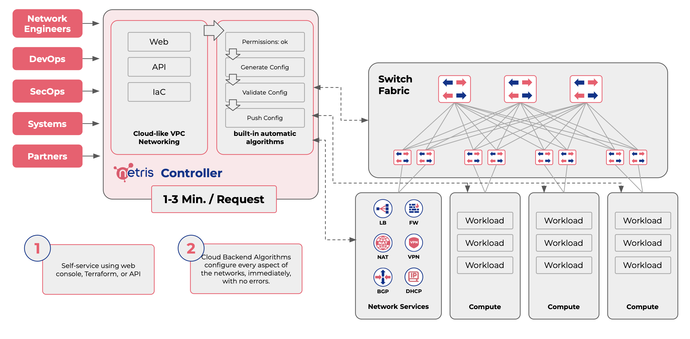

.. meta::
    :description: Introduction to Netris

Introduction to Netris
======================

Netris is a network automation and abstraction software for cloud builders. Netris brings cloud-like VPC abstractions for operating physical networks like it is a cloud. Netris automatically configures switching, routing, load-balancing, and network security based on user-defined services and policies. Netris continuously monitors the network’s health and either applies software remediation or informs you of necessary actions if human intervention is required. Netris abstracts away the complexities of detailed network configuration, letting you perform efficiently by operating your physical network in a top down approach like a cloud – instead of the legacy box by box operation.

Netris :doc:`SoftGate <netris-softgate-HS>`, also known as VPC gateway, provides Network Services and is an optional, multi-tenant (VPC-aware) software component designed for cloud providers and scales horizontally to provide this ingress and egress connectivity. The SoftGate software runs on a dedicated set of operator-provided bare-metal x86 servers and is tightly integrated with the Netris-managed North-South fabric.

    
