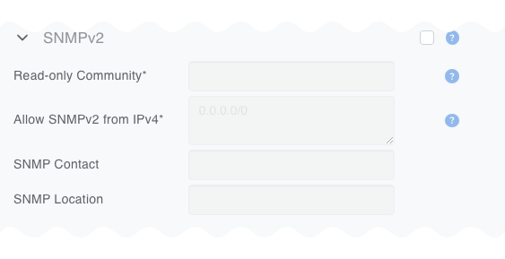

.. _topology-management:
.. meta::
    :description: Inventory Profiles

==================
Inventory Profiles
==================

Inventory profiles allow security hardening of inventory devices. By default all traffic flow destined to switch/SoftGate is allowed. As soon as the inventory profile is attached to a device it denies all traffic destined to the device except Netris-defined and user-defined custom flows. Automatically allowed flows include:

*  SSH from user defined subnets
*  NTP from user defined ntp services
*  DNS from user defined DNS servers
*  Custom user defined rules

.. csv-table:: Inventory Profile Fields
   :file: tables/inventory-profile-fields.csv
   :widths: 25, 75
   :header-rows: 0

.. image:: images/Inventory-Profile-Top.png
   :align: center
   :class: with-shadow

.. raw:: html

   

SNMPv2 credentials
==================

Netris administers can define SNMPv2 credentials to monitor switches and SoftGates in the inventory. To add SNMPv2 credentials, expand the SNMPv2 section of the Inventory Profile form, set the checkbox to enabled, and fill in the fields as described below:

.. list-table:: SNMPv2 Fields

   * - Read-Only Community
     - ✅ required
     - Specify the SNMPv2 read-only community string.
   * - Allow SNMPv2 from IPv4
     - ✅ required
     - Specify the IPv4 subnets from which SNMPv2 requests will be accepted.
   * - SNMP Contact
     - 🔹 Optional
     - Specify the SNMP contact information.
   * - SNMP Location
     - 🔹 Optional
     - Specify the SNMP location information.

.. raw:: html

   

Fabric Settings
================

Netris can automatically optimize fabric configurations based on administrator's design and prefernces. The following controls are available in the Fabric Settings section of the Inventory Profile form:

- **Optimize BGP Overlay for leaf-spine topology** (default = checked)  When checked, overlay BGP updates will be optimized for large scale. Each leaf switch (based on name) will form its overlay BGP sessions only with two spine switches (with the lowest IDs). Otherwise, Overlay BGP sessions will be configured on p2p links alongside underlay.
- **Optimize BGP Overlay for Hypervisor Integrated Fabric** (default = unchecked). Required for BGP/EVPN VXLAN integration with compute hypervisor networking. This optimization makes sure that a large number of hypervisor virtual networking EVPN prefixes do not overflow switch TCAM.
- **BGP Numbered Underlay** (default = unchecked)  When checked, BGP underlay sessions will be configured using p2p IPv4 addresses configured on link objects in the Netris controller. Otherwise, BGP unnumbered method is used and p2p ipv6 link-local addresses are used for BGP sessions.
- **Automatic Link Aggregation** (default = unchecked). When checked, Enable MC-LAG shall become unchecked automatically through the UI.
- **Enable MC-LAG** (default = unchecked). When checked, Automatic Link Aggregation shall become unchecked automatically through the UI.  If unchecked none of MC-LAG related configurations should be generated by switch agents. Help message: “Enabling MC-LAG functionality will disable any EVPN-MH functionality. Two multihoming methods are not supported simultaneously on the same switches.”

GPU Cluster Specific Settings
=============================

Additional optimizations are available for East-West GPU interconnect fabrics.
 
- **QoS & RoCE** (default = unchecked) Optimize for RDMA over Converged Ethernet
- **RoCE Adaptive Routing (AR)** (default = unchecked) Enable Adaptive Routing for RoCE
- **Congestion Control** (default = unchecked) Enable Zero Touch RoCE Congestion Control
- **ASIC monitoring** (default = unchecked) Enable ASIC monitoring: histograms and telemetry snapshots.
- **Aggregate L3VPN /31 prefixes into /26** (default = unchecked) Minimize prefix updates over BGP Overlay for L3VPN p2p links in rail-optimized topology and IP addressing schemes.

Custom Rules
================

Custom rules allow the administrator to define specific allow/deny flows to/from inventory devices.

If an inventory profile is attached to a switch or a softgate, then Netris configures an implicit inbounddeny ACL. Several rules are automatically added to this ACL to allow the necessary system services connections like NTP, DNS, SSH from Allowed Hosts, BGP, ICMP, DHCP, SNMP. Everything else is denied by the implicit deny rule. 
If additional inbound services (e.g., Netflow/Sflow) need to be allowed, you can use Custom Rules to permit those connections.

In the example below, a custom rule is defined to allow inbound TCP traffic on port 555 from 1.1.1.1/32 to the inventory device.

.. image:: images/CustomRules.png
   :align: center
   :class: with-shadow

.. raw:: html

   

ZTP Settings
================

- **NOS Image file** When Zero Touch Provisioning (ZTP) is in use, this Network Operating System image will be used to bootstrap the switches subject to this Inventory Profile.
- **NOS Admin Password** Once the ZTP process completes, Netris will configure this password for the builtin admin user.
- **NOS Admin Confirm Password** Confirmation of the NOS Admin Password.
