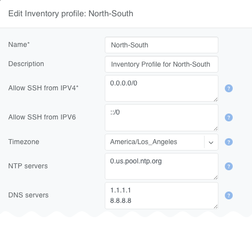
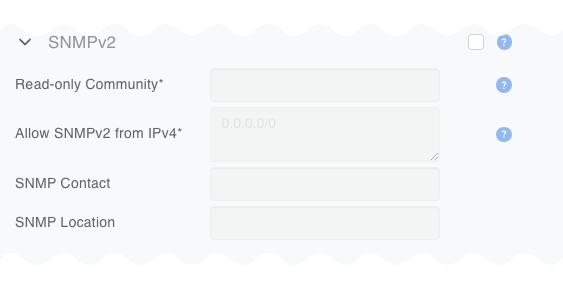
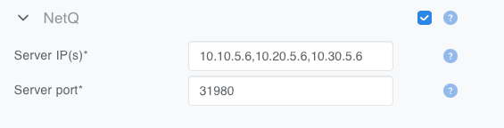
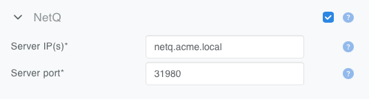
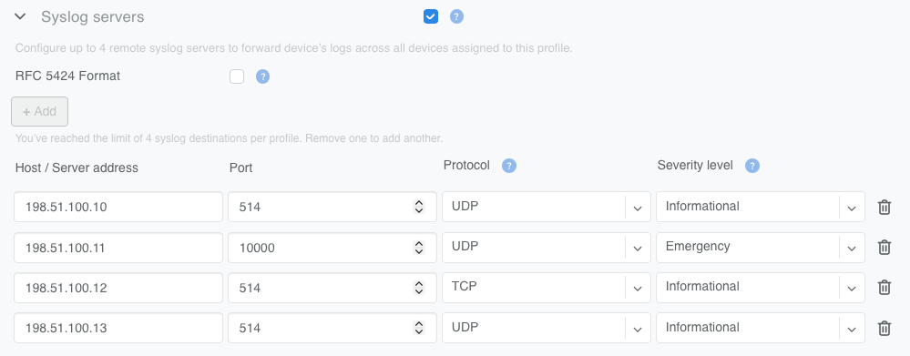
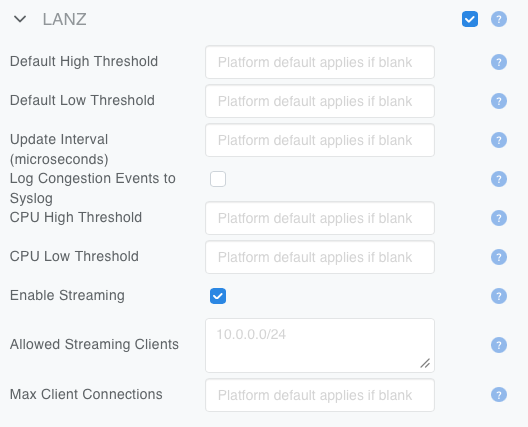
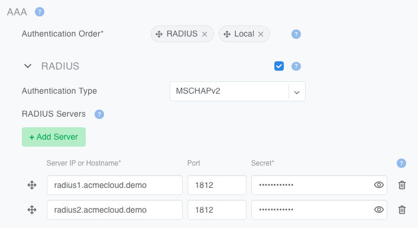
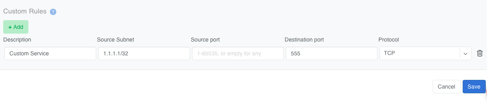

.. _inventory-profile:
.. meta::
    :description: Inventory Profiles

==================
Inventory Profiles
==================

.. contents:: Table of Contents
   :local:
   :depth: 2

Overview
========

Inventory profiles allow security hardening of inventory devices and fabric-wide configuration optimizations.

By default, all traffic flow destined to switch/SoftGate is allowed. As soon as you attach an inventory profile to a device, it denies all traffic destined for the device except Netris-defined and user-defined custom flows.

Automatically allowed IPv4 and IPv6 inbound flows include:

*  SSH TCP port 22 from user-defined subnets
*  NTP UDP port 123
*  DNS UDP and TCP port 53
*  SNMP UDP port 161 (IPv4 only) from user-defined subnets
*  LANZ streaming TCP port 50001 (IPv4 only), when Arista LANZ streaming is enabled
*  RADIUS replies from the RADIUS servers configured in the AAA section
*  BGP TCP port 179 from defined neighbors and fe80::/64
*  ICMP
*  DHCP
*  Custom user-defined rules

.. csv-table:: Inventory Profile Fields
   :file: tables/inventory-profile-fields.csv
   :widths: 25, 75
   :header-rows: 0

.. raw:: html

   

.. _snmp_settings:

SNMPv2 credentials
==================

Netris administrators can define SNMPv2 credentials to monitor switches in the inventory. To add SNMPv2 credentials, expand the SNMPv2 section of the Inventory Profile form, set the checkbox to enabled, and fill in the fields as described below:

.. list-table:: SNMPv2 Fields

   * - Read-Only Community
     - ✅ required
     - Specify the SNMPv2 read-only community string.
   * - Allow SNMPv2 from IPv4
     - ✅ required
     - Specify the IPv4 subnets from which SNMPv2 requests will be accepted.
   * - SNMP Contact
     - 🔹 Optional
     - Specify the SNMP contact information.
   * - SNMP Location
     - 🔹 Optional
     - Specify the SNMP location information.

.. raw:: html

   

.. note::

   Configuring SNMP monitoring of SoftGates is planned for future releases.

.. _netq_settings:

NetQ Settings
=============

Netris administrators can define the NetQ server address and port to configure the NetQ client on Cumulus Linux-based switches automatically.

.. list-table:: NetQ Fields

   * - NetQ Server
     - ✅ required
     - Specify the IP address(es) or the FQDN of the NetQ server. You can specify one (1) or three (3) addresses separated by commas, or one FQDN.
   * - NetQ Port
     - ✅ required
     - Specify the NetQ server port. The default is 31980.

.. raw:: html

   

.. raw:: html

   

.. tip::

   You may also export your network topology as a Graphviz DOT file to import into your NetQ instance. See :doc:`/monitoring-observability/netq` for more details.

.. _syslog_settings:

Syslog Settings
===============

Netris administrators can define up to four remote syslog destinations per Inventory Profile. Once configured, Netris pushes the syslog configuration to every switch and SoftGate assigned to the profile, so devices forward their logs to your SIEM or log collection system without any manual per-device configuration. To configure syslog forwarding, expand the Syslog Servers section of the Inventory Profile form, set the checkbox to enabled, and fill in the fields as described below:

.. list-table:: Syslog Fields

   * - RFC 5424 Format
     - 🔹 Optional
     - Send messages in the structured RFC 5424 format. When disabled (default), messages use the legacy RFC 3164 format.
   * - Host / Server Address
     - ✅ required
     - IPv4 address or FQDN of the remote syslog server.
   * - Port
     - ✅ required
     - Destination port. Default is 514.
   * - Protocol
     - ✅ required
     - UDP (default) or TCP.
   * - Severity Level
     - ✅ required
     - Minimum severity to forward: Emergency, Alert, Critical, Error, Warning, Notice, Informational (default), or Debug. Only messages at or above the selected severity are forwarded.

.. raw:: html

   
<em>Figure: Syslog Servers section of the Inventory Profile form</em>

Use **+ Add** to configure additional servers, up to four per profile. You can remove each server row with the trash icon; at least one server must remain while Syslog is enabled.

On SoftGates, Netris forwards routing logs along with operating system logs, so BGP and other routing events reach the same destinations.

.. note::

   SoftGates send syslog from their main routing table. Each syslog server must be reachable from that table.

.. note::

   Changing syslog settings restarts the system logging service on SoftGates. Buffered messages are preserved across the restart.

Syslog destination configuration is supported on Arista EOS, NVIDIA Cumulus Linux, and Dell SONiC switches, and on SoftGate. See the :doc:`Supported Functionality and Platforms Matrix </supported-platform-matrix>` for platform-by-platform switch support.

.. _lanz_settings:

Arista LANZ Settings
====================

Netris administrators can enable Arista LANZ (Latency Analyzer) to monitor egress queue depth in hardware and detect microbursts — transient congestion that builds and clears within microseconds, too briefly for polling-based monitoring such as SNMP to observe. LANZ generates a congestion event when a queue crosses its high threshold, and a recovery event when the queue drains below its low threshold. Events can be written to the switch's syslog, streamed to external monitoring clients in real time, or both.

.. raw:: html

   
<em>Figure: Arista LANZ settings in the Inventory Profile form</em>

To configure LANZ, expand the Arista LANZ section of the Inventory Profile form, set the checkbox to enabled, and fill in the fields as described below:

.. list-table:: Arista LANZ Fields

   * - Default High Threshold
     - 🔹 Optional
     - Queue depth at which a congestion event is generated on ports using the default thresholds, 8–16382. Leave blank to use the switch's platform default.
   * - Default Low Threshold
     - 🔹 Optional
     - Queue depth below which the queue is considered recovered, 1–16382. Must be lower than the Default High Threshold. Leave blank to use the switch's platform default.
   * - Update Interval
     - 🔹 Optional
     - Minimum time between repeated congestion messages for the same queue, in microseconds, 80–10000000. Applies to both syslog and streaming. Leave blank to use the switch's platform default.
   * - Log Congestion Events to Syslog
     - 🔹 Optional
     - Write over-threshold and recovery events to the switch's syslog. Disabled by default.
   * - CPU High Threshold
     - 🔹 Optional
     - Queue depth at which a congestion event is generated on the CPU control-plane queue, 8–16382. CPU queue monitoring is active whenever Arista LANZ is enabled; this field only overrides its threshold. Leave blank to use the switch's platform default.
   * - CPU Low Threshold
     - 🔹 Optional
     - Queue depth below which the CPU queue is considered recovered, 1–16382. Must be lower than the CPU High Threshold. Leave blank to use the switch's platform default.
   * - Enable Streaming
     - 🔹 Optional
     - Turn on the real-time feed that external monitoring clients connect to. Turned off by default. Enabling it makes the two fields below editable.
   * - Allowed Streaming Clients
     - 🔹 Optional
     - IPv4 subnets permitted to connect to the streaming feed (one per line, for example 10.0.0.0/24). Leave blank to allow any client.
   * - Max Client Connections
     - 🔹 Optional
     - Maximum number of clients that may connect to the streaming feed at once, 1–100. Leave blank to use the switch's platform default.

Each threshold pair is configured together: set both the high and the low value, or leave both blank. A pair with only one value set is not applied, and the switch keeps its platform defaults for that queue.

.. note::

   Arista EOS warns that an update interval below 5 seconds (5000000 microseconds) may cause congestion messages to be lost.

Monitoring clients open a TCP connection to the switch on port 50001 and pull telemetry from the streaming feed; the switch does not connect out to a collector. A client application is required to consume the feed.

Turning off the Arista LANZ checkbox removes the LANZ configuration from every switch assigned to the profile.

Arista LANZ is supported on Arista EOS switches. See the :doc:`Supported Functionality and Platforms Matrix </supported-platform-matrix>` for platform-by-platform support.

.. _aaa_settings:

AAA Settings
============

Netris administrators can configure RADIUS authentication for switch logins, so operators sign in to switches with credentials from your centralized AAA infrastructure instead of the shared local admin account. Once configured, Netris pushes the AAA configuration to every switch assigned to the profile, with no manual per-switch configuration and without a device reboot. The configuration is also applied during Zero Touch Provisioning, so switches come up with it already in place.

AAA configuration is supported on NVIDIA Cumulus Linux and Dell SONiC switches. See the :doc:`Supported Functionality and Platforms Matrix </supported-platform-matrix>` for platform-by-platform support.

Netris configures RADIUS for switch login authentication. Users who authenticate through RADIUS sign in with the same permissions as the NOS admin account whose password is set under :ref:`ZTP Settings <ztp_settings>`, so every account your RADIUS server authenticates has full administrative access to the switch. Netris does not configure RADIUS accounting.

Authentication Order
--------------------

The Authentication Order defines which authentication methods switches attempt, and in what order, from left to right. The default is Local alone.

Drag the chips to reorder them, or remove a chip with its "×". At least one method must remain in the authentication order. RADIUS becomes available as a chip only after you enable the RADIUS section below.

As long as Local is in the authentication order, local switch accounts remain usable: a user who exists only on the switch can still log in, including when the RADIUS servers are reachable and answering. Enabling RADIUS adds an identity source; it does not deactivate local accounts.

.. warning::

   If Local is not in the authentication order, operators are locked out of switch login whenever the configured RADIUS servers are unreachable. Keep Local in the authentication order unless you have an out-of-band recovery path.

.. raw:: html

   
<em>Figure: AAA settings in the Inventory Profile form, with RADIUS enabled</em>

RADIUS
------

To configure RADIUS servers, expand the RADIUS section of the Inventory Profile form, set the checkbox to enabled, and fill in the fields as described below:

.. list-table:: RADIUS Fields

   * - Authentication Type
     - ✅ required
     - CHAP, PAP, MSCHAPv2, or Default. Default (default) uses the switch operating system's own default authentication type: MSCHAPv2 on NVIDIA Cumulus Linux, PAP on Dell SONiC.
   * - Server Address
     - ✅ required
     - IPv4 address or FQDN of the RADIUS server.
   * - Port
     - ✅ required
     - Destination port, 1–65535. Default is 1812.
   * - Secret
     - ✅ required
     - Shared secret used to authenticate with this RADIUS server. The secret is stored encrypted and is never returned in clear text by the UI or the API. When editing an existing server, leave this field empty to keep the stored secret.

Use **Add Server** to configure additional servers, up to eight per profile. Each server must have a unique address and port combination within the profile.

Servers are tried in the order shown, top row first. Drag a row's handle on the left to reorder it and change its priority. Each server row can be removed with the trash icon; at least one server must remain while RADIUS is enabled.

Turning off the RADIUS checkbox removes the RADIUS configuration from every switch assigned to the profile and returns those switches to local authentication.

.. note::

   On NVIDIA Cumulus Linux switches, Netris restarts the NVUE management daemon (nvued) when the AAA configuration changes.

.. _fabric_settings:

Fabric Settings
================

Netris can automatically optimize fabric configurations based on the administrator's design and preferences. The following controls are available in the Fabric Settings section of the Inventory Profile form:

- **Fabric Type** (default = General Purpose). The selected fabric type filters which switches are subject to the "Optimize BGP Overlay for leaf-spine topology" feature, as described below. Supported values include:
  
  * Generic
  * East-West
  * East-West-Plane1
  * East-West-Plane2
  * East-West-Plane3
  * East-West-Plane4
  * North-South
  * OOB

- **Optimize BGP Overlay for leaf-spine topology** (default = checked). When checked, Netris applies the following logic to all switches sharing the Fabric Type value set in this Inventory Profile. Netris configures designated switches as EVPN Route Servers (EVPN-RS), and each switch with the Switch Role property set to Leaf forms overlay BGP sessions (address-family l2vpn evpn) exclusively with those nodes. No other overlay BGP sessions are configured.

  EVPN-RS designation works as follows:

  * If no switch object has the EVPN Route Server property (set in the :doc:`Topology Management </topology-management>` page's :ref:`Adding Switches <topology-management-adding-switches>` section) set, Netris automatically selects the two switches with the Switch Role property set to Super-Spine — or, if no Super-Spine switches are present, the two switches with the Switch Role property set to Spine — with the lowest loopback IPs.
  * If one or more switch objects have the EVPN Route Server property set, automatic selection is turned off entirely, and Netris uses only the explicitly designated switches as EVPN-RS nodes.
  * Because setting the property on even one switch turns off automatic selection, operators should explicitly designate at least two switches for redundancy. Netris does not automatically enforce this recommendation.

  When unchecked, overlay BGP sessions are configured on all point-to-point links.

- **Optimize BGP Overlay for Hypervisor Integrated Fabric** (default = unchecked). Required for BGP/EVPN VXLAN integration with compute hypervisor networking. This optimization makes sure that a large number of hypervisor virtual networking EVPN prefixes do not overflow switch TCAM.
- **BGP Numbered Underlay** (default = unchecked). When checked, BGP underlay sessions will be configured using p2p IPv4 addresses configured on link objects in the Netris controller. Otherwise, BGP uses the unnumbered method, and BGP sessions use p2p IPv6 link-local addresses.
- **Automatic Link Aggregation** (default = unchecked). When checked, the UI automatically unchecks Enable MC-LAG.
- **Generate ESI by Server ID** (default = unchecked). When checked, ESI-IDs are generated using server-ID-based logic instead of the default partner-MAC-based method. The setting is backward compatible: existing ESI-IDs remain valid, and servers not modeled in Netris automatically fall back to partner-MAC-based generation. Note that when multiple bond interfaces are present on servers, this should remain unchecked.
- **Enable MC-LAG** (default = unchecked). When checked, Automatic Link Aggregation will automatically become unchecked through the UI. If unchecked, switch agents should not generate any MC-LAG-related configurations. Help message: "Enabling MC-LAG functionality will disable any EVPN-MH functionality. Two multihoming methods are not supported simultaneously on the same switches."

.. _gpu_cluster_settings:

GPU Cluster Specific Settings
=============================

Additional optimizations are available for East-West GPU interconnect fabrics.
 
- **QoS & RoCE** (default = unchecked): Optimize for RDMA over Converged Ethernet.
- **RoCE Adaptive Routing (AR)** (default = unchecked): Enable Adaptive Routing for RoCE.
- **Congestion Control** (default = unchecked): Enable Zero Touch RoCE Congestion Control.
- **ASIC monitoring** (default = unchecked): Enable ASIC monitoring, including histograms and telemetry snapshots.
- **HWMP** (default = unchecked): Enable Hardware Multiplane (HWMP) support for GPU cluster fabrics with multiple planes of switches and leaf-spine topology. Must set the appropriate Reference Architecture.
- **Reference Architecture** (default = None): This setting tells Netris which reference architecture is being deployed on the subject fabric so that Netris can apply the appropriate prefix summarization in the L3VPN overlay.

  .. collapse:: Reference Architectures

    .. list-table::
        :header-rows: 1

        * - Reference Architecture
          - IPv4 

            Summarization mask
          - IPv6 
            
            Summarization mask
        * - H100/H200/B200 SPX 2-TIER

            H100/H200/B200 SPX 3-TIER
          - /26
          - /56
        * - GB200 SPX 2-TIER
            
            GB200 SPX 3-TIER
          - /25
          - /56
        * - B300/GB300 SPX 2-TIER/3-TIER, SINGLE/DUAL/QUAD-PLANE (all combinations)
          - /24
          - /56

.. _custom_rules:

Custom Rules
================

Custom rules allow the administrator to define specific allow/deny flows to/from inventory devices.

If an inventory profile is attached to a switch or a softgate, then Netris configures an implicit inbound deny ACL. Netris automatically adds several rules to this ACL to allow necessary system service connections, such as NTP, DNS, SSH from Allowed Hosts, BGP, ICMP, DHCP, SNMP, RADIUS, and LANZ streaming. Everything else is denied by the implicit deny rule.

If additional inbound services (e.g., Netflow/Sflow) need to be allowed, you can use Custom Rules to permit those connections.

In the example below, a custom rule allows inbound TCP traffic on port 555 from 1.1.1.1/32 to the inventory device.

.. raw:: html

   

.. _ztp_settings:

ZTP Settings
================

- **NOS Image file:** When Zero Touch Provisioning (ZTP) is in use, this Network Operating System image will be used to bootstrap the switches subject to this Inventory Profile.
- **NOS Admin Password:** Once the ZTP process completes, Netris will configure this password for the built-in admin user.
- **NOS Admin Confirm Password:** Confirmation of the NOS Admin Password.
