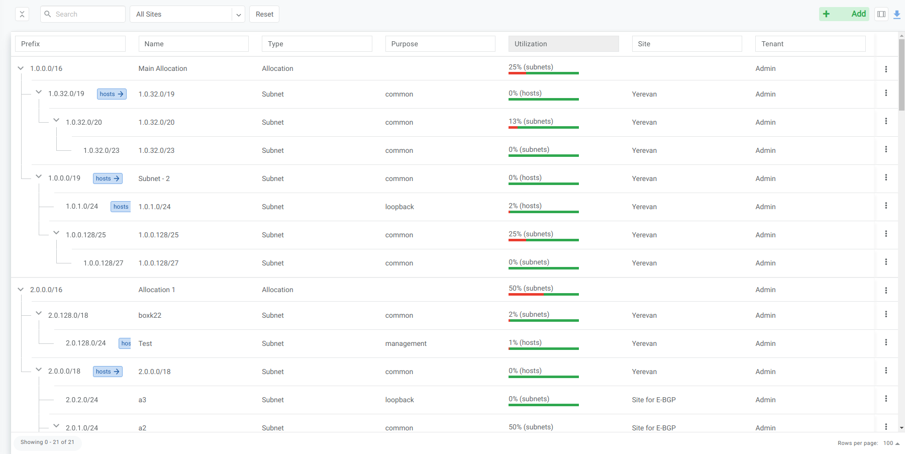
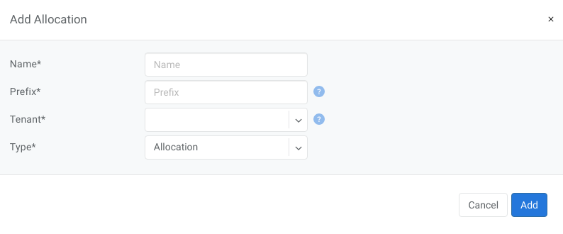
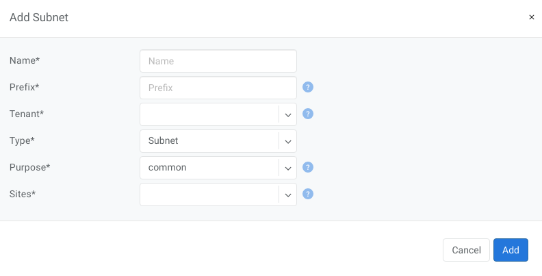

.. meta::
    :description: IP Address Management

=====================
IP Address Management
=====================

Netris IPAM allows users to document their IP addresses and track pool usage. It is designed to have a tree-like view to provide opportunity to perform any kind of subnetting.  

Purpose:
Users define specific roles(purpose) for each subnet/address and only after that are allowed to use those subnets in services like V-net, NAT, etc… 

Allocations and Subnets
-----------------------

There are 2 main types of IP prefixes - allocation and subnet. Allocations are IP ranges allocated to an organization via RIR/LIR or private IP ranges that are going to be used by the network. Subnets are prefixes which are going to be used in services. Subnets are always childs of allocation. Allocations do not have parent subnets.

   IPAM Tree View

--------------------------

Add an Allocation
-----------------

#. Navigate to Net→IPAM 
#. Click the **Add** button
#. Select **Allocation** from the bottom select box
#. Fill in the rest of the fields based on the requirements listed below
#. Click the **Add** button

.. list-table:: Allocation Fields
   :widths: 25 50
   :header-rows: 0

   * - Name
     - Unique name for current allocation.
   * - Prefix
     - Unique prefix for allocation, must not overlap with other allocations.
   * - Tenant
     - Owner of the allocation.

   Add Allocation Window

--------------------------

Add a Subnet
------------

#. Navigate to Net→IPAM 
#. Click the **Add** button
#. Select **Subnet** from the bottom select box
#. Fill in the rest of the fields based on the requirements listed below
#. Click the **Add** button

.. list-table:: Subnet fields
   :widths: 25 50
   :header-rows: 0

   * - **Name**
     - Unique name for current subnet.
   * - **Prefix**
     - Unique prefix for subnet, ust be included in one of allocations.
   * - **Tenant**
     - Owner of the subnet.
   * - **Purpose**
     - This field describes for what kind of services the current subnet can be used. It can have the following values:

        - *common* - ordinary subnet, can be used in v-nets.
        - *loopback* - hosts of this subnet can be used only as loopback IP addresses for Netris hardware (switches and/or softgates).
        - *management* - subnet which specifies the out-of-band management IP addresses for Netris hardware (switches and softgates).
        - *load-balancer* - hosts of this subnet are used in LB services only. Useful for deploying on-prem kubernetes with cloud-like experience.
        - *nat* - hosts of this subnet or subnet itself can be used to define NAT services.
        - *inactive* - can’t be used in any services, useful for reserving/documenting prefixes for future use.

   Add Subnet Window