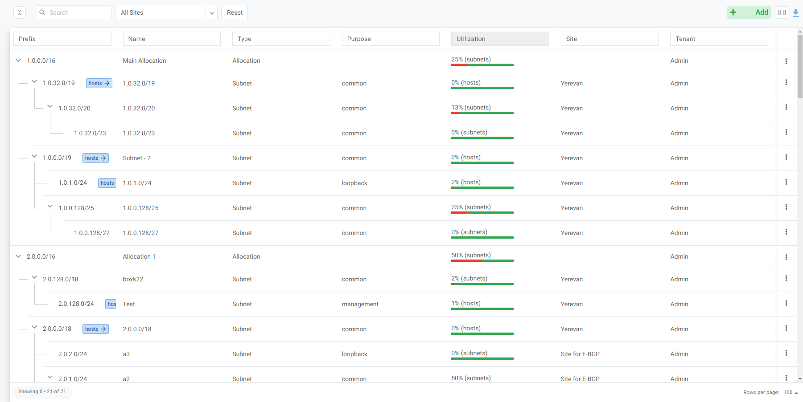
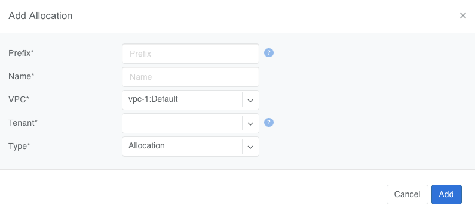
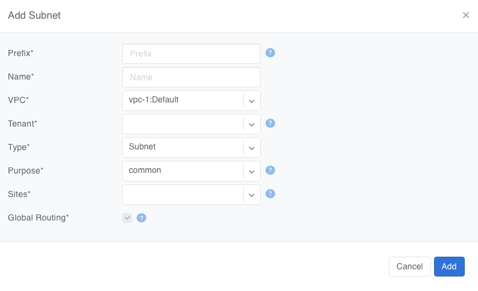

.. meta::
    :description: IP Address Management

.. _ipam_def:

============================
IP Address Management (IPAM)
============================

Netris IPAM allows users to document their IP addresses and track pool usage. It is designed to have a tree-like view to provide opportunity to perform any kind of subnetting.

Allocations and Subnets
-----------------------

There are 2 main types of IP prefixes - allocation and subnet. Allocations are IP ranges allocated to an organization via RIR/LIR or private IP ranges that are going to be used by the network. Subnets are prefixes which are going to be used in services. Subnets are always childs of allocation. Allocations do not have parent subnets.

IPAM Tree View

--------------------------

Subnet purpose and service dependencies
----------------------------------------

Netris models address space first and consumes it second: you create an IPAM subnet with the right **purpose** before the service that will use it. A service only offers addresses from subnets whose purpose matches, so the IPAM entry is a prerequisite, not an afterthought.

.. list-table::
   :header-rows: 1
   :widths: 20 55 25

   * - Purpose
     - Required for
     - Typical VPC
   * - ``common``
     - A :doc:`V-Net <vnet>`'s Layer-3 gateway (SVI), and the address pool :doc:`DHCP <dhcp-and-dhcp-relay>` hands out. For a multi-site V-Net, create the subnet and assign it to every site the V-Net spans before adding the gateway.
     - Tenant VPC
   * - ``loopback``
     - Loopback IPs for Netris hardware (switches, SoftGates).
     - System VPC
   * - ``management``
     - Out-of-band management IPs for switches and SoftGates; a management-purpose subnet also drives ZTP. (Since 4.9, management subnets can also be used in V-Nets and VPCs.)
     - System VPC
   * - ``load-balancer``
     - :doc:`L4 Load Balancer <l4-load-balancer>` frontend VIP pool.
     - System VPC
   * - ``nat``
     - :doc:`NAT <nat>` public addresses (SNAT pools and DNAT targets).
     - System VPC
   * - ``inactive``
     - Nothing — reserve or document a prefix for future use.
     - —

See the :doc:`V-Net <vnet>`, :doc:`L4 Load Balancer <l4-load-balancer>`, :doc:`NAT <nat>`, and :doc:`DHCP and DHCP Relay <dhcp-and-dhcp-relay>` pages for how each service consumes its subnet, and :doc:`Netris VPC <vpc>` for why loopback, management, load-balancer, and nat subnets live in the System VPC.

Add an Allocation
-----------------

#. Navigate to Net→IPAM 
#. Click the **Add** button
#. Select **Allocation** from the bottom select box
#. Fill in the rest of the fields based on the requirements listed below
#. Click the **Add** button

.. list-table:: Allocation Fields
   :widths: 25 50
   :header-rows: 0

   * - Name
     - Unique name for current allocation.
   * - Prefix
     - Unique prefix for allocation, must not overlap with other allocations.
   * - Tenant
     - Owner of the allocation.

Add Allocation Window

--------------------------

Add a Subnet
------------

#. Navigate to Net→IPAM 
#. Click the **Add** button
#. Select **Subnet** from the bottom select box
#. Fill in the rest of the fields based on the requirements listed below
#. Click the **Add** button

.. list-table:: Subnet fields
   :widths: 25 50
   :header-rows: 0

   * - **Name**
     - Unique name for current subnet.
   * - **Prefix**
     - Unique prefix for subnet, ust be included in one of allocations.
   * - **Tenant**
     - Owner of the subnet.
   * - **Purpose**
     - This field describes for what kind of services the current subnet can be used. It can have the following values:

        - *common* - ordinary subnet, can be used in v-nets.
        - *loopback* - hosts of this subnet can be used only as loopback IP addresses for Netris hardware (switches and/or softgates).
        - *management* - subnet which specifies the Out-of-Band management IP addresses for Netris hardware (switches and softgates).
        - *load-balancer* - hosts of this subnet are used in L4LB services only. Useful for deploying on-prem kubernetes with cloud-like experience.
        - *nat* - hosts of this subnet or subnet itself can be used to define NAT services.
        - *inactive* - can't be used in any services, useful for reserving/documenting prefixes for future use.

Add Subnet Window
