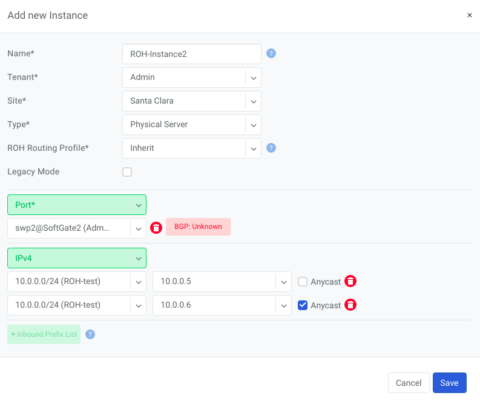
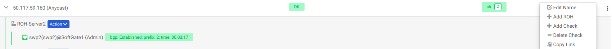
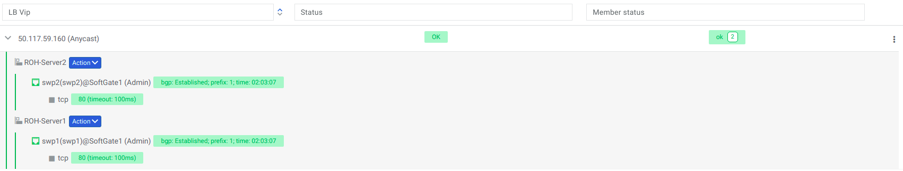

.. meta::
    :description: Layer-3 Load Balancer (Anycast)
  
#############################
L3 Load Balancer (Anycast LB)
#############################
L3 (Anycast) load balancer leverages ECMP load balancing and hashing capability of spine and leaf switches to deliver line-rate server load balancing with health checks.

ROH servers, besides advertising their unicast (unique) loopback IP address, need to configure and advertise an additional anycast (the same IP) IP address. Unicast IP address is used for connecting to each individual server. 

End-user traffic should be destined to the anycast IP address. The switch fabric uses ECMP to load balance the traffic towards every server, and will hash sessions based on IP/Protocol/Port such that TCP sessions will exist between the given end-user and server pair for the lifetime of the session. Optional health checks are used to identify application failures and reroute traffic in the case of a server outage. 

Creating an L3 Load Balancer
============================

To configure L3 (Anycast) load balancing:

#. Navigate to **Services→Instances (ROH)** and locate an existing ROH instance
#. Click the ellipses and then the **Edit** button
#. Select an extra IPv4 address from the select box at the bottom, and check the **Anycast** option. 
#. This will create a service under Services→Load Balancer and permit using the Anycast IP address in multiple ROH instances. 

   
   Example: Adding an Anycast IPv4 address 

   
   Example: Under Services→Load Balancer, you can find the listing of L3 (Anycast) Load Balancers, service statuses, and you can add/remove more ROH instances and/or health checks.

   
   Screenshot: L3 (Anycast) Load Balancer Detail
