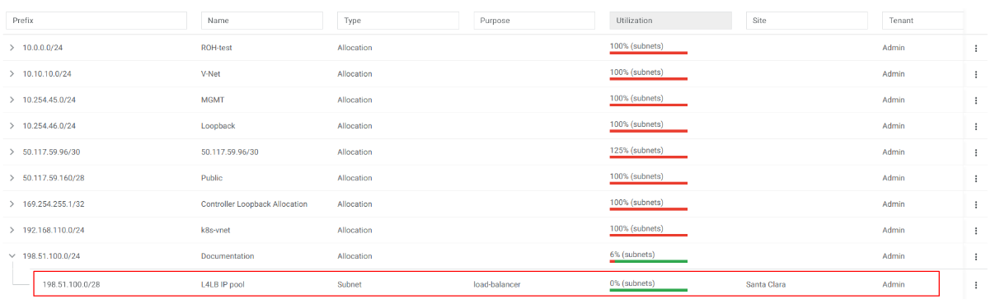
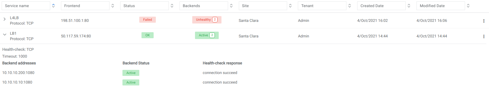

.. meta::
    :description: Netris Services and Configuration Examples
  

#######################
L4 Load Balancer (L4LB)
#######################
Netris L4 Load Balancer (L4LB) leverages SoftGate(Linux router) nodes to provide Layer-4 load balancing services, including on-demand cloud load balancing with native integration with Kubernetes. 

Enabling L4LB service
---------------------
L4 Load Balancer service requires at least one SoftGate node to be available in a given Site, as well as at least one IP address assignment (purpose=load balancer).

The IP address pool for L4LB can be defined in the Net→IPAM section by adding an Allocation and setting the purpose field to ‘load-balancer’. You can define multiple IP pools for L4LB at any given site.  See the below example.

Example: Adding a load-balancer IP pool assignment.

.. image:: images/add-allocation.png
   :align: center
   :class: with-shadow
   :alt: Add an IP Allocation
    
    
Screenshot: Listing of Net→IPAM after adding a load-balancer assignment

    
    
Consuming L4LB service
----------------------
This guide describes how to request an L4 Load Balancer using GUI. For Kubernetes integration, check the Kubenet section.

Click +add under Services→L4 Load Balancer to request an L4LB service.

Add new L4 Load Balancer fields are described below:

**General fields**

* **Name** - Unique name. 
* **Protocol** - TCP or UDP. 
* **Tenant** - Requestor Tenant should have access to the backend IP space.
* **Site** - Site where L4LB service is being requested for. Backends should belong on this site.
* **State** - Administrative state.

**Frontend**

* **Address** - Frontend IP address to be exposed for this L4LB service. “Assign automatically” will provide the next available IP address from the defined load-balancer pool. Alternatively, users can select manually from the list of available addresses.   
* **Port** -  TCP or UDP port to be exposed.

**Health-check**

* **Type** - Probe backends on service availability.

  * **None** - load balance unconditionally.
  * **TCP** - probe backend service availability through TCP connect checks.
  * **HTTP** - probe backend service availability through HTTP GET checks.

* **Timeout(ms)** - Probe timeout in milliseconds. 
* **Request path** - HTTP request path. 

**Backend**

* **+Add** - add a backend host.
* **Address** - IP address of the backend host.
* **Port** - Service port on the backend host.
* **Enabled** - Administrative state of particular backend. 

.. image:: images/request-L4.png
   :align: center
   :class: with-shadow
   :alt: Request an L4 Load Balancer
    
   Example: Requesting an L4 Load Balancer service.

   Example: Listing of L4 Load Balancer services