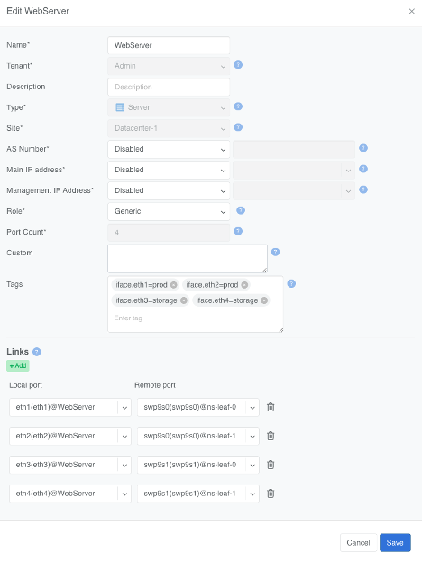
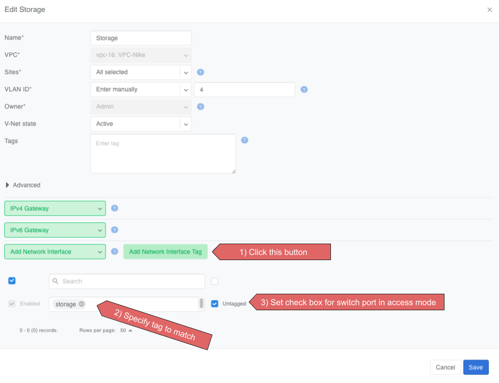
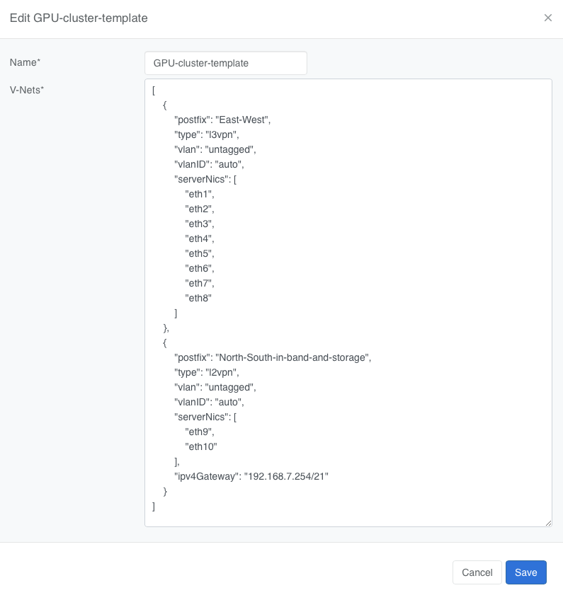
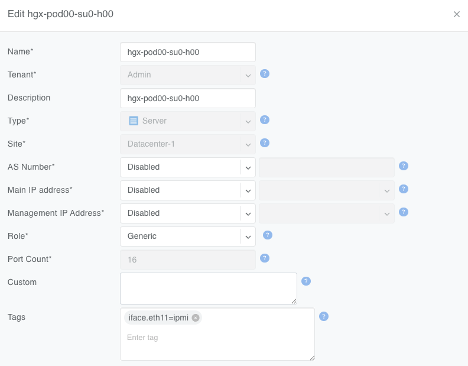
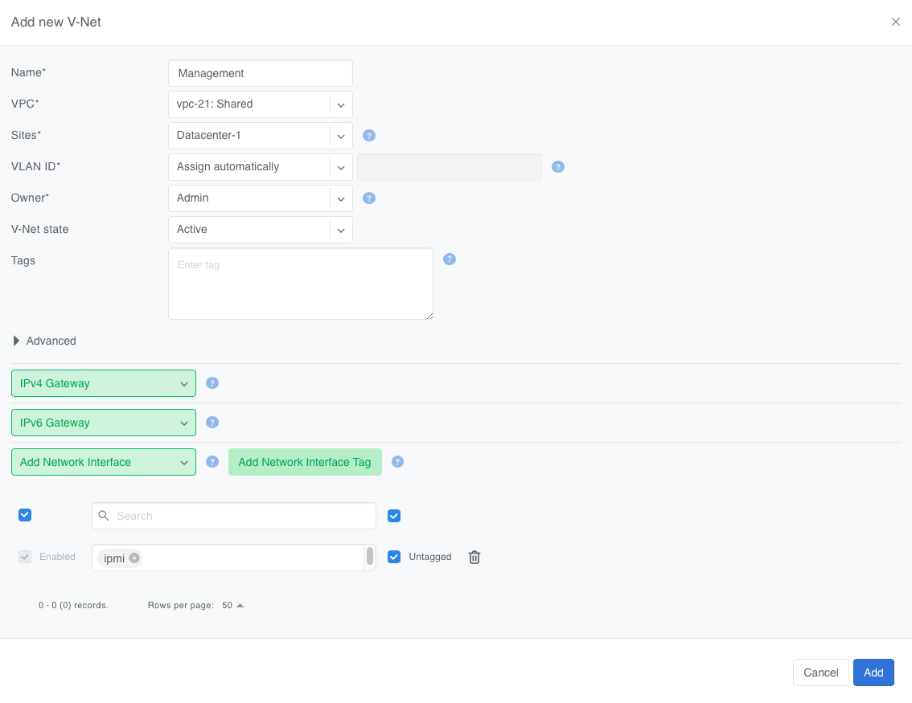

.. meta::
    :description: Labels for automatically assigning switch ports to a V-Net based on server NIC tags

.. _tags:

======
Labels
======

Labels (sometimes called tags) can be used to automatically place hundreds of switch ports into a V-Net. They can work together with the :doc:`server-cluster` and manual methods, or they can replace those methods.

Because Netris knows the topology, when you label server NICs, Netris can automatically identify the connected switch ports and place them into the V-Net.

How labels work
================

When defining a server object in ``Network -> Inventory`` or ``Network -> Topology``, use the *Labels* section to label each NIC on the server using the following key/value syntax.

.. code-block:: text

   iface.eth1 = prod
   iface.eth2 = prod
   iface.eth3 = storage
   iface.eth4 = storage

.. note::
   The hard-coded prefix *iface.* is required; it tells Netris the label applies to that specific NIC, not the whole server.

.. raw:: html

   
<em>Figure: Server interface labels</em>

To automatically add switch ports to a V-Net based on a label, in the V-Net definition dialog:

* Click the ``Add Network Interface Label`` button.
* Enter the "value" portion of the label. E.g., *storage* is the value of *iface.eth3=storage* label.
* Specify whether you want the switch port to be 802.1q tagged or untagged.

Based on the links defined in the Topology, Netris finds the switch ports eth1 and eth2 are connected to and adds them to the V-Net.

.. raw:: html

   
<em>Figure: Add Network Interface Label dialog</em>

Rules and limits
=================

* If a port is added both directly and by label, the direct entry wins even if you remove the label from the server NIC.
* The same NIC can be untagged in only one V-Net.
* Switch ports used for underlay links are ignored.
* Works only on server objects with switch-to-server links defined.
* Labels can only be used to add switch ports to a VLAN-unaware L2VPN V-Nets. L3VPN and VLAN-aware L2VPN are not supported.

When to use labels
===================

Labels can be used on their own or together with :doc:`server-cluster`.

Imagine a multi-tenant cloud operator manages hundreds of GPU servers, each with 11 network interfaces (a very typical situation): 8 interfaces for East-West traffic, 2 interfaces for North-South, and the last one for management.

The operator wants to be able to dynamically assign servers to different tenants, which means NICs *eth1* through *eth10* must be placed into the correct tenant's VPC.

At the same time, the operator wants to keep the server's IPMI / ILO / iDrac interface eth11 in the management VPC regardless of which tenant the server is reassigned to.

To achieve this outcome, the cloud operator can:

* Define a Server Cluster Template and only include non-management server NICs (*eth1* through *eth10*) in the template.

.. code-block:: json

   [
       {
           "postfix": "East-West",
           "type": "l3vpn",
           "vlan": "untagged",
           "vlanID": "auto",
           "serverNics": [
               "eth1",
               "eth2",
               "eth3",
               "eth4",
               "eth5",
               "eth6",
               "eth7",
               "eth8"
           ]
       },
       {
           "postfix": "North-South-in-band-and-storage",
           "type": "l2vpn",
           "vlan": "untagged",
           "vlanID": "auto",
           "serverNics": [
               "eth9",
               "eth10"
           ],
           "ipv4Gateway": "192.168.7.254/21"
       }
   ]

.. raw:: html

   
<em>Figure: GPU Cluster Template</em>

* Label the IPMI (*eth11*) NIC rather than include it in the Server Cluster Template.

.. raw:: html

   
<em>Figure: The operator adds a iface.eth11=ipmi label to each server object for eth11</em>

* Create a V-Net that includes this label as described earlier.

.. raw:: html

   
<em>Figure: The operator creates a V-Net for the management interfaces and adds network interfaces matching the ipmi label value.</em>

As a result of this configuration, Netris automatically adds *eth11* into the "Management" V-Net.

When a Server Cluster is created referencing the *GPU-cluster-template*, Netris will:

* Keep *eth11* in the Management V-Net (notice in this example the V-Net is in the Default VPC).
* Create new *East-West* and *North-South-in-band-and-storage* V-Nets in the VPCs selected when defining the Server Cluster. See :doc:`server-cluster` for more details about creating Server Clusters.
* Place *eth1* through *eth10* into the tenant's V-Nets as specified in the template, even though the V-Nets are in a different VPC from the Management V-Net.

When the operator needs to reallocate the GPU servers to a different tenant, they simply reassign these servers to a different tenant's Server Cluster. Netris will reconfigure the appropriate switch ports on the appropriate switches, but will keep the *eth11* in the Management V-Net.
