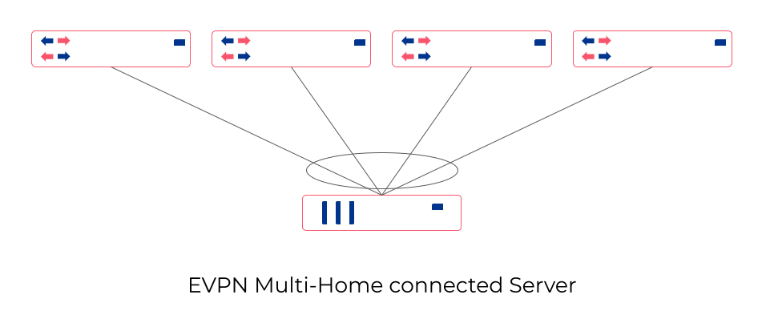
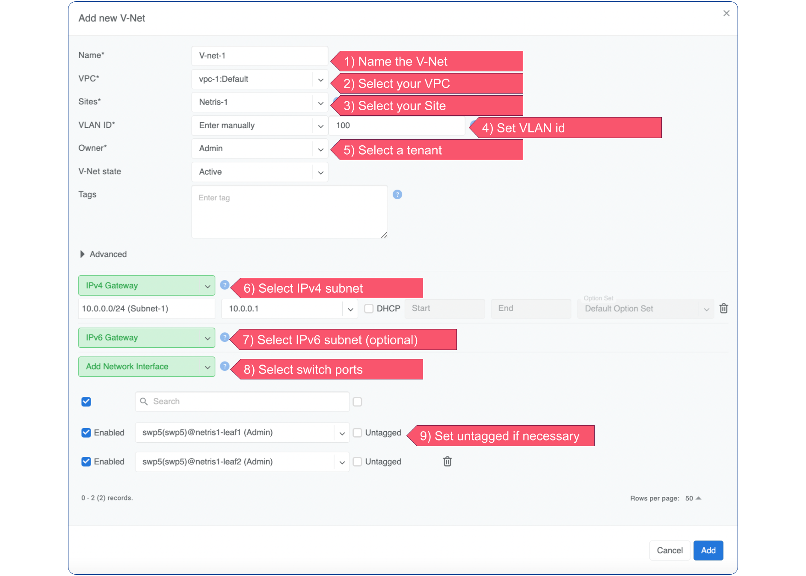
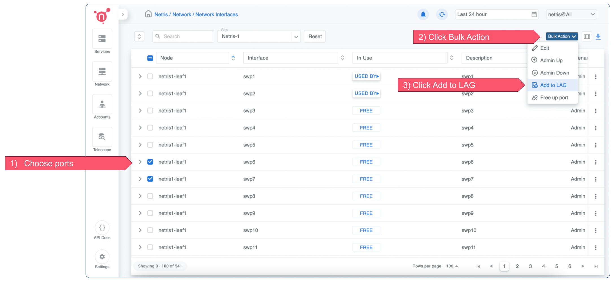
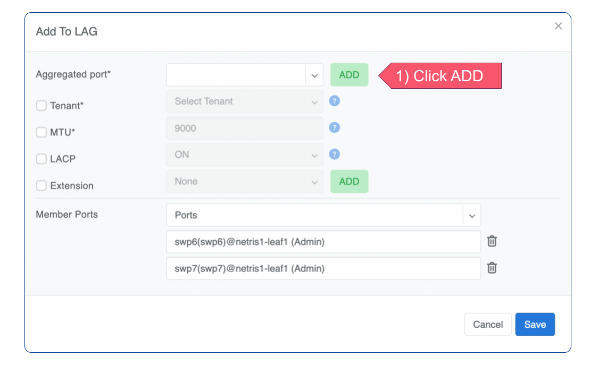
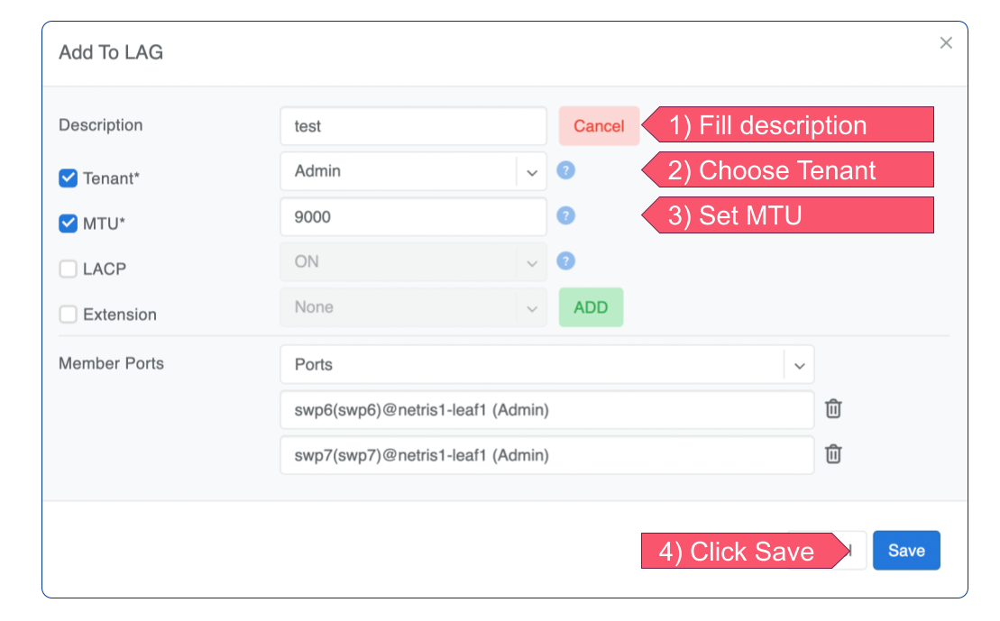

.. meta::
    :description: Link Aggregation

======================
Link Aggregation (LAG)
======================

Link Aggregation (LAG), also known as link bundling, Ethernet/network/NIC bonding, or port teaming, is a method of combining (aggregating) multiple network connections in parallel to increase throughput beyond what a single connection could sustain and to provide redundancy in case one of the links fails.

.. image:: images/lag_diagram.png
   :align: center
   :alt: LAG diagram

The Link Aggregation Control Protocol (LACP) is a key component of LAG. It's a protocol for the collective handling of multiple physical ports that can be seen as a single channel for network traffic. 

Netris supports Automatic and Custom modes of configuring LAGs, each described below.

Automatic LAG with EVPN Multi-homing
-----------------------------------

EVPN Multi-Homing (EVPN-MH) offers robust support for an all-active redundancy model for servers. This means that all connections from a server to multiple switches are concurrently active and operational, ensuring high availability, load balancing, and seamless failover capabilities. As a result, EVPN-MH enhances network resilience and continuity of service.

**Note: Active Active Multi-homing is currently limited to:**

* Switch OS Cumulus 5.3 or higher. 
* Netris 3.5 or higher.
* One port per switch (can be overcome in Custom LAG).
* Only two switches in EVPN-MH domain with ASIC Spectrum A1.

When you add switch ports to a V-net service, Netris agents automatically configure LAG and apply LACP with EVPN-MH and LACP fallback. If Active-Active Multi Homing is not supported on your hardware, Active-Standby LACP LAG will be configured. 

Both in Active-Active and Active-Standby cases LACP should be configured on the server side. If the server does not have LACP configured, the LAG will fallback into non LACP mode and one of two links will still remain active.

To create a V-net with EVPN-MH go to Service → V-net → +Add

   

Custom LAG
----------

There are several use cases when you may need a Custom (manually configured) LAG.

* Aggregate more than one port per each switch (with or without EVPN).
* LACP fallback is not sufficient and needs to be unconditionally disabled on the switch side. EVPN-MH will be deactivated in this case. 

Please note that a Custom LAG can only be created with one switch. However, if you add two or more Custom LAGs to a V-net, EVPN-MH will be automatically activated.

To create a Custom LAG go to Network → Network Interfaces.

Add a new LAG.

 
Set necessary options.
  

