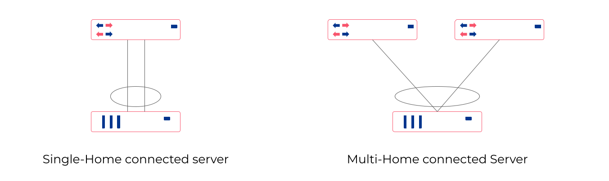
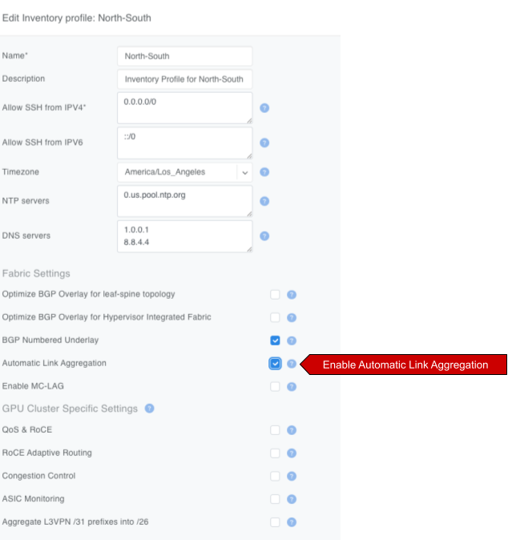
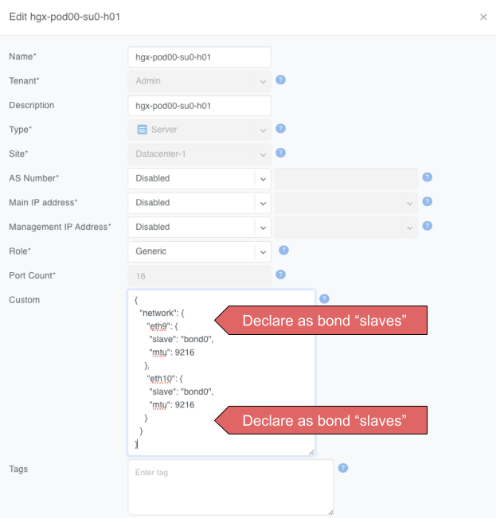
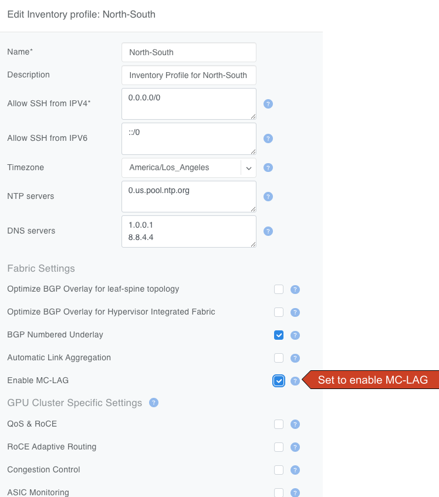
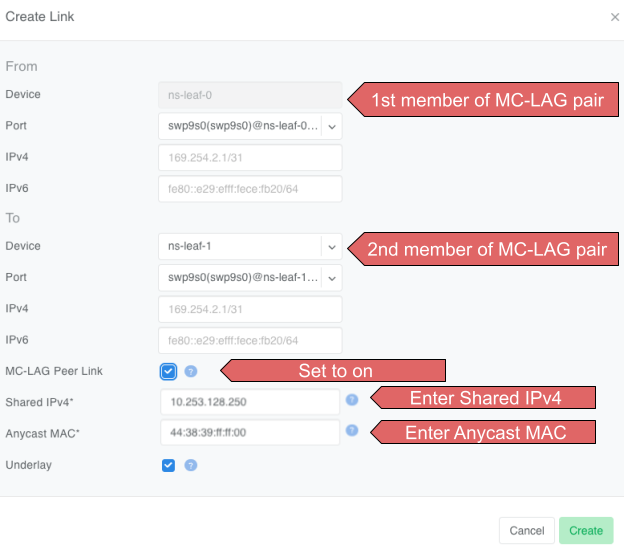
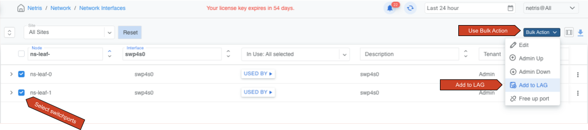
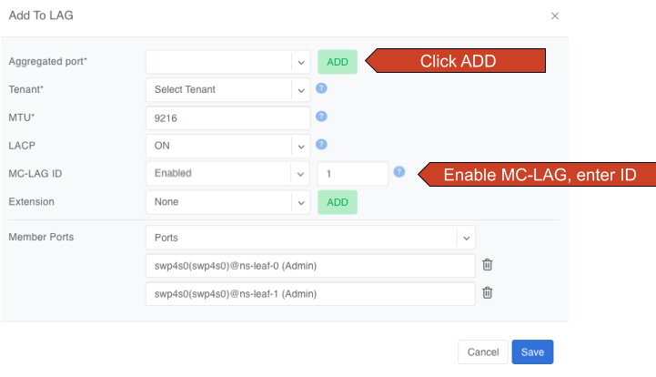
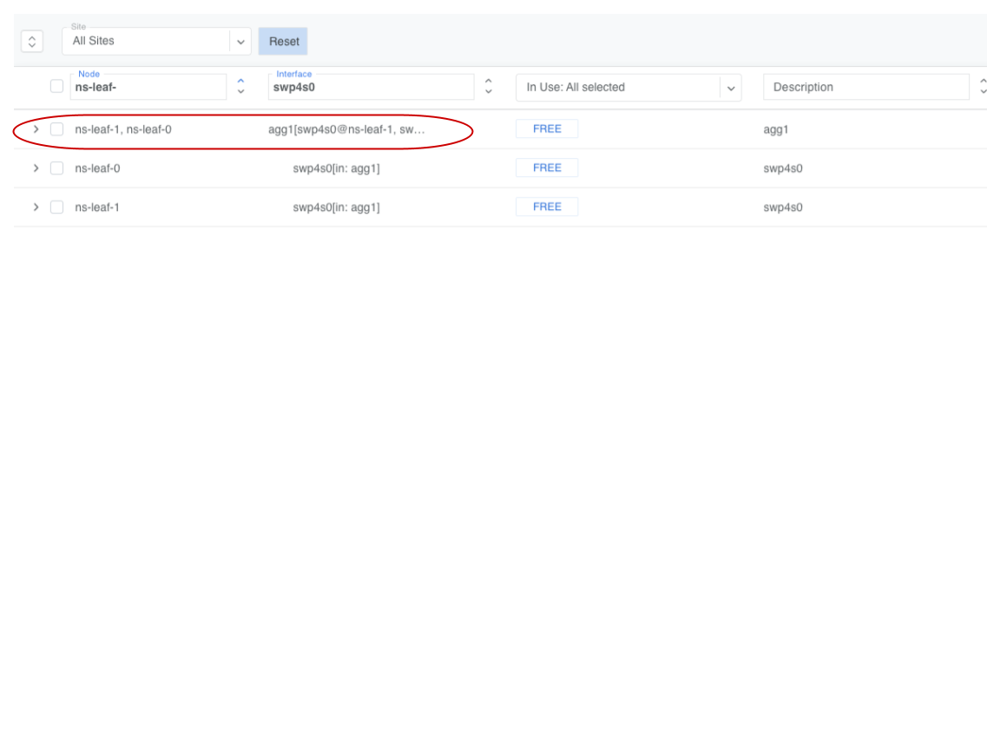

.. meta::
    :description: Link Aggregation and Multihoming for V-Nets

.. _vnet_lag_multihoming:

=================================
Link Aggregation and Multihoming
=================================

**Link Aggregation (LAG)**, also known as link bundling, Ethernet/network/NIC bonding, or port teaming, is a method of combining (aggregating) multiple network interfaces to increase throughput beyond what a single switch port could provide and/or provide redundancy in case one of the links fails.

An endpoint may be connected to a single switch with multiple cables, which are aggregated into a single logical bonded interface. This is known as single-homing.

An endpoint may be connected to two or more switches simultaneously, with these connections aggregated into a single logical bonded interface. Often done to eliminate single points of hardware failure, this method is known as multi-homing.

For best results, Netris recommends enabling **Link Aggregation Control Protocol (LACP/802.3ad)** when configuring server-side bonding.

Netris fully supports both single-home and multi-home use cases, and for multi-home use cases, Netris supports EVPN-MH and MC-LAG, subject to switch hardware support.

* **EVPN-MH** (recommended by Netris) is a standardized way to multi-home a device. It uses BGP EVPN with Ethernet Segment Identifiers (ESI) for control plane and Designated Forwarder (DF) election to avoid loops. EVPN-MH works with VXLAN overlays, supports all-active and single-active configurations, and offers quick convergence via aliasing and multi-homing.
* **MC-LAG** (or MLAG) is a switch vendor feature that extends LACP across two switches, avoiding loops with a shared control domain. It requires ICCP (Inter-Chassis Control Protocol), one or more peer-links, and typically scales to two devices, providing active-active L2 forwarding. Convergence and scaling are limited compared to EVPN-MH.

Ethernet VPN Multi-Homing (EVPN-MH)
======================================
**Ethernet VPN Multi-Homing** (EVPN-MH) is a standards-based network feature that allows a single endpoint to connect to two or more switches for redundancy and load sharing. This setup ensures that if one switch or link fails, traffic can continue to flow through the remaining connections without needing to reconfigure the network.

You can configure EVPN-MH in Netris in one of two ways: **Automatic Link Aggregation** or **Server Object custom JSON**.

Automatic Link Aggregation
----------------------------

**Automatic Link Aggregation** is a Netris feature that allows Netris to automatically create a bond interface for each switch port that is added to a V-Net. This prepares the network side to support bonded server connections without requiring manual configuration in the controller or switch port downtime.

The behavior of the bond is determined entirely by the **server-side configuration**. This gives the server administrator direct control over bonding behavior, enabling adjustments without waiting for network team changes, and allowing deployments to be adapted quickly and efficiently.

* Active/Standby (no LACP): The bonded links function for basic redundancy. Traffic fails over if one link goes down, but only one link is active at a time.
* Active/Active with LACP: If the server bond uses LACP, Netris detects the LACP negotiation and automatically determines which switches and switch ports the member links connect to. It then configures EVPN-MH on those switches and ports, allowing the server to take advantage of multi-homing with active/active load sharing and fault tolerance.

To enable Automatic Link Aggregation
  * Navigate to ``Network -> Inventory Profiles``.
  * Edit the Inventory Profile assigned to relevant switches and enable the ``Automatic Link Aggregation`` checkbox.

.. raw:: html

   

Server object custom JSON
----------------------------
Server Object Custom JSON method enables you to exercise granular control over which endpoints get a bond interface.

In a server object definition, Netris supports the use of optional JSON snippets to describe how server NICs are grouped. When you include such a snippet to declare NICs as part of a bond, this serves as a signal to Netris to place the corresponding switch ports into a bond. Just like with the Automatic Link Aggregation method, the server administrator retains full control over the bond behavior, including whether the bond operates in active/standby or active/active mode.

.. raw:: html

   

.. code-block:: json
    :caption: Example JSON snippet defining a bond interface

    {
        "network": {
            "eth9": {
                "slave": "bond0",
                "mtu": 9216
            },
            "eth10": {
                "slave": "bond0",
                "mtu": 9216
            }
        }
    }

.. warning::
    The JSON method and Automatic Link Aggregation serve the same purpose. If Automatic Link Aggregation is turned on, any JSON entries are ignored.

MC-LAG
========
**Mult-chassis Link Aggregation** (MC-LAG) is a switch vendor's proprietary link aggregation method available to you and supported by Netris. Please check the :ref:`Overlay Network Functions <overlay-network-functions>` section of the Supported Platforms Matrix to verify which switches support this functionality.

In contrast to EVPN-MH, when using MC-LAG, users are expected to manually define the aggregation interfaces in the Netris controller and explicitly specify the switch ports to be added as bond members.

Additionally, you must add the aggregation interfaces (aggX) to the V-Net instead of the individual switch ports (swpX), like you would in EVPN-MH.

.. warning::
    MC-LAG requires the use of peer-link.

Enable MC-LAG in the inventory profile
------------------------------------------
You must enable MC-LAG support in the Inventory Profile that is assigned to the switch fabric.

To enable MC-LAG support:
  - Navigate to ``Network -> Inventory Profiles``.
  - Edit the Inventory Profile that is applied to the appropriate switches and set the checkbox for ``Enable MC-LAG``.

.. raw:: html

     

.. warning::
    When you enable MC-LAG functionality, Netris will automatically disable EVPN-MH support. These two features are mutually exclusive in a given fabric.

Configure MC-LAG Peer Link(s)
---------------------------------
MC-LAG requires the presence of a physical peer link between the two switches participating in an MC-LAG configuration. Netris recommends multiple peer links for redundancy.

To define a peer link in Topology Manager
  - Navigate to ``Network -> Topology``.
  - Right-click one of the switches you will use in the MC-LAG pair.
  - Select ``Create Link``.
  - In the *Create Link* dialog box, select the other switch in the MC-LAG pair in the *To Device* drop-down.
  - Set the ``MC-LAG Peer Link`` check box.
  - Enter the shared MC-LAG IPv4 address and MC-LAG anycast MAC address.

.. raw:: html

     

.. important::
    - Multiple MC-LAG peer links between the same pair of switches must have the same MC-LAG IPv4 and MAC addresses.
    - The MC-LAG shared IPv4 address must be a part of any IPAM-defined subnet with the purpose set to loopback.
    - For MC-LAG anycast MAC address, Netris recommends choosing any MAC address from  44:38:39:ff:00:00 - 44:38:39:ff:ff:ff range. The MAC address should be globally unique compared to other links in the Netris controller, except when other links are between the same pair of switches.

Create MC-LAG aggregation interfaces
----------------------------------------
Navigate to ``Network -> Network Interfaces``, select one or more switch ports, use the bulk action menu, and select ``Add to LAG``.

.. raw:: html

     

Click the ``ADD`` button and fill out other values as needed.

.. raw:: html

     

You must set ``MC-LAG`` to *Enabled* and manually enter ``MC-LAG ID`` for Netris to configure the bond as MC-LAG instead of single switch LAG or EVPN-MH.

.. tip::
    The MC-LAG ID value is locally significant to the switch pair.

You can now add these new *aggX* interfaces to V-Nets the same way you normally add switch ports.

.. raw:: html

     
