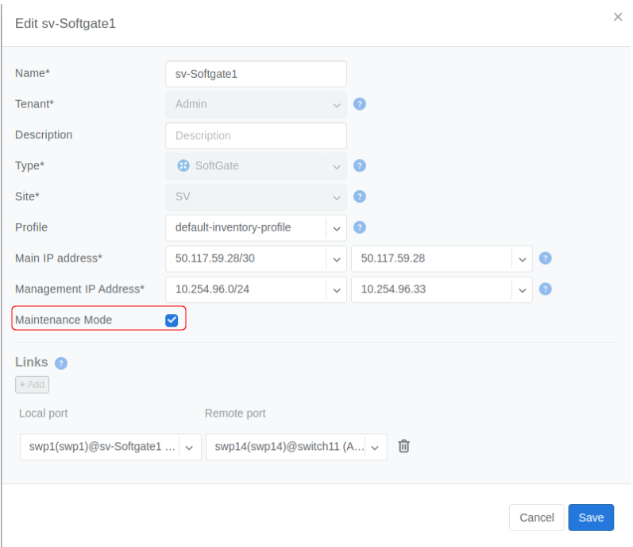

.. meta::
    :description: Netris System Visibility, Monitoring & Telemetry

**********************
Maintenance Mode
**********************

Overview
=================
Maintenance mode is designed to help gracefully offload the traffic from a specific device from your inventory in order to perform maintenance on the current device with minimal impact on your network. You should turn on **Maintenance Mode** before starting the maintenance on the device and once it is finished, turn off again. To enable/disable **Maintenance Mode** go to **Inventory** section, choose the device you want, from 3-dot menu click edit, turn on **Maintenance Mode** by clicking on the checkbox and then save your changes as shown in the screenshot below:

.. note:: 
  Maintenance mode does its best to offload the traffic from the current device however it DOES NOT ensure that traffic will be completely offloaded.
    
Maintenance Mode for Softgate
========

When enabling **Maintenance Mode** for the softgate following actions are automatically done behind the scenes to offload the traffic from the softgate:

  - Decrease BGP local preference attribute for all external and internal peers.
  - Prepend all routes 10x times for outbound direction for all external and internal peers.
  - Increase BGP MED attribute for all external and internal peers.
  - Decrease BGP origin attribute for all external and internal peers.
  - Connection oriented services like SNAT and L4LB will be automatically migrated to second softgate causing a reestablishment of TCP connections.

.. note:: 
  - Ensure that second softgate is functioning properly before turning on the maintenance mode.
  
Maintenance Mode for Switch
=========
Netris, besides automatic configuration, also provides automatic monitoring of the entire network without the need for configuration of the monitoring systems.

Telescope→Dashboard summarizes Network Health, which can also be accessed by clicking on the Netris icon in the top left corner.

Description of the pie charts.

* **Hardware Health** - summary of CPU, RAM, disk utilization. Statuses of power supplies, fans, temperature sensors, critical system services, and time synchronization. Statuses of switch port link, utilization, optical signal levels, and BGP sessions. 
* **E-BGP** - Statuses of external BGP sessions.
* **LB VIP** - Statuses of Load Balancer frontend / VIP availability.
* **LB Members** - Statuses of Load Balancer backend members.

By clicking on each title you can see the details of the checks on the right side.

Screenshot: Dashboard showing details of “Hardware Health.”

.. image:: images/hardware_health.png
    :align: center

Port up/down state can be set to “Save as normal.” So the system will alarm only if the actual state is different from the saved as the normal state. 

Screenshot: “Save as normal” on selected ports.

.. image:: images/saveasnormal.png
    :align: center
        

