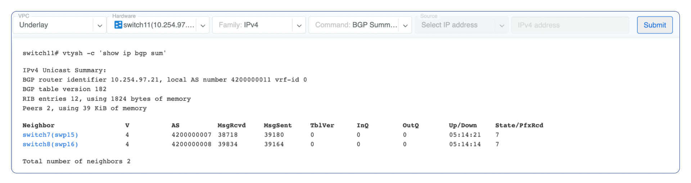
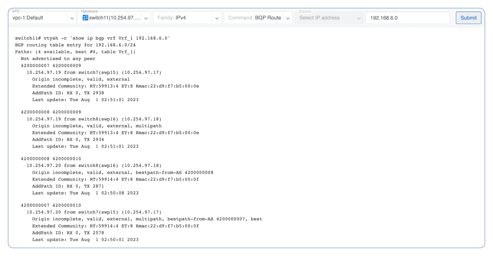
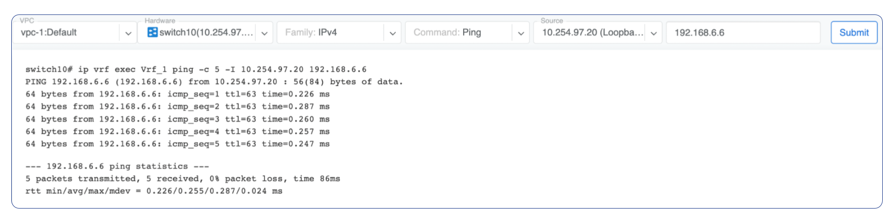
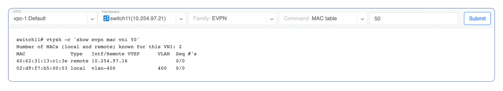
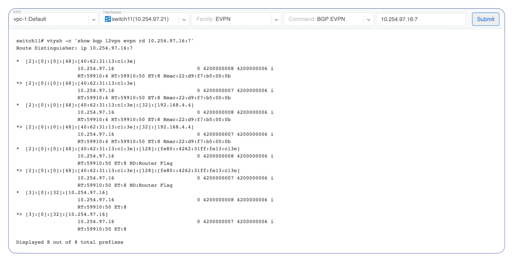

.. meta::
    :description: Netris Looking Glass

======================
Looking Glass
======================

The Looking Glass is a GUI-based tool for looking up routing information from a switch or SoftGate perspective. You can access the Looking Glass either from Topology, individually for every device (right click on device → details → Looking Glass), or by navigating to Network → Looking Glass then selecting the device from the top-left dropdown menu.

Looking Glass controls described for IPv4/IPv6 protocol families.

* **VPC** - select a VPC.
* **BGP Summary** - Shows the summary of BGP adjacencies with neighbors, interface names, prefixes received. You can click on the neighbor name then query for the list of advertised/received prefixes.
* **BGP Route** - Lookup the BGP table (RIB) for the given address.
* **Route** - Lookup switch routing table for the given address.
* **Traceroute** - Conduct a traceroute from the selected device towards the given destination, optionally allowing to determine the source IP address.
* **Ping** - Execute a ping on the selected device towards the given destination, optionally allowing to select the source IP address.

Example: listing BGP neighbors of a switch and number of received prefixes for the Underlay VPC.

.. raw:: html

   
<em>Figure: Looking Glass BGP summary</em>

Example: BGP Route - looking up V-Net subnet from switch11 perspective. Switch11 is load balancing between four available paths.

.. raw:: html

   
<em>Figure: Looking Glass BGP route</em>

Example: Ping.

.. raw:: html

   
<em>Figure: Looking Glass ping</em>

Looking Glass controls described for the EVPN family.

* **VPC** - select a VPC.
* **BGP Summary** - Show brief summary of BGP adjacencies with neighbors, interface names, and EVPN prefixes received.
* **VNI** - List VNIs learned.
* **BGP EVPN** - List detailed EVPN routing information optionally for the given route distinguisher.
* **MAC table** - List MAC address table for the given VNI.

Example: Listing MAC addresses on VNI 50.

.. raw:: html

   
<em>Figure: Looking Glass MAC table</em>

Example: EVPN routing information listing for a specified route distinguisher.

.. raw:: html

   
<em>Figure: Looking Glass EVPN route distinguisher</em>

