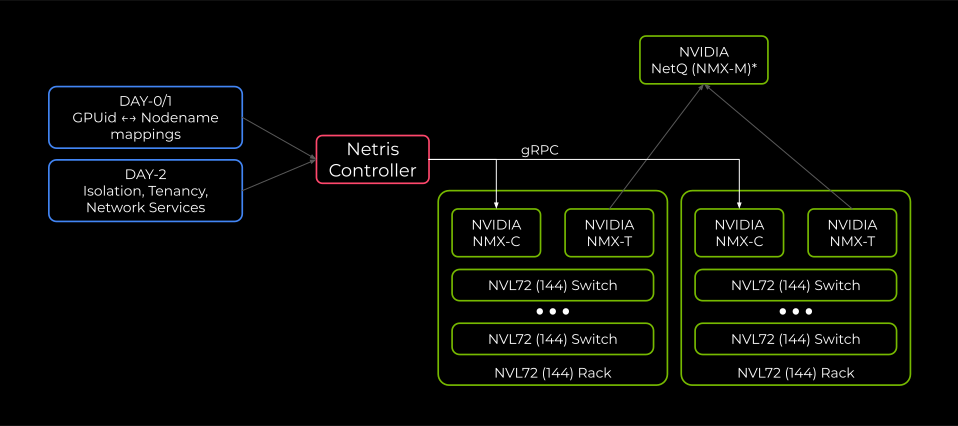
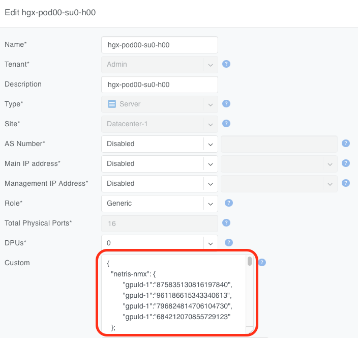

.. meta::
    :description: NVIDIA NMX-C (NVLink) Integration Plugin for Netris Controller

################################################################
NVIDIA NMX-C (NVLink) Integration Plugin for Netris Controller
################################################################

Overview
========

The Netris NVLink plugin provides an integration between your Netris Controller and `NVIDIA NMX Controller (NMX-C) <https://docs.nvidia.com/networking/software/nvlink-management-software/index.html#nmx-c>`_ for AI infrastructures that include NVIDIA NVLink Multi-Node NVL72 fabrics. Netris already acts as your Ethernet fabric manager and, with this NVLink integration, allows you to continue using Netris as your one source of truth for all your data center networking intent, including your East-West, North-South, Out-of-Band management, and scale-up (NVL72) networking fabrics. See the "How an AI network differs from a traditional network" section of :doc:`Introduction to Netris </introduction>` for more details about different network fabrics in a typical AI data center.

Key Benefits
--------------

- **Unified Management Interface**: Define tenant isolation intent by simply listing servers in a :doc:`Server Cluster </server-cluster>` object. Netris implements your declared intent in all appropriate Netris-managed fabrics, including Ethernet, InfiniBand, DPUs, and NVL72.
- **Automated Provisioning**: Automatically configure NVLink partitions on NVL72 Multi-Node fabrics to align with tenant boundaries configured on other fabrics such as East-West (via Ethernet or :doc:`InfiniBand </netris-ufm-integration>`) and North-South Ethernet. No additional actions are required to be taken outside of Netris to partition the NVL72 domain, making Netris your one-stop shop for declaring your multi-tenancy intent across all Netris-managed networking fabrics.
- **Simplified Operations**: The :doc:`Server Cluster </server-cluster>` feature eliminates the need to manage NVL72 partitions and GPU UIDs separately, as well as switch ports, VLANs, VRFs on Ethernet, and GUIDs, PKeys, SHARP groups on :doc:`InfiniBand </netris-ufm-integration>`.

Architecture
=============

The Netris NVLink plugin acts as the integration layer between Netris Controller and NVIDIA NMX controllers (NMX-C):

1. **Netris Controller**: Orchestrates the Ethernet switches and provides the primary user interface for all your network automation, abstraction, and multi-tenancy actions.
2. **NVIDIA NMX Controller (NMX-C)**: Manages the NVLink Multi-Node fabric switches and provides specialized NVLink functionality, such as hardware lifecycle management.
3. **Netris NVLink Plugin**: Synchronizes multi-tenancy configurations between both systems.

.. raw:: html

   
<em>Figure: Netris NVLink Integration architecture</em>

.. tip::
   NVIDIA NetQ (NMX-M) is not required by Netris, but it is recommended for granular Network + GPU telemetry.

When you define a :doc:`Server Cluster </server-cluster>` in Netris, the plugin automatically:

- Discovers GPU UIDs for each server using the preloaded GPU ledger (see the :ref:`nvlink_loading_gpu_inventory` section below for more details).
- Creates and manages appropriate NVL partitions in NMX-C.
- Assigns appropriate GPU UIDs to appropriate NVL partitions.

The Netris NVLink plugin runs continuously and, by default, validates that the operator's intent is correctly applied every 10 seconds. If the NVLink partition doesn't match the intent declared in the Netris Controller, the Netris NVLink plugin will enforce the intent in the appropriate NMX controller (NMX-C).

The NMX controller (NMX-C) remains the source of truth for GPU assignment to NVLink partitions (see the :ref:`nvlink_verification` section below). The Netris Controller is the source of truth for the operator's intent, and the Netris NVLink plugin will continuously enforce the operator's intent as expressed through the :doc:`Server Cluster </server-cluster>` object in the Netris Controller.

NVL72 is a rack-scale system, and a typical data center deployment will have multiple NMX controllers (NMX-Cs) — one per rack (see `NVIDIA materials <https://www.nvidia.com/en-us/data-center/nvlink/>`_ for more information on NVL72). Netris will automatically discover which NMX controllers (NMX-Cs) must create the NVL72 partition and will only create partitions in the appropriate NMX controllers.

High-Level Workflow
-----------------------

1. Install and configure the Netris NVLink plugin.
2. Preload GPU mapping.
3. The Netris NVLink plugin automatically discovers the current state from defined NMX-C(s).
4. Netris determines the desired partition based on the Server Cluster Template and :doc:`Server Cluster </server-cluster>` membership.
5. The Netris NVLink plugin reconciles every 10 seconds.

.. tip:: :doc:`Server Cluster </server-cluster>` is the only supported way for Netris to manage NVLink partitions.

.. tip:: Netris creates, modifies, and destroys NVL72 partitions, and adds or removes GPU UIDs from them. All other NVLink related activities, such as NVLink switch life cycle management, are performed by NMX-C and/or other relevant NVIDIA solutions. NVIDIA NMX-C is the NVLink fabric manager.

Version Compatibility
=====================

.. list-table::
   :header-rows: 1

   * - Component
     - Minimum Version
   * - Netris Controller
     - 4.6.0+
   * - Netris NVLink Plugin
     - Bundled with Netris Controller
   * - NVIDIA NMX-C
     - Consult your NVIDIA representative for supported versions

.. tip:: The Netris NVLink plugin communicates with NMX-C using its gRPC API with TLS client certificate authentication. Ensure your NMX-C version supports gRPC API access.

Prerequisites
==============

Before installing the Netris NVLink plugin, ensure there is:

1. A functioning Netris Controller environment. See :doc:`Netris Controller Installation </installation/installation>` documentation for more details.
2. Network connectivity between the Netris Controller and the NVIDIA NMX controller (NMX-C).
3. Credentials for the Netris Controller.
4. A GPU UID inventory file (CSV) mapping each server hostname to its GPU UIDs, ready to be loaded via ``nvlink-loader`` (see the :ref:`nvlink_loading_gpu_inventory` section below for CSV format details).
5. mTLS client certificate(s), private key(s), and the root CA certificate for authenticating NMX controllers (NMX-Cs).

Netris NVLink Plugin Installation
==================================

Installing the Netris NVLink plugin
--------------------------------------

The Netris NVLink plugin ships with the Netris Controller, but requires the additional steps outlined below to initialize. In the rest of the steps below, the guide assumes you unpacked the tarball into ``~/netris-controller-ha/`` (see :doc:`Installing HA Netris Controller in Air-Gapped Environments </installation/controller-k3s-air-gap-ha>` for more details).

.. tip:: Perform all steps in this section from the primary Netris Controller node only; they do not need to be repeated on standby nodes.

Step 1: Configuring the NMX-C plugin credentials
~~~~~~~~~~~~~~~~~~~~~~~~~~~~~~~~~~~~~~~~~~~~~~~~~

Provide the controller credentials that the Netris NVLink plugin will use to communicate with the Netris Controller by editing and applying the ``netris-controller-ha/manifests/netris-controller/nvlink/secret.yaml`` file.

.. code-block:: yaml

   ~$ vi ./netris-controller-ha/manifests/netris-controller/nvlink/secret.yaml
   apiVersion: v1
   kind: Secret
   metadata:
     name: netris-controller-nvlink-agent-envs
     namespace: netris-controller
   type: Opaque
   stringData:
     NETRIS_CONTROLLER_ADDR: http://netris-controller-ha-web-service-backend.netris-controller
     NETRIS_CONTROLLER_LOGIN: "netris"
     NETRIS_CONTROLLER_PASSWORD: "newNet0ps"
     NETRIS_SITE_NAME: "Site"
     # NETRIS_VERIFY_SSL: "true"

In the ``secret.yaml`` file you should only need to update the values of the ``NETRIS_CONTROLLER_LOGIN``, ``NETRIS_CONTROLLER_PASSWORD``, and ``NETRIS_SITE_NAME`` variables. The value of ``NETRIS_SITE_NAME`` must match the Site name defined in the Netris controller. See :doc:`Netris Site </site>` for more details on creating a Site in Netris.

.. warning:: Do not modify the value of the ``NETRIS_CONTROLLER_ADDR`` variable.

.. tip::
   The username and password supplied in the ``secret.yaml`` must have "Permit All" selected as a value of the "Permission Group" field and "All Tenants" added and Edit selected when adding a Netris user.

   .. image:: images/nvlink-add-user.png
      :align: center
      :class: with-shadow

   .. raw:: html

      
<em>Figure: Adding a Netris user with the Permission Group set to Permit All and All Tenants selected</em>

.. tip::
   If you update the credentials, please repeat Step 1 of this installation guide and restart the deployment.

   .. code-block:: bash

      kubectl rollout restart deployment/netris-controller-nvlink-agent -n netris-controller

Apply the updated ``secret.yaml``

.. code-block:: bash

   ~$ kubectl apply -f ./netris-controller-ha/manifests/netris-controller/nvlink/secret.yaml

Step 2: Configuring NMX Controller connection
~~~~~~~~~~~~~~~~~~~~~~~~~~~~~~~~~~~~~~~~~~~~~~

Edit the ``./netris-controller-ha/manifests/netris-controller/nvlink/config.yaml`` file and provide the IP addresses of all the NMX Controllers (NMX-Cs) in scope, as well as the NMX-C PKI certificate bundle, i.e., the file names for the Signed Certificate, Private Key, and the Root CA Certificate.

.. code-block:: yaml

   ~$ vi ./netris-controller-ha/manifests/netris-controller/nvlink/config.yaml
   apiVersion: v1
   kind: ConfigMap
   metadata:
     name: netris-controller-nvlink-agent-config
     namespace: netris-controller
   data:
     config: |-
       nmx-config:
         verify-ssl: true
         cert-file: /etc/netris-nvlink-agent/tls/client.crt
         key-file: /etc/netris-nvlink-agent/tls/client.key
         root-ca: /etc/netris-nvlink-agent/tls/rootCA.crt
         common-name: nmxc.example.com
         nmx-c:
           nmxc_001:
             addresses:
               - 192.0.2.1:8601
           nmxc_002:
             addresses:
               - 192.0.2.2:8601
           nmxc_003:
             addresses:
               - 192.0.2.3:8601
           nmxc_004:
             addresses:
               - 192.0.2.4:8601
           nmxc_005:
             addresses:
               - 192.0.2.5:8601
           nmxc_006:
             addresses:
               - 192.0.2.6:8601

.. tip:: The ``/etc/netris-nvlink-agent/tls/`` path is the path to the file inside the container, and not on the host system. It should match the value of the ``mountPath`` key in the ``deploy.yaml`` file.

Depending on your NMX-C configuration, you may provide one shared PKI certificate bundle for all NMX Controllers, as shown above, or specify a unique certificate bundle per NMX-C as shown below.

.. code-block:: yaml

   apiVersion: v1
   kind: ConfigMap
   metadata:
     name: netris-controller-nvlink-agent-config
     namespace: netris-controller
   data:
     config: |-
       nmx-config:
         verify-ssl: true
         root-ca: /etc/netris-nvlink-agent/tls/rootCA.crt
         nmx-c:
           nmxc_001:
             cert-file: /etc/netris-nvlink-agent/tls/nmx01/client.crt
             key-file: /etc/netris-nvlink-agent/tls/nmx01/client.key
             common-name: nmxc001.example.com
             addresses:
               - 192.0.2.1:8601
           nmxc_002:
             cert-file: /etc/netris-nvlink-agent/tls/nmx02/client.crt
             key-file: /etc/netris-nvlink-agent/tls/nmx02/client.key
             common-name: nmxc002.example.com
             addresses:
               - 192.0.2.2:8601
           nmxc_003:
             cert-file: /etc/netris-nvlink-agent/tls/nmx03/client.crt
             key-file: /etc/netris-nvlink-agent/tls/nmx03/client.key
             common-name: nmxc003.example.com
             addresses:
               - 192.0.2.3:8601

.. dropdown:: Netris NVLink Plugin Configuration Parameters

   The following configuration options are available in the Netris NVLink plugin YAML configuration file:

   - **nmx-config** - top-level mapping for the plugin configuration
   - **verify-ssl** - key to signal the plugin whether to use TLS authentication when accessing the NMX controller (NMX-C)
   - **cert-file** - absolute path to the client certificate
   - **key-file** - absolute path to the private key of the client certificate
   - **root-ca** - absolute path to the root CA certificate file.
   - **common-name** - must match the value of the CN field of the certificate presented by the NMX controller (NMX-C).
   - **nmx-c** - contains a mapping describing each NMX controller (NMX-C) you'd like Netris to create NVLink partitions in. It must contain at least one key with a value of a list of hostnames and port numbers

     - **addresses** - IP address and port number of each NMX-C endpoint.

   Each NMX-C must be presented through a separate key.

Apply the configuration to your Kubernetes cluster:

.. code-block:: bash

   ~$ kubectl apply -f ./netris-controller-ha/manifests/netris-controller/nvlink/config.yaml

Load the PKI certificate bundle into the K8S secrets (the example command below assumes the relevant PKI files are located in current directory):

.. code-block:: bash

   ~$ kubectl -n netris-controller create secret generic netris-controller-nvlink-agent-tls \
     --from-file=client.key=./client.key \
     --from-file=client.crt=./client.crt \
     --from-file=rootCA.crt=./rootCA.crt

If your deployment requires a unique client certificate per NMX-C, you will need to create multiple K8S secrets as shown below:

.. code-block:: bash

   ~$ kubectl -n netris-controller create secret generic netris-controller-nvlink-agent-tls-nmx01 \
     --from-file=client.key=./nmx01/client.key \
     --from-file=client.crt=./nmx01/client.crt \
     --from-file=rootCA.crt=./rootCA.crt
   ~$ kubectl -n netris-controller create secret generic netris-controller-nvlink-agent-tls-nmx02 \
     --from-file=client.key=./nmx02/client.key \
     --from-file=client.crt=./nmx02/client.crt \
     --from-file=rootCA.crt=./rootCA.crt
   ~$ kubectl -n netris-controller create secret generic netris-controller-nvlink-agent-tls-nmx03 \
     --from-file=client.key=./nmx03/client.key \
     --from-file=client.crt=./nmx03/client.crt \
     --from-file=rootCA.crt=./rootCA.crt

Step 3: Applying the K8S deployment
~~~~~~~~~~~~~~~~~~~~~~~~~~~~~~~~~~~~

If you are using a unique certificate bundle per NMX-C, you will need to edit ``./netris-controller-ha/manifests/netris-controller/nvlink/deploy.yaml`` before using it to include all the volume mounts and secrets you have created earlier. Otherwise, no changes to ``deploy.yaml`` are necessary.

The example below shows the per-NMX-C-certificate variant of the ``deploy.yaml`` file.

.. code-block:: yaml

   apiVersion: apps/v1
   kind: Deployment
   metadata:
     name: netris-controller-nvlink-agent
     namespace: netris-controller
   spec:
     replicas: 1
     selector:
       matchLabels:
         app: netris-controller-nvlink-agent
     template:
       metadata:
         labels:
           app: netris-controller-nvlink-agent
       spec:
         containers:
         - name: nvlink-agent
           image: netrisai/bare-metal-nvlink-agent:4.6.1-001
           command: ["/app/servicebin", "-c", "/app/config.yaml"]
           envFrom:
           - secretRef:
               name: netris-controller-nvlink-agent-envs
           env:
           - name: NETRIS_TIMEOUT
             value: "10"
           - name: RECONCILE_INTERVAL
             value: "10"
           volumeMounts:
           - name: nvlink-tls-nmxc01
             mountPath: /etc/netris-nvlink-agent/tls/nmxc01
             readOnly: true
           - name: nvlink-tls-nmxc02
             mountPath: /etc/netris-nvlink-agent/tls/nmxc02
             readOnly: true
           - name: nvlink-tls-nmxc03
             mountPath: /etc/netris-nvlink-agent/tls/nmxc03
             readOnly: true
           - name: nvlink-config
             mountPath: /app/config.yaml
             subPath: config
             readOnly: true
         volumes:
           - name: nvlink-tls-nmxc01
             secret:
               secretName: netris-controller-nvlink-agent-tls-nmx01
               defaultMode: 0400
           - name: nvlink-tls-nmxc02
             secret:
               secretName: netris-controller-nvlink-agent-tls-nmx02
               defaultMode: 0400
           - name: nvlink-tls-nmxc03
             secret:
               secretName: netris-controller-nvlink-agent-tls-nmx03
               defaultMode: 0400
           - name: nvlink-config
             configMap:
               name: netris-controller-nvlink-agent-config

Apply the deployment

.. code-block:: bash

   ~$ kubectl apply -f ./netris-controller-ha/manifests/netris-controller/nvlink/deploy.yaml

.. _nvlink_loading_gpu_inventory:

Loading GPU Inventory
------------------------

You must preload the mapping between the GPU UIDs and the servers in which those GPUs are installed before the automatic NVL partition management can start.

Here is an example of the GPU UID inventory file:

.. code-block:: bash

   hostname,gpuUid
   hgx-pod00-su0-h00,875835130816197840
   hgx-pod00-su0-h00,961186615343340613
   hgx-pod00-su0-h00,796824814706104730
   hgx-pod00-su0-h00,684212070855729123
   hgx-pod00-su0-h01,718625720642846212
   hgx-pod00-su0-h01,788578661925003442
   hgx-pod00-su0-h01,910329783472956766
   hgx-pod00-su0-h01,814561743235261831
   hgx-pod00-su0-h02,996615732638596030
   hgx-pod00-su0-h02,884228998345288014
   hgx-pod00-su0-h02,730725932032980822
   hgx-pod00-su0-h02,749618463645136824
   hgx-pod00-su0-h03,893225768947662203
   hgx-pod00-su0-h03,825286183620844317
   hgx-pod00-su0-h03,784007583961668668
   hgx-pod00-su0-h03,713366763878128965

In this file, the ``hostname`` refers to the server's object name in :doc:`Netris Inventory </topology-management>`.

Step 1: Install the nvlink-loader
~~~~~~~~~~~~~~~~~~~~~~~~~~~~~~~~~~

The ``nvlink-loader`` binary ships as part of the Netris Controller distribution package. Copy the ``nvlink-loader.bin`` binary into the Netris controller's local ``/usr/local/bin`` and make it executable.

.. code-block:: bash

   ~$ sudo cp ./netris-controller-ha/files/k3s/nvlink-loader.bin /usr/local/bin/nvlink-loader && sudo chmod +x /usr/local/bin/nvlink-loader

Step 2: Load the GPU inventory into the Netris Controller
~~~~~~~~~~~~~~~~~~~~~~~~~~~~~~~~~~~~~~~~~~~~~~~~~~~~~~~~~~

You only need to load the inventory on the primary Netris controller node. Do not repeat this action on standby controller nodes.

Execute ``nvlink-loader`` script to import the GPU UID inventory into the Netris Controller

.. code-block:: bash

   ~$ nvlink-loader --csv-file gpu-mapping.csv --netris-url "https://controller.acme.com" --username "admin" --password "passw0rd"

Where

.. code-block:: bash

   --csv-file <filename>    specifies the comma-separated value (CSV) file with GPU UID inventory

   --netris-url "<URL>"     specifies the Netris Controller URL

   --username "<username>"  specifies the Netris administrator username

   --password "<password>"  specifies the Netris administrator password

Upon successful import, you should see output similar to the one below

.. code-block:: text

   INFO [0000] Found 72 GPU mappings in CSV file
   INFO [0000] Logging in to Netris…
   INFO [0000] Successfully logged in to Netris
   INFO [0000] Fetching inventory from Netris (import mode)...
   INFO [0001] Found 38 server inventory items
   INFO [0002] Successfully updated server 'hgx-pod00-su0-h00' with 4 GPU mappings
   INFO [0003] Successfully updated server 'hgx-pod00-su0-h01' with 4 GPU mappings
   INFO [0004] Successfully updated server 'hgx-pod00-su0-h02' with 4 GPU mappings
   <output truncated for brevity>

Step 3: Verify the imported GPU inventory
~~~~~~~~~~~~~~~~~~~~~~~~~~~~~~~~~~~~~~~~~~

You can also confirm successful import by examining the appropriate server objects in the Netris controller. In the Custom JSON field of each relevant server object in Netris :doc:`Inventory </topology-management>`, you should see a JSON object similar to the following

.. raw:: html

   
<em>Figure: GPU UID mapping shown in the server's Custom JSON field</em>

Using the Netris NVLink plugin
================================

After successfully configuring the Netris NVLink plugin and loading the GPU inventory, as shown above, you can use the :doc:`Server Cluster </server-cluster>` functionality to create, update, and delete NVL72 NVLink partitions.

.. tip:: You must update your Server Cluster Template to include NVLink integration. See the :doc:`Server Cluster documentation </server-cluster>` for more details.

.. tip:: In the most basic sense, when you create a Server Cluster using a Server Cluster Template with NVLink integration, as shown in the :doc:`Server Cluster documentation </server-cluster>`, Netris will look up the relevant GPU UIDs in the Netris :doc:`Inventory </topology-management>` for each server object included in the given Server Cluster and create one NVL72 partition per NMX-C named after the Server Cluster, including the Server Cluster ID. Then Netris will assign the appropriate GPU UIDs to that partition.

.. warning:: Netris does not enforce the completeness of the GPU inventory or the correctness of the server-to-GPU ID mapping. Please verify the content of your inventory CSV file before loading it into the Netris Controller.

.. warning:: NVIDIA does not support NVL72 partitions spanning more than one NVL domain. If your Server Cluster spans multiple NVL72 domains, each NVL72 domain will have a partition created within it with GPU UIDs from that domain only. Please reach out to Netris support or your NVIDIA representative with questions about operating multiple NVL72 domains.

.. _nvlink_verification:

Verification
==============

When you need to directly validate NVL72 partitions and their membership, Netris recommends using a script to simplify access to NMX-C.

Here is an example of that script.

.. code-block:: bash

   #!/bin/bash

   # NMX-C Partition Info Script
   # Usage: ./nmx-get-partitions.sh [gateway_id]

   # Configuration
   GATEWAY_ID="${1:-gateway_id}"
   NMX_HOST="nmxc-01.acme.com:8601"
   CERT_PATH="/home/ubuntu/netris-nvlink-agent/client.crt"
   KEY_PATH="/home/ubuntu/netris-nvlink-agent/client.key"
   CACERT_PATH="/home/ubuntu/netris-nvlink-agent/rootCA.crt"

   echo "=== NMX-C Partition Information ==="
   echo "Gateway ID: $GATEWAY_ID"
   echo "Host: $NMX_HOST"
   echo "====================================="
   echo

   # Get partition info from NMX-C
   grpcurl -d "{\"gatewayId\": \"$GATEWAY_ID\"}" \
     -cert "$CERT_PATH" \
     -key "$KEY_PATH" \
     -cacert "$CACERT_PATH" \
     "$NMX_HOST" \
     nmx_c.NMX_Controller.GetPartitionInfoList | \
   jq -r '
     .partitionInfoList[] |
     "Partition ID: \(.partitionId.partitionId)",
     "Name: \(.name // "N/A")",
     "Number of GPUs: \(.numGpus // "N/A")",
     "GPU UIDs:",
     (if .gpuUidList then (.gpuUidList[] | "  - \(.)") else "  - None" end),
     "Health: \(.health // "N/A")",
     "Type: \(.partitionType // "N/A")",
     "----------------------------------------"
   '

Below are a few examples of running this verification script.

The following output shows that only a default partition is present in the NMX controller (NMX-C) and no GPU UIDs are assigned to it.

.. code-block:: text

   ~$ ./nmx-get-partitions.sh
   === NMX-C Partition Information ===
   Gateway ID: gateway_id
   Host: nmxc-01.acme.com:8601
   ===================================

   Partition ID: 32766
   Name: Default Partition
   Number of GPUs: N/A
   GPU UIDs:
   - None
   Health: NMX_PARTITION_HEALTH_HEALTHY
   Type: NMX_PARTITION_TYPE_GPUUID_BASED

The customer may choose to configure each NVL72 domain with a default partition (see `NVIDIA NVLink Multi-Node Documentation <https://docs.nvidia.com/multi-node-nvlink-systems/partition-guide-v1-2.pdf>`_ for more details). Netris is fully compatible with this scenario and will remove the GPU UIDs from the default NVL72 partition prior to assigning them to a new tenant partition.

The output below shows a new NVL72 partition created with 8 GPUs after a Server Cluster was instantiated containing servers with those GPU UIDs. Note that the partition name contains the Server Cluster ID (192 in this example), which may be helpful during troubleshooting. Netris will always include the Server Cluster ID in the NVL72 partition name.

.. code-block:: text

   ~$ ./nmx-get-partitions.sh
   === NMX-C Partition Information ===
   Gateway ID: gateway_id
   Host: nmxc-01.acme.com:8601
   ===================================

   Partition ID: 32766
   Name: Default Partition
   Number of GPUs: N/A
   GPU UIDs:
   - None
   Health: NMX_PARTITION_HEALTH_HEALTHY
   Type: NMX_PARTITION_TYPE_GPUUID_BASED
   -----------------------------------
   Partition ID: 8593
   Name: netris-cluster-192
   Number of GPUs: 8
   GPU UIDs:
   - 875835130816197840
   - 961186615343340613
   - 796824814706104730
   - 684212070855729123
   - 718625720642846212
   - 788578661925003442
   - 910329783472956766
   - 814561743235261831
   Health: NMX_PARTITION_HEALTH_HEALTHY
   Type: N/A
   -----------------------------------

Maintenance and Deprovisioning
===============================

If you need to perform maintenance on one or more GPU servers that are part of an NVL72 partition, Netris recommends that you remove those servers from the Server Cluster before performing this maintenance. Doing so will remove the relevant GPU UIDs from the tenant's NVL72 partition.

.. warning:: Removing a server from a Server Cluster will also remove this server from every and all V-Nets and VPCs that this server was a member of as a result of being a member of a Server Cluster. Netris will not remove this server from any V-Nets where the switch ports connected to this server were assigned to this V-Net manually or using :ref:`labels <tags>`.

Additional Resources
===============================

- `NVIDIA NMX-C Documentation <https://docs.nvidia.com/networking/software/nvlink-management-software/index.html#nmx-c>`_
- `NVIDIA NVLink Multi-Node Documentation <https://docs.nvidia.com/multi-node-nvlink-systems/partition-guide-v1-2.pdf>`_
