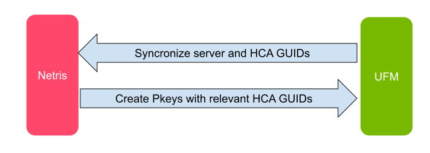
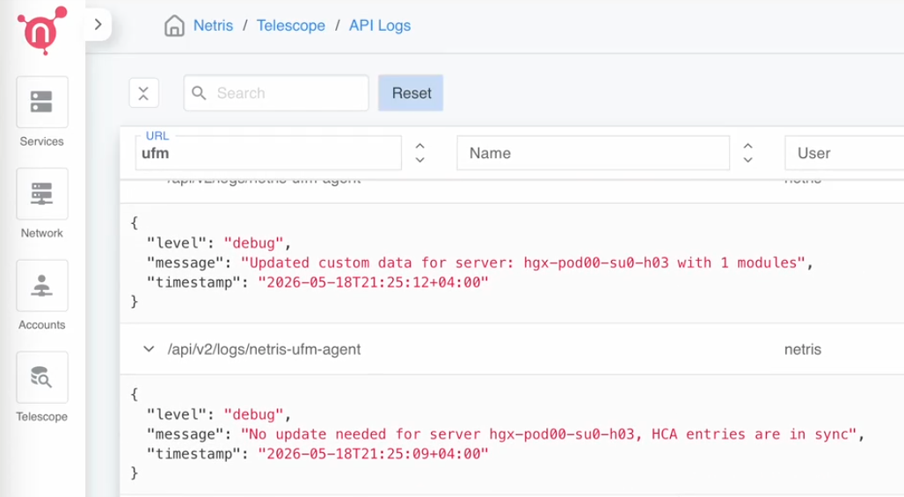

.. meta::
    :description: NVIDIA UFM (InfiniBand) Integration Plugin for Netris Controller

################################################################
NVIDIA UFM (InfiniBand) Integration Plugin for Netris Controller
################################################################

Overview
========

The Netris-UFM plugin provides seamless integration between Netris Controller and NVIDIA UFM (Unified Fabric Manager) for AI infrastructures with hybrid InfiniBand and Ethernet networks. This integration allows infrastructure operators to define compute multi-tenancy in a single place through Netris, significantly simplifying management across both network types.

Key Benefits
--------------

- **Unified Management Interface**: Define tenant isolation by simply listing servers in a :doc:`server-cluster </server-cluster>` object
- **Automated Provisioning**: Automatically configure both Ethernet (via Netris) and InfiniBand (via UFM) networks
- **Simplified Operations**: Eliminate the need to manage SwitchPorts, VLANs, VRFs on Ethernet and GUIDs, PKeys, SHARP groups on InfiniBand separately

Architecture
=============

The Netris-UFM plugin acts as the integration layer between Netris Controller and NVIDIA UFM:

1. **Netris Controller**: Orchestrates the Ethernet switches and provides the primary user interface
2. **NVIDIA UFM**: Manages the InfiniBand switches and provides specialized InfiniBand functionality
3. **Netris-UFM Plugin**: Synchronizes configurations between both systems

When you define a :doc:`server-cluster </server-cluster>` in Netris, the plugin automatically:

- Discovers InfiniBand port GUIDs from UFM
- Creates and manages appropriate PKeys in UFM
- Optionally sets up SHARP reservations for high-performance operations

Netris interacts with UFM exclusively through UFM's REST API, where it creates and maintains PKeys, GUID membership including the ``index0`` attribute, and SHARP reservations.

.. raw:: html

   
<em>Figure: Netris-UFM Integration Workflow</em>

   
Prerequisites
==============

Before installing the Netris-UFM plugin, ensure:

1. A functioning Netris Controller environment
2. A properly configured NVIDIA UFM installation with limited membership enabled (see below)
3. Network connectivity between both systems
4. Appropriate access credentials for both platforms

UFM Configuration Requirements
================================

To enable the UFM PKey REST API functionality required by the Netris-UFM integration, you must configure UFM to use limited membership by default.

**Configure gv.cfg**

Edit the UFM configuration file ``/opt/ufm/files/conf/gv.cfg`` and add or modify the following section:

.. code-block:: ini

   [MngNetwork]
   default_membership = limited

**Restart UFM Service**

After making this configuration change, restart the UFM enterprise service:

.. code-block:: bash

   systemctl restart ufm-enterprise

.. important::
   This UFM configuration change is essential for the Netris-UFM integration to function properly. The setting enables limited membership by default, which allows servers on the subnet to communicate only when they have full membership in non-default partitions managed by the Netris-UFM plugin.

Installation
=============

The Netris-UFM plugin manifest ships inside the same air-gapped installation tarball used to deploy the Netris Controller — no internet access is required. The steps below assume you unpacked that tarball into ``~/netris-controller-ha/`` (see :doc:`installation/controller-k3s-air-gap-ha` for details).

1. Edit ``netris-controller-ha/manifests/netris-controller/ufm.yaml`` to update the secret values based on your environment:

   .. code-block:: yaml

      apiVersion: v1
      kind: Secret
      metadata:
        name: netris-controller-nvidia-ufm-agent-envs
        namespace: netris-controller
      type: Opaque
      stringData:
        NETRIS_CONTROLLER_ADDR: "https://netris.example.com"
        NETRIS_CONTROLLER_LOGIN: "netris"
        NETRIS_CONTROLLER_PASSWORD: "Password!"
        NETRIS_VERIFY_SSL: "true"
        NETRIS_SITE_NAME: "Site"
        UFM_ADDR: "https://ufm.example.com"
        UFM_LOGIN: "admin"
        UFM_PASSWORD: "123456"
        UFM_VERIFY_SSL: "false"
        UFM_ID: "ufm-lab"
        UFM_PKEY_RANGE: "100-7ffe"
        UFM_ENABLE_SHARP: "true"

2. Apply the configuration to your Kubernetes cluster:

   .. code-block:: bash

      kubectl apply -f netris-controller-ha/manifests/netris-controller/ufm.yaml

Upgrading the UFM Integration
===============================

When you upgrade an existing Netris deployment, Netris recommends setting the ``netris-controller-nvidia-ufm-agent`` replicas to 0, which effectively disables the UFM integration, then following the normal Netris upgrade procedure (see :doc:`installation/controller-k3s-air-gap-ha`).

To set the replicas to 0:

.. code-block:: bash

   kubectl -nnetris-controller scale deploy netris-controller-nvidia-ufm-agent --replicas=0

To upgrade the plugin, simply apply the updated ``ufm.yaml`` manifest.

.. tip::
   Remember to populate the updated ``ufm.yaml`` manifest file with the current netris credentials as shown in the installation section above.

Multiple UFM Instances
-----------------------

If a customer's InfiniBand environment has more than one fabric — each with its own UFM (for example, separate compute and storage fabrics) — deploy a separate Netris-UFM agent per UFM. A highly available UFM pair presents a single address to Netris and is served by one agent.

1. Copy ``ufm.yaml`` to a new file name.
2. In the copy, give the agent a unique Kubernetes resource name (``metadata.name``), ``UFM_ADDR``, and a unique ``UFM_ID``, and update the other UFM/Netris connection values as needed.

.. tip::
   Here is a quick way to update the YAML file for the 2nd UFM instance:

   .. code-block:: bash

      cp ufm.yaml ufm-storage.yaml
      sed -i 's/netris-controller-nvidia-ufm-agent/netris-controller-nvidia-ufm-agent-storage/g' ufm-storage.yaml

3. Apply the copy with ``kubectl apply -f``.

.. important::
   Re-applying a manifest with the same ``metadata.name`` updates the existing agent rather than creating a second one. Each UFM instance needs its own uniquely-named deployment and a unique ``UFM_ID``.

Configuration Parameters
========================

Netris Controller Configuration
-------------------------------

.. list-table::
   :widths: 30 50 20
   :header-rows: 1

   * - Parameter
     - Description
     - Example
   * - NETRIS_CONTROLLER_ADDR
     - The URL of your Netris Controller
     - https://netris.example.com
   * - NETRIS_CONTROLLER_LOGIN
     - Username for authenticating with Netris Controller
     - netris
   * - NETRIS_CONTROLLER_PASSWORD
     - Password for authenticating with Netris Controller
     - Password!
   * - NETRIS_VERIFY_SSL
     - Whether to verify SSL certificates when connecting to Netris Controller
     - true or false
   * - NETRIS_SITE_NAME
     - The name of the site in Netris Controller to manage
     - Datacenter-1

NVIDIA UFM Configuration
------------------------

.. list-table::
   :widths: 30 50 20
   :header-rows: 1

   * - Parameter
     - Description
     - Example
   * - UFM_ADDR
     - The URL of your NVIDIA UFM server
     - https://ufm.example.com
   * - UFM_LOGIN
     - Username for authenticating with UFM
     - admin
   * - UFM_PASSWORD
     - Password for authenticating with UFM
     - 123456
   * - UFM_VERIFY_SSL
     - Whether to verify SSL certificates when connecting to UFM
     - true or false
   * - UFM_ID
     - Unique identifier for this UFM instance, referenced from the ``ufm`` field in the :doc:`Server Cluster Template </server-cluster>`. The value is operator-chosen and arbitrary; it must match exactly between this agent and the template. An agent acts on templates whose ``ufm`` value matches its own ``UFM_ID``.
     - ufm-lab
   * - UFM_PKEY_RANGE
     - Range of PKey IDs that can be allocated to clusters, in hexadecimal format
     - 100-7ffe
   * - UFM_ENABLE_SHARP
     - Whether to enable SHARP reservation management for clusters
     - true or false

Before assigning a PKey from ``UFM_PKEY_RANGE``, the agent always checks whether that PKey already exists in UFM, and will not overwrite an existing PKey. If a customer already has PKeys configured manually and wants to preserve them, set ``UFM_PKEY_RANGE`` to start above their existing range (e.g., start at ``200`` instead of ``100``) to avoid collisions.

Agent Configuration
-------------------

.. list-table::
   :widths: 30 40 15 15
   :header-rows: 1

   * - Parameter
     - Description
     - Default
     - Example
   * - LOG_LEVEL
     - Logging level for the agent
     - info
     - info or debug
   * - RECONCILE_INTERVAL
     - Interval in seconds between reconciliation operations
     - 10
     - 10

Starting in Netris Controller 4.11, the Reconcile Interval can also be set from the UI (**Settings** → **General**). When that field is present, it takes precedence over ``RECONCILE_INTERVAL`` in the YAML/env file; the YAML/env value is used only as a fallback on controllers predating 4.11.

Usage Guide
===========

After successfully installing and configuring the Netris-UFM agent, follow these steps to set up and use the integration:

1. Server Configuration in Netris
----------------------------------

The first step is to create servers in the Netris Controller inventory that match exactly with the servers in UFM:

1. In Netris Controller, navigate to **Network** → **Topology** → **+Add**.
2. Create servers with **identical names** as they appear in UFM (this is crucial for proper GUID mapping)
3. Once created, the Netris-UFM agent will automatically sync the InfiniBand host and HCA GUIDs from UFM into Netris

.. important::
   Server names must match exactly between UFM and Netris Controller for the initial sync to complete properly. Once the initial sync is done and the `hosting_system_guid` field is populated in Netris inventory, the plugin will continue to maintain the mapping even if server names change in Netris or UFM. You can verify the GUID mapping in Netris Controller UI under **Network** → **Inventory** by examining the Custom field of the server object. It should show both the HCA GUIDs and the hosting system GUID.

   .. image:: images/ufm-hosting-system-guid.png
      :align: center
      :class: with-shadow

   .. raw:: html

      
<em>Figure: Server Custom field showing GUIDs</em>

``hosting_system_guid`` always corresponds to the GUID of the server's first HCA. You can cross-check this value in the UFM UI under the server's Device view, which displays one general GUID that should match. Replacing that first HCA — for example, during an RMA — changes this GUID and breaks the Netris↔UFM mapping. If a server's first HCA is replaced, re-establish the mapping manually: either rename the server to force a fresh name-based sync, or set ``hosting_system_guid`` directly to the new value.

.. note::
   The server's Custom field may also show GPU UID entries. Those come from the separate :doc:`NVLink integration <netris-nvlink-integration>` and are unrelated to UFM — the Netris-UFM plugin doesn't read or write them.

2. Create a Server Cluster Template
------------------------------------

Next, create a Server Cluster Template.

1. Navigate to **Services** → **Server Cluster Template**.
2. Click **Add** to create a new template
3. Configure the template using JSON with specific sections for different network fabrics. Use :ref:`infiniband-fabric-example`.

.. note::
   Netris Controller has no visibility into individual UFM NICs or ports, so the InfiniBand side of the template is just a single generic ``netris-ufm`` fabric entry — you don't (and can't) enumerate individual HCAs the way you would for Ethernet interfaces. Per-host HCA/port mapping happens automatically via the GUID sync described above.

3. Create Server Clusters
--------------------------

After setting up the template, create server clusters as described in :ref:`creating-server-cluster`.

3. Verification
-----------------

Once the server cluster is created:

1. The Netris-UFM agent will automatically:

   - Identify the InfiniBand GUIDs associated with the servers in the cluster
   - Provision appropriate PKeys in UFM
   - Create necessary SHARP reservations if applicable (if UFM_ENABLE_SHARP is set to true)

2. Verify the configuration:

   - Check the Netris Controller UI for successful cluster creation
   - Examine the UFM UI to confirm PKey assignments
   - Test connectivity between servers in the cluster via InfiniBand
   - In the UFM UI, open the PKey and confirm the ``index0`` value of each GUID matches whether that server is a dedicated or shared member

4. Monitoring Integration Status
----------------------------------

To monitor the status of the integration:

1. Check the Netris-UFM agent logs (as described in the Monitoring section)
2. Verify the synchronization state:

   .. code-block:: bash

      kubectl logs -f deployment/netris-controller-nvidia-ufm-agent -n netris-controller

Functional Workflow
=====================

1. **Discovery Phase**:

   - Plugin connects to both Netris Controller and NVIDIA UFM
   - InfiniBand port GUIDs are discovered from UFM and stored in Netris inventory

2. **Cluster Creation**:

   - When a server cluster is created or modified in Netris Controller
   - Plugin identifies affected servers and their InfiniBand GUIDs
   - Appropriate PKeys are automatically provisioned in UFM

3. **SHARP Integration**:

   - For high-performance network operations, SHARP reservations are created if UFM_ENABLE_SHARP is set to true
   - These correspond to the server clusters defined in Netris

4. **Continuous Reconciliation**:

   - Plugin periodically synchronizes between Netris and UFM
   - Ensures consistency between Ethernet and InfiniBand configurations
   - Reconciliation interval is configurable (default: 10 seconds)

PKey membership: dedicated and shared
--------------------------------------

When Netris provisions a PKey for a Server Cluster, each member server's HCA GUIDs are added to that PKey. The ``index0`` attribute records whether the server is a dedicated or a shared member:

- **Dedicated member** — GUIDs added with ``index0=true``. A GUID holds ``index0=true`` membership in one PKey.
- **Shared member** — GUIDs added with ``index0=false``. A GUID can hold ``index0=false`` membership in any number of PKeys.

This is the InfiniBand equivalent of untagged versus 802.1Q tagged switch ports on Ethernet. See :ref:`server-cluster-shared-endpoints` on the Server Cluster page.

When ``index0=false``, additional server-side configuration is required and is under the control of your compute orchestrator.

A server can be added as a shared member directly, whether or not it is a dedicated member of another cluster.

InfiniBand Security (Recommended)
======================================

What is MKey Protection?
------------------------

MKey (Management Key) is InfiniBand's security mechanism that protects fabric devices from unauthorized management access. When enabled, only tools and managers with the correct MKey can perform configuration operations on switches and HCAs.
We strongly recommend enabling MKey protection in production environments to prevent unauthorized fabric management operations and protect against rogue management tools.

Impact on Netris Integration
----------------------------

MKey protection has **no impact** on the Netris-UFM integration. The Netris-UFM plugin communicates exclusively through UFM's REST API, and UFM (as the authorized Subnet Manager) handles all MKey authentication with fabric devices internally.

Configuration Steps
-------------------

To enable MKey protection in UFM:

1. Set the MKey Value
^^^^^^^^^^^^^^^^^^^^^

Edit ``/opt/ufm/files/conf/gv.cfg`` and in the ``[SubnetManager]`` section, set a non-zero value (e.g., ``0x2`` or any 64-bit hex value):

  .. code-block:: ini

     global_m_key_seed = 0x0000000000000002

2. Enable MKey Protection Level
^^^^^^^^^^^^^^^^^^^^^^^^^^^^^^^^

Edit ``/opt/ufm/files/conf/opensm/opensm.conf`` and set:

.. code-block:: ini

   m_key_protection_level 2

**Protection levels:**

* ``0``: No protection (MKey set but not enforced)
* ``1``: Basic protection (prevents unauthorized Set operations)
* ``2``: Full protection (prevents unauthorized Get and Set operations) **← Recommended**

3. Enable VSKey (Vendor Specific Key)
^^^^^^^^^^^^^^^^^^^^^^^^^^^^^^^^^^^^^^

VSKey provides security for NVIDIA/Mellanox vendor-specific operations that go beyond standard InfiniBand management.

To configure it edit ``/opt/ufm/files/conf/opensm/opensm.conf`` and set:

.. code-block:: ini

   vs_key_enable 2
   vs_key_lease_period = 60
   vs_key_ci_protect_bits = 1
   key_mgr_seed = 0x0000000000000000

**VSKey Configuration Parameters:**

* ``vs_key_enable``:
  
  * ``0`` – Ignore: No VS key configuration
  * ``1`` – Disable: Ports set with zero values (no protection)
  * ``2`` – Enable: Each port configured with unique VS Key **← Recommended**

* ``vs_key_ci_protect_bits``: Protection level

  * ``0`` – Key is protected but readable via KeyInfo GET
  * ``1`` – Full protection; all VS MADs must have correct key **← Recommended**

* ``vs_key_lease_period``: Duration in seconds before key expires (``60`` recommended)
* ``key_mgr_seed``: Set to ``0`` to use MKey as seed for VS keys

4. Restart UFM Service
^^^^^^^^^^^^^^^^^^^^^^^

.. code-block:: bash

   systemctl restart ufm-enterprise.service

5. Verification
^^^^^^^^^^^^^^^

Verify MKey and protection level are applied:

.. code-block:: bash

   cat /opt/ufm/files/conf/opensm/opensm.conf | grep -E "^m_key|^m_key_protection_level|^vs_key_enable"

Should show:

.. code-block:: text

   m_key 0x0000000000000002
   m_key_protection_level 2
   vs_key_enable 2

Test protection by querying a fabric device:

.. code-block:: bash

   # Without MKey - should timeout/fail
   sudo smpquery portinfo <lid> 1
   
   # With correct MKey - should succeed
   sudo smpquery --m_key 0x2 portinfo <lid> 1

.. note::

   Once MKey is enabled, diagnostic tools like ``ibdiagnet`` will need the ``--m_key`` parameter to access fabric devices. UFM itself continues to function normally as it manages the MKey internally.

Monitoring and Troubleshooting
===============================

.. _ufm_integration_view_logs:

Viewing Logs
--------------

.. code-block:: bash

   kubectl logs -f deployment/netris-controller-nvidia-ufm-agent -n netris-controller

.. raw:: html

   
<em>Figure: Viewing UFM integration logs in Netris Controller UI</em>

Common Issues and Solutions
-----------------------------

Connection Issues to Netris Controller or UFM
^^^^^^^^^^^^^^^^^^^^^^^^^^^^^^^^^^^^^^^^^^^^^^

**Symptoms**:

- Log messages indicating connection timeouts or authentication failures
- Missing data in Netris inventory

**Solutions**:

1. Verify network connectivity between the plugin and both systems:

   .. code-block:: bash

      ping netris.example.com
      ping ufm.example.com

2. Check credentials in the configuration:

   - Verify username/password combinations for both systems
   - Ensure API permissions are sufficient

3. Verify SSL certificate settings:

   - If using self-signed certificates, set NETRIS_VERIFY_SSL/UFM_VERIFY_SSL to "false"
   - For production, use valid certificates and set verification to "true"
   - Certificates typically expire within one year (sometimes two); plan for rotation. When a certificate expires or becomes invalid, Netris logs a connection failure in the agent logs.

**Note on log behavior:** The agent logs an entry only when it takes an action or encounters an error. A reconciliation cycle that completes normally and finds nothing to change does not produce a log message — so no new log entries is the expected, healthy state, not a sign that something has stalled.

If connectivity to UFM goes down, you will see a new timeout message every reconcile interval (every 10 seconds by default) for as long as the outage lasts. Once connectivity is restored, those timeout messages stop, and no separate "connection restored" message is logged in their place. So a timeout logged hours ago with nothing since typically means connectivity was restored, not that the integration is still down.

PKey Assignment Issues
^^^^^^^^^^^^^^^^^^^^^^^^

**Symptoms**:

- Server clusters don't have proper isolation in InfiniBand
- Errors about PKey allocation failures in logs

**Solutions**:

1. Ensure the UFM_PKEY_RANGE has sufficient available IDs:

   - Check current PKey usage in UFM
   - Adjust the range if needed

2. Verify server naming consistency:

   - Server names must match exactly between Netris and UFM
   - Check for any server name discrepancies

3. Examine the PKey allocation process in debug logs:

   .. code-block:: bash

      kubectl logs -f deployment/netris-controller-nvidia-ufm-agent -n netris-controller | grep "PKey"

SHARP Reservation Issues
^^^^^^^^^^^^^^^^^^^^^^^^^

**Symptoms**:

- InfiniBand performance is not at expected levels
- SHARP reservations are not being created

**Solutions**:

1. Verify SHARP is enabled on all relevant switches in UFM
2. Check UFM configuration for SHARP support
3. Ensure the plugin has permission to create SHARP reservations
4. Set LOG_LEVEL to "debug" for more detailed information:

   .. code-block:: bash

      LOG_LEVEL="debug"

Synchronization Delays
^^^^^^^^^^^^^^^^^^^^^^^

**Symptoms**:

- Changes in Netris don't appear quickly in UFM
- Inconsistent behavior after making configuration changes

**Solutions**:

1. Turn on debug logging in Settings>General to monitor synchronization operations in detail. Tail the logs once turned on. See :ref:`ufm_integration_view_logs` for instructions on viewing logs.
2. Adjust the Reconcile Interval Settings>General to a shorter time period for faster synchronization. Tail the logs once turned on. See :ref:`ufm_integration_view_logs` for instructions on viewing logs.
3. Use Dry Run mode (Settings → General) to test changes without applying them. This is particularly useful in two situations: (a) the agent was disabled for a while, and Netris and UFM have drifted apart from manual changes made on both sides, so you want to preview what enabling it would do before actually re-enabling it; and (b) your change-management process requires reviewing planned changes before they're applied — Dry Run lets you generate that preview for approval. Tail the logs once turned on. See :ref:`ufm_integration_view_logs` for instructions on viewing logs.

   .. image:: images/general-ufm-debug-dry-run-reconcile.png
      :align: center
      :class: with-shadow

   .. raw:: html

       

4. Check for high CPU or memory usage on the plugin host
5. Verify network latency between the plugin and both systems
6. Restart the plugin service if synchronization issues persist:

   .. code-block:: bash

      kubectl rollout restart deployment/netris-controller-nvidia-ufm-agent -n netris-controller

**Checking PKey/GUID membership:** To see which GUIDs belong to a given server cluster's PKey, use the Netris API (v2) PKey Ledger endpoint for the ``netris-ufm`` integration. Useful when troubleshooting cluster membership that doesn't match expectations.

Version Compatibility
======================

.. list-table::
   :widths: 33 33 33
   :header-rows: 1

   * - Netris Controller Version
     - NVIDIA UFM Version
     - Plugin Version
   * - 4.4.1+
     - 6.15.4+
     - 0.3.0+

Getting Started Guide
======================

Quick Setup Example
--------------------

1. Install the plugin as described above
2. Verify the plugin is running properly:

   .. code-block:: bash

      kubectl get pods -n netris-controller | grep ufm

3. Create a Server Cluster Template in Netris Controller UI or API
4. Create Server Cluster with the servers that have InfiniBand connections
5. Verify PKey assignments in UFM:

   - Check the UFM UI for PKey assignments
   - Verify servers in the cluster can communicate via InfiniBand

Additional Resources
=====================

- `NVIDIA UFM Documentation <https://docs.nvidia.com/networking/display/ufmenterpriseumv6200/>`_
- :doc:`Netris NVIDIA Spectrum-X Scenario </try-learn/nvidia-spectrum-x-scenario>`
