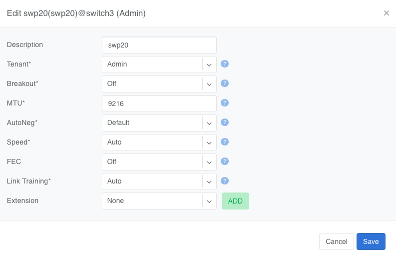
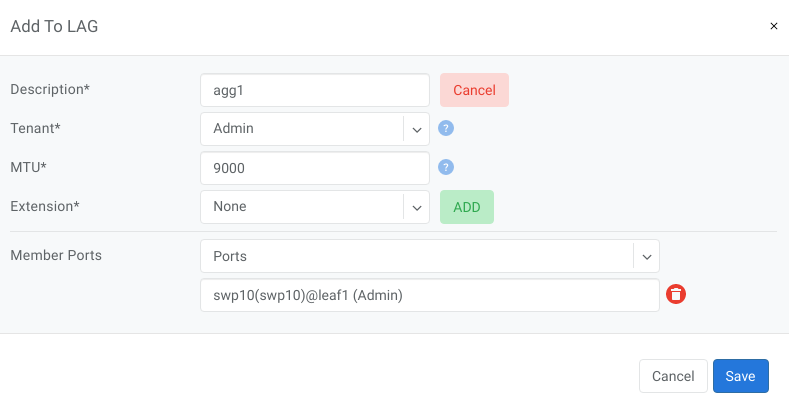

.. meta::
    :description: Network Interfaces

===================
Network Interfaces
===================

Switch ports can be directly managed in the **Network Interfaces** UI section. Both physical and virtual ports (extended, aggregate, etc…) will appear in this section once they have been added to inventory. The Netris Controller will automatically sync the list of available ports that appear on each device.

The following options are available for editing on each port:

* **Description** - Description of the port.
* **Tenant** - Tenant to whom the port is assigned, by default it is the owner tenant of the device to whom the port belongs to.
* **Breakout** - Available only for physical switch ports, used to split physical ports into multiple physical ports. When there is a need to use other supported option supported by switch not shown in the dropdown list user must set breakout to "Manual" and configure breakout manually on the switch. For certain platforms some ports need to be disabled to support breakout into other ports, for that option use "Disable" mode of breakout. Once a port is broken out, Netris applies no other configuration to the parent port. For Cumulus, after configuration, user must manually restart switchd daemon on the switch via command "systemctl restart switchd".
* **MTU** - Maximum transmission unit of the port. Ports that Netris discovers on a switch are added with an MTU of 9216.
* **Autoneg** - Autonegotiation of the port. Available only for physical ports. Supported values:

  * On - Autonegotiation is enabled.
  * Off - Autonegotiation is disabled.
  * Default - Netris does not configure autonegotiation, and the switch's own setting applies. On Cumulus, Speed and Duplex are also not applied when Autoneg is Default. On Arista, Default is applied the same way as Off.

* **Speed** - Speed of the port. Available only for physical ports. Auto leaves the speed to the switch. On Cumulus, a fixed speed is applied only when Autoneg is On or Off. On Arista, port speed can only be changed through Breakout.
* **FEC** - Forward Error Correction (FEC) mode of the port. Available only for physical ports. Supported modes:

  * Auto - Netris does not configure FEC on the port, and the port uses the switch's default FEC behavior. If an earlier Netris version set FEC to auto explicitly on a Cumulus switch, Netris leaves that setting in place.
  * Base-R - Base-R (FireCode) FEC.
  * RS - Reed-Solomon FEC.
  * Off - FEC is disabled on the port.

  .. list-table::
    :header-rows: 1

    * - Platform
      - Supported Modes
      - Default
    * - Spectrum-X (Cumulus)
      - Auto, Base-R, RS, Off
      - Auto
    * - Arista
      - Auto, Base-R, RS, Off
      - Auto
    * - SONiC
      - Auto, Base-R, RS, Off
      - Off

* **Link Training** - Link training of the port. Supported values:

  * On - Link training is enabled.
  * Off - Link training is disabled.
  * Auto (default) - Link training is enabled only if the transceiver EEPROM reports copper medium and the port speed is 200Gbps or higher.

* **Duplex** - Duplex mode of the port, Full or Half. Available only for physical ports. On Cumulus, Duplex is applied only when Autoneg is On or Off. Duplex is not applied on Arista, where it is part of the port speed.
* **Extension** - Create extension ports. Available for physical and aggregate ports.
* **Extension Name** - Name for new extension.
* **VLAN Range** - VLAN id range for new extension port.

Example: Edit physical port

Quick action menu provides the following actions for ports (note that Bulk Action is also available for multiple ports:

| Edit - Edit the port.
| Admin UP/Down - Toggle the port's admin status.

Add to LAG - Add selected ports into a LAG.

Copy Link - Copy the hyperlink to this port object to your buffer.

Free Up Port - Detach port from all resources.
