.. meta::
    :description: Netris Network Policies & Protocol Configuration

###
VPC
###

Netris Controller is preconfigured with a default system VPC-1. Use the default VPC, and create additional VPCs as needed in the future.

The VPC acts as a VRF in traditional networking, providing the ability to use overlapping IP ranges across various VPCs while maintaining safe management and operation of services.

VPC can be created in the Network → VPC section. 

Adding new VPC
--------------

1. Navigate to Network → VPC in the web UI.
2. Click Add button.

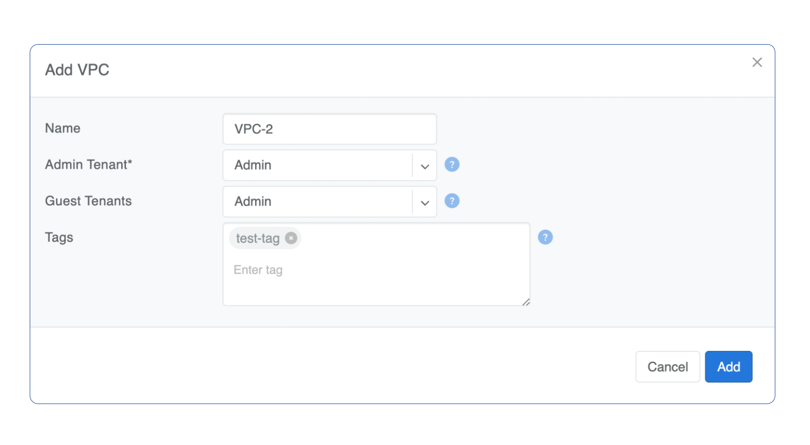

.. _ipam_def_vpc:

#####################
IP Address Management
#####################

Netris IPAM allows users to document their IP addresses and track pool usage. It is designed to have a tree-like view to provide opportunity to perform any kind of subnetting.

Purpose: Users define specific roles (purpose) for each subnet/address and only after that are allowed to use those subnets in services like V-Net, NAT, etc…

Each VPC has its own IPAM table.

Allocations and Subnets
-----------------------

There are 2 main types of IP prefixes - allocation and subnet. Allocations are IP ranges allocated to an organization via RIR/LIR or private IP ranges that are going to be used by the network. Subnets are prefixes which are going to be used in services. Subnets are always childs of allocation. Allocations do not have parent subnets.

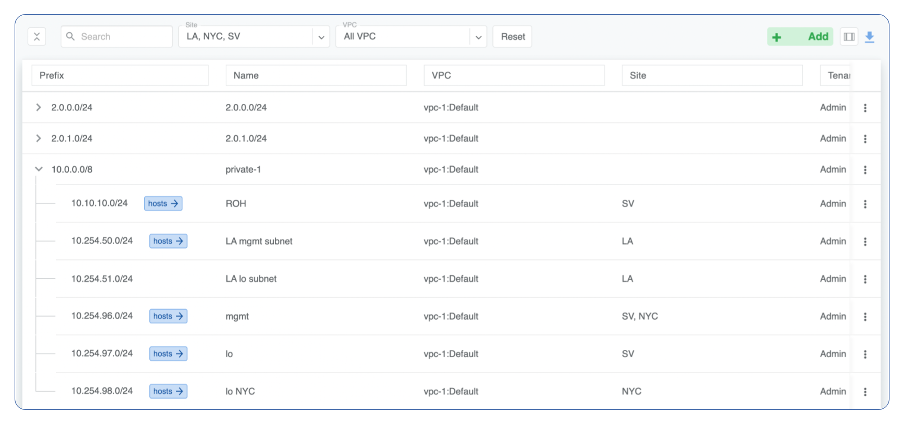

IPAM Tree View
--------------------------

Add an Allocation
-----------------

#. Navigate to Network → IPAM
#. Click the **Add** button
#. Select **Allocation** from the bottom select box
#. Fill in the rest of the fields based on the requirements listed below
#. Click the **Add** button

.. list-table:: Allocation Fields
   :widths: 25 50
   :header-rows: 0

   * - Prefix
     - Unique prefix for allocation, must not overlap with other allocations.
   * - Name
     - Unique name for current allocation.
   * - VPC
     - Select a VPC to which the allocation belongs.
   * - Tenant
     - Owner of the allocation.

.. image:: images/allocation_empty.png
   :align: center
   :class: with-shadow
   :alt: Add a New IP Allocation

Add Allocation Window

--------------------------

Add a Subnet
------------

#. Navigate to Network → IPAM 
#. Click the **Add** button
#. Select **Subnet** from the bottom select box
#. Fill in the rest of the fields based on the requirements listed below
#. Click the **Add** button

.. list-table:: Subnet fields
   :widths: 25 50
   :header-rows: 0

   * - **Prefix**
     - Unique prefix for subnet, ust be included in one of allocations.
   * - **Name**
     - Unique name for current subnet.
   * - **VPC**
     - Select a VPC to which the subnet belongs.
   * - **Tenant**
     - Owner of the subnet.
   * - **Purpose**
     - This field describes for what kind of services the current subnet can be used. It can have the following values:

        - *common* - ordinary subnet, can be used in v-nets and ROH.
        - *loopback* - hosts of this subnet can be used only as loopback IP addresses for Netris hardware (switches and/or softgates).
        - *management* - subnet which specifies the out-of-band management IP addresses for Netris hardware (switches and softgates).
        - *load-balancer* - hosts of this subnet are used in L4LB services only. Useful for deploying on-prem kubernetes with cloud-like experience.
        - *nat* - hosts of this subnet or subnet itself can be used to define NAT services.
        - *inactive* - can't be used in any services, useful for reserving/documenting prefixes for future use.

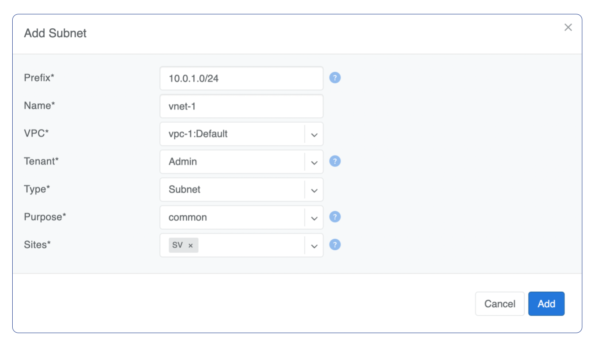

Add Subnet Window

.. _bgp_def:

#########
Basic BGP
#########

BGP neighbors can be declared in the Network → E-BGP section. Netris software will automatically generate and program the network configuration to meet the requirements.

Adding BGP Peers
----------------
#. Navigate to Network → E-BGP in the web UI.
#. Click the Add button.
#. Fill in the fields as described in the table below.
#. Click the Add button.

.. .. csv-table:: BGP Peer Fields
..    :file: tables/bgp-basic.csv
..    :widths: 25, 75
..    :header-rows: 0

Example: Declare a basic BGP neighbor.

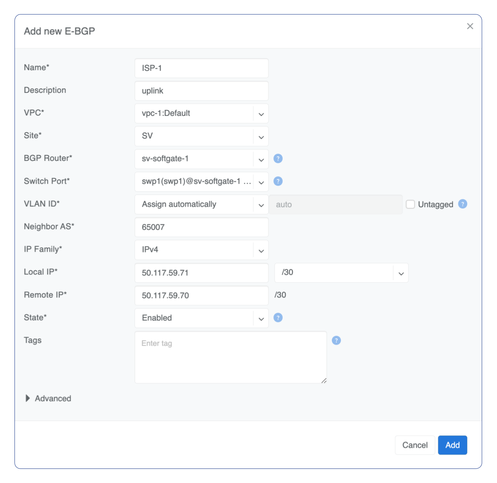

############
Advanced BGP
############

BGP neighbor declaration can optionally include advanced BGP attributes and BGP route-maps for fine-tuning of BGP policies.

Click Advanced to expand the BGP neighbor add/edit window.

.. .. csv-table:: BGP Peer Fields - Advanced
..    :file: tables/bgp-advanced.csv
..    :widths: 25, 75
..    :header-rows: 0

--------------------------

BGP Objects
-----------
| Under Network → E-BGP objects, you can define various BGP objects referenced from a route-map to declare a dynamic BGP policy.
| Supported objects include:

* IPv4 Prefix
* IPv6 Prefix
* AS-PATH
* Community
* Extended Community
* Large Community

IPv4 Prefix
^^^^^^^^^^^
| The rules are defined one per line.  
| Each line in IPv4 prefix list field consists of three parts:

* Action - Possible values are: permit or deny (mandatory).
* IP Prefix - Any valid IPv4 prefix (mandatory).
* Length - Possible values are: le <len>, ge <len> or ge <len> le <len>. 

Example: Creating an IPv4 Prefix list.

.. image:: images/ipv4_prefix.png
    :align: center
    
IPv6 Prefix
^^^^^^^^^^^
| Rules defined one per line.
| Each line in IPv6 prefix list field consists of three parts: 

* Action - Possible values are: permit or deny (mandatory).
* IP Prefix - Any valid IPv6 prefix (mandatory).
* Keyword - Possible values are: le <len>, ge <len> or ge <len> le <len>. 

Example: Creating an IPv6 Prefix list.

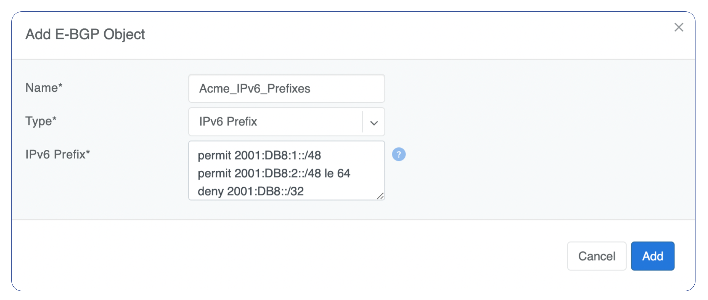
    
Community
^^^^^^^^^
| Community field has two parts:

* Action - Possible values: permit or deny (mandatory).
* Community string - format is AA:NN, where AA and NN are any number from 0 to 65535 range or alternatively well known string (local-AS|no-advertise|no-export|internet|additive).

Example: Creating community.

.. image:: images/community.png
    :align: center

--------------------------

BGP route-maps
--------------
| Under the Network → E-BGP Route-maps section, you can define route-map policies, which can be associated with the BGP neighbors inbound or outbound.

| Description of route-map fields:

* **Sequence Number** - Automatically assigned a sequence number. Drag and move sequences to organize the order.
* **Description** - Free description.
* **Policy** - Permit or deny the routes which match below all match clauses within the current sequence.
* **Match** - Rules for route matching.

  * **Type** - Type of the object to match: AS-Path, Community, Extended Community, Large Community, IPv4 prefix-list, IPv4 next-hop, Route Source, IPv6 prefix-list. IPv6 next-hop, local-preference, MED, Origin, Route Tag. 
  * **Object** - Select an object from the list. 
  
* **Action** - Action when all match clauses are met.

  * **Action type** - Define whether to manipulate a particular BGP attribute or go to another sequence.
  * **Attribute** - The attribute to be manipulated.
  * **Value** - New attribute value.
    
Example: route-map

.. image:: images/route-map.png
    :align: center
    :class: with-shadow

--------------------------    

##############
Static Routing
##############
Located under Network → Routes is a method for describing static routing policies that Netris will dynamically inject on switches and/or SoftGate where appropriate. We recommend using the Routes only if BGP is not supported by the remote end.

| Typical use cases for static routing:

* To connect the switch fabric to an ISP or upstream router in a situation where BGP and dual-homing are not supported.
* Temporary interconnection with the old network for a migration. 
* Routing a subnet behind a VM hypervisor machine for an internal VM network.
* Specifically routing traffic destined to a particular prefix through an out-of-band management network.

| Add new static route fields description:

* **Prefix** - Route destination to match. 
* **Next-Hop** - Traffic destined to the Prefix will be routed towards the Next-Hop. Note that static routes will be injected only on units that have the Next-Hop as a connected network.
* **Description** - Free description.
* **VPC** - Select a VPC to which the static route belongs.
* **Site** - Site where Route belongs. 
* **State** - Administrative (enable/disable) state of the Route. 
* **Apply to** -  Limit the scope to particular units. It's typically used for Null routes.

Example: Default route pointing to a Next-Hop that belongs to one of V-Nets. 

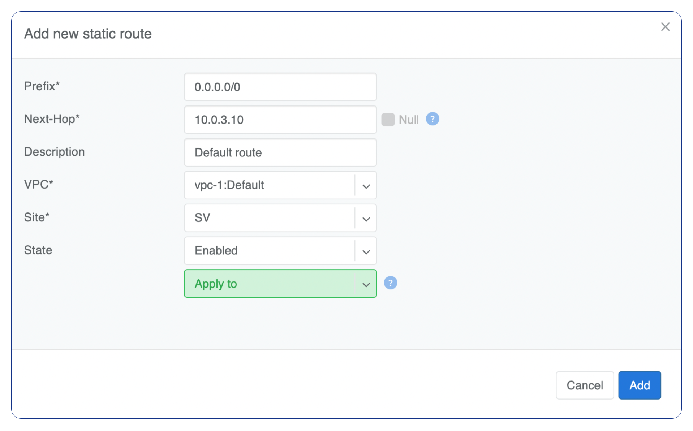

Example: Adding a back route to 10.254.0.0/16 through an out-of-band management network.

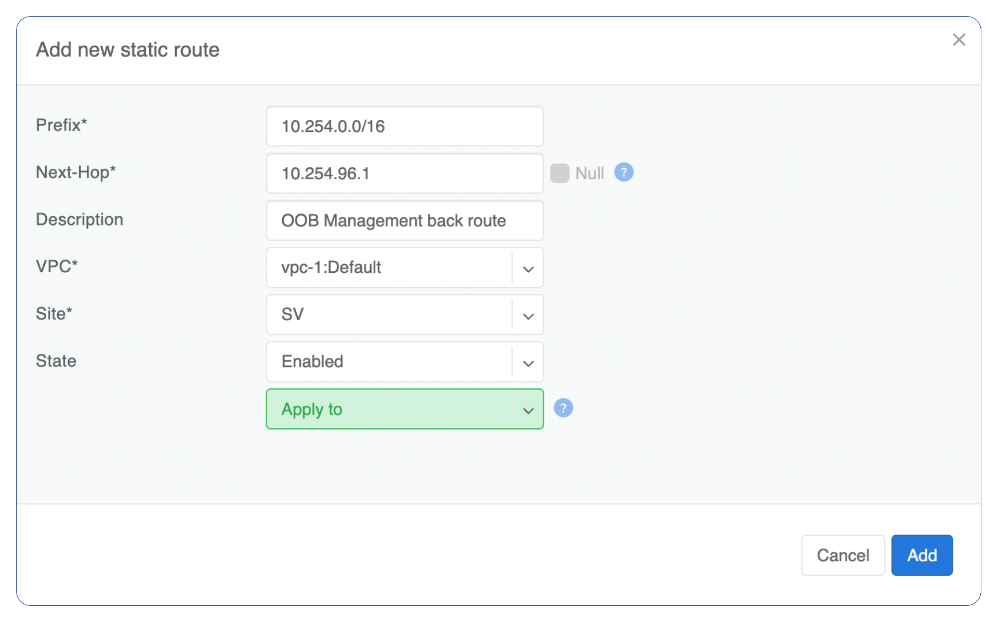
    
Screenshot shows that the back route is actually applied on Softgate1 and Softgate2 .

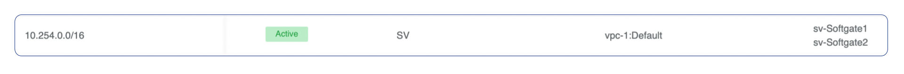

--------------------------

.. _nat_def:

###
NAT
###

Netris SoftGate nodes are required forNAT (Network Address Translation) functionality to work. 

**Note: works only in the system default VPC (limitation is planned to be lifted in Netris v. 4.1.0).**

Enabling NAT
------------
To enable NAT for a given site, you first need to create a subnet with NAT purpose in the IPAM section. The NAT IP addresses can be used for SNAT or DNAT as a global IP address (the public IP visible on the Internet). NAT IP pools are IP address ranges that SNAT can use as a rolling global IP (for a larger scale, similar to carrier-grade SNAT). SNAT is always overloading the ports, so many local hosts can share one or just a few public IP addresses. You can add as many NAT IP addresses and NAT pools as you need.
Adding an IP Subnet under Network → IPAM.

1. Allocate a public IP subnet for NAT under Net→IPAM. 

Example: Adding an IP allocation under Net→Subnets.

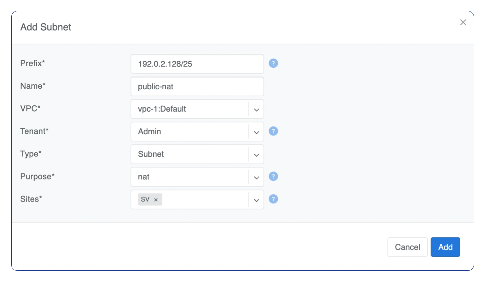

Defining NAT rules
------------------
NAT rules are defined under Network → NAT.

.. list-table:: NAT Rule Fields
  :widths: 25 75
  :header-rows: 1

  * - Name
    - Unique name.
  * - **State**
    - State of rule (enabled or disabled).
  * - **Site** 
    - Site to apply the rule.
  * - **Action**
    - *SNAT* - Replace the source IP address with specified NAT IP along with port overloading.
      *DNAT* - Replace the destination IP address and/or destination port with specified NAT IP.
      *ACCEPT* - Silently forward, typically used to add an exclusion to broader SNAT or DNAT rule.
      *MASQUERADE* - Replace the source IP address with the IP address of the exit interface.
  * - **Protocol**
    - *All* - Match any IP protocol.
      *TCP* - Match TCP traffic and ports.
      *UDP* - Match UDP traffic and ports.
      *ICMP* - Match ICMP traffic.
  * - **Source**
    - *Address* - Source IP address to match.
      *Port* - Source ports range to match with this value (TCP/UDP).
  * - **Destination**
    - *Address* - Destination IP address to match. In the case of DNAT it should be one of the predefined NAT IP addresses.
      *Port* - For DNAT only, to match a single destination port.
      *Ports* - For SNAT/ACCEPT only. Destination ports range  to match with this value (TCP/UDP).
  * - **DNAT to IP** 
    - The global IP address for SNAT to be visible on the Public Internet. The internal IP address for DNAT to replace the original destination address with.
  * - **DNAT to Port** 
    - The Port to which destination Port of the packet should be NAT'd.
  * - **Status**
    - Administrative state (enable/disable).
  * - **Comment**
    - Free optional comment.

Example: SNAT all hosts on 10.0.1.0/24subnet to the Internet using 192.0.2.128as a global IP.

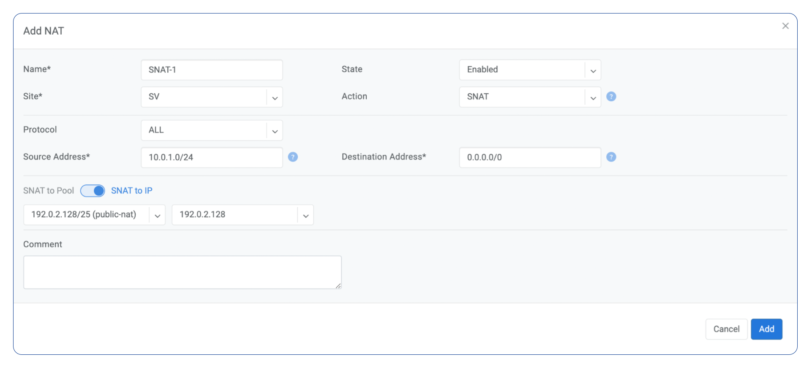
    
Example: Port forwarding. DNAT the traffic destined to 192.0.2.130:8080 to be forwarded to the host 10.0.1.100 on port tcp/80.

.. image:: images/create_dnat_empty.png
    :align: center

--------------------------

########
SiteMesh
########

SiteMesh is a Netris service for site-to-site interconnection over the public Internet. SiteMesh automatically generates configuration for WireGuard to create encrypted tunnels between participating sites and automatically generates a configuration for FRR to run dynamic routing. Hence, sites learn how to reach each other over the mesh WireGuard tunnels. The SiteMesh feature requires a SoftGate node at each participating site.

**Note: works only in the system default VPC (limitation is planned to be lifted in Netris v. 4.1.0).**

Edit Network → Sites, do declare what sites should form a SiteMesh. See SiteMesh types described below.

* **Disabled** - Do not participate in SiteMesh.
* **Hub** - Hub sites form full-mesh tunnels with all other sites (Hub and non-Hub) and can carry transit traffic for non-Hub sites. (usually major data center sites)
* **Spoke** - Spoke sites form tunnels with all Hub sites. Spoke to Spoke traffic will transit a Hub site. (small data center sites or major office sites)
* **Dynamic Spoke** - Dynamic Spoke is like Spoke, but it will maintain a tunnel only with one Hub site, based on dynamic connectivity measurements underneath and mathematical modeling. (small office sites)

Screenshot: Site Mesh parameter editing a Site under Network → Sites.

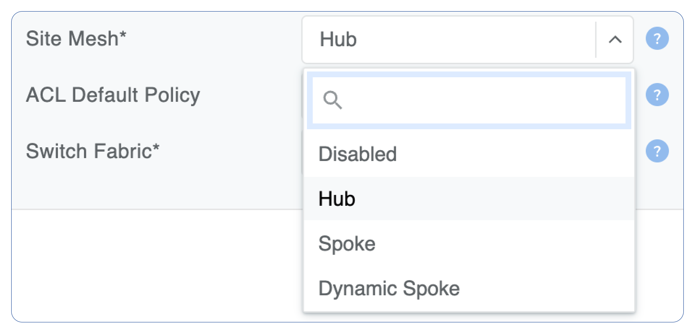
    
You only need to define your site-to-site VPN architecture policy by selecting SiteMesh mode for every site. Netris will generate the WireGuard tunnels (using randomly generated keys, and generate FRR rules to get the dynamic routing to converge.

.. image:: images/SiteMesh_modes.png
    :align: center  
    
Check the Network → Site Mesh section for the listing of tunnel statuses.

Screenshot: Listing of SiteMesh tunnels and BGP statuses (Net→Site Mesh)

.. image:: images/SiteMesh_listing.png
    :align: center  

--------------------------

#############
Looking Glass
#############

The Looking Glass Is a GUI-based tool for looking up routing information from a switch or SoftGate perspective. You can access the Looking Glass either from Topology, individually for every device (right click on device → details → Looking Glass), or by navigating to Network → Looking Glass then selecting the device from the top-left dropdown menu.

Looking Glass controls described for IPv4/IPv6 protocol families.

* **VPC** - select a VPC.
* **BGP Summary** - Shows the summary of BGP adjacencies with neighbors, interface names, prefixes received. You can click on the neighbor name then query for the list of advertised/received prefixes.
* **BGP Route** - Lookup the BGP table (RIB) for the given address.
* **Route** - Lookup switch routing table for the given address.
* **Traceroute** - Conduct a traceroute from the selected device towards the given destination, optionally allowing to determine the source IP address.
* **Ping** - Execute a ping on the selected device towards the given destination, optionally allowing to select the source IP address.

Example: listing BGP neighbors of a switch and number of received prefixes for the Underlay VPC.

.. image:: images/lg_summary.png
    :align: center
    
Example: BGP Route - looking up V-Net subnet from switch11 perspective. Switch11 is load balancing between four available paths.

.. image:: images/lg_bgp_route.png
    :align: center

Example: Ping.

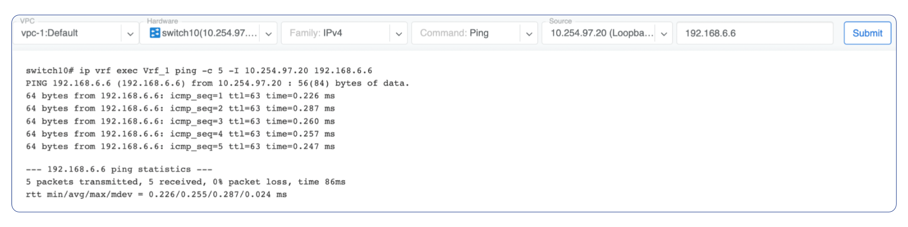

| Looking Glass controls described for the EVPN family.

* **VPC** - select a VPC.
* **BGP Summary** - Show brief summary of BGP adjacencies with neighbors, interface names, and EVPN prefixes received.
* **VNI** - List VNIs learned.
* **BGP EVPN** - List detailed EVPN routing information optionally for the given route distinguisher. 
* **MAC table** - List MAC address table for the given VNI.

Example: Listing MAC addresses on VNI 50.

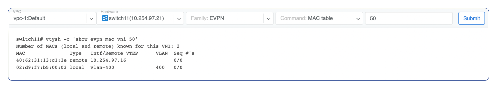

Example: EVPN routing information listing for a specified route distinguisher.

.. image:: images/lg_rd.png
    :align: center
