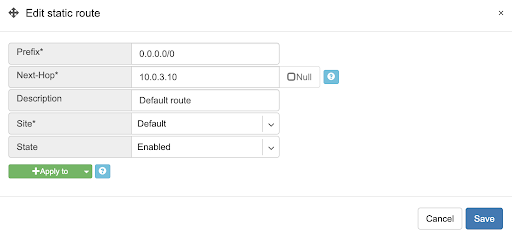
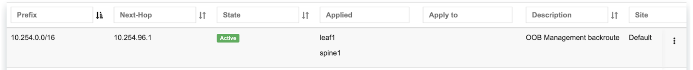
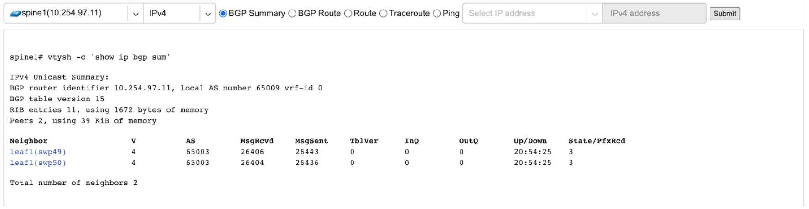

.. meta::
    :description: Netris Network Policies & Protocol Configuration

#########
Basic BGP
#########

BGP neighbors can be declared in the Net→E-BGP section. Netris will automatically generate and inject the right configuration to meet your requirements as declared. See below description of E-BGP neighbor declaration fields.

* **Name** - Name for BGP session.
* **Description** - Free description.
* **Site** - Selects the  site (data center) where this  BGP session should be terminated on.
* **NFV Node** - Only if SoftGate nodes are in use, define on which node BGP session should be terminated on.
* **Neighbor AS** - Autonomous System number of the remote side. (Local AS is defined at Net→Sites section)
* **Terminate on switch** - Typically used for setups without SoftGate, for connecting with upstream routers. Instructs the system to terminate the BGP session directly on the switch. 
* **Switch port** - Switch Port for the physical cable to the BGP neighbor. (any port on the fabric). Optionally can bind to a V-NET service, typically used for peering with IXPs or systems like GGC (Google Global Cache).
* **VLAN ID** - Optionally tag with a VLAN ID. (usually untagged)
* **IP Version** - IPv4 / IPv6
* **Local IP** - BGP peering IP address on Netris controlled side.
* **Remote IP** - BGP peering IP address on the remote end.
* **State** - Administrative state. (Enabled/Disabled)
* **Advanced** - Advanced policy settings are described in the next section. 

Example: Declare a basic BGP neighbor.

.. image:: images/BGP_neighbor.png
    :align: center

############
Advanced BGP
############
BGP neighbor declaration can optionally include advanced BGP attributes and BGP route-maps for fine-tuning of BGP policies. 

Click Advanced to expand the BGP neighbor add/edit window.

* **Neighbor address** - IP address of the neighbor when peering with the loopback IP address instead of the interface IP address. (aka Multihop).
* **Update source** - When Multihop BGP peering is used, it allows the        operator to choose one of the loopback IP addresses of the SoftGate node as a BGP speaker source IP address.
* **BGP password** - Password for the BGP session.
* **Allowas-in** - Define the number of allowed occurrences of the self AS number in the received BGP NLRI to consider it valid. (normally 0)
* **Default Originate** - Originate default route to the current neighbor.
* **Prefix Inbound Max** - Drop the BGP session if the number of received prefixes exceeds this max limit. For switch termination maximum allowed is 1000 prefixes, while SoftGate termination can handle up to one million prefixes. 
* **Inbound Route-Map** - Apply BGP policies described in a route-map for inbound BGP updates. 
* **Outbound Route-Map** - Apply BGP policies described in a route-map for outbound BGP updates. 
* **Local Preference** - Set local preference for all inbound routes for the current neighbor.
* **Weight** - Set weight for all inbound routes for the current neighbor.
* **Prepend Inbound(times)** - How many times to prepend self AS number for inbound routes.
* **Prepend Outbound(times)** - How many times to prepend self AS number for outbound routes.
* **Prefix List Inbound** - List of IP addresses prefixes to permit or deny inbound.
* **Prefix List Outbound** - List of IP addresses prefixes to permit or deny outbound.
* **Send BGP Community** - List of BGP communities to send to the current neighbor.

BGP objects
-----------
| Under Net→E-BGP objects, you can define various BGP objects referenced from a route-map to declare a dynamic BGP policy.
| Supported objects are:

* IPv4 Prefix
* IPv6 Prefix
* AS-PATH
* Community
* Extended Community
* Large Community

IPv4 Prefix.
^^^^^^^^^^^^
| Rules defined one per line. 
| Each line in IPv4 prefix list field consists of three parts: 

* Action - Possible values are: permit or deny (mandatory).
* IP Prefix - Any valid IPv4 prefix (mandatory).
* Length - Possible values are: le <len>, ge <len> or ge <len> le <len>. 

Example: Creating an IPv4 Prefix list.

.. image:: images/IPv4_Prefix.png
    :align: center
    
IPv6 Prefix.
^^^^^^^^^^^^
| Rules defined one per line.
| Each line in IPv6 prefix list field consists of three parts: 

* Action - Possible values are: permit or deny (mandatory).
* IP Prefix - Any valid IPv6 prefix (mandatory).
* Keyword - Possible values are: le <len>, ge <len> or ge <len> le <len>. 

Example: Creating an IPv6 Prefix list.

    
Community.
^^^^^^^^^^
| Community field has two parts:

* Action - Possible values: permit or deny (mandatory).
* Community string - format is AA:NN, where AA and NN are any number from 0 to 65535 range or alternatively well known string (local-AS|no-advertise|no-export|internet|additive).

Example: Creating community.

.. image:: images/community.png
    :align: center
    
BGP route-maps
--------------
| Under the Net→E-BGP Route-maps section, you can define route-map policies, which can be associated with the BGP neighbors inbound or outbound. 
| Description of route-map fields:

* **Sequence Number** - Automatically assigned a sequence number. Drag and move sequences to organize the order.
* **Description** - Free description.
* **Policy** - Permit or deny the routes which match below all match clauses within the current sequence.
* **+Match** - Rules for route matching.

  * **Type** - Type of the object to match: AS-Path, Community, Extended Community, Large Community, IPv4 prefix-list, IPv4 next-hop, Route Source, IPv6 prefix-list. IPv6 next-hop, local-preference, MED, Origin, Route Tag. 
  * **Object** - Select an object from the list. 
  
* **Action** - Action when all match clauses are met.

  * **Action type** - Define whether to manipulate a particular BGP attribute or go to another sequence.
  * **Attribute** - The attribute to be manipulated.
  * **Value** - New attribute value.
    
Example: route-map

.. image:: images/route-map.png
    :align: center

#######################
Routes (static routing)
#######################
Located under Net→Routes is a method for describing static routing policies that Netris will dynamically inject on switches and/or SoftGate where appropriate.
We recommend using the Routes only if BGP is not supported by the remote end. 

| Typical use cases for Routes
* To connect the switch fabric to an ISP or upstream router in a situation where BGP and dual-homing are not supported. 
* Temporary interconnection with the old network for a migration. 
* Routing a subnet behind a VM hypervisor machine for an internal VM network.
* Specifically routing traffic destined to a particular prefix through an out-of-band management network.

| Add new static route fields description:
* **Prefix** - Route destination to match. 
* **Next-Hop** - Traffic destined to the Prefix will be routed towards the Next-Hop. Note that static routes will be injected only on units that have the Next-Hop as a connected network.
* **Description** - Free description.
* **Site*** - Site where Route belongs. 
* **State** - Administrative (enable/disable) state of the Route. 
* **+Apply to** -  Limit the scope to particular units. It’s typically used for Null routes.

Example: Default route pointing to a Next-Hop that belongs to one of V-NETs. 

Example: Adding a back route to 10.254.0.0/16 through an out-of-band management network.  

.. image:: images/static_route.png
    :align: center
    
Screenshot: This Shows that my back route is actually applied on leaf1 and spine1.

###    
NAT
###
Netris SoftGate nodes are required to support NAT (Network Address Translation). 

Enabling NAT
------------
To enable NAT for a given site, you first need to attach NAT IP addresses and/or NAT IP pool resources to SoftGate nodes. NAT IP addresses can be used for SNAT or DNAT as a global IP address (the public IP visible on the Internet). NAT IP pools are IP address ranges that SNAT can use as a rolling global IP (for a larger scale, similar to carrier-grade SNAT). SNAT is always overloading the ports, so many local hosts can share one or just a few public IP addresses. You can add as many NAT IP addresses and NAT pools as you need, assuming it's configured as an allocation under Net→Subnets section.

1. Allocate a public IP subnet for NAT under Net→Subnets. 

Example: Adding an IP allocation under Net→Subnets.

.. image:: images/IP_allocation.png
    :align: center

2. Attach NAT IP addresses and/or NAT IP Pools to just one SoftGate node. Other SoftGate Nodes on the same site will automatically add the same NAT IP/Pool resources for proper consistency and high availability.

Example: Adding NAT IP addresses and NAT IP Address Pools to a SoftGate node.

.. image:: images/NATIP_address.png
    :align: center

Defining NAT rules
------------------
NAT rules are defined under Net→NAT.

NAT rule fields described:

* **Name** - Unique name.
* **Protocol** 

  * **All** - Match any IP protocol.
  * **TCP** - Match TCP traffic and ports.
  * **UDP** - Match UDP traffic and ports
  * **ICMP** - Match ICMP traffic.
  
* **Action** 

  * **SNAT** - Replace the source IP address with specified NAT IP.
  * **DNAT** - Replace the destination IP address and/or destination port with specified NAT IP. 
  * **ACCEPT** - Silently forward, typically used to add an exemption to broader SNAT or DNAT rule. 
  
* **Source**

  * **Address** - Source IP address to match.
  * **From port** - Source ports to match starting with this value (TCP/UDP)
  * **To port** - Source ports to much up to this value (TCP/UDP)
  
* **Destination**

  * **Address** - Destination IP address to match. In the case of DNAT it should be one of the predefined NAT IP addresses.
  * **Port** - For DNAT only, to match a single destination port.
  * **From port** - For SNAT/ACCEPT only. Destination ports to match starting with this value (TCP/UDP)
  * **To port** - For SNAT/ACCEPT only. Destination ports to much up to this value (TCP/UDP)
  
* **NAT IP** - The global IP address for SNAT to be visible on Public Internet. The internal IP address for DNAT to replace the original destination address with.
* **Status** - Administrative state (enable/disable).
* **Comment** - Free optional comment.

Example: SNAT all hosts on 10.0.0.0/8 to the Internet using 198.51.100.65 as a global IP. 

.. image:: images/globalIP.png
    :align: center
    
Example: Port forwarding. DNAT the traffic destined to 198.51.100.66:80 to be forwarded to the host 10.0.4.10 on port tcp/1080. 

.. image:: images/Port_Forwarding.png
    :align: center

SiteMesh
========
SiteMesh is a Netris service for site-to-site interconnects over the public Internet. SiteMesh automatically generates configuration for WireGuard to create encrypted tunnels between participating sites and automatically generates a configuration for FRR to run dynamic routing. Hence, sites learn how to reach each other over the mesh WireGuard tunnels. The SiteMesh feature requires a SoftGate node at each participating site. 

Edit Net->Sites, do declare what sites should form a SiteMesh. See SiteMesh types described below.

* **Disabled** - Do not participate in SiteMesh.
* **Hub** - Hub sites form full-mesh tunnels with all other sites (Hub and non-Hub) and can carry transit traffic for non-Hub sites. (usually major data center sites)
* **Spoke** - Spoke sites form tunnels with all Hub sites. Spoke to Spoke traffic will transit a Hub site. (small data center sites or major office sites)
* **Dynamic Spoke** - Dynamic Spoke is like Spoke, but it will maintain a tunnel only with one Hub site, based on dynamic connectivity measurements underneath and mathematical modeling. (small office sites)

Screenshot: Site Mesh parameter editing a Site under Net→Sites.

.. image:: images/Site_Mesh.png
    :align: center  
    
You only need to define your site-to-site VPN architecture policy by selecting SiteMesh mode for every site. Netris will generate the WireGuard tunnels (using randomly generated keys, and generate FRR rules to get the dynamic routing to converge.

.. image:: images/SiteMesh_modes.png
    :align: center  
    
Check the Net→Site Mesh section for the listing of tunnel statuses.

Screenshot: Listing of SiteMesh tunnels and BGP statuses (Net→Site Mesh)

.. image:: images/SiteMesh_listing.png
    :align: center  
    
#############
Looking Glass
#############
The Looking Glass Is a GUI-based tool for looking up routing information from a switch or SoftGate perspective. You can access the Looking Glass either from Topology, individually for every device (right click on device → details → Looking Glass), or by navigating to Net→Looking Glass then selecting the device from the top-left dropdown menu. 

Looking Glass controls described for IPv4/IPv6 protocol families.

* **BGP Summary** - Shows the summary of BGP adjacencies with neighbors, interface names, prefixes received. You can click on the neighbor name then query for the list of advertised/received prefixes.
* **BGP Route** - Lookup the BGP table (RIB) for the given address.
* **Route** - Lookup switch routing table for the given address.
* **Traceroute** - Conduct a traceroute from the selected device towards the given destination, optionally allowing to determine the source IP address.
* **Ping** - Execute a ping on the selected device towards the given destination, optionally allowing to select the source IP address.

Example: Spine1: listing BGP neighbors and number of received prefixes.

.. image:: images/Spine1.png
    :align: center
    
Example: BGP Route - looking up my leaf1 switch’s loopback address from spine1’s perspective. Spine1 is load balancing between two available paths. 

.. image:: images/BGP_route.png
    :align: center

Example: Ping.

| Looking Glass controls described for the EVPN family.
* **BGP Summary** - Show brief summary of BGP adjacencies with neighbors, interface names, and EVPN prefixes received. 
* **VNI** - List VNIs learned.
* **BGP EVPN** - List detailed EVPN routing information optionally for the given route distinguisher. 
* **MAC table** - List MAC address table for the given VNI.

Example: Listing of adjacent BGP neighbors and number of EVPN prefixes received.

Example: Listing MAC addresses on VNI 2.

.. image:: images/MAC_listing.png
    :align: center

Example: EVPN routing information listing for a specified route distinguisher.

.. image:: images/EVPN_routing.png
    :align: center
