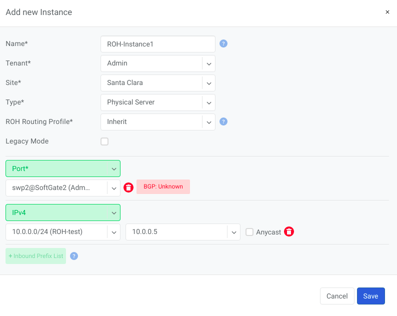
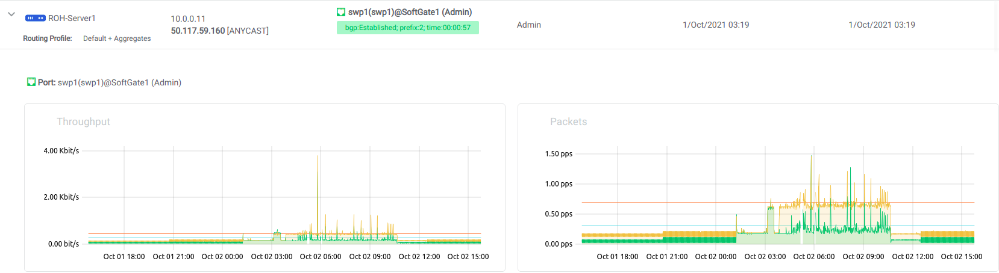

.. meta::
    :description: Routing on the Host

#########################
ROH (Routing on the Host)
#########################
To create more resilient and higher-performance data centers, some companies leverage the Linux ecosystem to run routing protocols directly on their servers. This is commonly known as ROH (Routing on the Host).

In ROH architectures, servers use a routing daemon to establish a BGP adjacency with the switch fabric on every physical link. ROH can run on bare metal servers, VMs, and even containers. The most commonly used routing daemon/suite is FRR.

Hosts connected to the network in ROH architecture don’t have IP addresses on a shared Ethernet segment; instead an IP address is configured on the loopback interface and advertised over all BGP links towards switch fabric. This is a modern and optimal design, leveraging Layer-3 networking from the fabric to the servers.

By using only Layer-3 interfaces, Layer-2 protocols such as Spanning Tree (STP) can be minized and the reliability of the network increases.

The ROH architecture that is configured by Netris allows for leveraging ECMP load balancing capabilities of the switching hardware for the high-performance server load balancing (described in L3 Load Balancer section). For each instance of ROH, you’ll need to create a ROH entry in Netris Controller.

Adding ROH Hosts
----------------

#. Navigate in the Netris UI to **Services→Instances (ROH)**
#. Click the **Add** button
#. Fill out the form based on the fields in the table below.
#. Click the **Add** button

Description of ROH instance fields:

- **Name** - Unique name for the ROH instance
- **Site** - Site where the current ROH instance belongs
- **Type** - Physical Server, for all servers forming a BGP adjacency directly with the switch fabric. Hypervisor, for using the hypervisor as an interim router. Proxmox is currently the only supported hypervisor.
- **ROH Routing Profile** - ROH Routing profile defines what set of routing prefixes to be advertised to ROH instances

  - **Default route only (most common design)** - Will advertise 0.0.0.0/0 + loopback address of the physically connected switch
  - **Default + Aggregate** - Will add prefixes of defined assignments + "Default" profile
  - **Full table** - Will advertise all prefixes available in the routing table of the connected switch
  - **Inherit** - Will inherit policy from site objects defined under Net→Sites

- **Legacy Mode** - Switch from default zero-config mode to using /30 IP addresses. Used for MSFT Windows Servers or other OS that doesn’t support FRR.
- **+Port** - Physical Switch Ports anywhere on the network. 
- **+IPv4** - IPv4 addresses for the loopback interface.
- **+Inbound Prefix List** - List of additional prefixes that the ROH server may advertise. Sometimes used to advertise container or VM networks.

.. tip:: Many switches can’t autodetect old 1Gbps ports. If attaching hosts with 1Gbps ports to 10Gpbs switch ports, you’ll need to change the speed for a given Switch Port from Auto(default) to 1Gbps. You can edit a port in Net→Switch Ports individually or in bulk.

   Example: Adding an ROH instance.  (Yes, you can use A.B.C.0/32 and A.B.C.255/32)

   Expanded view of ROH listing. BGP sessions are up, and the expected IP is in fact received from the actual ROH server. Traffic stats are available per port.
