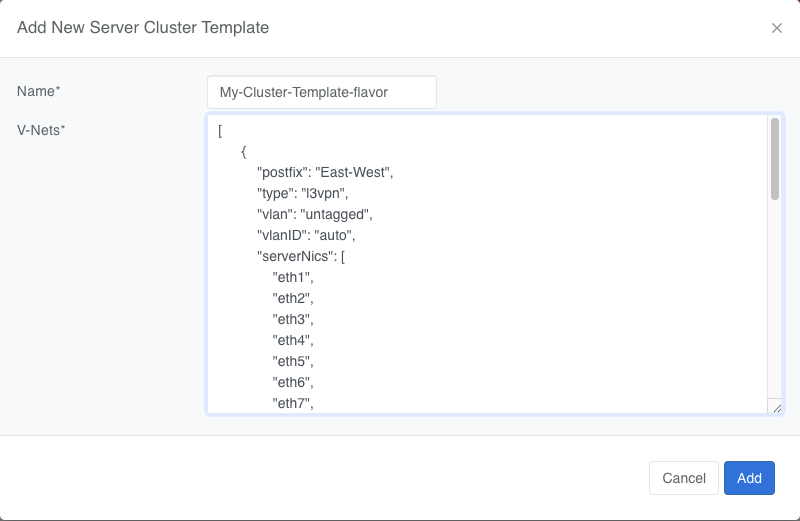
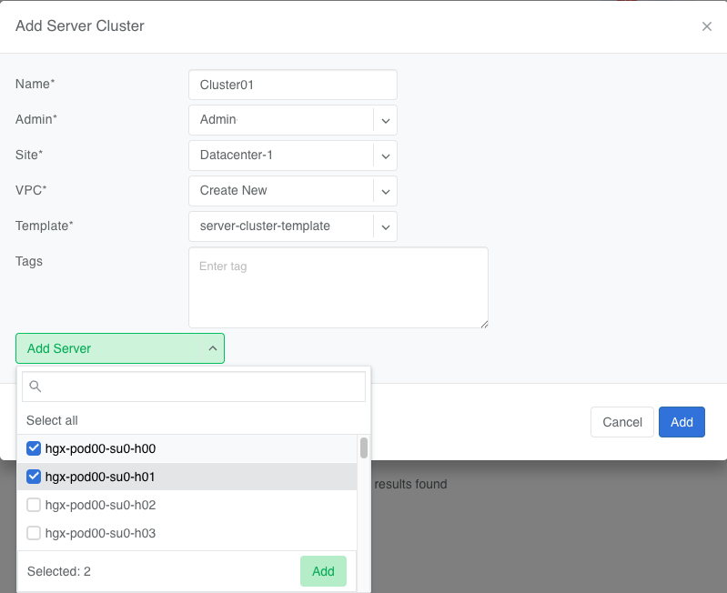
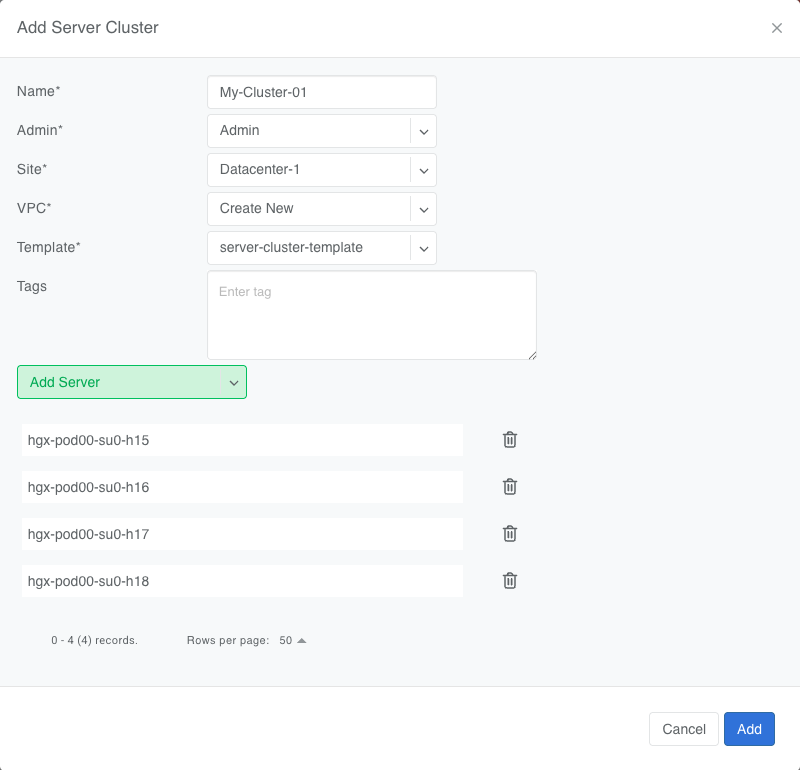

.. meta::
    :description: Server Cluster

==============
Server Cluster
==============

In the past, setting up servers in Netris required many steps. You had to go to different menus to create VPCs, assign IP addresses, and link switch ports one by one. This was slow and easy to get wrong.

The **Server Cluster** makes this much easier. It is a construct that lets you group servers together and assign them to a tenant or VPC.

You do this by creating a Server Cluster where you provide a list of server names and choose a Server Cluster Template. The template tells Netris which V-Net each server interface should belong to.

Then, based on a Server Cluster Template, Netris will:
- Set up the correct switch ports (front-end, back-end, InfiniBand)
- Apply VLANs, LAGs, InfiniBand PKeys, and other fabric-specific settings
- Create the right VPCs, VNets, and IP subnets

This means you don't have to configure each switch port by hand. Instead, you can focus on servers, and Netris will build the network for you.

This is helpful for cloud providers and AI infrastructure teams, who need to create isolated server environments quickly and safely.

The Template acts as a blueprint; the Server Cluster turns it into deployment. A network engineer defines the design once in the template, and from there, DevOps or infrastructure teams can deploy and scale server environments with full network consistency and minimal involvement from the networking team.

Server Cluster Template
=======================

Before a Server Cluster can be created, a Server Cluster Template must be defined.

Prior to the introduction of the Server Cluster and the Server Cluster Template the engineer was required to navigate to ``Network->VPC``, ``Network->IPAM``, and ``Services->V-Net`` sections and create the required Netris primitives by hand, then using the ``Network->Network Interfaces`` list switch ports for Netris to implement the necessary configurations.

With the introduction of the **Server Cluster Template** the **V-Nets**, **Allocations**, and **IP Subnet** primitives are defined in the template. You can more information about these primitives in the :doc:`V-Net </vnet>` and :doc:`IP Address Management </ipam>` documentation.

Notes:
-----------------

- This functionality assumes that server NIC names are consistent across all servers in the cluster. For example, if eth1 is used for east-west traffic on one server, it should be the same on all other servers in that cluster.

Server Cluster Template Examples:
--------------------------

Ethernet-only Fabric Example

.. code-block:: shell-session

  {
    "name": "ethernet-only-fabric-template",
    "vnets": [
      {
        "postfix": "mgmt",
        "type": "l2vpn",
        "vlan": "untagged",
        "vlanID": "auto",
        "serverNics": ["eth0"],
        "ipv4DhcpEnabled": true
      },{
        "postfix": "N-S-and-storage",
        "type": "l2vpn",
        "vlan": "untagged",
        "vlanID": "auto",
        "serverNics": ["eth1", "eth2"],
        "ipv4Gateway": "192.168.10.254/24"
      },
      {
        "postfix": "E-W-backend",
        "type": "l3vpn",
        "vlan": "untagged",
        "vlanID": "auto",
        "serverNics": ["eth3", "eth4"],
        "ipv4Gateway": {
          "assignType": "auto",
          "allocation": "10.10.0.0/16",
          "childSubnetPrefixLength": 24,
          "hostnum": 1
        }
      }
    ]
  }

Infiniband Fabric Example

.. code-block:: shell-session

  {
    "name": "infini-band-template",
    "vnets": [
      {
        "postfix": "mgmt",
        "type": "l2vpn",
        "vlan": "untagged",
        "vlanID": "auto",
        "serverNics": ["eth0"],
        "ipv4DhcpEnabled": true
      },
      {
        "postfix": "N-S-and-storage",
        "type": "l3vpn",
        "vlan": "untagged",
        "vlanID": "auto",
        "serverNics": ["eth1", "eth2"],
        "ipv4Gateway": "192.168.100.1/24"
      },
      {
        "postfix": "E-W-backend",
        "type": "infiniband",
        "pkey": "auto",
        "serverNics": ["ib0", "ib1"]
      }
    ]
  }

Nvidia UFM Example

.. code-block:: shell-session

  {
    "name": "Nvidia-ufm-template",
    "vnets": [
      {
        "postfix": "mgmt",
        "type": "l2vpn",
        "vlan": "untagged",
        "vlanID": "auto",
        "serverNics": ["eth0"],
        "ipv4DhcpEnabled": true
      },
      {
        "postfix": "N-S-and-storage",
        "type": "l3vpn",
        "vlan": "untagged",
        "vlanID": "auto",
        "serverNics": ["eth1", "eth2"],
        "ipv4Gateway": "192.168.20.1/24"
      },
      {
        "postfix": "E-W-backend",
        "type": "netris-ufm",
        "ufm": "ufm-88",
        "pkey": "auto"
      }
    ]
  }

Template Fields Explained:
--------------------------

Typically, a Server Cluster Template is made up of just two key-value pairs:

- **Name**: A descriptive name for the template.

- **Vnets**: A JSON array defining the V-Nets to be created for each server in the cluster. Each object in the array includes:

  - **postfix**: A string appended to the server cluster name to form the V-Net name.
  - **type**: A string specifying the type of V-Net (l2vpn, l3vpn, infiniband, netris-ufm).
  - **vlan**: A string specifying whether the V-Net is tagged or untagged.
  - **vlanID**: A sring specifying the VLAN ID. Only `auto` is permitted at this time.
  - **serverNics**: An array of NIC names on the server that will be associated with this V-Net.
  - **ipv4Gateway** (optional): A string specifying the IPv4 gateway for the V-Net, or "specify" to force the operator to enter the gateway explicity at cluster creation, or an object (see Advanced Uses) with the following properties:

    - **assignType**: A string indicating the type of assignment ('auto', 'static').
    - **allocation**: A string specifying the IPv4 address allocation, a supernet from which the child subnets will be derived.
    - **childSubnetPrefixLength**: An integer specifying the prefix length for child subnets.
    - **hostnum**: An integer specifying the host number for the gateway.

  - **ipv4DhcpEnabled** (optional): Boolean to enable/disable DHCP for IPv4.
  - **ipv6Gateway** (optional): A string specifying the IPv6 gateway for the V-Net.
  - **Ufm** (optional): UFM settings for type "netris-ufm". See UFM documentation for details.
  - **Pkey** (optional): Pkey settings for type "netris-ufm". See UFM documentation for details.

- **ID**: A unique identifier for the template, typically auto-generated and is not exposed to the user.

Adding a Server Cluster Template
--------------------------------

To define a Server Cluster Template in the web console, navigate to ``Services->Server Cluster Template`` - click ``+Add``, give the template a descriptive name like 'GPU-Cluster-Template'. Enter JSON style configuration defining V-Nets and which server NICs must be placed into these V-Nets.

.. raw:: html

   

Note that when using the UI, the JSON configuration shall only include the 'vnets' array, as the 'name' field is provided separately in the form. The 'id' field is auto-generated and should not be included in the UI input.

Advanced Uses
----------------

Non-overlapping subnets
~~~~~~~~~~~~~~~~~~~~~~~

While Netris fully supports overlapping IP addresses across multiple tenants and VPCs, some use cases such as shared storage access or external network integrations, may require globally unique subnets for north-south connectivity. In these cases, you can configure Netris to automatically allocate non-overlapping subnets from a larger pool, ensuring compatibility with such constraints.

This is done by specifying the **allocation** field in the **ipv4Gateway** or **ipv6Gateway** objects and providing a supernet from which child subnets will be derived. This approach ensures that the IP addresses assigned to each V-Net do not overlap.

For IPv4 and IPv6 gateways, you can specify an object with the following properties:

.. code-block:: shell-session

  [
    {
        "postfix": "N-S-and-storage",
        "type": "l2vpn",
        "vlan": "untagged",
        "vlanID": "auto",
        "serverNics": [
            "eth9",
            "eth10"
        ],
        "ipv4Gateway": {
            "assignType": "auto",
            "allocation": "10.0.0.0/16",
            "childSubnetPrefixLength": 24,
            "hostnum": 1
        }
    },
    {
        "postfix": "E-W-backend",
        "type": "l2vpn",
        "vlan": "untagged",
        "vlanID": "auto",
        "serverNics": [
            "eth7",
            "eth8"
        ],
        "ipv4Gateway": {
            "assignType": "auto",
            "allocation": "192.168.0.0/16",
            "childSubnetPrefixLength": 24,
            "hostnum": 254
        },
        "ipv4DhcpEnabled": true
    },
    {
        "postfix": "OOB",
        "type": "l2vpn",
        "vlan": "untagged",
        "vlanID": "auto",
        "serverNics": [
            "eth9",
            "eth10"
        ],
        "ipv4Gateway": "192.168.0.254/24",
        "ipv4DhcpEnabled": true
    }
  ]

Specify gateway
~~~~~~~~~~~~~~~~~~~~~~

In some environments, IP address management is handled entirely outside of Netris by a customer-owned IPAM system or provisioning portal. In these cases, Netris cannot automatically assign subnets or gateways. Instead, the correct gateway address must be specified manually at the time of Server Cluster creation by setting ``ipv4Gateway`` (or ``ipv6Gateway``) to ``"specify"``. Doing so will force Netris to prompt for the exact gateway address at the time of defining the cluster. This enables seamless integration with external IPAM workflows while still leveraging Netris for declarative network provisioning.

.. code-block:: shell-session

  [
    {
        "postfix": "UFM8",
        "type": "netris-ufm",
        "ufm": "ufm-88",
        "pkey": "auto"
    },
    {
        "postfix": "L3VPN",
        "type": "l3vpn",
        "vlan": "untagged",
        "vlanID": "auto",
        "serverNics": [
            "eth1",
            "eth2"
        ]
    },
    {
        "postfix": "NS",
        "type": "l2vpn",
        "vlan": "untagged",
        "vlanID": "auto",
        "serverNics": [
            "eth11",
            "eth12"
        ],
        "ipv4Gateway": "specify",
        "ipv4DhcpEnabled": true
    },
    {
        "postfix": "EW",
        "type": "l2vpn",
        "vlan": "untagged",
        "vlanID": "auto",
        "serverNics": [
            "eth9",
            "eth10"
        ],
        "ipv4Gateway": "specify",
        "ipv4DhcpEnabled": true
    }
  ]

Server Cluster
==============

With a Server Cluster Template defined, a Server Cluster can be instantiated by referencing that template and specifying a list of servers. This operation triggers the creation of network primitives—such as V-Nets, IP subnets, Pkeys and other InfiniBand based on the template's definitions.

A Server Cluster Template serves as a reusable design blueprint. It defines how servers are connected to the fabric, but it doesn't provision any actual resources on its own. In practice, cloud service provider (CSP) admins typically create one or more templates to reflect common deployment patterns. Then day-to-day operations revolve around creating, editing, or deleting Server Clusters. Usually one or more clusters per tenant with each cluster triggering the actual provisioning of VPCs, V-Nets, and switch port configurations based on the selected template.

Adding a Server Cluster
-----------------------

To define a Server CLuster navigate to ``Services->Server Cluster`` and click ``+Add``. Give the new cluster a name, set Admin to the appropriate tenant (this defines who can edit/delete this cluster), set the site, set VPC to 'create new', select the Template created earlier, and click ``+Add server`` to start selecting server members. Click ``Add``.

.. raw:: html

   

When you click the blue ``Add`` button, Netris will create the VPC, V-Nets, and IP subnets as defined in the template. It will also configure the switch ports for each server based on the NIC names specified in the template.

For every cluster Netris will create a new VPC, V-Nets, assign IP subnets. To add servers into an existing V-Net you should edit an existing cluster and add servers to it.

.. raw:: html

   

- VPC creation is only automatic when 'create new' is selected. If an existing VPC is chosen, the system will not create a new VPC, and it is assumed that the selected VPC already contains the necessary network constructs.
- After creation, the template, VPC, and site fields are locked. Servers may be added or removed, but only if their NIC layout matches the template.
- When deleting a cluster, users may choose to retain or delete the associated VPC. If the VPC is still used by other resources, it will not be removed.
- To avoid misconfiguration, all servers in a cluster must share identical NIC names and counts. Templates assume symmetry; mismatched layouts will be rejected.
- Shared endpoints must not be listed as exclusive members in any cluster. The system enforces this exclusivity to prevent configuration conflicts.

Shared Endpoints
----------------

In most cases, servers in a cluster are exclusively assigned. Each physical server belongs to one server cluster and is provisioned for a single tenant.

However, certain infrastructure components, such as hypervisors or shared storage nodes, may need to serve multiple tenants simultaneously. In such cases, these endpoints must participate in more than one server cluster.

To support this need, Netris allows administrators to designate specific endpoints as shared. A shared endpoint may be assigned to multiple server clusters, making it possible for virtualized workloads running on shared infrastructure (e.g., VMs or shared storage) to be exposed across tenant boundaries.

Designating an endpoint as shared changes how the associated switch port is provisioned. Netris automatically configures the switch port in tagged mode, or the functional equivalent in environments such as InfiniBand or NVLink. In essence:

Shared endpoint = Tagged switch port

This is the primary behavioral change triggered by marking an endpoint as shared.

Server Clusters do not automatically follow where virtual machines move. You must make sure all the right hypervisors are added to the correct Server Cluster ahead of time. If VM1 can migrate between HostA and HostB, both must be in the Server Cluster.

.. Note::
  Shared endpoints cannot be used as exclusive endpoints and vice versa.

Additionally, Netris does not manage of influence the internal networking configurations of hypervisors or shared storage nodes. The responsibility for ensuring that virtual machines or storage services are correctly networked within their respective environments lies with the orchestrator or cloud operator.

Server Cluster Fields Explained:
--------------------------------

- **Name**: A descriptive name for the server cluster.
- **Admin**: The tenant that administers this server cluster.
- **Site**: The site where the server cluster is located.
- **VPC**: The VPC to which the server cluster belongs. Typically set to 'create new' to generate a new VPC.
- **Template**: The Server Cluster Template that defines the network configuration for this cluster.
- **Servers**: An array of server names that are exclusive members of this cluster.
- **SharedEndpoints**: An array of server names that are shared members of this cluster.

Server Cluster JSON Example
--------------------------------

In this example, we are creating a Server Cluster named 'My-Cluster-01' in Site-1, using the previously defined template 'My-Cluster-Template-flavor'. The cluster includes five servers for compute workloads and five servers designated for shared endpoints.

.. code-block:: shell-session

  {
    "name": "My-Cluster-01",
    "admin": "tenant-a",
    "site": "Site-1",
    "vpc": "create new",
    "template": "My-Cluster-Template-flavor",
    "servers": [
        "server-01",
        "server-02",
        "server-03",
        "server-04",
        "server-05"
    ]
    "SharedEndpoints": [
        "server-10",
        "server-11",
        "server-12",
        "server-13",
        "server-15"
    ]
  }

Best Practices
===============

- Use descriptive names for templates and clusters to convey their purpose.
- Maintain consistent NIC naming conventions across servers in a cluster.
- Double-check NIC layouts before adding servers to ensure compatibility with the template.

