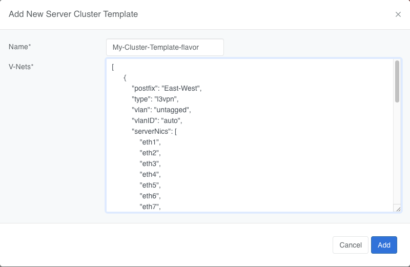
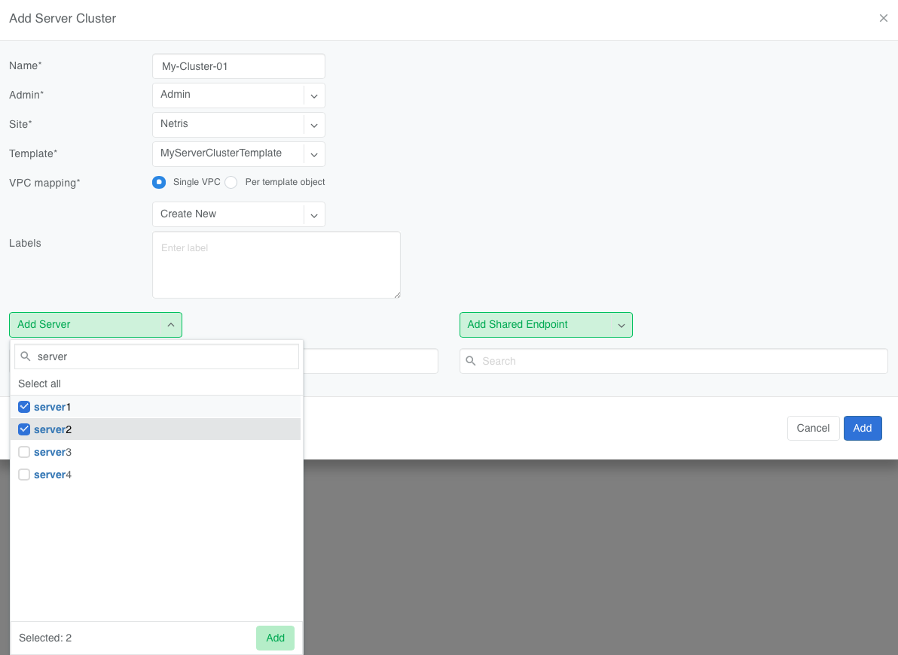
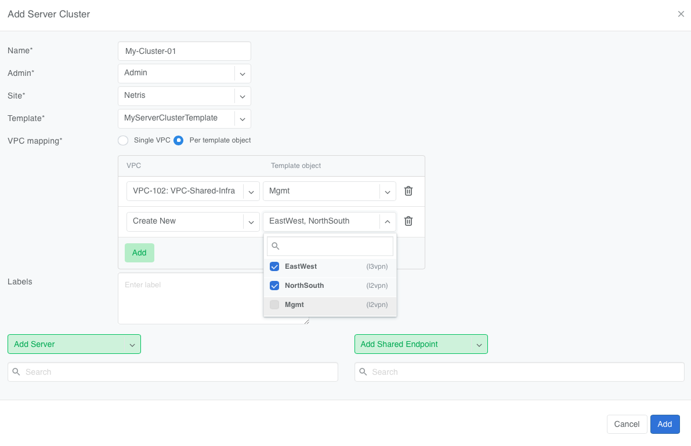
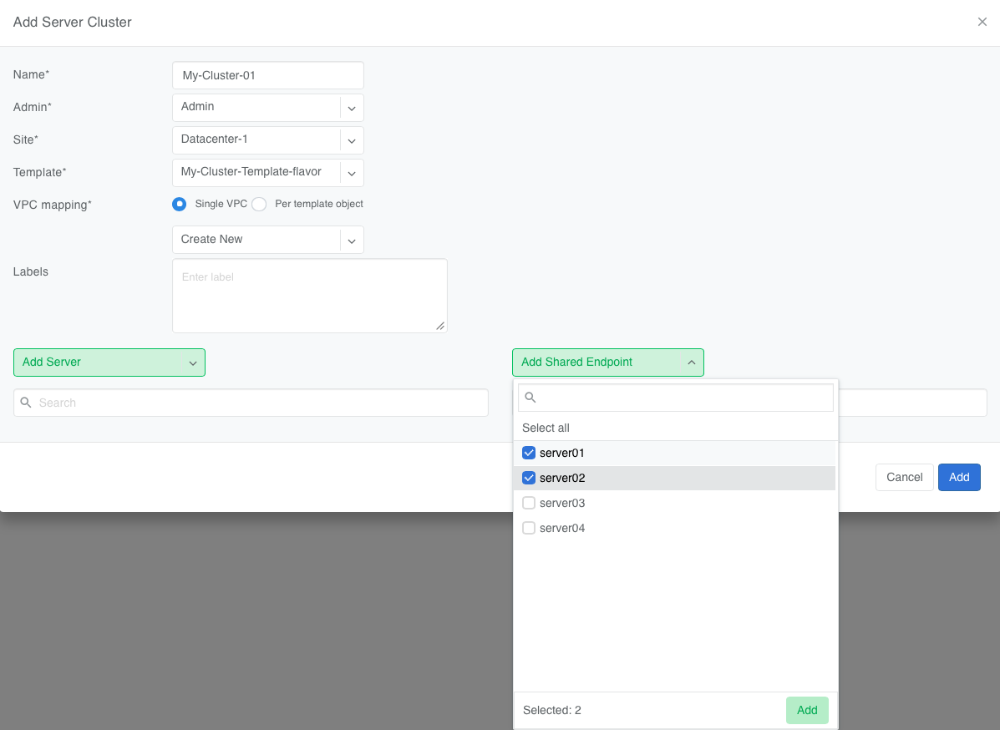
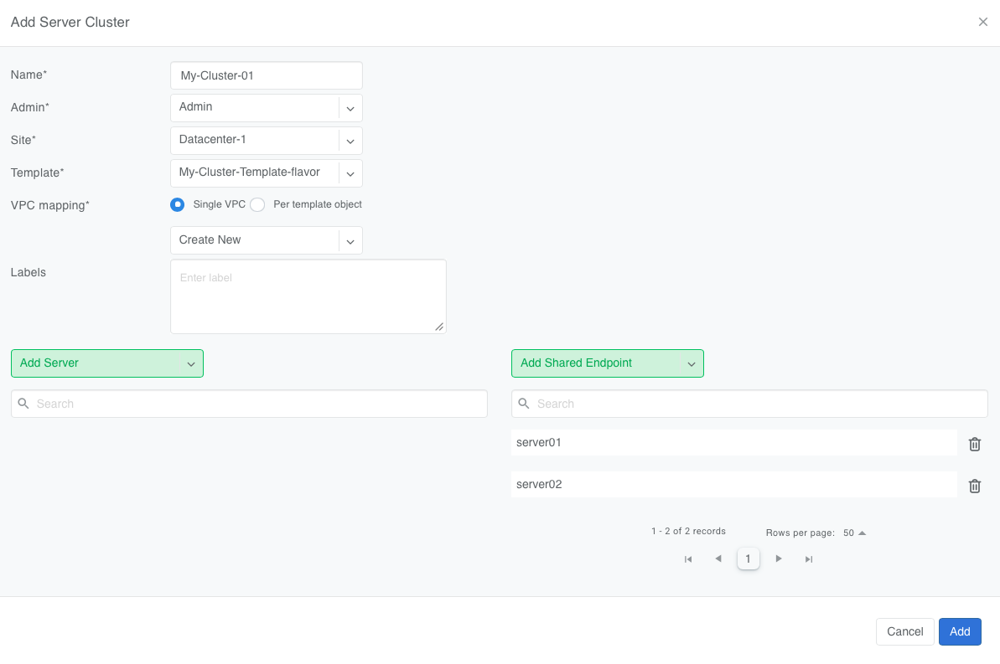

.. meta::
    :description: Server Cluster

==============
Server Cluster
==============

.. contents:: Table of Contents
   :depth: 3
   :local:

Introduction
============

Netris **Server Cluster** makes it possible to define network boundaries by referencing a list of compute or storage nodes (Netris Server objects).

Behind the scenes, Netris figures out which VXLANs, VLANs, Pkeys, and NVLink partitions, when appropriate to configure for every appropriate switch and switch port. The Server Cluster object will also create the underlying V-Net, VPC, and other Netris objects.

This helps infrastructure operators create, edit, and delete network boundaries by focusing only on the list of servers and not worrying about switch ports, GUIDs, GPU UIDs, or any other implementation details.

Server Cluster Template
=======================

A Server Cluster Template is a JSON array of V-Nets to create, their types, and server NICs to be assigned to these V-Nets. The template must be defined before a Server Cluster can be created.

In a Server Cluster Template you define:

- What V-Nets to create and their types (VXLAN, VLAN, UFM, NVLink, and others)
- What subnets to assign to each these V-Nets, when applicable
- Which server NICs map to these V-Nets (for Ethernet-based V-Nets only)
- Other applicable settings specific to Ethernet, InfiniBand, and NVLink fabrics

You can find more information about these primitives in the :doc:`V-Net </vnet>` and :doc:`IP Address Management </ipam>` Netris documentation.

Based on a Server Cluster Template, Netris will:

- Create VPCs, V-Nets, and IP allocations and subnets
- Look up and configure the correct switch ports (front-end, back-end, management)
- Apply VXLANs, VLANs, LAGs, InfiniBand PKeys, NVLink partitions, and other network configurations

Here are several template examples followed by detailed descriptions of every field.

.. warning::
   For l3vpn type to function properly, the /31 links' addresses must be prepopulated. This is best done with Terraform during the server onboarding phase. See :doc:`Netris Terraform Provider </terraform-integration>` for details.

Server Cluster Template Examples:
---------------------------------

Ethernet-only Fabric Example
~~~~~~~~~~~~~~~~~~~~~~~~~~~~~~

This example is common for AI fabrics where both Frontend (North-South) and Backend (East-West) networks are based on Ethernet. A Server Cluster referenced to this template will create two L2VPN VXLAN V-Nets and one L3VPN VXLAN V-Net. V-Net names will start with the name of the server cluster and end with the value of each `postfix` attribute.

.. code-block:: shell-session

  [
    {
      "postfix": "E-W",
      "type": "l3vpn",
      "vlan": "untagged",
      "vlanID": "auto",
      "ipFamily": "dual",
      "serverNics": [
        "eth3",
        "eth4"
      ]
    },
    {
      "postfix": "N-S",
      "type": "l2vpn",
      "vlan": "untagged",
      "vlanID": "auto",
      "serverNics": [
        "eth1",
        "eth2"
      ],
      "ipv4Gateway": "192.168.10.254/24",
      "ipFamily": "ipv4",
      "ipv4DhcpEnabled": true
    },
    {
      "postfix": "mgmt",
      "type": "l2vpn",
      "vlan": "untagged",
      "vlanID": "auto",
      "serverNics": [
        "eth0"
      ],
      "ipFamily": "ipv4",
      "ipv4Gateway": {
        "assignType": "auto",
        "allocation": "10.10.0.0/16",
        "childSubnetPrefixLength": 24,
        "hostnum": 1
      }
    }
  ]

.. _infiniband-fabric-example:

Infiniband Fabric Example
~~~~~~~~~~~~~~~~~~~~~~~~~

This example is common for AI fabrics where the frontend is based on Ethernet and the backend is based on InfiniBand. A Server Cluster referencing this template will create two L2VPN type VXLAN V-Nets and will automatically configure the Ethernet switches, and will configure one PKey with appropriate GUIDs in the NVIDIA UFM (Infiniband controller).

.. code-block:: shell-session

  [
    {
      "postfix": "E-W",
      "type": "netris-ufm",
      "ufm": "ufm-88",
      "pkey": "auto"
    },
    {
      "postfix": "N-S",
      "type": "l2vpn",
      "vlan": "untagged",
      "vlanID": "auto",
      "ipFamily": "dual",
      "serverNics": [
        "eth9",
        "eth10"
      ],
      "ipv4Gateway": "10.0.0.1/24",
      "ipv4DhcpEnabled": true
    },
    {
      "postfix": "mgmt",
      "type": "l2vpn",
      "vlan": "untagged",
      "vlanID": "auto",
      "serverNics": [
        "eth11"
      ],
      "ipFamily": "ipv4",
      "ipv4Gateway": "192.168.100.1/24",
      "ipv4DhcpEnabled": true
    }
  ]

.. tip::
   If your deployment includes more than one InfiniBand fabric (e.g., East-West GPU-to-GPU fabric and a dedicated InifiBand-based storage fabric) you can include multiple stanzas with "type":"netris-ufm". See :doc:`Netris UFM documentation </netris-ufm-integration>` for more details.

You can find more details about NVIDIA UFM (InfiniBand) integration in :doc:`Netris UFM documentation </netris-ufm-integration>`.

.. _nvlink-fabric-example:

NVLink (NVL72 or NVL144) Fabric Example
~~~~~~~~~~~~~~~~~~~~~~~~~~~~~~~~~~~~~~~~~~~

In systems where NVLink Multi-Node fabric is present, Netris can be configured to automatically create GPU partitions within the appropriate NVL72 or NVL144 NVLink domain.

.. code-block:: shell-session

  [
      {
        "postfix": "E-W",
        "type": "netris-ufm",
        "ufm": "ufm-88",
        "pkey": "auto"
      },
      {
        "postfix": "NVL",
        "type": "netris-nvlink",
        "partition": "auto"
      },
      {
        "postfix": "N-S",
        "type": "l2vpn",
        "vlan": "untagged",
        "vlanID": "auto",
        "ipFamily": "dual",
        "serverNics": [
          "eth9",
          "eth10"
        ],
        "ipv4Gateway": "10.0.0.1/24",
        "ipv4DhcpEnabled": true
      },
      {
        "postfix": "mgmt",
        "type": "l2vpn",
        "vlan": "untagged",
        "vlanID": "auto",
        "serverNics": [
          "eth11"
        ],
        "ipFamily": "dual",
        "ipv4Gateway": "192.168.100.1/24",
        "ipv4DhcpEnabled": true
      }    
    ]

You can find more detail about the NVIDIA NMX-C (NVLink Multi-Node / NVL72 / NVL144) integration in :doc:`NMX-C (NVLink) Integration Plugin for Netris Controller </netris-nvlink-integration>`.

IPv6 Example
~~~~~~~~~~~~~~~~~~~~~~~~~~~~~~~

IPv6 is fully supported in Netris. This example showcases how to optionally enable IPv6 on any V-Net segment of the Server Cluster Template.

.. code-block:: shell-session

  [
    {
      "postfix": "E-W",
      "serverNics": [
        "eth1",
        "eth2",
        "eth3",
        "eth4",
        "eth5",
        "eth6",
        "eth7",
        "eth8"
      ],
      "type": "l3vpn",
      "vlan": "untagged",
      "vlanID": "auto",
      "ipFamily": "ipv6"
    },
    {
      "postfix": "N-S",
      "serverNics": [
        "eth9",
        "eth10"
      ],
      "type": "l2vpn",
      "vlan": "untagged",
      "vlanID": "auto",
      "ipFamily": "ipv6",
      "ipv6Gateway": "2001:db8:1::1/64"
    },
    {
      "postfix": "OOB-MGMT",
      "serverNics": [
        "eth11"
      ],
      "type": "l2vpn",
      "vlan": "untagged",
      "vlanID": "auto",
      "ipFamily": "ipv6",
      "ipv6Gateway": {
        "assignType": "auto",
        "allocation": "2001:DB8::/32",
        "childSubnetPrefixLength": 64,
        "hostnum": 1
      }
    }
  ]

Template Fields Explained:
--------------------------

Each object in the **Vnets** JSON array may include a combination of the following key-value pairs

  - **postfix**: A string appended to the server cluster name to form the V-Net name.
  - **type**: A string specifying the type of V-Net (`l2vpn`, `l3vpn`, `netris-ufm`, `netris-nvlink`).
  - **vlan**: A string specifying whether the V-Net is `tagged` or `untagged`. Only `untagged` is permitted at this time.
  - **vlanID**: A string specifying the VLAN ID. Accepts `auto` or `specify`.

    - Use `auto` to instruct Netris to automatically assign a new VLAN ID.
    - Use `specify` to require the operator to enter the VLAN ID explicitly at cluster creation.
  - **ipFamily**: A string specifying the IP family for the V-Net (`ipv4`, `ipv6`, or `dual`).
  - **serverNics**: An array of Netris server NIC names on the server that will be associated with this V-Net.
  - **ipv4Gateway**: When `type:l2vpn` one of the following values:

    - A string specifying the IPv4 gateway for V-Net in CIDR notation
    - A string `specify` to force the operator to enter the gateway explicitly at cluster creation
    - an object (see :ref:`advanced-uses`) with the following properties: **assignType** (only `auto` is permitted at this time), **allocation** (the IPv4 address allocation, a supernet from which the child subnets will be derived), **childSubnetPrefixLength** (the prefix length for child subnets), and **hostnum** (the host number for the gateway).

  - **ipv4DhcpEnabled**: A boolean to enable/disable DHCP for IPv4.
  - **ipv6Gateway**: When `type:l2vpn` one of the following values:

    - A string specifying the IPv6 gateway for V-Net in CIDR notation
    - A string `specify` to force the operator to enter the gateway explicitly at cluster creation
    - an object (see :ref:`advanced-uses`) with the same **assignType**, **allocation**, **childSubnetPrefixLength**, and **hostnum** properties as above (IPv6-scoped).

  - **Ufm**: Nvidia UFM controller identifier (`ufm_id`) for V-Net `type:netris-ufm`. See :doc:`Netris UFM documentation </netris-ufm-integration>` for details.
  - **Pkey**: Pkey settings when V-Net `type:netris-ufm`. Only `auto` is permitted at this time.
  - **partition**: NVLink partition settings when V-Net `type:netris-nvlink`. Only `auto` is permitted at this time.

.. list-table:: V-Net Key/Value Requirements by Type
   :header-rows: 1

   * - Field
     - type: l2vpn
     - type: l3vpn
     - type: netris-ufm
     - type: netris-nvlink
   * - `postfix`
     - ✅ required
     - ✅ required
     - ✅ required
     - ✅ required
   * - `type`
     - ✅ required
     - ✅ required
     - ✅ required
     - ✅ required
   * - `vlan`
     - ✅ (must be "untagged")
     - ✅ (must be "untagged")
     - ❌
     - ❌
   * - `vlanID`
     - ✅ required
     - ✅ (`auto` only)
     - ❌
     - ❌
   * - `ipFamily`
     - optional (defaults to `dual`)
     - optional (defaults to `dual`)
     - ❌
     - ❌
   * - `serverNics`
     - ✅ required
     - ✅ required
     - ❌
     - ❌
   * - `ipv4Gateway`
     - optional
     - ❌
     - ❌
     - ❌
   * - `ipv4DhcpEnabled`
     - optional (requires `ipv4Gateway`)
     - ❌
     - ❌
     - ❌
   * - `ipv6Gateway`
     - optional
     - ❌
     - ❌
     - ❌
   * - `ufm`
     - ❌
     - ❌
     - ✅ required
     - ❌
   * - `pkey`
     - ❌
     - ❌
     - ✅ (`auto` only)
     - ❌
   * - `partition`
     - ❌
     - ❌
     - ❌
     - ✅ (`auto` only)

Adding a Server Cluster Template
--------------------------------

To define a Server Cluster Template in the web console, navigate to ``Services->Server Cluster Template``, click ``+Add``, give the template a descriptive name like 'GPU-Cluster-Template'. Enter V-Nets, their configuration parameters, and which server NICs must be placed into these V-Nets as a JSON array.

.. raw:: html

   

.. _advanced-uses:

Advanced Uses
----------------

Non-overlapping subnets
~~~~~~~~~~~~~~~~~~~~~~~

Netris fully supports overlapping IP addresses across VPCs, but some use cases such as shared storage access or external network integrations, may require globally unique subnets for the North-South (Frontend) fabric. In these cases, you can configure Netris to automatically allocate non-overlapping subnets from a larger pool, ensuring compatibility with such constraints.

This is done by specifying the `allocation` key in the `ipv4Gateway` or `ipv6Gateway` object and providing a supernet from which child subnets will be derived. This approach ensures that the IP addresses assigned to each V-Net do not overlap.

.. code-block:: shell-session

  [
    {
      "postfix": "E-W",
      "type": "l2vpn",
      "vlan": "untagged",
      "vlanID": "auto",
      "ipFamily": "ipv6",
      "serverNics": [
        "eth7",
        "eth8"
      ],
      "ipv6Gateway": {
        "assignType": "auto",
        "allocation": "2001:DB8::/32",
        "childSubnetPrefixLength": 64,
        "hostnum": 1
      }
    },
    {
      "postfix": "N-S",
      "type": "l2vpn",
      "vlan": "untagged",
      "vlanID": "auto",
      "ipFamily": "ipv4",
      "serverNics": [
        "eth9",
        "eth10"
      ],
      "ipv4Gateway": {
        "assignType": "auto",
        "allocation": "10.0.0.0/16",
        "childSubnetPrefixLength": 24,
        "hostnum": 1
      },
      "ipv4DhcpEnabled": true
    },
    {
      "postfix": "OOB",
      "type": "l2vpn",
      "vlan": "untagged",
      "vlanID": "auto",
      "ipFamily": "ipv4",
      "serverNics": [
        "eth11"
      ],
      "ipv4Gateway": "192.168.0.254/24",
      "ipv4DhcpEnabled": true
    }
  ]

Specify gateway
~~~~~~~~~~~~~~~~~~~~~~

In case you want to specify the IP gateway manually when creating a Server Cluster object, you can indicate this in the Server Cluster Template by setting the `ipv4Gateway` (or `ipv6Gateway`) key to `specify` . Netris will prompt for the exact gateway address at the time of defining the cluster and will infer the subnet address to be assigned to the V-Net.

.. code-block:: shell-session

  [
    {
      "postfix": "UFM8-E-W",
      "type": "netris-ufm",
      "ufm": "ufm-88",
      "pkey": "auto"
    },
    {
      "postfix": "N-S",
      "type": "l2vpn",
      "vlan": "untagged",
      "vlanID": "auto",
      "serverNics": [
        "eth9",
        "eth10"
      ],
      "ipFamily": "dual",
      "ipv4Gateway": "specify",
      "ipv6Gateway": "specify"
    },
    {
      "postfix": "OOB-MGMT",
      "type": "l2vpn",
      "vlan": "untagged",
      "vlanID": "auto",
      "ipFamily": "dual",
      "serverNics": [
        "eth11"
      ],
      "ipv4Gateway": "specify",
      "ipv6Gateway": "specify"
    }
  ]

.. _creating-server-cluster:

Creating Server Cluster
=======================

With templates defined, you can create Server Clusters by referencing these templates and specifying a list of servers. This operation triggers the creation of the applicable network primitives such as V-Nets, IP subnets, Pkeys and other InfiniBand primitives based on the template's definitions.

Adding a Server Cluster
-----------------------

To define a Server Cluster, navigate to ``Services->Server Cluster`` and click ``+Add``. Give the new cluster a name, set Admin to the appropriate owner (this defines who can edit/delete this cluster and only servers already assigned to this owner will be available for selection), set the site, set VPC to "Create New", select the Template created earlier, and click ``+Add Server`` or ``+Add Shared Server`` to start selecting server members. Click Add.

.. raw:: html

   
<em>Figure: Adding a server cluster with a single VPC</em>

When you click the blue ``Add`` button, Netris will create the VPC, V-Nets, and IP subnets as defined in the template. It will also configure the switch ports for each server based on the NIC names specified in the template.

.. note::

  - A VPC will be created automatically when "Create New" is selected.
  - After creation, the template, the VPC, and the site fields are locked.
  - The same Netris NIC name must be used consistently across all server objects in a cluster. For example, when eth10 is assigned to a V-Net in the template, Netris will assign every switch port that corresponds to every server's eth10 to the same  V-Net throughout the server cluster.

In some architectures you may want to assign some V-Nets to one VPC, while assigning others to another VPC when creating a Server Cluster. A typical use case might be assigning East-West and North-South scoped V-Nets to a new dedicated VPC, while assigning the management V-Net to an existing management VPC. Alternatively, you can use Labels to achieve a similar outcome as described :doc:`here <labels>`.

To assign the templated V-Nets to different VPCs at the time of Server Cluster creation, select ``Per template object`` under the VPC mapping option and select an existing VPC or create a new VPC for each V-Net specified in the template.

To assign multiple V-Nets to the same VPC, select them together as shown on the screenshot below.

.. raw:: html

   
<em>Figure: Adding a server cluster with multiple VPCs</em>

.. note::

  In the screenshot above the Mgmt V-Net will be added to the existing VPC-102 (Shared-infra), while one new VPC will be created with the EastWest and the NorthSouth V-Nets assigned to it.

.. _server-cluster-shared-endpoints:

Shared Endpoints
----------------

Typically, each physical server is dedicated to one server cluster and is provisioned for a single VPC.

However, certain infrastructure components, such as hypervisors or shared storage nodes, may need to serve multiple VPCs simultaneously. In such cases, these endpoints must participate in more than one server cluster.

To support this, Netris allows administrators to designate specific endpoints as shared. A shared endpoint may be assigned to multiple server clusters, making it possible for Hypervisors, Storage, or other shared resources to be exposed across multiple VPCs.

.. raw:: html

   
<em>Figure. Selecting servers as shared endpoints</em>

.. raw:: html

   
<em>Figure. Server01 and server02 are added to th My-Cluster-01 server cluster as shared endpoints</em>

Designating an endpoint as shared changes how the associated switch port is provisioned. On Ethernet, Netris configures the switch port as 802.1Q tagged rather than untagged. On InfiniBand, Netris sets the equivalent by adding the server's GUIDs to the PKey with ``index0=false``.

In essence: Shared endpoint = 802.1Q tagged switch port.

This is the primary behavioral change triggered by marking an endpoint as shared.

.. note::

  - Ensure every hypervisor in the VM mobility scope is included in the server cluster.
  - Ensure host networking is appropriately configured to work in a shared use case.
  - `type:l3vpn` is silently ignored.
  - `vlan` key is silently ignored.

Shared and dedicated endpoints across fabrics
~~~~~~~~~~~~~~~~~~~~~~~~~~~~~~~~~~~~~~~~~~~~~

.. list-table::
   :header-rows: 1

   * - Fabric
     - Dedicated member
     - Shared member
   * - Ethernet
     - Untagged (native VLAN) switch port
     - 802.1Q tagged switch port
   * - InfiniBand
     - GUID added to the PKey with ``index0=true``
     - GUID added to the PKey with ``index0=false``
   * - NVLink (NVL72 / NVL144)
     - Not applicable — the distinction applies to Ethernet and InfiniBand fabrics
     - Not applicable — the distinction applies to Ethernet and InfiniBand fabrics

On InfiniBand the distinction is expressed through PKey membership rather than VLAN tagging. A GUID can hold ``index0=true`` membership in one PKey, which is what a dedicated member uses, and ``index0=false`` membership in any number of PKeys, which is what makes a node shared. The UFM UI renders ``index0=true`` as Index-0 enabled.

When ``index0=false``, additional server-side configuration is required and is under the control of your compute orchestrator.

A server can be added to a Server Cluster as a shared member directly, whether or not it is a dedicated member of another cluster.

See :doc:`NVIDIA UFM (InfiniBand) Integration </netris-ufm-integration>` and :doc:`NMX-C (NVLink) Integration </netris-nvlink-integration>` for fabric-specific detail.

Untagged VLAN on Shared Endpoints
~~~~~~~~~~~~~~~~~~~~~~~~~~~~~~~~~

In some cases, you may need to have an untagged VLAN on a switch port with a shared endpoint. For example, some storage solutions require an untagged VLAN for internal communication.

To enable this, a node can be added to one cluster as a dedicated member (e.g., to use native/untagged VLAN or its InfiniBand/NVLink equivalent). That same node can be added to any number of other clusters as a shared member, as long as it's not the same cluster where it is already dedicated. A node cannot be both a dedicated and a shared member of the same cluster.

Once a node is selected as dedicated in a cluster:

- It cannot be added as a dedicated member to any other cluster
- It cannot be added as a shared node into the same cluster, but it can be added as a shared node to any other cluster.

Server Cluster Fields Explained:
--------------------------------

- **Name**: A descriptive name for the server cluster.
- **Admin**: The administrative owner of this server cluster.
- **Site**: The site where the server cluster is located.
- **VPC**: The VPC to which the server cluster belongs. Typically set to "Create New" to generate a new VPC.
- **Template**: The Server Cluster Template that defines the Netris primitives for this cluster.
- **Servers**: A list of servers that are dedicated members of this cluster.
- **SharedEndpoints**: A list of servers that are members of this cluster, but can also be added to other clusters.
