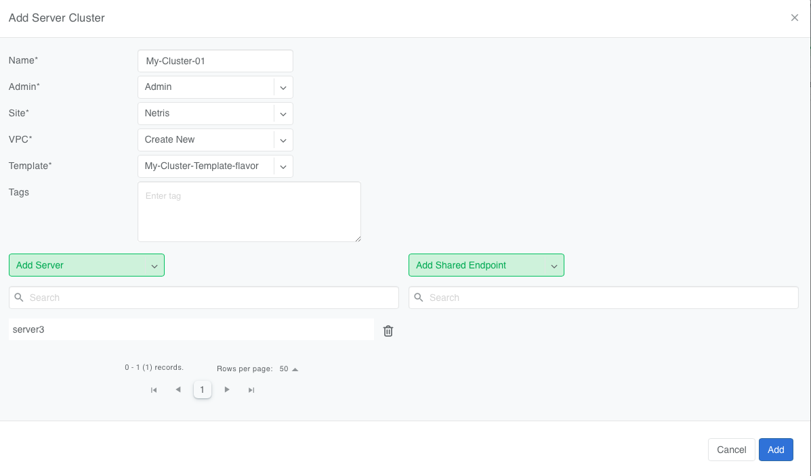

.. meta::
    :description: Server Cluster

==============
Server Cluster
==============

.. contents:: Table of Contents
   :depth: 2
   :local:

Introduction
============

A Netris abstraction called **Server Cluster** makes it easier and safer to assign servers to networks.
Instead of configuring each server and switch port by hand, you group servers into a Server Cluster and assign the whole group to a VPC in one step.

Behind the scenes, Netris uses a **Server Cluster Template** to figure out which switch ports to configure, which VLANs or PKeys to apply, and which V-Nets to create.

This helps teams deploy consistent network setups quickly in cloud and AI infrastructure environments where scale and repeatability are important.

The Template acts as a blueprint; the Server Cluster turns it into deployment. A network engineer defines the design once in the template, and from there, DevOps or infrastructure teams can deploy and scale server environments with full network consistency and minimal involvement from the networking team.

Server Cluster Template
=======================

Before a Server Cluster can be created, a Server Cluster Template must be defined.

In the past you had to manually:

- Create a VPC in ``Network->VPC``
- Create IP allocations and subnets in ``Network->IPAM``
- Create V-Nets in ``Services->V-Net``
- Select individual switch ports in ``Network->Network Interfaces`` and add them to V-Nets

This process was slow and easy to get wrong.

Now the **V-Nets**, **Allocations**, and **IP Subnet** primitives are defined in the template. You can find more information about these primitives in the :doc:`V-Net </vnet>` and :doc:`IP Address Management </ipam>` Netris documentation.

Based on a Server Cluster Template, Netris will:

- Set up the correct switch ports (front-end, back-end, management, InfiniBand)
- Apply VLANs, LAGs, InfiniBand PKeys, and other fabric-specific settings
- Create VPCs, VNets, and IP subnets

You no longer have to configure each switch port by hand. Instead, you focus on servers, and Netris will build the network for you.

.. warning::

  This functionality assumes that server NIC names are consistent across all servers in the cluster. For example, if eth1 is used for east-west traffic on one server, it should be the same on all other servers in that cluster.

Server Cluster Template Examples:
---------------------------------

Ethernet-only Fabric Example

.. code-block:: shell-session

  {
    "name": "ethernet-only-template",
    "vnets": [
      {
        "postfix": "mgmt",
        "type": "l2vpn",
        "vlan": "untagged",
        "vlanID": "auto",
        "serverNics": ["eth0"]
      },
      {
        "postfix": "N-S-and-storage",
        "type": "l2vpn",
        "vlan": "untagged",
        "vlanID": "auto",
        "serverNics": ["eth1", "eth2"],
        "ipv4Gateway": "192.168.10.254/24",
        "ipv4DhcpEnabled": true
      },
      {
        "postfix": "E-W-backend",
        "type": "l3vpn",
        "vlan": "untagged",
        "vlanID": "auto",
        "serverNics": ["eth3", "eth4"],
        "ipv4Gateway": {
          "assignType": "auto",
          "allocation": "10.10.0.0/16",
          "childSubnetPrefixLength": 24,
          "hostnum": 1
        }
      }
    ]
  }

Infiniband Fabric Example

.. code-block:: shell-session

  {
    "name": "infini-band-template",
    "vnets": [
      {
        "postfix": "mgmt",
        "type": "l2vpn",
        "vlan": "untagged",
        "vlanID": "auto",
        "serverNics": ["eth0"],
        "ipv4Gateway": "192.168.100.1/24",
        "ipv4DhcpEnabled": true

      },
      {
        "postfix": "N-S-and-storage",
        "type": "l3vpn",
        "vlan": "untagged",
        "vlanID": "auto",
        "serverNics": ["eth1", "eth2"],
      },
      {
        "postfix": "E-W-backend",
        "type": "infiniband",
        "pkey": "auto"
      }
    ]
  }

Nvidia UFM Example

.. code-block:: shell-session

  {
    "name": "Nvidia-ufm-template",
    "vnets": [
      {
        "postfix": "mgmt",
        "type": "l2vpn",
        "vlan": "untagged",
        "vlanID": "auto",
        "serverNics": ["eth0"],
        "ipv4Gateway": "192.168.20.1/24"
        "ipv4DhcpEnabled": true
      },
      {
        "postfix": "N-S-and-storage",
        "type": "l3vpn",
        "vlan": "untagged",
        "vlanID": "auto",
        "serverNics": ["eth1", "eth2"]
      },
      {
        "postfix": "E-W-backend",
        "type": "netris-ufm",
        "ufm": "ufm-88",
        "pkey": "auto"
      }
    ]
  }

Template Fields Explained:
--------------------------

Typically, a Server Cluster Template is made up of just three key-value pairs:

- **Name**: A string specifyig a descriptive name for the template.
- **Vnets**: A JSON array defining the V-Nets to be created for each server in the cluster.
- **ID**: A unique auto-generated identifier for the template, typically  and is not exposed to the user.

Each object in the Vnets array includes:

  - **postfix**: A string appended to the server cluster name to form the V-Net name.
  - **type**: A string specifying the type of V-Net (l2vpn, l3vpn, infiniband, netris-ufm).
  - **vlan**: A string specifying whether the V-Net is tagged or untagged.
  - **vlanID**: A sring specifying the VLAN ID. Only `auto` is permitted at this time.
  - **serverNics**: An array of NIC names on the server that will be associated with this V-Net.
  - **ipv4Gateway** (optional): A string specifying the IPv4 gateway for the V-Net, or "specify" to force the operator to enter the gateway explicity at cluster creation, or an object (see Advanced Uses) with the following properties:

    - **assignType**: A string indicating the type of assignment ('auto', 'static').
    - **allocation**: A string specifying the IPv4 address allocation, a supernet from which the child subnets will be derived.
    - **childSubnetPrefixLength**: An integer specifying the prefix length for child subnets.
    - **hostnum**: An integer specifying the host number for the gateway.

  - **ipv4DhcpEnabled** (optional): Boolean to enable/disable DHCP for IPv4. ipv4Gateway must be specified if DHCP is enabled.
  - **ipv6Gateway** (optional): A string specifying the IPv6 gateway for the V-Net.
  - **Ufm** (required for type:netris-ufm): Nvidia UFM controller URL for type "netris-ufm". See :doc:`Netris UFM documentation </netris-ufm-integration>` for details.
  - **Pkey** (required for type:infiniband): Pkey settings for type "netris-ufm". Only `auto` is permitted at this time. See :doc:`Netris UFM documentation </netris-ufm-integration>` for details.

Adding a Server Cluster Template
--------------------------------

To define a Server Cluster Template in the web console, navigate to ``Services->Server Cluster Template`` - click ``+Add``, give the template a descriptive name like 'GPU-Cluster-Template'. Enter JSON style configuration defining V-Nets and which server NICs must be placed into these V-Nets.

.. image:: images/add-server-cluster-template.png
  :align: center
  :class: with-shadow

.. raw:: html

   

Note that when using the UI, the JSON configuration must only include the 'vnets' array. The 'name' field is provided separately in the form. The 'id' field is auto-generated and should not be included in the UI input.

Advanced Uses
----------------

Non-overlapping subnets
~~~~~~~~~~~~~~~~~~~~~~~

Netris fully supports overlapping IP addresses across tenants and VPCs, but some use cases such as shared storage access or external network integrations, may require globally unique subnets for north-south connectivity. In these cases, you can configure Netris to automatically allocate non-overlapping subnets from a larger pool, ensuring compatibility with such constraints.

This is done by specifying the **allocation** field in the **ipv4Gateway** or **ipv6Gateway** objects and providing a supernet from which child subnets will be derived. This approach ensures that the IP addresses assigned to each V-Net do not overlap.

For IPv4 and IPv6 gateways, you can specify an object with the following properties:

.. code-block:: shell-session

  [
    {
        "postfix": "N-S-and-storage",
        "type": "l2vpn",
        "vlan": "untagged",
        "vlanID": "auto",
        "serverNics": [
            "eth9",
            "eth10"
        ],
        "ipv4Gateway": {
            "assignType": "auto",
            "allocation": "10.0.0.0/16",
            "childSubnetPrefixLength": 24,
            "hostnum": 1
        }
    },
    {
        "postfix": "E-W-backend",
        "type": "l2vpn",
        "vlan": "untagged",
        "vlanID": "auto",
        "serverNics": [
            "eth7",
            "eth8"
        ],
        "ipv4Gateway": {
            "assignType": "auto",
            "allocation": "192.168.0.0/16",
            "childSubnetPrefixLength": 24,
            "hostnum": 254
        },
        "ipv4DhcpEnabled": true
    },
    {
        "postfix": "OOB",
        "type": "l2vpn",
        "vlan": "untagged",
        "vlanID": "auto",
        "serverNics": [
            "eth9",
            "eth10"
        ],
        "ipv4Gateway": "192.168.0.254/24",
        "ipv4DhcpEnabled": true
    }
  ]

Specify gateway
~~~~~~~~~~~~~~~~~~~~~~

In some environments, IP address management is handled entirely outside of Netris by a customer-owned IPAM system or a provisioning portal. In these cases, Netris cannot automatically assign subnets or gateways.

In these cases the gateway address must be specified manually at the time of Server Cluster creation. When you set ``ipv4Gateway`` (or ``ipv6Gateway``) to ``"specify"``, Netris will prompt for the exact gateway address at the time of defining the cluster and will infer the subnet address to assigne to the V-Net. This enables seamless integration with external IPAM workflows while still leveraging Netris for declarative network provisioning.

.. code-block:: shell-session

  [
    {
        "postfix": "UFM8",
        "type": "netris-ufm",
        "ufm": "ufm-88",
        "pkey": "auto"
    },
    {
        "postfix": "L3VPN",
        "type": "l3vpn",
        "vlan": "untagged",
        "vlanID": "auto",
        "serverNics": [
            "eth1",
            "eth2"
        ]
    },
    {
        "postfix": "NS",
        "type": "l2vpn",
        "vlan": "untagged",
        "vlanID": "auto",
        "serverNics": [
            "eth11",
            "eth12"
        ],
        "ipv4Gateway": "specify",
        "ipv4DhcpEnabled": true
    },
    {
        "postfix": "EW",
        "type": "l2vpn",
        "vlan": "untagged",
        "vlanID": "auto",
        "serverNics": [
            "eth9",
            "eth10"
        ],
        "ipv4Gateway": "specify",
        "ipv4DhcpEnabled": true
    }
  ]

Creating Server Cluster
=======================

With templates defined, you can now create Server Clusters by referencing these templates and specifying a list of servers. This operation triggers the creation of network primitives—such as V-Nets, IP subnets, Pkeys and other InfiniBand primitives based on the template's definitions.

A Server Cluster Template serves as a reusable design blueprint. It defines how servers are connected to the fabric, but it doesn't provision any actual resources on its own. In practice, cloud service provider (CSP) admins typically create one or more templates to reflect common deployment patterns. Then day-to-day operations revolve around creating, editing, or deleting Server Clusters. Usually one or more clusters per tenant with each cluster triggering the actual provisioning of VPCs, V-Nets, and switch port configurations based on the selected template.

.. warning::

  For every cluster Netris will create a new VPC, V-Nets, assign IP subnets. To add servers into an existing V-Net you should edit an existing cluster and add servers to it.

Adding a Server Cluster
-----------------------

To define a Server CLuster navigate to ``Services->Server Cluster`` and click ``+Add``. Give the new cluster a name, set Admin to the appropriate tenant (this defines who can edit/delete this cluster and only servers already assigned to this tenant will be available for selection), set the site, set VPC to 'create new', select the Template created earlier, and click ``+Add server`` to start selecting server members. Click ``Add``.

.. image:: images/add-server-cluster-selecting-servers.png
  :align: center
  :class: with-shadow

.. raw:: html

   

When you click the blue ``Add`` button, Netris will create the VPC, V-Nets, and IP subnets as defined in the template. It will also configure the switch ports for each server based on the NIC names specified in the template.

.. raw:: html

   

- VPC creation is only automatic when 'create new' is selected. If an existing VPC is chosen, the system will not create a new VPC, and it is assumed that the selected VPC already contains the necessary network constructs.
- After creation, the template, VPC, and site fields are locked. Servers may be added or removed, but only if their NIC layout matches the template.
- When deleting a cluster, users may choose to keep or delete the associated VPC. If the VPC is still used by other resources, it will not be removed.
- To avoid misconfiguration, all servers in a cluster must share identical NIC names and counts. Templates assume symmetry; mismatched layouts will be rejected.

Shared Endpoints
----------------

In most cases, servers in a cluster are exclusively assigned. Each physical server is dedicated to one server cluster and is provisioned for a single VPC.

However, certain infrastructure components, such as hypervisors or shared storage nodes, may need to serve multiple VPCs simultaneously. In such cases, these endpoints must participate in more than one server cluster.

To support this need, Netris allows administrators to designate specific endpoints as shared. A shared endpoint may be assigned to multiple server clusters, making it possible for virtualized workloads running on shared infrastructure (e.g., VMs or shared storage) to be exposed across VPC boundaries.

Designating an endpoint as shared changes how the associated switch port is provisioned. Netris automatically configures the switch port in tagged mode, or the functional equivalent in environments such as InfiniBand or NVLink. In essence:

Shared endpoint = Tagged switch port

This is the primary behavioral change triggered by marking an endpoint as shared.

.. warning::

  Server Clusters do not automatically follow where virtual machines move. You must make sure all the right hypervisors are added to the correct Server Cluster ahead of time. If VM1 can migrate between HostA and HostB, both must be in the Server Cluster.

.. warning::

  Additionally, Netris does not manage of influence the internal networking configurations of hypervisors or shared storage nodes. The responsibility for ensuring that virtual machines or storage services are correctly networked within their respective environments lies with the orchestrator or cloud operator.

Untagged VLAN on Shared Endpoints
~~~~~~~~~~~~~~~~~~~~~~~~~~~~~~~~~

In some cases, you may need to a functional untagged VLAN on a switch port with a shared endpoint. For example, some storage solutions require untagged VLAN for internal communication.

To enable this a node can be added to one cluster as a dedicated member (e.g., to use native/untagged VLAN or its InfiniBand/NVLink equivalent). That same node can be added to any number of other clusters as a shared member, as long as it's not the same cluster where it is dedicated. A node cannot be both dedicated and shared in the same cluster.

Once a node is selected as dedicated in a cluster:
- It cannot be added as a dedicated member to any other cluster
- It cannot be added as a shared node into same cluster only (it can be added as a shared node to any other cluster).

Server Cluster Fields Explained:
--------------------------------

- **Name**: A descriptive name for the server cluster.
- **Admin**: The tenant that administers this server cluster.
- **Site**: The site where the server cluster is located.
- **VPC**: The VPC to which the server cluster belongs. Typically set to 'create new' to generate a new VPC.
- **Template**: The Server Cluster Template that defines the network configuration for this cluster.
- **Servers**: An array of server names that are exclusive members of this cluster.
- **SharedEndpoints**: An array of server names that are shared members of this cluster.

Best Practices
===============

- Use descriptive names for templates and clusters to convey their purpose.
- Maintain consistent NIC naming conventions across servers in a cluster.
- Double-check NIC layouts before adding servers to ensure compatibility with the template.
