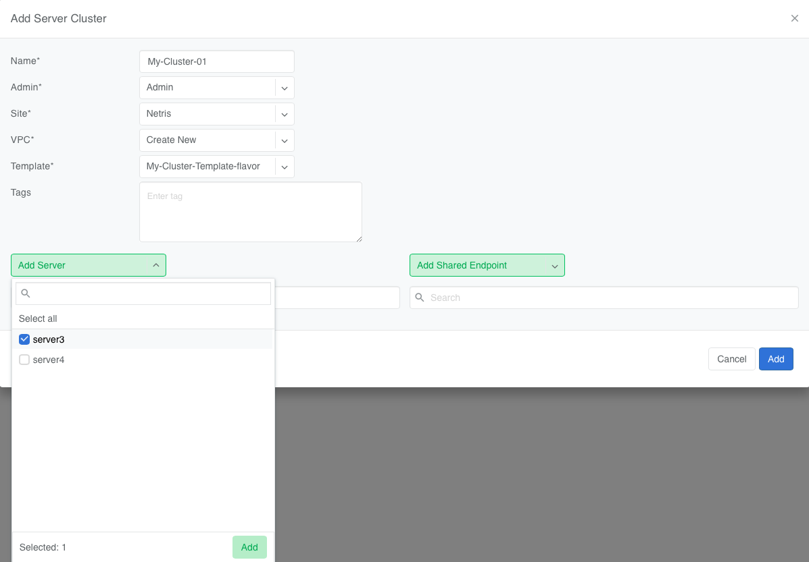
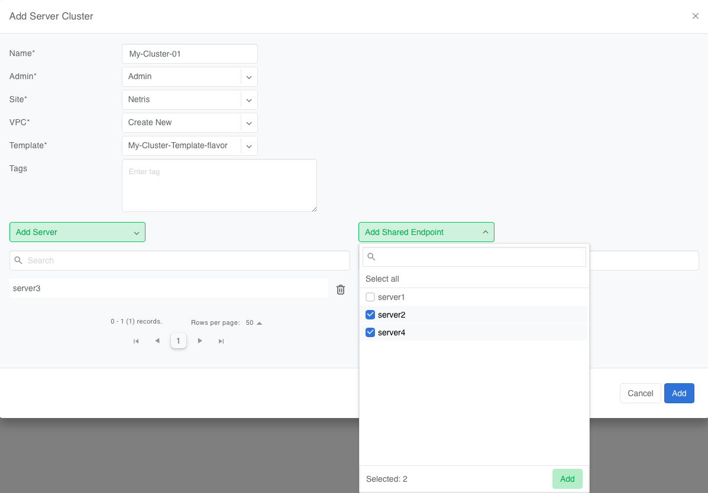

.. meta::
    :description: Server Cluster

==============
Server Cluster
==============

.. contents:: Table of Contents
   :depth: 2
   :local:

Introduction
============

Netris **Server Cluster** makes it possible to define network boundaries by referencing a list of compute or storage nodes (Netris Server objects).

Behind the scenes, Netris figures out which VXLANs, VLANs, and Pkeys to configure for every appropriate switch and switch port. The Server Cluster object will also create the underlying V-Net, VPC, and other Netris objects.

This helps infrastructure operators create, edit, and delete network boundaries by focusing only on the list of servers and not worry about switch ports, GUIDs, or any other implementation details.

Server Cluster Template
=======================

A Server Cluster Template is a JSON array of V-Nets to create, their types, and server NICs to be assigned to these V-Nets. The template must be defined before a Server Cluster can be created.

In a Server Cluster Template you define:

- What V-Nets to create and their types (VXLAN, VLAN, UFM, NVLink, and others)
- What subnets to assign to each these V-Net, when applicable
- Which server NICs map to these V-Nets
- Other applicable settings specific to Ethernet, InfiniBand, and NVLink fabrics

You can find more information about these primitives in the :doc:`V-Net </vnet>` and :doc:`IP Address Management </ipam>` Netris documentation.

Based on a Server Cluster Template, Netris will:

- Create VPCs, V-Nets, and IP allocations and subnets
- Look up and configure the correct switch ports (front-end, back-end, management)
- Apply VXLANs, VLANs, LAGs, InfiniBand PKeys, and other network configurations

Here are several template examples followed by detailed descriptions of every field.

Server Cluster Template Examples:
---------------------------------

Ethernet-only Fabric Example
~~~~~~~~~~~~~~~~~~~~~~~~~~~~~~

This example is common for AI fabrics where both Frontned and Backend networks are based on Ethernet. A Server Cluster referenced to this template will create two l2vpn VXLAN V-Nets and one l3vpn VXLAN V-Net. V-Net names will start with the name of the server cluster and end with the value of each postfix attribute.

.. code-block:: shell-session

  [
    {
      "postfix": "mgmt",
      "type": "l2vpn",
      "vlan": "untagged",
      "vlanID": "auto",
      "serverNics": [
        "eth0"
      ],
      "ipv4Gateway": {
        "assignType": "auto",
        "allocation": "10.10.0.0/16",
        "childSubnetPrefixLength": 24,
        "hostnum": 1
      }
    },
    {
      "postfix": "N-S",
      "type": "l2vpn",
      "vlan": "untagged",
      "vlanID": "auto",
      "serverNics": [
        "eth1",
        "eth2"
      ],
      "ipv4Gateway": "192.168.10.254/24",
      "ipv4DhcpEnabled": true
    },
    {
      "postfix": "E-W",
      "type": "l3vpn",
      "vlan": "untagged",
      "vlanID": "auto",
      "serverNics": [
        "eth3",
        "eth4"
      ]
    }
  ]

Infiniband Fabric Example
~~~~~~~~~~~~~~~~~~~~~~~~~~~~~~

This example is common for AI fabrics where the frontend is based on Ethernet and the backend is based on InfiniBand. A Server Cluster referencing this template will create two l2vpn type VXLAN V-Nets and will automatically configure the Ethernet switches, and will configure one PKey with appropriate GUIDs in the NVIDIA UFM (Infiniband controller).

.. code-block:: shell-session

  [
    {
      "postfix": "mgmt",
      "type": "l2vpn",
      "vlan": "untagged",
      "vlanID": "auto",
      "serverNics": [
        "eth0"
      ],
      "ipv4Gateway": "192.168.100.1/24",
      "ipv4DhcpEnabled": true
    },
    {
      "postfix": "N-S",
      "type": "l2vpn",
      "vlan": "untagged",
      "vlanID": "auto",
      "serverNics": [
        "eth1",
        "eth2"
      ]
    },
    {
      "postfix": "E-W",
      "type": "netris-ufm",
      "ufm": "ufm-88",
      "pkey": "auto"
    }
  ]

IPv6 Example
~~~~~~~~~~~~~~~~~~~~~~~~~~~~~~~

IPv6 is fully supported in Netris. This example showcases how to optionally enable IPv6 on any V-Net segment of the Server Cluster Template.

.. code-block:: shell-session

  [
    {
      "postfix": "E-W",
      "serverNics": [
        "eth1",
        "eth2",
        "eth3",
        "eth4",
        "eth5",
        "eth6",
        "eth7",
        "eth8"
      ],
      "type": "l3vpn",
      "vlan": "untagged",
      "vlanID": "auto"
    },
    {
      "postfix": "N-S",
      "serverNics": [
        "eth9",
        "eth10"
      ],
      "type": "l2vpn",
      "vlan": "untagged",
      "vlanID": "auto",
      "ipv6Gateway": "2001:db8:1::1/64"
    },
    {
      "postfix": "OOB-MGMT",
      "serverNics": [
        "eth11"
      ],
      "type": "l2vpn",
      "vlan": "untagged",
      "vlanID": "auto",
      "ipv6Gateway": {
        "assignType": "auto",
        "allocation": "2001:DB8::/32",
        "childSubnetPrefixLength": 64,
        "hostnum": 1
      }
    }
  ]

Template Fields Explained:
--------------------------

Each object in the **Vnets** JSON array may include a combination of the following key-value pairs

  - **postfix**: A string appended to the server cluster name to form the V-Net name.
  - **type**: A string specifying the type of V-Net (`l2vpn`, `l3vpn`, `netris-ufm`).
  - **vlan**: A string specifying whether the V-Net is `tagged` or `untagged`.
  - **vlanID**: A string specifying the VLAN ID. Only `auto` is permitted at this time.
  - **serverNics**: An array of Netris server NIC names on the server that will be associated with this V-Net.
  - **ipv4Gateway** (optional): When `type:l2vpn` one of the following values:

    - A string specifying the IPv4 gateway for V-Net in CIDR notation
    - A string `specify` to force the operator to enter the gateway explicitly at cluster creation
    - an object (see :ref:`advanced-uses`) with the following properties:

      - **assignType**: A string indicating the type of assignment. Only `auto` is permitted at this time.
      - **allocation**: A string specifying the IPv4 address allocation, a supernet from which the child subnets will be derived.
      - **childSubnetPrefixLength**: An integer specifying the prefix length for child subnets.
      - **hostnum**: An integer specifying the host number for the gateway.

  - **ipv4DhcpEnabled** (optional): When `type:l2vpn` a boolean to enable/disable DHCP for IPv4. `ipv4Gateway` must be specified if DHCP is enabled.
  - **ipv6Gateway** (optional): When `type:l2vpn` one of the following values:

    - A string specifying the IPv6 gateway for V-Net in CIDR notation
    - A string `specify` to force the operator to enter the gateway explicitly at cluster creation
    - an object (see :ref:`advanced-uses`) with the following properties:

      - **assignType**: A string indicating the type of assignment. Only `auto` is permitted at this time.
      - **allocation**: A string specifying the IPv4 address allocation, a supernet from which the child subnets will be derived.
      - **childSubnetPrefixLength**: An integer specifying the prefix length for child subnets.
      - **hostnum**: An integer specifying the host number for the gateway.

  - **Ufm** (required for `type:netris-ufm`): Nvidia UFM controller identifier (`ufm_id`) for V-Net `type:netris-ufm`. See :doc:`Netris UFM documentation </netris-ufm-integration>` for details.
  - **Pkey** (required for `type:netris-ufm`): Pkey settings when V-Net `type:netris-ufm`. Only `auto` is permitted at this time.

Adding a Server Cluster Template
--------------------------------

To define a Server Cluster Template in the web console, navigate to ``Services->Server Cluster Template``, click ``+Add``, give the template a descriptive name like 'GPU-Cluster-Template'. Enter V-Nets, their configuration parameters, and which server NICs must be placed into these V-Nets as a JSON array.

.. raw:: html

   

.. _advanced-uses:

Advanced Uses
----------------

Non-overlapping subnets
~~~~~~~~~~~~~~~~~~~~~~~

Netris fully supports overlapping IP addresses across VPCs, but some use cases such as shared storage access or external network integrations, may require globally unique subnets for the north-south (frontend) fabric. In these cases, you can configure Netris to automatically allocate non-overlapping subnets from a larger pool, ensuring compatibility with such constraints.

This is done by specifying the `allocation` field in the `ipv4Gateway` or `ipv6Gateway` object and providing a supernet from which child subnets will be derived. This approach ensures that the IP addresses assigned to each V-Net do not overlap.

.. code-block:: shell-session

  [
    {
      "postfix": "N-S",
      "type": "l2vpn",
      "vlan": "untagged",
      "vlanID": "auto",
      "serverNics": [
        "eth9",
        "eth10"
      ],
      "ipv4Gateway": {
        "assignType": "auto",
        "allocation": "10.0.0.0/16",
        "childSubnetPrefixLength": 24,
        "hostnum": 1
      },
      "ipv4DhcpEnabled": true
    },
    {
      "postfix": "E-W",
      "type": "l2vpn",
      "vlan": "untagged",
      "vlanID": "auto",
      "serverNics": [
        "eth7",
        "eth8"
      ],
      "ipv6Gateway": {
        "assignType": "auto",
        "allocation": "2001:DB8::/32",
        "childSubnetPrefixLength": 64,
        "hostnum": 1
      }
    },
    {
      "postfix": "OOB",
      "type": "l2vpn",
      "vlan": "untagged",
      "vlanID": "auto",
      "serverNics": [
        "eth1"
      ],
      "ipv4Gateway": "192.168.0.254/24",
      "ipv4DhcpEnabled": true
    }
  ]

Specify gateway
~~~~~~~~~~~~~~~~~~~~~~

In case you want to specify the IP gateway manually when creating a Server Cluster object, you can indicate this in the Server Cluster Template by setting the `ipv4Gateway` (or `ipv6Gateway`) key to `specify` . Netris will prompt for the exact gateway address at the time of defining the cluster and will infer the subnet address to be assigned to the V-Net.

.. code-block:: shell-session

  [
    {
      "postfix": "UFM8",
      "type": "netris-ufm",
      "ufm": "ufm-88",
      "pkey": "auto"
    },
    {
      "postfix": "L3VPN",
      "type": "l3vpn",
      "vlan": "untagged",
      "vlanID": "auto",
      "serverNics": [
        "eth1",
        "eth2"
      ]
    },
    {
      "postfix": "NS",
      "type": "l2vpn",
      "vlan": "untagged",
      "vlanID": "auto",
      "serverNics": [
        "eth11",
        "eth12"
      ],
      "ipv4Gateway": "specify",
      "ipv6Gateway": "specify"
    }
  ]

Creating Server Cluster
=======================

With templates defined, you can create Server Clusters by referencing these templates and specifying a list of servers. This operation triggers the creation of the applicable network primitives such as V-Nets, IP subnets, Pkeys and other InfiniBand primitives based on the template's definitions.

Adding a Server Cluster
-----------------------

To define a Server Cluster navigate to ``Services->Server Cluster`` and click ``+Add``. Give the new cluster a name, set Admin to the appropriate owner (this defines who can edit/delete this cluster and only servers already assigned to this owner will be available for selection), set the site, set VPC to "Create New", select the Template created earlier, and click ``+Add Server`` or ``+Add Shared Server`` to start selecting server members. Click Add.

.. raw:: html

   

When you click the blue ``Add`` button, Netris will create the VPC, V-Nets, and IP subnets as defined in the template. It will also configure the switch ports for each server based on the NIC names specified in the template.

.. image:: images/add-server-cluster.png
  :align: center
  :class: with-shadow

.. raw:: html

   

.. note::

  - A VPC will be created automatically when "Create New" is selected.
  - After creation, the template, the VPC, and the site fields are locked.
  - The same Netris NIC name must be used consistently across all server objects in a cluster. For example, when eth10 is assigned to a V-Net in the template, Netris will assign every switch port that corresponds to every server's eth10 to the same  V-Net throughout the server cluster.

Shared Endpoints
----------------

Typically each physical server is dedicated to one server cluster and is provisioned for a single VPC.

However, certain infrastructure components, such as hypervisors or shared storage nodes, may need to serve multiple VPCs simultaneously. In such cases, these endpoints must participate in more than one server cluster.

To support this, Netris allows administrators to designate specific endpoints as shared. A shared endpoint may be assigned to multiple server clusters, making it possible for Hypervisors, Storage, or other shared resources to be exposed across multiple VPCs.

.. raw:: html

   

.. raw:: html

   

Designating an endpoint as shared changes how the associated switch port is provisioned. Netris automatically configures the switch port in tagged mode, or the functional equivalent in environments such as InfiniBand or NVLink. In essence:

Shared endpoint = Tagged switch port

This is the primary behavioral change triggered by marking an endpoint as shared.

.. warning::

  Server Clusters do not automatically include every node where virtual machines move. You must make sure all the right hypervisors are added to the correct Server Cluster ahead of time. If VM1 can migrate between HostA and HostB, both of these servers must be in the same Server Cluster.

.. warning::

  Netris does not manage or influence the internal networking configurations of hypervisors or shared storage nodes. The responsibility for ensuring that virtual machines or storage services are correctly networked within their respective environments lies with the orchestrator or the cloud operator.

Untagged VLAN on Shared Endpoints
~~~~~~~~~~~~~~~~~~~~~~~~~~~~~~~~~

In some cases, you may need to have an untagged VLAN on a switch port with a shared endpoint. For example, some storage solutions require untagged VLAN for internal communication.

To enable this, a node can be added to one cluster as a dedicated member (e.g., to use native/untagged VLAN or its InfiniBand/NVLink equivalent). That same node can be added to any number of other clusters as a shared member, as long as it's not the same cluster where it is already dedicated. A node cannot be both a dedicated and a shared member of the same cluster.

Once a node is selected as dedicated in a cluster:

- It cannot be added as a dedicated member to any other cluster
- It cannot be added as a shared node into the same cluster, but it can be added as a shared node to any other cluster.

Server Cluster Fields Explained:
--------------------------------

- **Name**: A descriptive name for the server cluster.
- **Admin**: The administrative owner of this server cluster.
- **Site**: The site where the server cluster is located.
- **VPC**: The VPC to which the server cluster belongs. Typically set to "Create New" to generate a new VPC.
- **Template**: The Server Cluster Template that defines the Netris primitives for this cluster.
- **Servers**: A list of servers that are dedicated members of this cluster.
- **SharedEndpoints**: A list of servers that are members of this cluster, but can also be added to other clusters.
