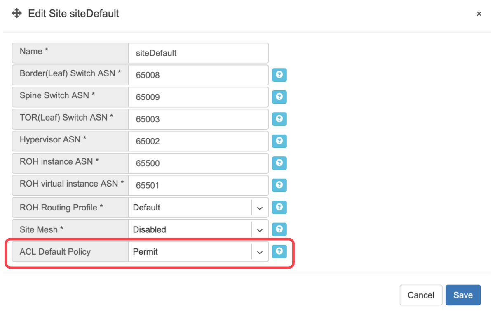
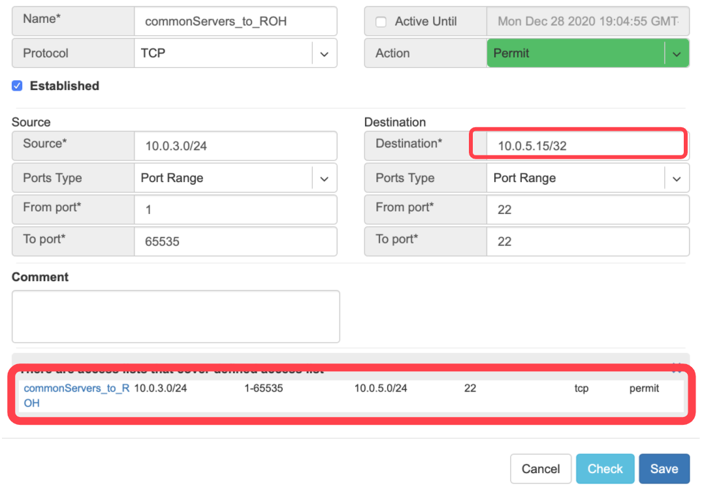
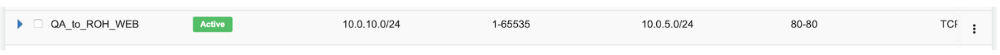

.. meta::
    :description: Netris Services and Configuration Examples

#####
V-NET
#####
V-NET is a virtual networking service. V-NETs can be used for Layer-2 (unrouted) or Layer-3 (routed) virtual network segments involving switch ports anywhere on the switch fabric. V-NETs can be created and managed by a single tenant (single team) or created and managed collaboratively by multiple tenants (different teams inside and/or outside the organization). 

  Automatically, Netris will configure a VXLAN with an EVPN control plane over an unnumbered BGP Layer-3 underlay network and organize the high availability for the default gateway behind the scenes. 

V-Net fields.

- **Name** - Unique name for the V-NET.
- **Owner** - Tenant, who can make any changes to current V-NET.
- **V-Net state** - Active/Disable state for entire V-NET.
- **VLAN aware** - Enable VLAN aware bridge, use only in rare cases, if otherwise is not possible.
- **Guest tenants** - List of tenants allowed to add/edit/remove ports to the V-Net but not manage other parameters.
- **Sites** - Ports from these sites will be allowed to participate in the V-Net. (Multi-site circuits would require backbone connectivity between sites).
- **IPv4 Gateway** - IPv4 address to be used as a default gateway in this V-NET. Should be configured under Net→Subnets as an assignment, assigned to the owner tenant, and available in the site where V-NET is intended to span.
- **IPv6 Gateway** - IPv6 address to be used as a default gateway in this V-NET. Should be configured under Net→Subnets as an assignment, assigned to the owner tenant, and available in the site or sites where V-NET is intended to span.
- **Port** - Physical Switch Port anywhere on the network. Switch Port should be assigned to the owner or guest tenant under Net→Switch Ports.
  
  - **Enabled** - Enable or disable individual Switch Port under current V-NET
  - **Port Name** - Switch Port format: <alias>(swp<number>)@<switch name>
  - **VLAN ID / Untag** - Specify a VLAN ID for tagging traffic on a per-port basis or set Untag not to use tagging on a particular port. VLAN tags are only significant on each port’s ingress/egress unless VLAN aware mode is used.
  - **LAG Mode** -  Allows for active-standby dual-homing, assuming LAG configuration on the remote end. Active/active dual homing will be enabled in future releases (dependence on SVI support by NOSes).

Tip: Many switches can’t autodetect old 1Gbps ports. If attaching hosts with 1Gbps ports to 10Gpbs switch ports, you’ll need to change the speed for a given Switch Port from Auto(default) to 1Gbps. You can edit a port in Net→Switch Ports individually or in bulk.

Example: Adding a new V-NET.

.. image:: images/new_VNET.png
    :align: center

Example: Listing of V-NETs.

.. image:: images/VNETs.png
    :align: center
    

Example: Expanded view of a V-NET listing.

.. image:: images/VNET_listing.png
    :align: center
  
#######
Kubenet
#######
Kubenet is a network service purpose-built for Kubernetes cluster nodes. Netris integrates with Kube API to provide on-demand load balancer and other Kubernetes specific networking features. Netris Kubenet is designed to complement Kubernetes CNI networking and provide a cloud-like user experience to local Kubernetes clusters.  

The Gateway and Switch Port part of Kubenet is similar to the V-NET. In fact, it is leveraging a V-NET. Kubeconfig is for granting Netris Controller access to your Kube API. Kubenet therefore, dynamically leverages Netris L4LB and other services based on events that Netris kube-watcher (Kube API integration adapter) watches in your Kube API. 

Description of Kubenet fields.

- **Name** - Unique name for the Kubenet.
- **Tenant** - Tenant, who can make any changes to current Kubenet.
- **Site** - Site where Kubernetes cluster belongs. 
- **State** - Active/Disable state for particular Kubenet service.
- **IPv4** Gateway - IPv4 address to be used as a default gateway for current Kubenet. 
- **Port** - Physical Switch Port anywhere on the switch fabric. Switch Port should be assigned to the owner tenant under Net→Switch Ports.

  - **Enabled** - Enable or disable individual Switch Port under current Kubenet.
  - **Port Name** - Switch Port format: <alias>(swp<number>)@<switch name>
  - **VLAN ID / Untag** - Specify a VLAN ID for tagging traffic on a per-port basis or set to Untag not to use tagging on a particular port. 

- **Kubeconfig** - After installing the Kubernetes cluster, add your Kube config for granting Netris at least read-only access to the Kube API. 

Tip: Many switches can’t autodetect old 1Gbps ports. If attaching hosts with 1Gbps ports to 10Gpbs switch ports, you’ll need to change the speed for a given Switch Port from Auto(default) to 1Gbps. You can edit a port in Net→Switch Ports individually or in bulk.

Example: Adding a new Kubenet service.

.. image:: images/new_kubenet.png
    :align: center
  
Once Netris Controller establishes a connection with Kube API, status will reflect on the listing.

Screenshot: Listing of Kubenet services. Kube API connection is successful.

.. image:: images/listing_kubenet.png
    :align: center
    

Screenshot: Physical Switch Port statuses.

.. image:: images/switch_port_statuses.png
    :align: center
    
    
Screenshot: Statuses of on-demand load balancers (type: load-balancer)

.. image:: images/load-balancer.png
    :align: center

#########################
ROH (Routing on the Host)
#########################
To create more resilient and higher-performance data centers, some companies leverage the Linux ecosystem to run routing protocols directly to their servers. Known as ROH (Routing on the Host). 

In ROH architectures, servers use a routing demon to establish a BGP adjacency with the switch fabric on every physical link. ROH can run on bare metal servers, VMs, and even containers. The most commonly used routing daemon is FRR.

Hosts connected to the network in ROH architecture don’t have IP addresses on a shared Ethernet segment; instead IP address is configured on the loopback interface and advertised over all BGP links towards switch fabric. Thus, leveraging the Layer-3 network throughout the entire network down the servers. 

ROH architecture with Netris allows for leveraging ECMP load balancing capabilities of the switching hardware for the high-performance server load balancing (described in L3 Load Balancer section). 
For each instance of ROH, you’ll need to create an ROH entry in Netris Controller.

Description of ROH instance fields:

- **Name** - Unique name for the ROH instance.
- **Site** - Site where the current ROH instance belongs.
- **Type** - Physical Server, for all servers forming a BGP adjacency directly with the switch fabric. Hypervisor, for using the hypervisor as an interim router. Proxmox is currently the only supported hypervisor.
- **ROH Routing Profile** - ROH Routing profile defines what set of routing prefixes to be advertised to ROH instances.

  - **Default route only (a most common choice)** - Will advertise 0.0.0.0/0 + loopback address of the physically connected switch.
  - **Default + Aggregate** - Will add prefixes of defined assignments + "Default" profile.
  - **Full table** - Will advertise all prefixes available in the routing table of the connected switch.
  - **Inherit** - will inherit policy from site objects defined under Net→Sites.

- **Legacy Mode** - Switch from default zero-config mode to using /30 IP addresses. Use for MS Windows Servers or other OS that doesn’t support FRR.
- **+Port** - Physical Switch Ports anywhere on the network. 
- **+IPv4** - IPv4 addresses for the loopback interface.
- **+Inbound Prefix List** - List of additional prefixes that the ROH server may advertise. Sometimes used to advertise container or VM networks.

Tip: Many switches can’t autodetect old 1Gbps ports. If attaching hosts with 1Gbps ports to 10Gpbs switch ports, you’ll need to change the speed for a given Switch Port from Auto(default) to 1Gbps. You can edit a port in Net→Switch Ports individually or in bulk.

Example: Adding an ROH instance.  (Yes, you can use A.B.C.0/32 and A.B.C.255/32)

.. image:: images/ROH_instance.png
    :align: center

Screenshot: Expanded view of ROH listing. BGP sessions are up, and the expected IP is in fact received from the actual ROH server. Traffic stats are available per port.

.. image:: images/ROH_listing.png
    :align: center
    

#############################
L3 Load Balancer (Anycast LB)
#############################
L3 (Anycast) load balancer is leveraging ECMP load balancing and hashing capability of spine and leaf switches to deliver line-rate server load balancing with health checks.

ROH servers, besides advertising their unicast (unique) loopback IP address, need to configure and advertise an additional anycast (the same IP) IP address. Unicast IP address is used for connecting to each individual server. 

End-user traffic should be destined to the anycast IP address. Switch fabric will ECMP load balance the traffic towards every server, as well as will hash based on IP/Protocol/Port such that TCP sessions will keep complete between given end-user and server pair. Optionally health checks are available to reroute the traffic away in the event of application failure. 

To configure L3 (Anycast) load balancing, edit an existing ROH instance entry and add an extra IPv4 address, and select Anycast. This will create a service under Services→Load Balancer and permit using the Anycast IP address in multiple ROH instances. 

Example: Adding an Anycast IPv4 address

.. image:: images/anycast_IPv4_address.png
    :align: center
    
   
Example: Under Services→Load Balancer, you can find the listing of L3 (Anycast) Load Balancers, service statuses, and you can add/remove more ROH instances and/or health checks.

.. image:: images/listing_L3.png
    :align: center
    

Screenshot: L3 (Anycast) Load Balancer listing.

.. image:: images/loadbalancer_listing.png
    :align: center

#######################
L4 Load Balancer (L4LB)
#######################
Netris L4 Load Balancer (L4LB) is leveraging SoftGate(Linux router) nodes for providing Layer-4 load balancing service, including on-demand cloud load balancer with native integration with Kubernetes. 

Enabling L4LB service
---------------------
L4 Load Balancer service requires at least one SoftGate node to be available in a given Site, as well as at least one IP address assignment (purpose=load balancer).

The IP address pool for L4LB can be defined in the Net→Subnets section by adding an Allocation and setting the purpose field to ‘load-balancer.’ You can define multiple IP pools for L4LB at any given Site.  See the below example.

Example: Adding a load-balancer IP pool assignment.

.. image:: images/IP_pool_assignment.png
    :align: center
    
    
Screenshot: Listing of Net→Subnets after adding a load-balancer assignment

.. image:: images/NetSubnets_listing.png
    :align: center
    
    
Consuming L4LB service
----------------------
This guide describes how to request an L4 Load Balancer using GUI. For Kubernetes integration, check the Kubenet section.

Click +add under Services→L4 Load Balancer to request an L4LB service.

Add new L4 Load Balancer fields are described below:

**General fields**

* **Name*** - Unique name. 
* **Protocol*** - TCP or UDP. 
* **Tenant*** - Requestor Tenant should have access to the backend IP space.
* **Site*** - Site where L4LB service is being requested for. Backends should belong on this site.
* **State*** - Administrative state.

**Frontend**

* **Address*** - Frontend IP address to be exposed for this L4LB service. “Assign automatically” will provide the next available IP address from the defined load-balancer pool. Alternatively, users can select manually from the list of available addresses.   
* **Port*** -  TCP or UDP port to be exposed.

**Health-check**

* **Type*** - Probe backends on service availability.

  * **None** - load balance unconditionally.
  * **TCP** - probe backend service availability through TCP connect checks.
  * **HTTP** - probe backend service availability through http GET checks.

* **Timeout(ms)*** - Probe timeout in milliseconds. 
* **Request path*** - Http request path. 

**Backend**

* **+Add** - add a backend host.
* **Address** - IP address of the backend host.
* **Port** - Service port on the backend host.
* **Enabled** - Administrative state of particular backend. 

Example: Requesting an L4 Load Balancer service.

.. image:: images/request_L4.png
    :align: center
    
Example: Listing of L4 Load Balancer services

.. image:: images/listing_L4.png
    :align: center
    
    
##########################
Access Control Lists (ACL)
##########################
Netris supports ACLs for switch network access control. (ACL and ACL2.0) ACL is for defining network access lists in a source IP: Port, destination IP: Port format. ACL2.0 is an object-oriented service way of describing network access.

Both ACL and ACL2.0 services support tenant/RBAC based approval workflows. Access control lists execute in switch hardware providing line-rate performance for security enforcement. It’s important to keep in mind that the number of ACLs is limited to the limited size of TCAM of network switches. 

Screenshot: TCAM utilization can be seen under Net→Inventory

.. image:: images/TCAM.png
    :align: center
    
Netris is applying several optimization algorithms to minimize the usage of TCAM while achieving the user-defined requirements.  

ACL Default Policy.
-------------------
The ACL default policy is to permit all hosts to communicate with each other.  You can change the default policy on a per Site basis by editing the Site features under Net→Sites. Once the “ACL Default Policy” is changed to “Deny,” the given site will start dropping any traffic unless specific communication is permitted through ACL or ACL2.0 rules.

Example: Changing “ACL Default Policy” for the site “siteDefault”.

    

ACL rules
---------
ACL rules can be created, listed, edited, approved under Services→ACL.

Description of ACL fields.
General

* **Name*** - Unique name for the ACL entry.
* **Protocol*** - IP protocol to match.

  * All - Any IP protocols.
  * IP - Specific IP protocol number.
  * TCP - TCP.
  * UDP - UDP.
  * ICMP ALL - Any IPv4 ICMP protocol.
  * ICMP Custom - Custom IPv4 ICMP code.
  * ICMPv6 ALL - Any IPv6 ICMP protocol. 
  * ICMPv6 Custom - Custom IPv6 ICMP code.
  
* **Active Until** - Disable this rule at the defined date/time. 
* **Action** - Permit or Deny forwarding of matched packets.
* **Established/Reverse** - For TCP, also match reverse packets except with TCP SYN flag. For non-TCP, also generate a reverse rule with swapped source/destination.  

Source/Destination - Source and destination addresses and ports to match.

* **Source*** IPv4/IPv6 - IPv4/IPv6 address.
* **Ports Type*** 

  * Port Range - Match on the port or a port range defined in this window.
  * Port Group - Match on a group of ports defined under Services→ ACL Port Group.
  
* **From Port*** - Port range starting from.
* **To Port*** - Port range ending with.

* **Comment** - Descriptive comment, commonly used for approval workflows.

* **Check button** - Check if Another ACL on the system already permits the described network access.

Example: Permit hosts in 10.0.3.0/24 to access hosts in 10.0.5.0/24 by SSH, also permit the return traffic (Established).

.. image:: images/action_permit.png
    :align: center
    
   
Example: “Check” shows that requested access is already provided by a broader ACL rule.

    
    
ACL approval workflow
---------------------
When one Tenant (one team) needs to get network access to resources under the responsibility of another Tenant (another team), an ACL can be created but will activate only after approval of the Tenant responsible for the destination address resources. See the below example.

Example: User representing QA_tenant is creating an ACL where source belongs to QA_tenant, but destination belongs to the Admin tenant.

.. image:: images/ACL_approval.png
    :align: center
    
Screenshot: ACL stays in “waiting for approval” state until approved.
    
.. image:: images/waiting_approval.png
    :align: center
    
Screenshot: Users of tenant Admin, receive a notification in the GUI, and optionally by email. Then one can review the access request and either approve or reject it.

    
Screenshot: Once approved, users of both tenants will see the ACL in the “Active” state, and soon Netris Agents will push the appropriate config throughout the switch fabric.

    
The sequence order of ACL rules
-------------------------------
1. User-defined Deny Rules
2. User-defined Permit Rules
3. Deny the rest

