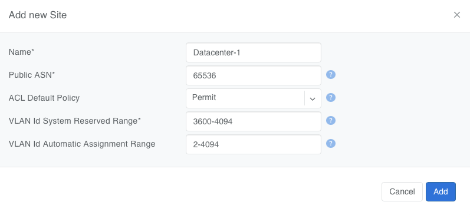

##############
Netris Site
##############

Overview
--------

A Netris Site is a discrete physical deployment — a region, data center, or other location. A Site defines the parameters that every network object at that location inherits: the BGP Autonomous System Number (ASN) used toward external peers, the default ACL policy, and the VLAN ID ranges available to the switch fabric.

Create one Site per location where Netris manages switches, SoftGate nodes, or DPUs. A Site must exist before any inventory, V-Net, or IPAM Subnet can be created, so creating the first Site is the first configuration step after installing the Controller.

.. raw:: html

   
<em>Figure: Add a Site</em>

Site scope
----------

Objects in Netris are either global, bound to exactly one Site, or spanning one or more Sites. Use the table below to determine where a Site selection is required.

.. list-table::
   :header-rows: 1
   :widths: 20 45 35

   * - Scope
     - Objects
     - Notes
   * - Global — no Site
     - Users, User Roles, Permission Groups, Tenants, VPCs, VPC Peerings, IPAM Allocations, Inventory Profiles, Server Cluster Templates, DHCP Options Sets, ACL Port Groups, E-BGP Objects, E-BGP Route-Maps
     - A VPC is a logical container; its child objects each select their own Site.
   * - Exactly one Site
     - Inventory units (switches, SoftGate nodes, servers, DPUs), Links, E-BGP peers, Static Routes, NAT rules, L4 Load Balancers, Server Clusters
     - A Link terminates on ports of two inventory units, so it inherits their Site. Backends of an L4 Load Balancer must belong to the same Site as the service.
   * - One or more Sites
     - V-Nets, IPAM Subnets
     - A Subnet assigned to multiple Sites is the mechanism for extending a V-Net across locations.
   * - Per VPC, per-Site default
     - ACL entries
     - An ACL entry belongs to a VPC and is installed per interface. The ACL Default Policy is set per Site and applies to every VPC at that Site.

Add a Site
----------

To add a new Site in Netris, navigate to Network → Sites and click the +Add button.

* **Site name** - an alphanumeric value identifying the physical location.
* **Public ASN** - the BGP Autonomous System Number Netris presents to peers outside the Netris-managed fabric. Netris uses it as the default Local ASN for every E-BGP session at this Site — sessions terminated on switches and on SoftGate nodes alike. The Local ASN of an individual E-BGP peer can be overridden to the switch's Local ASN or a custom value; see the :doc:`E-BGP section <bgp>`. The Public ASN is not used inside the fabric: each switch gets its own local ASN for the underlay, assigned automatically from the controller-wide System ASN range in Settings → General (default 4200000000–4209999999). Specify your registered public ASN here if you have one. If not, use a private ASN from 64512–65534 (16-bit) or 4200000000–4294967294 (32-bit) that does not fall inside the System ASN range. Netris documentation uses ASN 65536 in examples.
* **ACL Default Policy** - the action Netris applies to Layer-3 traffic that no ACL entry matches. Netris installs it as the final rule on every interface at the Site.

  * **Deny** - traffic is dropped unless an ACL entry permits it. DHCP and BGP control traffic is excluded from the policy and is never dropped, so no ACL entries are needed for Netris DHCP or E-BGP sessions to operate. Use this policy for a Zero Trust model.
  * **Permit** - traffic is forwarded unless an ACL entry denies it. This is the default.

  ACL entry precedence is determined by the sort order described in the :doc:`ACL section <acls>`, not by the Default Policy.

* **VLAN ID System Reserved Range** - VLAN IDs Netris reserves for the switch fabric itself: switch OS and ASIC requirements and the internal VLANs Netris uses to build V-Nets and other constructs. Netris never assigns these IDs to user-facing V-Nets. Default: 3600–4094.
* **VLAN ID Automatic Assignment Range** - the pool Netris draws from when "Automatically Assign" is selected during V-Net creation. Default: 2–4094. The two ranges may overlap. Where they do, the System Reserved Range is excluded from the pool: with the defaults, Netris auto-assigns from 2–3599 only.

Edit or delete a Site
---------------------

Site parameters can be changed after creation from Network → Sites. Changing the Public ASN resets E-BGP sessions that inherit it. Changing the ACL Default Policy to "Deny" on a Site with live workloads drops every flow that no ACL entry permits; plan the ACL entries before switching the policy.

.. warning::
  The ACL Default Policy applies to all VPCs at this Site and does not allow for per-VPC or per-V-Net exceptions.

A Site with inventory attached cannot be deleted. Remove or reassign every switch, SoftGate node, and DPU at the Site first.

API and Terraform
-----------------

Sites can be managed through the REST API and the Terraform provider (`netris_site <https://registry.terraform.io/providers/netrisai/netris/latest/docs/resources/site>`_). As of Netris 4.16.0 the ``switchFabricProviders`` attribute has been removed from the Sites API; ``switchFabric`` is still returned on read, always as ``netris``, and is ignored on create or update.
