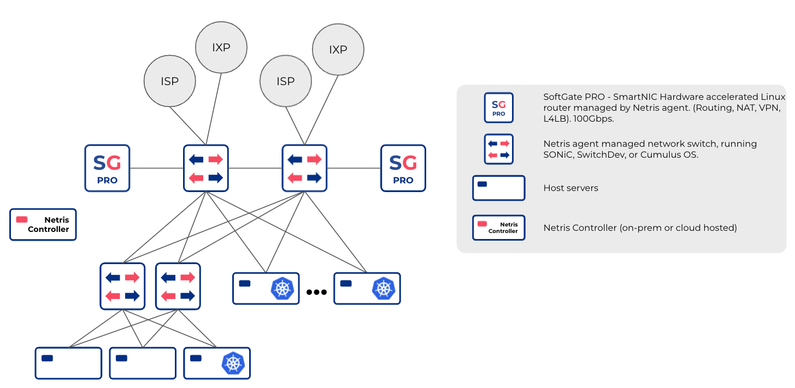
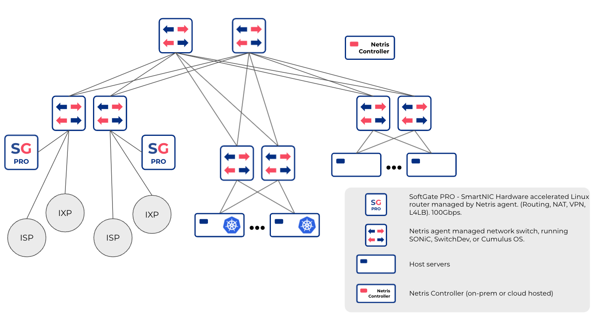

.. meta::
    :description: Supported Networks

##################
Supported Networks
##################

The following basic network designs are supported by Netris:

Unmanaged Switch & SoftGate
---------------------------

.. image:: images/slide-1.png
    :align: center

--------------------------

Unmanaged Switch & SoftGate (Redundant)
---------------------------------------

.. image:: images/slide-2.png
    :align: center

--------------------------

Netris Managed Switch & SoftGate (Redundant)
--------------------------------------------

--------------------------

Netris Managed Switch & SoftGate (Multipod)
--------------------------------------------

--------------------------