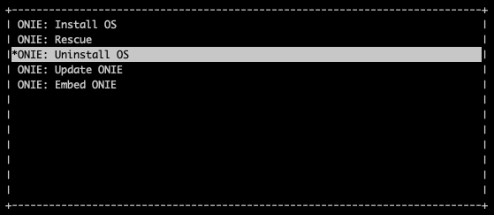
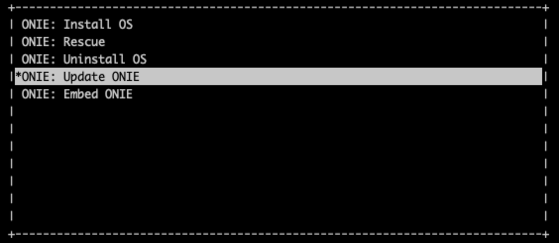
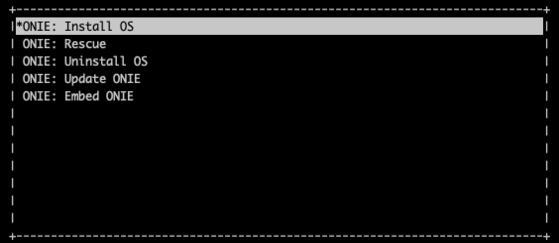

.. _switch-agent-installation:
.. meta::
  :description: Netris Switch Agent Installation

#########################
Switch Agent Installation
#########################

******************
Prerequisite Steps
******************

============================
Nvidia Cumulus Linux Devices
============================
Requirements:
* Fresh install of Cumulus Linux v. 3.7.(x) - Cumulus 4.X is in the process of validation and will be supported in the next Netris release.

Configure the OOB Management IP address
***************************************
Configure internet connectivity via management port.

.. code-block:: shell-session

    sudo vim /etc/network/interfaces

.. code-block:: shell-session

 # The loopback network interface
 auto lo
 iface lo inet loopback
 
 # The primary network interface
 auto eth0
 iface eth0 inet static
         address <management IP address/prefix length>
         gateway <gateway of management network>
         dns-nameserver <dns server>
 
 source /etc/network/interfaces.d/*

.. code-block:: shell-session

 sudo ifreload -a

Configure Nvidia Cumulus Linux License
**************************************

.. code-block:: shell-session

 sudo cl-license -i

Copy/paste the Cumulus Linux license string then press ctrl-d.

Continue to :ref:`"Install the Netris Agent"<switch-agent-installation-install-the-netris-agent>` section.

============================
Ubuntu SwitchDev Devices
============================

.. note::

  Further installation requires a Console and Internet connectivity via management port!
  
1. NOS Uninstall

Uninstall current NOS using **Uninstall OS** from grub menu:

    
Once the uninstallation is completed, the switch will reboot automatically.

2. Update ONIE

Select **Update ONIE** from grub menu:

In case you don't have DHCP in the management network, then stop ONIE discovery service and configure IP address and default gateway manually:

.. code-block:: shell-session

  onie-discovery-stop
  ip addr add <management IP address/prefix> dev eth0
  ip route add default via <gateway of management network>
  echo "nameserver <dns server>" > /etc/resolv.conf

Update ONIE to the supported version. 

.. note::

  ONIE image available for Mellanox switches only!

.. code-block:: shell-session

  onie-self-update https://repo.netris.ai/repo/onie-updater-x86_64-mlnx_x86-r0

3. NOS Install

Select **Install OS** from grub menu:

In case you don't have DHCP in the management network, then stop ONIE discovery service and configure IP address and default gateway manually:

.. code-block:: shell-session

  onie-discovery-stop
  ip addr add <management IP address/prefix> dev eth0
  ip route add default via <gateway of management network>
  echo "nameserver <dns server>" > /etc/resolv.conf

Install Ubuntu-SwitchDev from the Netris custom image:

.. code-block:: shell-session

  onie-nos-install https://repo.netris.ai/repo/netris-ubuntu-18.04.1.bin

Default username/password
 
``netris/newNet0ps``

Configure the OOB Management IP address
***************************************
Configure internet connectivity via management port.

.. code-block:: shell-session

    sudo vim /etc/network/interfaces

.. code-block:: shell-session

 # The loopback network interface
 auto lo
 iface lo inet loopback
 
 # The primary network interface
 auto eth0
 iface eth0 inet static
         address <management IP address/prefix length>
         gateway <gateway of management network>
         dns-nameserver <dns server>
 
 source /etc/network/interfaces.d/*

.. code-block:: shell-session

 sudo ifreload -a

Continue to :ref:`"Install the Netris Agent"<switch-agent-installation-install-the-netris-agent>` section.

============================
EdgeCore SONiC Devices
============================

.. note::

  Further installation requires a Console and Internet connectivity via management port!
  
1. NOS Uninstall

Uninstall current NOS using **Uninstall OS** from grub menu:

    
Once the uninstallation is completed, the switch will reboot automatically.

2. NOS Install

Select **Install OS** from grub menu:

In case you don't have DHCP in the management network, then stop ONIE discovery service and configure IP address and default gateway manually:

.. code-block:: shell-session

  onie-discovery-stop
  ip addr add <management IP address/prefix> dev eth0
  ip route add default via <gateway of management network>
  echo "nameserver <dns server>" > /etc/resolv.conf

Install EdgeCore SONiC image from the Netris repository:

.. code-block:: shell-session

  onie-nos-install https://repo.netris.ai/repo/Edgecore-SONiC_20211125_074752_ec202012_227.bin

Default username/password
 
``admin/YourPaSsWoRd``

Configure the OOB Management IP address
***************************************
Disable Zero Touch Provisioning for time being.

.. code-block:: shell-session
  
  ztp disable -y

.. note::
  This will take some time, please be patient.

Configure internet connectivity via management port.

.. code-block:: shell-session
  
  ip addr add <management IP address/prefix> dev eth0
  ip route add default via <gateway of management network>
  echo "nameserver <dns server>" > /etc/resolv.conf

Continue to :ref:`"Install the Netris Agent"<switch-agent-installation-install-the-netris-agent>` section.

.. _switch-agent-installation-install-the-netris-agent:

************************
Install the Netris Agent 
************************

1. Add the Switch in the controller **Inventory**. Detailed configuration documentation is available here: :ref:`"Adding Switches"<topology-management-adding-switches>`
2. Once the Switch is created in the **Inventory**, click on **three vertical dots (⋮)** on the right side on the Switch and select the **Install Agent** option
3. Copy the agent install command to your clipboard and run the command on the Switch
4. Reboot the Switch when the installation completes

.. code-block:: shell-session

 sudo reboot

Once the switch boots up you should see its heartbeat going from Critical to OK in Net→Inventory, Telescope→Dashboard, and switch color will reflect its health in Net→Topology

Screenshot: Net→Inventory

.. image:: images/inventory_heartbeat.png
   :align: center
