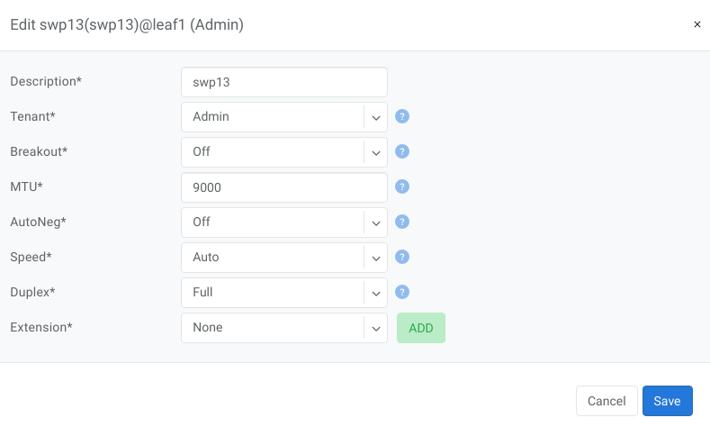
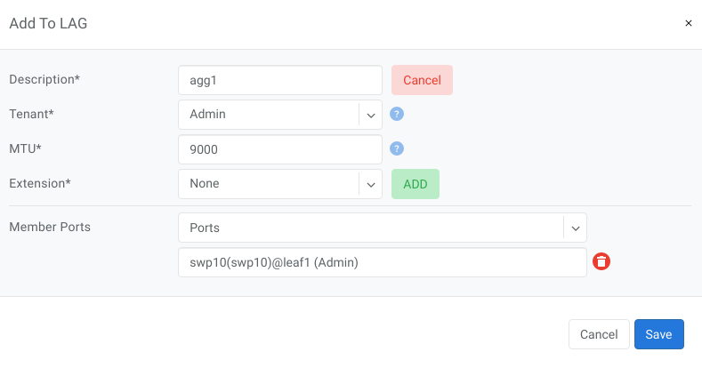

.. meta::
    :description: Switch Ports

============
Switch Ports
============

Switch ports can be directly managed in the **Switch Port** UI section.  Both physical and virtual ports (extended, aggregate, etc…) will appear in this section once they have been added to inventory. The Netris Controller will automatically sync the list of available ports that appear on each device.

The following options are available for editing on each port:

* Description - Description of the port.
* Tenant - Tenant to whom the port is assigned, by default it is the owner tenant of the device to whom the port belongs to.
* Breakout - Available only for physical ports of the switches, used to split physical port into multiple physical ports.
* MTU - Maximum transmission unit of the port.
* Autoneg - Toggle autonegotiation. Available only for physical ports.
* Speed - Toggle speed. Available only for physical ports.
* Duplex - Toggle duplex. Available only for physical ports.
* Extension - Create extension ports. Available for physical and aggregate ports.
* Extension Name - Name for new extension.
* VLAN Range - VLAN id range for new extension port.

Example: Edit physical port

Quick action menu provides following actions for ports (note that Bulk Action also available for multiple ports:

Edit - Edit the port.
Admin UP/Down - Toggle admin status of the port.
Add to V-net - Add selected port(s) to a V-net.

.. image:: images/quick-action-port.png
   :align: center
   :class: with-shadow

    Add to LAG - Add selected ports into a LAG.

Free Up Port - Detach port from all resources.
