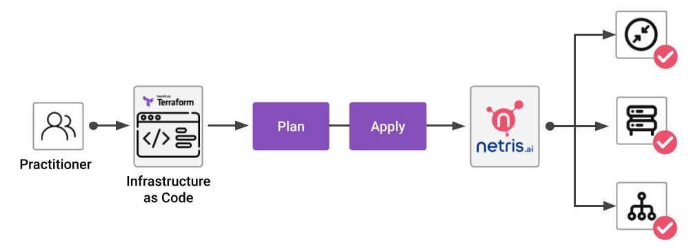

.. meta::
    :description: Terraform Integration
  
#####################
Terraform Integration
#####################

With Terraform you can easily provision your network resources in Netris and manage them using configuration files. They store the infrastructure description in HashiCorp Configuration Language (HCL).

When you make changes in the configuration files and apply them, Terraform automatically decides which part of your configuration is already deployed and what should be added or removed.

.. contents:: To create your first Terraform configuration:
   :local:

Install Terraform
=================

Download and install the `Terraform <https://www.terraform.io/downloads>`_

Create a directory for Terraform configuration files
====================================================

#. Create a directory with any name, for example, ``netris-terraform``. It stores the configuration files and saved states for Terraform and your infrastructure.
#. Create a configuration file with the ``.tf`` extension in this directory, such as ``main.tf``.

Configure a provider
====================

1. At the beginning of the configuration file, specify the provider settings.

.. code-block::

  terraform {
    required_providers {
      netris = {
        source  = "netrisai/netris"
      }
    }
  }

  provider "netris" {
    address = "<controller address>"
    login = "<controller login>"
    password = "<controller password>"
  }

Specify the provider required arguments:

* ``address`` - This is your Netris-Controller address (http://example.com). This can also be specified with the ``NETRIS_ADDRESS`` environment variable.
* ``login`` -  This is your Netris-Controller login. This can also be specified with the ``NETRIS_LOGIN`` environment variable.
* ``password`` - This is your Netris-Controller password. This can also be specified with the ``NETRIS_PASSWORD`` environment variable.

2. Execute the command ``terraform init`` in the folder with the configuration file. This command initializes the providers specified in the configuration files and lets you work with the provider resources and data sources.

Prepare an infrastructure plan
==============================

[todo]

Create resources
================

[todo]

Delete resources
================
[todo]
