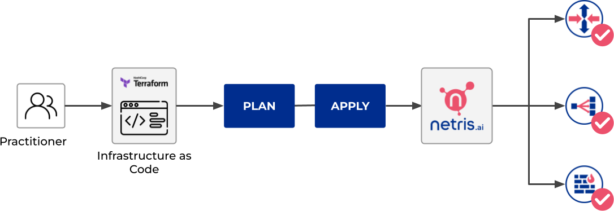

.. meta::
    :description: Terraform: Netris provider
  
##########################
Terraform: Netris provider
##########################

Use Netris provider to interact with the many resources supported by Netris. You must configure the provider with the proper credentials before you can use it.
To learn the basics of Terraform using this provider, follow the hands-on `get started tutorials <https://learn.hashicorp.com/tutorials/terraform/infrastructure-as-code?in=terraform/aws-get-started>`_ on HashiCorp’s Learn platform.

When you make changes in the Terraform files and apply them, Terraform automatically decides which part of your configuration is already deployed into Netris controller and what should be added or removed.

.. contents:: To create your first Terraform configuration:
   :local:

Install Terraform
=================

Download and install the `Terraform <https://www.terraform.io/downloads>`_

Create a directory for Terraform files
======================================

#. Create a directory with any name, for example, ``netris-terraform``. It stores the configuration files and saved states for Terraform and your infrastructure.
#. Create a configuration file with the ``.tf`` extension in this directory, such as ``main.tf``.

Configure a provider
====================

1. At the beginning of the configuration file, specify the provider settings.

.. code-block::

  terraform {
    required_providers {
      netris = {
        source  = "netrisai/netris"
        version = "1.1.0"
      }
    }
  }

  provider "netris" {
    address = "<controller address>"
    login = "<controller login>"
    password = "<controller password>"
  }

Specify the provider required arguments:

* ``address`` - This is your Netris-Controller address (http://example.com). This can also be specified with the ``NETRIS_ADDRESS`` environment variable.
* ``login`` -  This is your Netris-Controller login. This can also be specified with the ``NETRIS_LOGIN`` environment variable.
* ``password`` - This is your Netris-Controller password. This can also be specified with the ``NETRIS_PASSWORD`` environment variable.

2. Execute the command ``terraform init`` in the folder with the configuration file. This command initializes the providers specified in the configuration files and lets you work with the provider resources and data sources.

Prepare an infrastructure plan
==============================

By using Netris Terraform Provider, you can create all kinds of resources, such as Sites, IPAMs, Topology, Inventory, etc.
To create a resource, specify a set of required and optional parameters that define the resource properties. Such resource descriptions make up an infrastructure plan.

Infrastructure provisioning in Netris starts with Site resources. The Netris-Controller comes with the initial site ``Default``. You can use it in your Terraform configuration files by getting its ID with the Terraform `Data source element <https://www.terraform.io/language/data-sources>`_.

Let's create a separate file for site resource, and get its ID via Terraform Data source element.

.. code-block::

  cat << EOF > site.tf
  data "netris_site" "default" {
    name = "Default"
  }
  EOF

Or, you can create a new ``Site`` resource, `here <https://registry.terraform.io/providers/netrisai/netris/latest/docs/resources/site>`_ is the detailed documentation with examples.

Now, when we're clear on ``Site`` resource usage, let's define our IPAM. There are two types of IPAM resources in the Netris-Controller it’s ``Allocation`` and ``Subnet``. 
IPAM resources only require ``tenantid`` field, let's get our default Admin tenant ID with the Data source element.

.. code-block::

  cat << EOF > tenant.tf
  data "netris_tenant" "admin"{
    name = "Admin"
  }
  EOF

Then, when we have the ``tenantid``, we can create IPAM resources. 

.. code-block::
  
  cat << EOF > ipam.tf
  resource "netris_allocation" "my-allocation-mgmt" {
    name = "my-allocation-mgmt"
    prefix = "192.0.2.0/24"
    tenantid = data.netris_tenant.admin.id
  }
  
  resource "netris_allocation" "my-allocation-loopback" {
    name = "my-allocation-loopback"
    prefix = "198.51.100.0/24"
    tenantid = data.netris_tenant.admin.id
  }
  
  resource "netris_allocation" "my-allocation-common" {
    name = "my-allocation-common"
    prefix = "203.0.113.0/24"
    tenantid = data.netris_tenant.admin.id
  }
  
  resource "netris_subnet" "my-subnet-mgmt" {
    name = "my-subnet-mgmt"
    prefix = "192.0.2.0/24"
    tenantid = data.netris_tenant.admin.id
    purpose = "management"
    defaultgateway = "192.0.2.254"
    siteids = [data.netris_site.default.id]
    depends_on = [
      netris_allocation.my-allocation-mgmt,
    ]
  }
  
  resource "netris_subnet" "my-subnet-loopback" {
    name = "my-subnet-loopback"
    prefix = "198.51.100.0/24"
    tenantid = data.netris_tenant.admin.id
    purpose = "loopback"
    siteids = [data.netris_site.default.id]
    depends_on = [
      netris_allocation.my-allocation-loopback,
    ]
  }
  
  resource "netris_subnet" "my-subnet-common" {
    name = "my-subnet-common"
    prefix = "203.0.113.0/25"
    tenantid = data.netris_tenant.admin.id
    purpose = "common"
    siteids = [data.netris_site.default.id]
    depends_on = [
      netris_allocation.my-allocation-common,
    ]
  }
  EOF

With the command above, we've defined 6 resources, 3 of the type of Allocation, 3 of the type of Subnet, each Subnet resource has a different purpose.
For more details, get familiar with the IPAM `docs <https://www.netris.ai/docs/en/stable/ipam.html>`_.

Now, when we have all the required resources let's define our Inventory.
We're going to create 1 SoftGate, 1 switch and connect them with a link.

.. code-block::
  
  cat << EOF > inventory.tf
  resource "netris_softgate" "my-softgate" {
    name = "my-softgate"
    tenantid = data.netris_tenant.admin.id
    siteid = data.netris_site.default.id
    description = "Softgate 1"
    mainip = "auto"
    mgmtip = "auto"
    depends_on = [
      netris_subnet.my-subnet-mgmt,
      netris_subnet.my-subnet-loopback,
    ]
  }
  
  resource "netris_switch" "my-switch" {
    name = "my-switch"
    tenantid = data.netris_tenant.admin.id
    siteid = data.netris_site.default.id
    description = "Switch 01"
    nos = "cumulus_linux"
    asnumber = "auto"
    mainip = "auto"
    mgmtip = "auto"
    portcount = 16
    depends_on = [
      netris_subnet.my-subnet-mgmt,
      netris_subnet.my-subnet-loopback,
    ]
  }
  
  resource "netris_link" "sg-to-sw" {
    ports = [
      "swp1@my-softgate",
      "swp16@my-switch"
    ]
    depends_on = [
      netris_softgate.my-softgate,
      netris_switch.my-switch,
    ]
  }
  EOF

Next, let's define a local L3 network for our servers, suppose we want to connect 3 servers to our switch first 3 ports

.. code-block::
  
  cat << EOF > vnet.tf
  resource "netris_vnet" "my-vnet" {
    name = "my-vnet"
    tenantid = data.netris_tenant.admin.id
    state = "active"
    sites{
      id = data.netris_site.default.id
      gateways {
        prefix = "203.0.113.1/25"
      }
      ports {
        name = "swp1@my-switch"
        vlanid = 1050
      }
      ports {
        name = "swp2@my-switch"
        vlanid = 1050
      }
      ports {
        name = "swp3@my-switch"
      }
    }
    depends_on = [
      netris_switch.my-switch,
      netris_subnet.my-subnet-common,
    ]
  }
  EOF

And finally, we have to provide internet connectivity to our fabric, for that we'll define BGP resource. Suppose we're going to connect our ISP cable to the 10th port of our switch, and want to establish the BGP session on our Softgate.

.. code-block::
  
  cat << EOF > bgp.tf
  data "netris_port" "swp10_my_switch"{
    name = "swp10@my-switch"
    depends_on = [netris_switch.my-switch]
  }
  
  resource "netris_bgp" "my-bgp" {
    name = "my-bgp"
    siteid = data.netris_site.default.id
    hardware = "my-softgate"
    neighboras = 23456
    portid = data.netris_port.swp10_my_switch.id
    vlanid = 3000
    localip = "172.16.0.2/30"
    remoteip = "172.16.0.1/30"
    description = "My First BGP"
    prefixlistinbound = ["deny 127.0.0.0/8 le 32", "permit 0.0.0.0/0 le 24"]
    prefixlistoutbound = ["permit 192.0.2.0/24", "permit 198.51.100.0/24 le 25", "permit 203.0.113.0/24 le 26"]
    depends_on = [netris_link.sg-to-sw]
  }
  EOF

.. note::

  For more information about all resources, how to create and manage them in Terraform, see the `provider's documentation <https://registry.terraform.io/providers/netrisai/netris/latest/docs>`_.

Now, when we've done with the configuration files, let's check whether they are valid

.. code-block:: shell-session

  terraform validate

If the configuration is valid, the following message is returned:

.. code-block:: shell-session

  Success! The configuration is valid.

Create resources
================

1. After preparing and checking the configuration, run the command:

.. code-block:: shell-session

  terraform plan

The terminal will display a list of resources with parameters. This is a test step. No resources are created. If there are errors in the configuration, Terraform points them out.

2. To create resources, run the command:

.. code-block:: shell-session

  terraform apply

3. Confirm the resource creation: type ``yes`` in the terminal and press **Enter**.

Terraform will create all the required resources and the terminal will display the progress. After creation, you can check resource availability and their settings in the Netris-Controller UI.

Delete resources
================

1. To delete resources created using Terraform:

Run the command:

.. code-block:: shell-session

  terraform destroy

After the command is executed, the terminal will display a list of resources to be deleted.

2. Type ``yes`` to confirm their deletion and press **Enter**.
