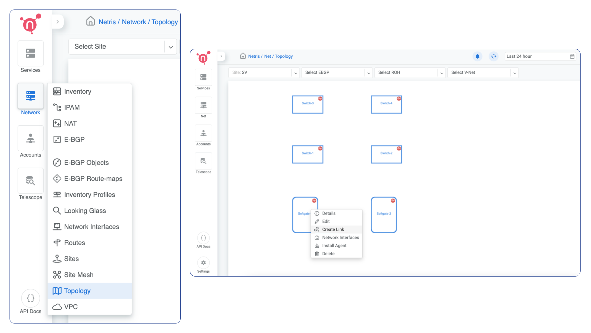
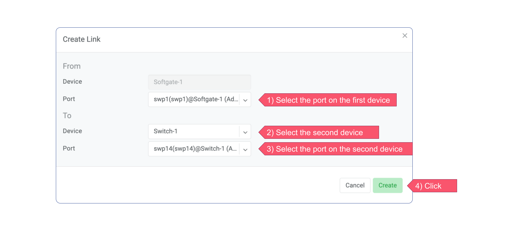
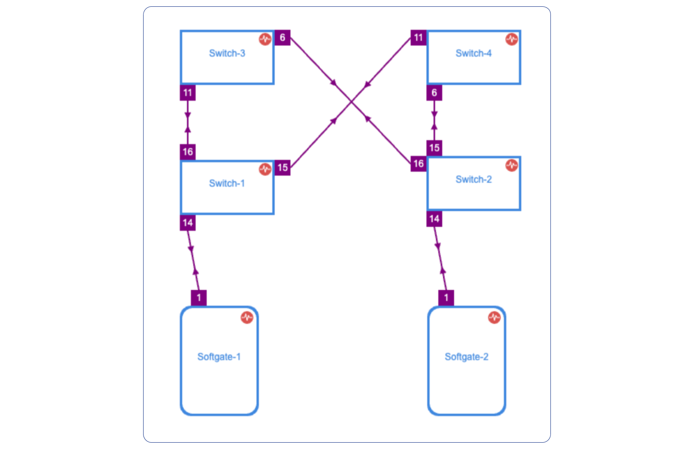

.. _topology-management:
.. meta::
    :description: Topology Management

=========
Inventory
=========

The Inventory section allows you to add/edit/delete network switches and SoftGates (VPC gateways). Initial setup of a Netris managed network is a three step process:

#. Create :doc:`inventory-profile`.
#. Adding Switches.
#. Adding Softgates.

.. note::
  You can also add new devices in the Topology view.

.. _topology-management-adding-switches:

Adding Switches
===============

Every switch needs to be added to the Netris Controller inventory. You can add new devices with the following process:

#. Navigate to **Network -> Inventory**
#. Click the **Add** button
#. Fill in the fields as described below
#. Click the **Add** button

 .. csv-table:: Add Inventory Fields - Switch
    :file: tables/inventory-add-switch.csv
    :widths: 25, 75
    :header-rows: 0

**Example:**  Add a new Switch.

  .. image:: images/inventory_switch.png
     :align: center

.. note:: Repeat this process to define all your switches.

.. _topology-management-adding-softgates:

Adding SoftGates
================
Every SoftGate node needs to be added to the Netris Controller inventory.

The installation process for SoftGate HS is described in the :ref:`SoftGate HS installation <netris-softgate-HS-installation>` section.

.. _topology-management-adding-servers:

Adding Servers
==============

Every server needs to be added to the Netris Controller inventory. You can add new devices with the following process:

#. Navigate to **Network -> Inventory**
#. Click the **Add** button
#. Fill in the fields as described below
#. Click the **Add** button

 .. csv-table:: Add Inventory Fields - Server
    :file: tables/inventory-add-server.csv
    :widths: 25, 75
    :header-rows: 0

**Example:**  Add a new Server.

  .. image:: images/inventory_server.png
     :align: center

.. note:: Repeat this process to define all your servers.

.. _topology-management-adding-dpus:

Adding DPUs
===========

Starting with Netris 4.7, you can operate NVIDIA BlueField-3 DPUs. Unlike switches, servers, and SoftGates, DPUs are not standalone inventory objects, but rather a part of the server object. You can find more details about DPU support in Netris in the :doc:`NVIDIA BlueField-3 DPUs <bluefield-3-dpus>` section.

To add a DPU to a Netris server object, add or edit the server object in which the DPU is installed and fill in the DPU fields as described below:

#. Navigate to **Network -> Inventory**
#. Find the server object in which the DPU is installed and click **Edit**. If the server object does not exist, create it with the process described in :ref:`Adding Servers <topology-management-adding-servers>` section.
#. Set the **DPUs** field to the number of DPUs installed in the server and configured in Zero-Trust mode.
#. Fill in the fields as described below
#. Click the **Save** button

 .. csv-table:: Add Inventory Fields - DPU
    :file: tables/inventory-add-dpu.csv
    :widths: 25, 75
    :header-rows: 0

**Example:**  Add a new DPU.

  .. image:: images/inventory_dpu.png
     :align: center

.. note:: Repeat this process to define all your DPUs.

.. _topology-manager:

================
Topology Manager
================

The topology manager is used for describing and monitoring the desired network topology. Netris Switch Agents software will automatically configure the underlying network devices according to this topology and will watch against potential failures. Wire your switches in accordance with the topology view.

Adding Links
============

To define the links in the network:

#. Right-click on the spine switch
#. Click **Create Link**
#. Select the **From Port** and the **To Port**

See the example below:  

    
Once the links have been defined, the network is automatically configured as long as physical connectivity is in place and Netris Agents can communicate with Netris Controller.

.. tip:: You can drag/move the units to your desired positions and click “Save positions”.
