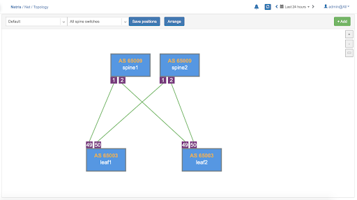
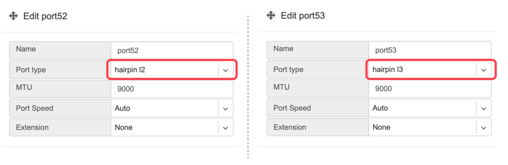
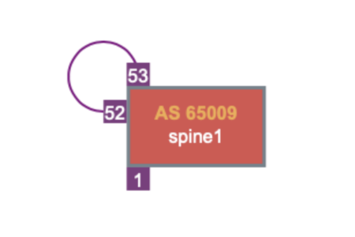

.. meta::
    :description: Topology Management

=========
Inventory
=========
Inventory allows you to add/edit/delete network switches and Softgates
Initial setup of a Netris managed network is a two part process:

#. Adding Switches
#. Adding Softgates

Adding Switches to Inventory
===========================
Every switch needs to be added to the Netris Controller inventory.  You can add new devices with the following process:

#. Navigate to **Net→Inventory**
#. Click the **Add** button
#. Fill in the fields as described below
#. Click the **Add** button

 The descriptions of parameters of inventory devices are following:
* **Name** - Name of the device
* **Owner Tenant**  - Owner tenant of the device
* **Description** - Description of the device
* **Type** - There are 3 types of devices that users can add/edit - Switch, Softgate and Controller. Other types are added automatically when creating services like ROH
* **NOS** - Operating system of the device, applicable for switches only  
* **Site** - Site where the devices reside.
* **AS Number** - Private AS number of the device, applicable for switches only, recommended to be assigned automatically
* **Profile** - Inventory profile for current device. Profiles are used for security hardening the devices
* **Main IP address** - Main loopback IP address for the device. Can be configured manually, or assigned automatically from subnet with “loopback” purpose defined for current site.
* **Management IP address** - Management IP address for the device. Can be configured manually, or assigned automatically from subnet with “management” purpose defined for current site. This IP address is configured on the out-of-band management interface of the device. 
* **MAC address** - MAC address of the device, applicable for switches only
* **Preliminary port count** - Used for definition of topology. When the device registers with the controller the real ports are synced with inventory
* **Add Link** - provides functionality to define the connections between devices, mandatory for Switch and Softgate physical interconnections

**Example:**  Add a new Switch.

  .. image:: images/add-new-hardware.png
      :align: center
      :class: with-shadow

.. note:: Repeat this process to define all your switches.

Adding SoftGates to Inventory
=============================
Every SoftGate node needs to be added to the Netris Controller inventory.  To add a SoftGate node:

#. Navigate to **Net→Topology**
#. Click **Add**
#. Fill in the fields as described below
#. Click the **Add** button

* **Name** - Descriptive name.
* **Owner Tenant** - Tenant(typically Admin), who administers this node.
* **Description** - Free text description.
* **Hardware Type** - NFV node.
* **Site** - The data center where the current SoftGate node belongs. 
* **Inventory Profile** - Profile describing the timezone, DNS, NTP, and Security features.
* **IP Address** - IPv4 address for the loopback interface.
* **Management IP address** - IPv4 address for the out of band management interface. 
* **NFV Node Port** - A physical port on a spine switch where the SoftGate node's first SmartNIC port is connected. Typically each spine switch has one SoftGate node connected to it. 
* **+NAT address** - Public IP addresses to be used as global IP for SNAT/DNAT. (check Enabling NAT section of Network Policies chapter)
* **+NAT address pool** - Public IP address subnets to be used as rolling global IP addresses for SNAT. (check Enabling NAT section of Network Policies chapter)

Example: Adding a SoftGate Node to Topology.

.. image:: images/softgate_node.png
    :align: center
    :class: with-shadow

Viewing Device Inventory
========================

Inventory Listing shows also Heartbeat and monitoring statuses of each device.

Heartbeat - Shows the status of device reachability.
Health - Shows number of successful and failed checks on the device.

  .. image:: images/inventory-listing.png
      :align: center
      :class: with-shadow      

.. note:: You can also add new devices in the Topology view.

================
Topology Manager
================

The topology manager is for describing and monitoring the desired network topology. Netris Switch Agents will configure the underlying network devices according to this topology dynamically and start watching against potential failures.

Adding Links
============

To define the links, right-click on the spine switch, then click create a link. Select the “from port,” then “to device” and “port.” See the example below.  

.. image:: images/create_link.png
    :align: center
    :class: with-shadow
    
All links require definition in the topology manager. Topology links can also be described through a .yaml file when using Kubernetes CRD. (a GUI wizard is planned to be available in v2.10).

    
Once the links have been defined, the network is automatically configured as long as physical connectivity is in place and Netris Agents can communicate with Netris Controller.

.. tip:: You can drag/move the units to your desired positions and click “Save positions”.

Hairpin Links (Cumulus only) 
============================
With Cumulus Linux only, we need to loop two ports on spine switches (hairpin cable) in the current release, usually two upstream (higher capacity) ports. We are planning to lift this requirement in the next Netris release (v2.10).

To define what ports will be used as a hairpin, navigate to Net→Switch Ports, or right-click on the spine switch, click Ports in Net-->Topology.

Example: Accessing Switch Ports from Net→Topology

.. image:: images/switch_port.png
    :align: center
    :class: with-shadow

For each spine switch, find the two ports that you are going to connect (loop/hairpin) and configure one port as a “hairpin **l2**” and another port as “hairpin **l3**”. The order doesn’t matter. The system needs to know which ports you have dedicated for the hairpin/loop on each spine switch. (do not do this for non-Cumulus switches)  
|
|
Example: Editing Switch Port from Net→Switch Ports.

.. image:: images/edit_switch_port.png
    :align: center
    :class: with-shadow
    
Example: Setting port types to “hairpin l2” and “hairpin l3”.

    
Screenshot: Hairpin visualized in Net→Topology

