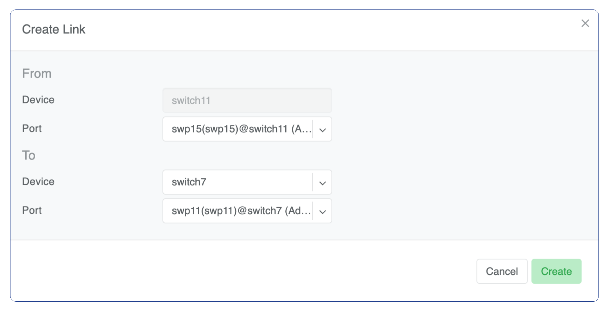

.. _topology-management:
.. meta::
    :description: Topology Management

=========
Inventory
=========

The Inventory section allows you to add/edit/delete network switches and SoftGates (VPC gateways). Initial setup of a Netris managed network is a three step process:

#. Create :doc:`inventory-profile`.
#. Adding Switches.
#. Adding Softgates.

.. _topology-management-adding-switches:

Adding Switches
===============

Every switch needs to be added to the Netris Controller inventory. You can add new devices with the following process:

#. Navigate to **Network → Inventory**
#. Click the **Add** button
#. Fill in the fields as described below
#. Click the **Add** button

 .. csv-table:: Add Inventory Fields - Switch
    :file: tables/inventory-add-switch.csv
    :widths: 25, 75
    :header-rows: 0

**Example:**  Add a new Switch.

  .. image:: images/add-new-hardware.png
     :align: center

.. note:: Repeat this process to define all your switches.

.. _topology-management-adding-softgates:

Adding SoftGates
================
Every SoftGate node needs to be added to the Netris Controller inventory.

The installation process for SoftGate HS is described in the :ref:`SoftGate HS installation <netris-softgate-HS-installation>` section.

================
Topology Manager
================

The topology manager is for describing and monitoring the desired network topology. Netris Switch Agents software will automatically configure the underlying network devices according to this topology and will watch against potential failures.

Adding Links
============

To define the links in the network:

#. Right-click on the spine switch
#. Click **Create Link**
#. Select the **From Port** and the **To Port**

See the example below:  

    

    
Once the links have been defined, the network is automatically configured as long as physical connectivity is in place and Netris Agents can communicate with Netris Controller.

.. tip:: You can drag/move the units to your desired positions and click “Save positions”.
