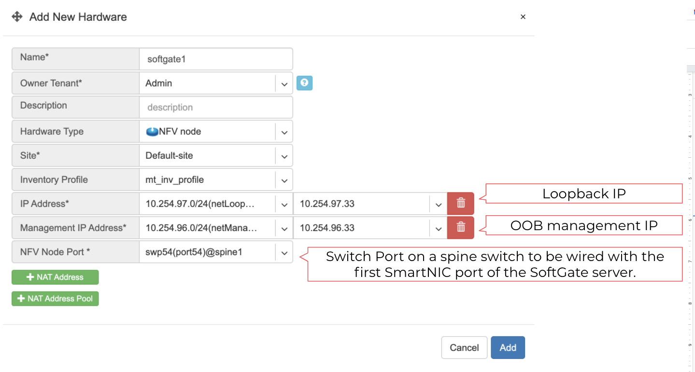

.. meta::
    :description: Topology Management

================
Topology Manager
================
The network topology is designed and created in the Topology Manager.

Initial setup of a Netris managed network is a two part process:

#. Adding Devices
#. Adding Links

Adding Devices to Topology
===========================
You need to define every switch in the Net→Topology section. To add a switch, navigate to Net→Topology and click **Add**.

* **Name** - Descriptive name.
* **Owner Tenant**  - Tenant(typically Admin) who administers this node.
* **Description** - Free text description.
* **Hardware Type** - For switches: Spine Switch or Leaf Switch.
* **NOS** - Network operating system. Cumulus Linux, Ubuntu SwitchDev (Nvidia Mellanox only), SONiC (not for production use yet)  
* **Site** - The site where the switch belongs. 
* **Inventory Profile** - Reference to Timezone, DNS, NTP, and Security features profile.
* **IP Address** - IPv4 address for the loopback interface.
* **Management IP address** - IPv4 address for the out of band management interface. 
* **Zero-touch provisioning** - Automatically install the NOS. (Experimental in this version) 
* **MAC address** - Out of band management interface MAC address used for zero-touch provisioning. (Experimental in this version)
* **The number of ports** - It is required for the topology manager. WIll be synced to the real number of Switch Ports when Netris Switch Agent establishes the very first connection with the Netris Controller.

**Example:**  Adding a spine switch w/ Cumulus Linux.

  .. image:: images/new_hardware.png
      :align: center
      :class: with-shadow

.. tip:: You can drag/move the units to your desired positions and click “Save positions”.

.. note:: Repeat this process to define all your switches.

Topology Manager
================
The topology manager is for describing and monitoring the desired network topology. Netris Switch Agents will configure the underlying network devices according to this topology dynamically and start watching against potential failures.

To define the links, right-click on the spine switch, then click create a link. Select the “from port,” then “to device” and “port.” See the example below.  

.. image:: images/create_link.png
    :align: center
    :class: with-shadow
    
All links require definition in the topology manager. Topology links can also be described through a .yaml file when using Kubernetes CRD. (a GUI wizard is planned to be available in v2.10).

.. image:: images/topology_manager.png
    :align: center
    :class: with-shadow
    
Now when network units and links are defined, your network is automatically configured as long as physical connectivity is in place and Netris Agents can communicate with Netris Controller.

Hairpin (Cumulus only) 
======================
With Cumulus Linux only, we need to loop two ports on spine switches (hairpin cable) in the current release, usually two upstream (higher capacity) ports. We are planning to lift this requirement in the next Netris release (v2.10).

To define what ports will be used as a hairpin, navigate to Net→Switch Ports, or right-click on the spine switch, click Ports in Net-->Topology.

Example: Accessing Switch Ports from Net→Topology

.. image:: images/switch_port.png
    :align: center
    :class: with-shadow

For each spine switch, find the two ports that you are going to connect (loop/hairpin) and configure one port as a “hairpin **l2**” and another port as “hairpin **l3**”. The order doesn’t matter. The system needs to know which ports you have dedicated for the hairpin/loop on each spine switch. (do not do this for non-Cumulus switches)  
|
|
Example: Editing Switch Port from Net→Switch Ports.

.. image:: images/edit_switch_port.png
    :align: center
    :class: with-shadow
    
Example: Setting port types to “hairpin l2” and “hairpin l3”.

.. image:: images/hairpin.png
    :align: center
    :class: with-shadow
    
Screenshot: Hairpin visualized in Net→Topology

.. image:: images/hairpin_topology.png
    :align: center
    :class: with-shadow

--------------------------

Adding SoftGate nodes to Topology
=================================
Every SoftGate node first needs to be defined in Netris Controller.
To add a SoftGate node, please go to Net→Topology and click +Add.

* **Name** - Descriptive name.
* **Owner Tenant** - Tenant(typically Admin), who administers this node.
* **Description** - Free text description.
* **Hardware Type** - NFV node.
* **Site** - The data center where the current SoftGate node belongs. 
* **Inventory Profile** - Profile describing the timezone, DNS, NTP, and Security features.
* **IP Address** - IPv4 address for the loopback interface.
* **Management IP address** - IPv4 address for the out of band management interface. 
* **NFV Node Port** - A physical port on a spine switch where the SoftGate node's first SmartNIC port is connected. Typically each spine switch has one SoftGate node connected to it. 
* **+NAT address** - Public IP addresses to be used as global IP for SNAT/DNAT. (check Enabling NAT section of Network Policies chapter)
* **+NAT address pool** - Public IP address subnets to be used as rolling global IP addresses for SNAT. (check Enabling NAT section of Network Policies chapter)

Example: Adding a SoftGate Node to Topology.

