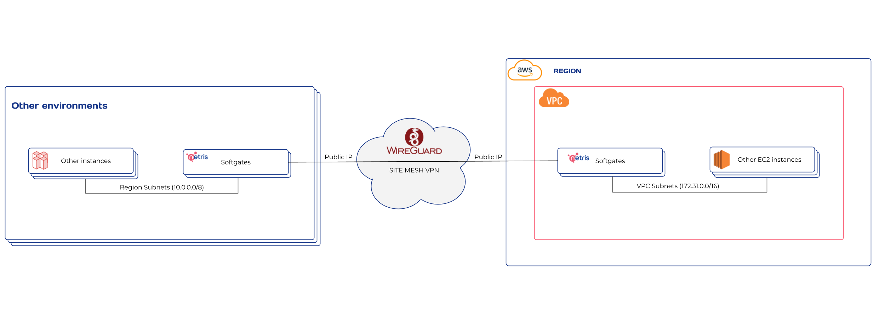

###################################
Site-to-Site Mesh with AWS Overview
###################################

Introduction
-------------

This guide provides a step-by-step process to set up and configure Netris Softgate in AWS for establishing a site-to-site mesh network between the user's on-premises, AWS, and other cloud environments.

Concept
--------

Netris Softgate in AWS is an EC2 instance that runs the Netris software. Therefore, you'll first need to create an EC2 instance for Netris Softgate and install the Netris software on it. Once that's done, you'll need to configure the routes in your AWS VPC for all destination IP subnets that exist in your other environments, such as on-premises or other clouds. This will allow your AWS VPC to access those destinations through the Netris Softgate EC2 instance.

Once the routes are configured, you can enable a site-to-site mesh between Netris Softgate instances in different environments. Enabling the site-to-site mesh allows for secure communication between different environments and enables you to route traffic between the different subnets in a secure and efficient way.
