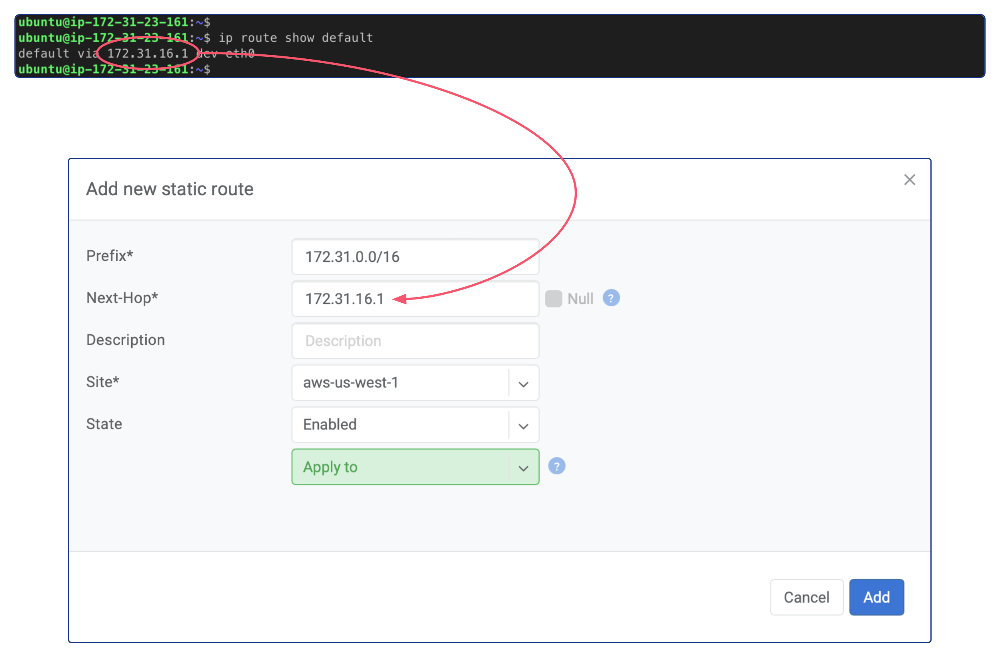

.. meta::
  :description: Deploy a Softgate in AWS

########################
Deploy a Softgate in AWS
########################

As stated in the previous section, the following sequence of actions must be taken in order to proceed: create an EC2 instance, add Softgate into the Netris Controller, install Netris Softgate software on the EC2 instance, and configure routes in AWS VPC. Let us commence with these steps in the specified order.

Create an EC2 instance
======================

Due to Netris Softgate is a network device capable of supporting numerous network services and being equipped with its own firewall, it is advisable to open all ports for the associated EC2. To achieve this, create a security group with the "All traffic" type and "Anywhere" source for both inbound and outbound rules. Afterward, an EC2 instance can be created using the security group above.

.. image:: images/aws-security-group.png
  :align: center

To enable connectivity with other Netris sites, it is essential to create the EC2 instance in the desired VPC. Therefore, provision a new EC2 instance with the Ubuntu 22.04 operating system installed, utilizing an instance type that meets the minimum hardware requirements of 2 virtual CPUs and 4 GB of RAM, such as t2.medium/t3.medium or any other type that satisfies these specifications. It is also recommended to allocate at least 30 GB of drive space.

.. image:: images/aws-softgate-deployed.png
  :align: center

After successfully deploying the EC2 instance, it is crucial to take note of its Public IPv4 address. This address will be required in the upcoming step.

Configure Netris Controller
===========================

Prior to defining a Softgate in the Netris Controller, certain pre-requisite steps must be completed.

Pre-Requisite Steps
-------------------

In the Netris Controller, the initial step involves creating a new site. To create it, follow the steps below:

1. Open the Netris Web Console.
2. Navigate to "Net" and select "Sites".
3. Click on the "+ Add" button.
4. Select "Dot1q Trunk" as the "Switch Fabric".
5. Input a descriptive name for the site.
6. Specify ``65500`` in the "Public ASN" field.
7. Click "Add" to create the new site.

.. image:: images/aws-netris-site-create.png
  :align: center

Subsequently, it is necessary to create a private subnet for Softgate management. To achieve this, follow the steps below:

1. Go to the "IPAM" section under the "Net" tab.
2. Click on the "+ Add" button located at the top-right corner.
3. Enter a unique "Prefix" for the new subnet, such as ``10.255.255.0/24``.
4. Type a descriptive "Name" for the subnet.
5. Select the desired tenant name from the "Tenant" dropdown menu.
6. From the "Type" dropdown menu, select "Subnet".
7. Select "management" from the "Purpose" dropdown menu.
8. Choose the appropriate site from the "Sites" dropdown menu.
9. Click on the "Add" button to create the subnet.

.. image:: images/aws-netris-ipam-mgmt.png
  :align: center

Following the creation of the private subnet for Softgate management, it is necessary to create another subnet with the "Purpose" of loopback. The "Prefix" for this subnet will be the Public IPv4 address of the AWS EC2 instance with a netmask length of /32. For instance, if the EC2 instance's IP address is 54.176.11.144, then the "Prefix" for the loopback subnet will be 54.176.11.144/32. However, unlike the subnet for Softgate management, an allocation for that "Prefix" must first be created before creating the subnet for loopback.

Add AWS VPC Subnet into the Netris
----------------------------------

To register your AWS VPC's entire CIDR block into Netris IPAM, follow these steps:

1. From the AWS Console, navigate to your VPC and take note of your CIDR blocks.
2. In Netris Controller, go to the "IPAM" section under the "Net" tab.
3. Click the "+ Add" button located at the top-right corner.
4. Enter the VPC CIDR block into the "Prefix" field for the new subnet. For example, if your CIDR block is "172.31.0.0/16", enter that value.
5. Type a descriptive name for the subnet.
6. From the "Tenant" dropdown menu, select the desired tenant name.
7. From the "Type" dropdown menu, select "Subnet".
8. Select "inactive" from the "Purpose" dropdown menu.
9. Choose the appropriate site from the "Sites" dropdown menu.
10. Click the "Add" button.

Static route for AWS VPC Subnet in Netris Controller
----------------------------------------------------

In the previous step, we added the AWS VPC CIDR block into Netris IPAM. However, Netris Softgate creates a blackhole route for each subnet. This means that Softgate will not be able to reach EC2 instances in other Availability Zones (AZs). To prevent this from happening, we need to create a static route in Netris. The prefix for the route will be the AWS VPC CIDR block, and the next-hop will be the default gateway of Netris Softgate EC2.

Here are the steps to create the static route:

1. Securely log in to the Netris Softgate's EC2 instance using SSH.
2. Retrieve the default gateway address by typing the command ``ip route show default``.
3. In Netris Controller, go to the "Routes" section under the "Net" tab.
4. Click on the "+ Add" button located at the top-right corner of the screen.
5. Enter your VPC CIDR block in the "Prefix" field.
6. Enter the default gateway of the Netris Softgate EC2 instance in the "Next-Hop" field.
7. Select the appropriate site from the "Site" dropdown menu.
8. Finally, click on the "Add" button to create the static route.

Add Softgate into the Netris Controller
---------------------------------------

After completing all the pre-required steps, the next step is to create a Softgate in the Netris Controller. Here is a step-by-step guide:

1. Ensure that you have completed all the pre-required steps.
2. Navigate to the "Net" tab in the Netris Controller and select the "Inventory" section.
3. Click on the "+Add" button to create a new Softgate.
4. Provide a descriptive name for the Softgate in the "Name" field.
5. From the "Tenant" dropdown menu, select the same tenant name used in the pre-required steps when creating the subnets.
6. From the "Type" dropdown menu, select "SoftGate".
7. Choose the appropriate site from the "Site" dropdown menu.
8. For the "Main IP address" and "Management IP Address" fields, select "Assign automatically".
9. In the "Description" field, add ``int=eth0`` to specify that Netris should use the softgate's eth0 interface instead of the default bond0 interface that Netris Softgate Agent looks for.
10. Finally, click on the "Add" button to create the Softgate.

Install Netris Softgate Agent on EC2 instance
---------------------------------------------

After creating a softgate resource in Netris Controller, the next step is to install the softgate agent. This can be done by clicking the three vertical dots (⋮) on the right side of the created SoftGate node and selecting "Install Agent". Copy the one-line installer command to your clipboard and connect to your EC2 instance via SSH. Paste the copied command into the terminal and wait for the provisioning to finish. Once it's done, reboot the server.

.. image:: images/aws-netris-provision-sg.png
  :align: center

Configure AWS VPC
=================

Adding routes
-------------

To enable specific traffic to be routed to the Netris Softgate EC2 instance in your AWS VPC, you need to modify your VPC's Route Table. To get started, go to the AWS Console and navigate to your VPC's Route Table. From there, click the "Edit routes" button to access the routing table, and then click "Add route" to create a new routing entry.

In the "Destination" field, enter the subnet CIDR block for the Netris other Sites' subnets you want to access from this VPC. Next, in the "Target" field, select the "Instance" option and then select the Netris Softgate EC2 instance you previously created. This will ensure that traffic for those subnets is directed to the Softgate instance.

EC2 Source / destination check
------------------------------

To allow Netris SoftGate to work properly, it is necessary to disable the 'Source / destination check' for the SoftGate's EC2 Instance. To do so, follow the steps below:

1. Go to the AWS Console and navigate to the EC2 service page.
2. Select the SoftGate EC2 instance.
3. Click on the "Actions" button in the "Networking" section.
4. Select "Change Source / destination check".
5. Mark the "Stop" checkbox to disable the feature.
6. Click "Save" to apply the changes.

By disabling the "Source / destination check", the SoftGate EC2 instance can receive and forward traffic between the Netris other Sites and AWS VPC subnets.

Enabling Site-to-Site Mesh
==========================

To enable Site-to-Site Mesh, in Netris Controller, navigate to the "Net" tab and select "Sites". Next, click on the three vertical dots (⋮) on the right side of the AWS site and select "Edit", and then from the "Site Mesh" dropdown menu, select "Hub". Save the changes. Repeat these steps for all sites that need to have meshed.

The Site Mesh status can be viewed by navigating to the "Site Mesh" section under the "Net" tab. This will display the current status of Site Mesh for all Sites.

