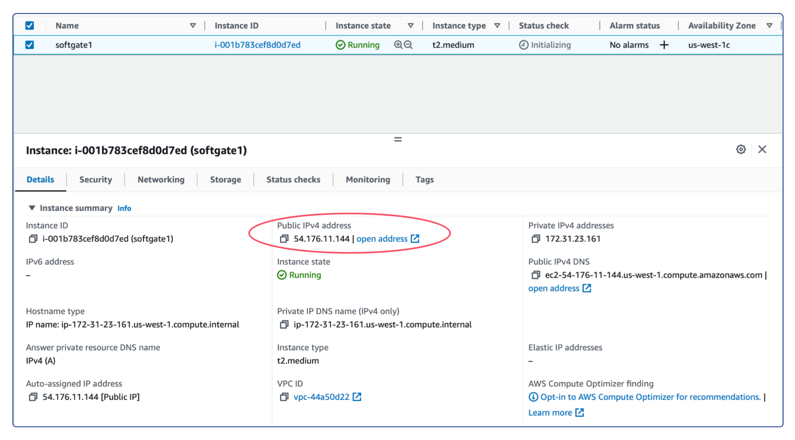

.. meta::
  :description: Deploy a Softgate in AWS

########################
Deploy a Softgate in AWS
########################

As stated in the previous section, the following sequence of actions must be taken in order to proceed: create an EC2 instance, add Softgate into the Netris Controller, install Netris Softgate software on the EC2 instance, and configure routes in AWS VPC. Let us commence with these steps in the specified order.

Create an EC2 instance
======================

Due to Netris Softgate is a network device capable of supporting numerous network services and being equipped with its own firewall, it is advisable to open all ports for the associated EC2. To achieve this, create a security group with the "All traffic" type and "Anywhere" source for both inbound and outbound rules. Afterward, an EC2 instance can be created using the security group above.

To enable connectivity with other Netris sites, it is essential to create the EC2 instance in the desired VPC. Therefore, provision a new EC2 instance with the Ubuntu 22.04 operating system installed, utilizing an instance type that meets the minimum hardware requirements of 2 virtual CPUs and 4 GB of RAM, such as t2.medium/t3.medium or any other type that satisfies these specifications. It is also recommended to allocate at least 30 GB of drive space.

After successfully deploying the EC2 instance, it is crucial to take note of its Public IPv4 address. This address will be required in the upcoming step.

Configure Netris Controller
===========================

Prior to defining a Softgate in the Netris Controller, certain pre-requisite steps must be completed.

Pre-Requisite Steps
-------------------

In the Netris Controller, the initial step involves creating a new site. To do so, go to Netris Web Console → Net → Sites and click +Add. Here, create a new site by selecting "Dot1q Trunk" as the "Switch Fabric" inputting a descriptive name for the site, and specifying "65500" in the "Public ASN" field.

Subsequently, it is necessary to create a private subnet for Softgate management. To achieve this, navigate to the "IPAM" section under the "Net" tab and click the "+ Add" button located at the top-right corner. Next, input a unique "Prefix" for the new subnet, such as "10.255.255.0/24," and a descriptive "Name". From the "Tenant" dropdown menu, select the desired tenant name, and from the "Type" dropdown menu, select "Subnet". Then, select "management" from the "Purpose" dropdown menu and choose the appropriate site from the "Sites" dropdown menu.

.. image:: images/aws-netris-ipam-mgmt.png
  :align: center

Following the creation of the private subnet for Softgate management, it is necessary to create another subnet with the "Purpose" of loopback. The "Prefix" for this subnet will be the Public IPv4 address of the AWS EC2 instance with a netmask length of /32. For instance, if the EC2 instance's IP address is 54.176.11.144, then the "Prefix" for the loopback subnet will be 54.176.11.144/32. However, unlike the subnet for Softgate management, an allocation for that "Prefix" must first be created before creating the subnet for loopback.

.. image:: images/aws-netris-ipam-lo.png
  :align: center

Add Softgate into the Netris Controller
---------------------------------------

After completing all the pre-required steps, the next step is to create a Softgate in the Netris Controller. To do this, navigate to Net → Inventory and click on the +Add button. Provide a descriptive name for the Softgate in the "Name" field. From the "Tenant" dropdown menu, select the same tenant name that was used in the previous step when creating the subnets. From the "Type" dropdown menu, select "SoftGate", and choose the appropriate site from the "Sites" dropdown menu. For the "Main IP address" and "Management IP Address" fields, select "Assign automatically". Finally, add "int=eth0" into the "Description" field to specify that Netris should use the softgate's eth0 interface instead of the default bond0 interface that Netris Softgate Agent looks for.

.. image:: images/aws-netris-create-sg.png
  :align: center

Install Netris Softgate Agent on EC2 instance
---------------------------------------------

After creating a softgate resource in Netris Controller, the next step is to install the softgate agent. This can be done by clicking the three vertical dots (⋮) on the right side of the created SoftGate node and selecting "Install Agent". Copy the one-line installer command to your clipboard and connect to your EC2 instance via SSH. Paste the copied command into the terminal and wait for the provisioning to finish. Once it's done, reboot the server.

