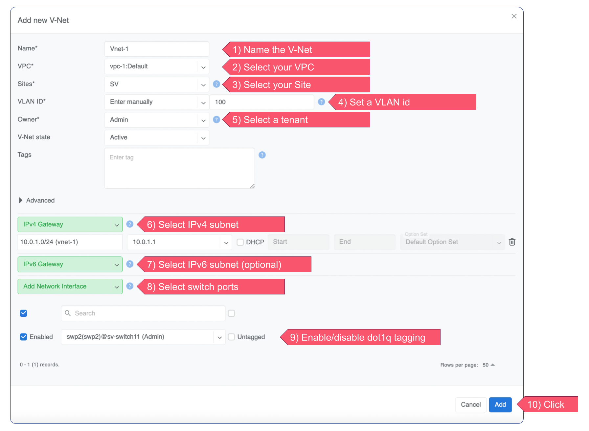

===============================================
Connecting servers to the Netris managed fabric
===============================================

To connect servers or other endpoints to the switch fabric, you should use V-Nets. V-Net is a virtual networking service that provides Layer-2 (unrouted) or Layer-3 (routed) virtual network segments on switch ports throughout the switch fabric. Netris automatically configures a VXLAN with an EVPN control plane over an unnumbered BGP Layer-3 underlay network and manages the high availability for the default gateway behind the scenes. Simply add the necessary switch ports to a V-Net, and Netris will handle the rest.
Navigate to Services → V-Net → +Add

If you are planning to use Link Aggregation in your setup, please take a look at the options provided by Netris here [link to the LAG section]
