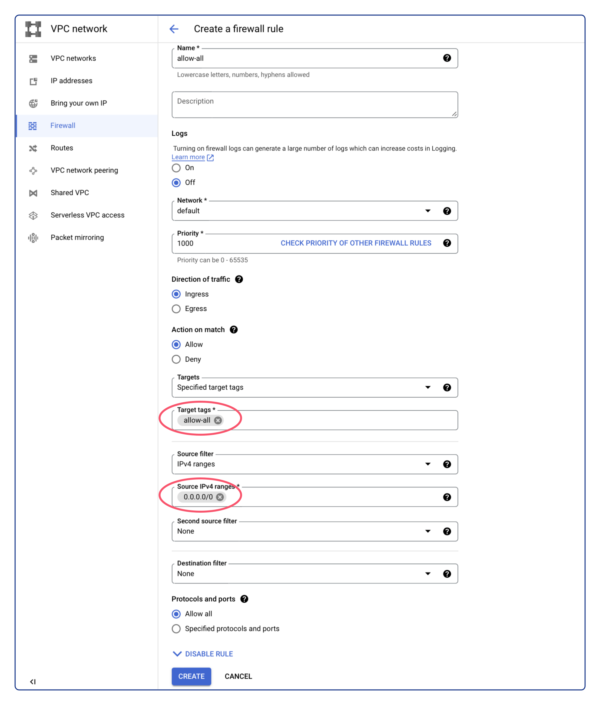
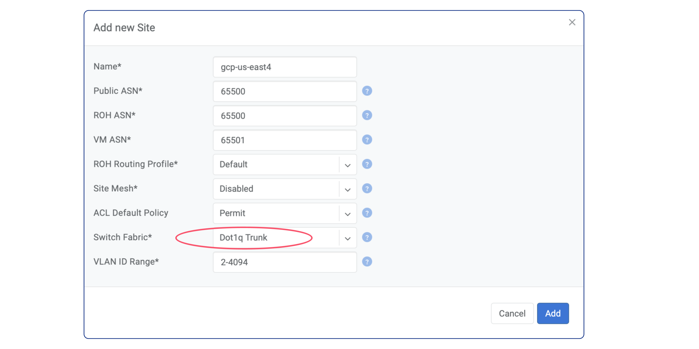
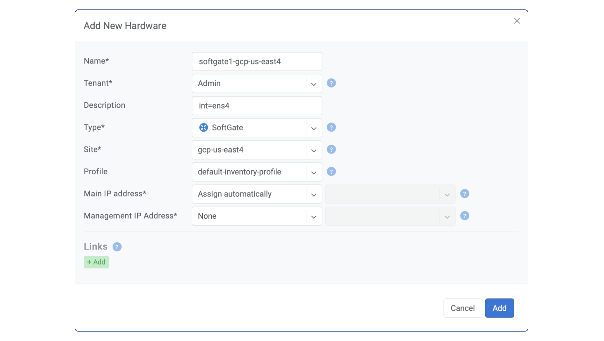
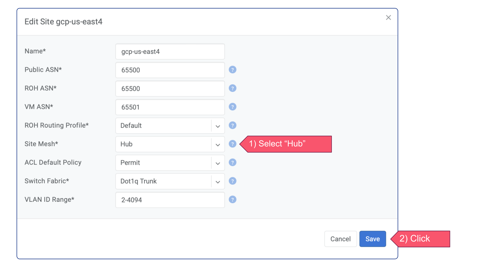

.. meta::
  :description: Deploy a Softgate in GCP

########################
Deploy a Softgate in GCP
########################

As stated in the previous section, the following sequence of actions must be taken in order to proceed: create an VM instance, add Softgate into the Netris Controller, install Netris Softgate software on the VM instance, and configure routes in GCP VPC. Let's commence with these steps in the specified order.

Create an VM instance
======================

Due to Netris Softgate is a network device capable of supporting numerous network services and being equipped with its own firewall, it is advisable to open all ports for the associated VM instance. To achieve this, create a VPC firewall rule with the following parameters:

* Name: Any name
* Direction of traffic: "Ingress"
* Action on match: "Allow"
* Targets: "Specified target tags"
* Target tags: ``allow-all``
* Source filter: "IPv4 ranges"
* Source IPv4 ranges: ``0.0.0.0/0``
* Protocols and ports: "Allow all"

Afterward, an VM instance can be created using the network tag above.

To enable connectivity with other Netris sites, creating the VM instance in the desired VPC is essential. Therefore, provision a new VM instance with the **Ubuntu 22.04** operating system installed, utilizing an instance type that meets the minimum hardware requirements of **2** virtual CPUs, **4 GB** of RAM, and **30 GB** of drive space, such as e2-medium or any other type that satisfies these specifications. From Advanced Networking options enable ``IP forwarding`` and specify the previously created ``allow-all`` network tag.

After successfully deploying the VM instance, it is crucial to take note of its External IP. This address will be required in the upcoming step.

Configure Netris Controller
===========================

Prior to defining a Softgate in the Netris Controller, certain pre-requisite steps must be completed.

Pre-Requisite Steps
-------------------

In the Netris Controller, the initial step involves creating a new site. To create it, follow the steps below:

1. Open the Netris Web Console.
2. Navigate to "Net" and select "Sites".
3. Click on the "+ Add" button.
4. Select "Dot1q Trunk" as the "Switch Fabric".
5. Input a descriptive name for the site.
6. Specify ``65500`` in the "Public ASN" field.
7. Click "Add" to create the new site.

Subsequently, it is necessary to create a private subnet for Softgate management. To achieve this, follow the steps below:

1. Go to the "IPAM" section under the "Net" tab.
2. Click on the "+ Add" button located at the top-right corner.
3. Enter a unique "Prefix" for the new subnet, such as ``10.254.254.0/24``.
4. Type a descriptive "Name" for the subnet.
5. Select the desired tenant name from the "Tenant" dropdown menu.
6. From the "Type" dropdown menu, select "Subnet".
7. Select "management" from the "Purpose" dropdown menu.
8. Choose the appropriate site from the "Sites" dropdown menu.
9. Click on the "Add" button to create the subnet.

.. image:: images/gcp-netris-ipam-mgmt.png
  :align: center

Following the creation of the private subnet for Softgate management, it is necessary to create another subnet with the "Purpose" of loopback. The "Prefix" for this subnet will be the External IP of the GCP VM instance with a netmask length of /32. For instance, if the VM instance's External IP address is 34.85.167.128, then the "Prefix" for the loopback subnet will be 34.85.167.128/32. However, unlike the subnet for Softgate management, an allocation for that "Prefix" must first be created before creating the subnet for loopback.

Add Softgate into the Netris Controller
---------------------------------------

After completing the pre-required steps, the next step is to create a Softgate in the Netris Controller. Here is a step-by-step guide:

1. Ensure that you have completed all the pre-required steps.
2. Navigate to the "Net" tab in the Netris Controller and select the "Inventory" section.
3. Click on the "+Add" button to create a new Softgate.
4. Provide a descriptive name for the Softgate in the "Name" field.
5. From the "Tenant" dropdown menu, select the same tenant name used in the pre-required steps when creating the subnets.
6. From the "Type" dropdown menu, select "SoftGate".
7. Choose the appropriate site from the "Site" dropdown menu.
8. For the "Main IP address" and "Management IP Address" fields, select "Assign automatically".
9. In the "Description" field, add ``int=ens4`` to specify that Netris should use the softgate's ens4 interface instead of the default bond0 interface that Netris Softgate Agent looks for.
10. Finally, click on the "Add" button to create the Softgate.

Add GCP VPC Subnet(s) into the Netris
-------------------------------------

The next step involves registering into Netris IPAM the subnet of the region where the SoftGate node has been created. Follow the steps below to accomplish this:

1. Access the GCP Console and navigate to your VPC Subnets.
2. Take note of the Internal IP range associated with the relevant region.
3. In Netris Controller, go to the "IPAM" section under the "Net" tab.
4. Click the "+ Add" button located at the top-right corner.
5. Enter the region Internal IP range into the "Prefix" field for the new subnet. For example, if your Internal IP range is "10.150.0.0/20", enter that value.
6. Type a descriptive name for the subnet.
7. From the "Tenant" dropdown menu, select the desired tenant name.
8. From the "Type" dropdown menu, select "Subnet".
9. Select "inactive" from the "Purpose" dropdown menu.
10. Choose the appropriate site from the "Sites" dropdown menu.
11. Click the "Add" button.

Once the subnet of the region where the SoftGate node was created has been successfully registered in Netris IPAM, you can proceed to create subnets for other necessary regions in a similar manner.

Static route for GCP VPC Subnet(s) in Netris Controller
-------------------------------------------------------

In the previous step, we added the GCP VPC Subnet(s) into Netris IPAM. However, Netris Softgate creates a blackhole route for each subnet. This means that Softgate will not be able to reach VM instances in that regions. To prevent this from happening, we need to create a static route in Netris. The prefix for the route will be the GCP VPC Subnet(s), and the next-hop will be the default gateway of Netris Softgate VM Instance.

Here are the steps to create the static route:

1. Securely log in to the Netris Softgate's VM instance using SSH.
2. Retrieve the default gateway address by typing the command ``ip route show default``.
3. In Netris Controller, go to the "Routes" section under the "Net" tab.
4. Click on the "+ Add" button located at the top-right corner of the screen.
5. Enter the subnet of the GCP region in the "Prefix" field.
6. Enter the default gateway of the Netris Softgate VM instance in the "Next-Hop" field.
7. Choose the appropriate site from the "Site" dropdown menu.
8. From the "Apply to" dropdown menu, select the SoftGate.
9. Finally, click on the "Add" button to create the static route.

Repeat these steps for each GCP VPC Subnet that has been registered in Netris IPAM.

*Note: Regardless of the GCP region's subnet, the "Next-Hop" field should always contain the default gateway of the Netris SoftGate VM instance.*

Install Netris Softgate Agent on VM instance
---------------------------------------------

After creating a softgate resource in Netris Controller and defining all necessary routes, the next step is to install the softgate agent. This can be done by clicking the three vertical dots (⋮) on the right side of the created SoftGate node and selecting "Install Agent". Copy the one-line installer command to your clipboard and connect to your VM instance via SSH. Paste the copied command into the terminal and wait for the provisioning to finish. Once it's done, reboot the server.

Adding GCP VPC routes
=====================

To ensure that specific traffic is directed to the Netris Softgate VM instance within your GCP VPC, it is necessary to configure new route entries in VPC routes. Follow the step-by-step guide below to add GCP VPC routes:

1. Access the Google Cloud Platform (GCP) Console.
2. Navigate to the VPC Network page.
3. Click on the "Routes" then switch to the "ROUTE MANAGEMENT" tab to view the existing routes.
4. Click the "+ Create Route" button to create a new route.
5. Provide the following details for the new route:

  * Name: Assign a descriptive name to the route.
  * Network: Select the appropriate network for the route.
  * Destination IP Range: Specify the subnets of other Netris sites that you wish to access from this VPC.
  * Next hop: From the dropdown menu, select the "Specify an instance"
  * Next hop instance: From the dropdown menu, select the SoftGate's VM Instance

6. Review the route configuration and ensure all the details are accurate.
7. Click the "Create" button to add the route to the GCP VPC network.
8. Verify that the new route appears in the list of routes for the selected VPC network.

Repeat these steps for any additional routes you need to add.

Enabling Site-to-Site Mesh
==========================

To enable Site-to-Site Mesh, in Netris Controller, navigate to the "Net" tab and select "Sites". Next, click on the three vertical dots (⋮) on the right side of the GCP site and select "Edit", and then from the "Site Mesh" dropdown menu, select "Hub". Save the changes. Repeat these steps for all sites that need to have meshed.

The Site Mesh status can be viewed by navigating to the "Site Mesh" section under the "Net" tab. This will display the current status of Site Mesh for all Sites.

